# ⚙️ Section #10: `Thinking in React: Components, Composition and Reusability`

---

## 📑 Table of Contents
> _Autogenerated by GitHub based on headings_

- [⚙️ Section #10: `Thinking in React: Components, Composition and Reusability`](#️-section-10-thinking-in-react-components-composition-and-reusability)
  - [📑 Table of Contents](#-table-of-contents)
  - [🔧 1. Lesson 106 — *Setting Up the "usePopcorn" project*](#-1-lesson-106--setting-up-the-usepopcorn-project)
    - [🧠 1.1 Context](#-11-context)
    - [🔍 1.2 Application working](#-12-application-working)
  - [🔧 2. Lesson 107 — *How to split  a UI into components*](#-2-lesson-107--how-to-split--a-ui-into-components)
    - [🧠 2.1 Context](#-21-context)
    - [🔍 2.2 How to split:](#-22-how-to-split)
  - [🔧 3. Lesson 108 — *Splitting Components in Practice*](#-3-lesson-108--splitting-components-in-practice)
    - [🧠 3.1 Context](#-31-context)
    - [⚙️ 3.2 Adding new code:](#️-32-adding-new-code)
      - [1. Provided Code:](#1-provided-code)
      - [2. Keeping `App` as simple as possible:](#2-keeping-app-as-simple-as-possible)
      - [3. Reduce `App.jsx` and Create `Navbar.jsx` component:](#3-reduce-appjsx-and-create-navbarjsx-component)
      - [4. Reduce `App.jsx` and Create `Main.jsx` component:](#4-reduce-appjsx-and-create-mainjsx-component)
      - [5. Reduce `Navbar.jsx` and Create `Logo.jsx` component:](#5-reduce-navbarjsx-and-create-logojsx-component)
      - [6. Reduce `Navbar.jsx` and Create `Search.jsx` component:](#6-reduce-navbarjsx-and-create-searchjsx-component)
      - [7. Reduce `Navbar.jsx` and Create `NumResult.jsx` component:](#7-reduce-navbarjsx-and-create-numresultjsx-component)
      - [8. Reduce `Main.jsx` and Create `ListBox.jsx` component:](#8-reduce-mainjsx-and-create-listboxjsx-component)
      - [9. Reduce `Main.jsx` and Create `WatchedBox.jsx` component:](#9-reduce-mainjsx-and-create-watchedboxjsx-component)
      - [10. Reduce `ListBox.jsx` and Create `MovieList.jsx` component:](#10-reduce-listboxjsx-and-create-movielistjsx-component)
      - [11. Reduce `MovieList.jsx` and create `Movie.jsx`  component:](#11-reduce-movielistjsx-and-create-moviejsx--component)
      - [12. Reduce `WatchedBox.jsx` and Create `WatchedSummary.jsx` component:](#12-reduce-watchedboxjsx-and-create-watchedsummaryjsx-component)
      - [13. Reduce `WatchedBox.jsx` and Create `WatchedMovieList.jsx` component:](#13-reduce-watchedboxjsx-and-create-watchedmovielistjsx-component)
      - [14. Reduce `WatchedMovieList.jsx` and Create `WatchedMovie.jsx` component:](#14-reduce-watchedmovielistjsx-and-create-watchedmoviejsx-component)
      - [15. 📂 Directory/Project Tree:](#15--directoryproject-tree)
      - [16. 🔍 Component Hierarchy](#16--component-hierarchy)
      - [17. 🔍Components (`src/components/`)](#17-components-srccomponents)
    - [⚡ 3.3 Incidents Found](#-33-incidents-found)
    - [🧱 3.4 Pending Fixes (TODO)](#-34-pending-fixes-todo)
  - [🔧 4. Lesson 109 — *Component Categories*](#-4-lesson-109--component-categories)
    - [🧠 4.1 Context:](#-41-context)
      - [**Stateless/Presentational Components**](#statelesspresentational-components)
      - [**Stateful Components**](#stateful-components)
      - [**Structural Components**](#structural-components)
    - [⚙️ 4.2 Theory:](#️-42-theory)
      - [4.2.1 Component categories:](#421-component-categories)
  - [🔧 5. Lesson 110 — *Prop Drilling*](#-5-lesson-110--prop-drilling)
    - [🧠 5.1 Context:](#-51-context)
    - [⚙️ 5.2 Updating code according the context:](#️-52-updating-code-according-the-context)
      - [5.2.1 Categorizing each Component:](#521-categorizing-each-component)
      - [5.2.2 Access to Movie Result dynamically lifting up `movie` prop from `App` to `NumResults`:](#522-access-to-movie-result-dynamically-lifting-up-movie-prop-from-app-to-numresults)
      - [5.2.3 Access to Movie lifting up `movie` prop from `App` to `MovieList`:](#523-access-to-movie-lifting-up-movie-prop-from-app-to-movielist)
    - [🐞 5.3 Issues:](#-53-issues)
    - [🧱 5.4 Pending Fixes (TODO)](#-54-pending-fixes-todo)
  - [🔧 6. Lesson 111 — *Component Composition*](#-6-lesson-111--component-composition)
    - [🧠 6.1 Context:](#-61-context)
    - [⚙️ 6.2 Theory context:](#️-62-theory-context)
    - [🐞 6.3 Issues:](#-63-issues)
    - [🧱 6.4 Pending Fixes (TODO)](#-64-pending-fixes-todo)
  - [🔧 XX. Lesson YYY — *{{TITLE\_NAME}}*](#-xx-lesson-yyy--title_name)
    - [🧠 XX.1 Context:](#-xx1-context)
    - [⚙️ XX.2 Updating code according the context:](#️-xx2-updating-code-according-the-context)
      - [XX.2.1](#xx21)
      - [XX.2.2](#xx22)
    - [🐞 XX.3 Issues:](#-xx3-issues)
    - [🧱 XX.4 Pending Fixes (TODO)](#-xx4-pending-fixes-todo)

---

## 🔧 1. Lesson 106 — *Setting Up the "usePopcorn" project*

### 🧠 1.1 Context  
This lesson focuses on setting up the initial project structure for "usePopcorn", a movie rating and discovery application. We'll initialize a new React project using Vite, configure the development environment, and establish the foundation for building a component-based application. The project will demonstrate React best practices including component composition, state management, and reusability patterns. This setup phase is crucial as it establishes the project architecture and development workflow that will be used throughout the section.

### 🔍 1.2 Application working
  
  visit [UsePoCorn app](https://usepopcorn.netlify.app/) here!.

## 🔧 2. Lesson 107 — *How to split  a UI into components* 

### 🧠 2.1 Context  
This lesson teaches the fundamental skill of breaking down a user interface into logical, reusable React components. We'll explore the principles of component design, including when to create new components, how to determine appropriate component size, and strategies for identifying component boundaries. The lesson covers practical guidelines for component composition, emphasizing the balance between too-small components (over-engineering) and too-large components (monolithic code). Understanding these concepts is essential for building maintainable, scalable React applications and is a core skill in "thinking in React".

### 🔍 2.2 How to split:

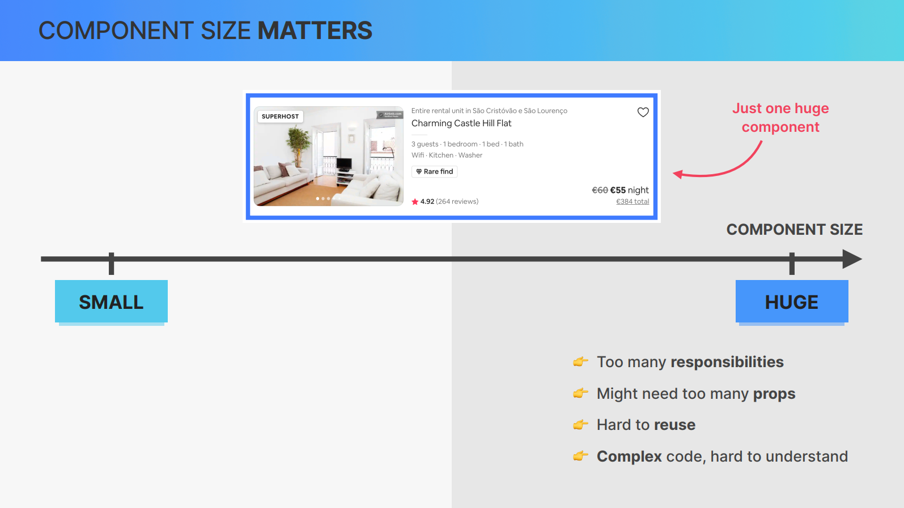
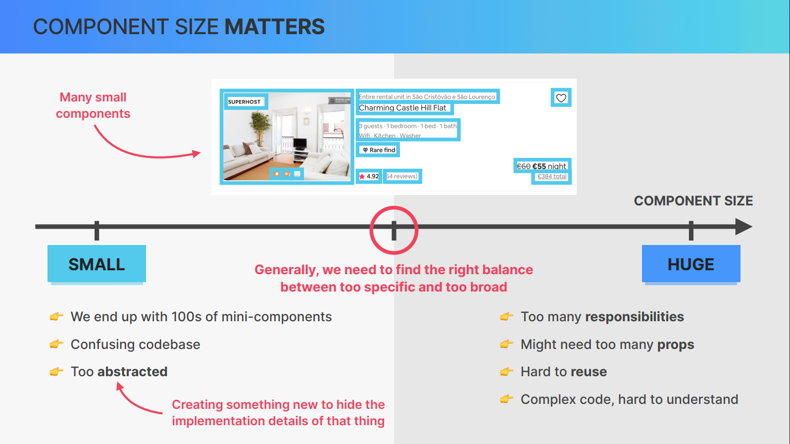
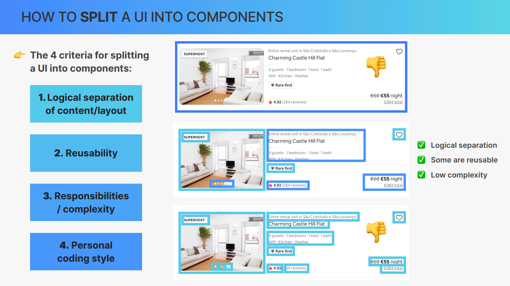
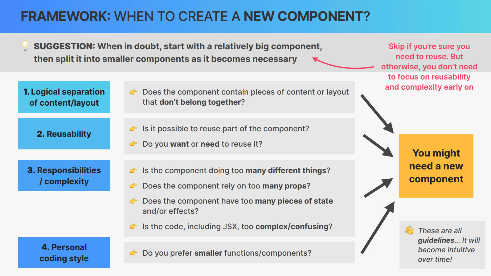
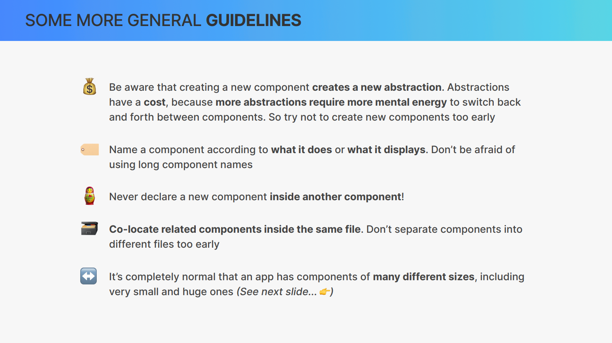


## 🔧 3. Lesson 108 — *Splitting Components in Practice* 

### 🧠 3.1 Context
This lesson applies the theoretical concepts from Lesson 107 by practically splitting a monolithic React component into smaller, reusable, and maintainable components. We start with a single `App.jsx` file containing all the UI logic and progressively break it down into logical component pieces. The refactoring process demonstrates the step-by-step approach to component decomposition, showing how to identify component boundaries, extract reusable UI elements, and manage component composition. This hands-on practice reinforces the principles of "thinking in React" by transforming a complex single-component application into a well-structured component hierarchy. The lesson covers creating container components, presentational components, and understanding when to lift state up or keep it local, establishing a solid foundation for building scalable React applications.

### ⚙️ 3.2 Adding new code:

#### 1. Provided Code:
```jsx
/* src/App.jsx */
import { useState } from "react";

const tempMovieData = [
  {
    imdbID: "tt1375666",
    Title: "Inception",
    Year: "2010",
    Poster: "https://m.media-amazon.com/images/M/MV5BMjAxMzY3NjcxNF5BMl5BanBnXkFtZTcwNTI5OTM0Mw@@._V1_SX300.jpg",
  },
  {
    imdbID: "tt0133093",
    Title: "The Matrix",
    Year: "1999",
    Poster:
      "https://m.media-amazon.com/images/M/MV5BNzQzOTk3OTAtNDQ0Zi00ZTVkLWI0MTEtMDllZjNkYzNjNTc4L2ltYWdlXkEyXkFqcGdeQXVyNjU0OTQ0OTY@._V1_SX300.jpg",
  },
  {
    imdbID: "tt6751668",
    Title: "Parasite",
    Year: "2019",
    Poster:
      "https://m.media-amazon.com/images/M/MV5BYWZjMjk3ZTItODQ2ZC00NTY5LWE0ZDYtZTI3MjcwN2Q5NTVkXkEyXkFqcGdeQXVyODk4OTc3MTY@._V1_SX300.jpg",
  },
];

const tempWatchedData = [
  {
    imdbID: "tt1375666",
    Title: "Inception",
    Year: "2010",
    Poster: "https://m.media-amazon.com/images/M/MV5BMjAxMzY3NjcxNF5BMl5BanBnXkFtZTcwNTI5OTM0Mw@@._V1_SX300.jpg",
    runtime: 148,
    imdbRating: 8.8,
    userRating: 10,
  },
  {
    imdbID: "tt0088763",
    Title: "Back to the Future",
    Year: "1985",
    Poster:
      "https://m.media-amazon.com/images/M/MV5BZmU0M2Y1OGUtZjIxNi00ZjBkLTg1MjgtOWIyNThiZWIwYjRiXkEyXkFqcGdeQXVyMTQxNzMzNDI@._V1_SX300.jpg",
    runtime: 116,
    imdbRating: 8.5,
    userRating: 9,
  },
];

const average = (arr) => arr.reduce((acc, cur, i, arr) => acc + cur / arr.length, 0);

function App() {
  const [query, setQuery] = useState("");
  const [movies, setMovies] = useState(tempMovieData);
  const [watched, setWatched] = useState(tempWatchedData);
  const [isOpen1, setIsOpen1] = useState(true);
  const [isOpen2, setIsOpen2] = useState(true);

  const avgImdbRating = average(watched.map((movie) => movie.imdbRating));
  const avgUserRating = average(watched.map((movie) => movie.userRating));
  const avgRuntime = average(watched.map((movie) => movie.runtime));

  return (
    <>
      <nav className="nav-bar">
        <div className="logo">
          <span role="img">🍿</span>
          <h1>usePopcorn</h1>
        </div>
        <input
          className="search"
          type="text"
          placeholder="Search movies..."
          value={query}
          onChange={(e) => setQuery(e.target.value)}
        />
        <p className="num-results">
          Found <strong>{movies.length}</strong> results
        </p>
      </nav>

      <main className="main">
        <div className="box">
          <button className="btn-toggle" onClick={() => setIsOpen1((open) => !open)}>
            {isOpen1 ? "–" : "+"}
          </button>
          {isOpen1 && (
            <ul className="list">
              {movies?.map((movie) => (
                <li key={movie.imdbID}>
                  
                  <h3>{movie.Title}</h3>
                  <div>
                    <p>
                      <span>🗓</span>
                      <span>{movie.Year}</span>
                    </p>
                  </div>
                </li>
              ))}
            </ul>
          )}
        </div>

        <div className="box">
          <button className="btn-toggle" onClick={() => setIsOpen2((open) => !open)}>
            {isOpen2 ? "–" : "+"}
          </button>
          {isOpen2 && (
            <>
              <div className="summary">
                <h2>Movies you watched</h2>
                <div>
                  <p>
                    <span>#️⃣</span>
                    <span>{watched.length} movies</span>
                  </p>
                  <p>
                    <span>⭐️</span>
                    <span>{avgImdbRating}</span>
                  </p>
                  <p>
                    <span>🌟</span>
                    <span>{avgUserRating}</span>
                  </p>
                  <p>
                    <span>⏳</span>
                    <span>{avgRuntime} min</span>
                  </p>
                </div>
              </div>

              <ul className="list">
                {watched.map((movie) => (
                  <li key={movie.imdbID}>
                    
                    <h3>{movie.Title}</h3>
                    <div>
                      <p>
                        <span>⭐️</span>
                        <span>{movie.imdbRating}</span>
                      </p>
                      <p>
                        <span>🌟</span>
                        <span>{movie.userRating}</span>
                      </p>
                      <p>
                        <span>⏳</span>
                        <span>{movie.runtime} min</span>
                      </p>
                    </div>
                  </li>
                ))}
              </ul>
            </>
          )}
        </div>
      </main>
    </>
  );
}
export default App;
```

```css
/* src/index.css */
:root {
  --color-primary: #6741d9;
  --color-primary-light: #7950f2;
  --color-text: #dee2e6;
  --color-text-dark: #adb5bd;
  --color-background-100: #343a40;
  --color-background-500: #2b3035;
  --color-background-900: #212529;
  --color-red: #fa5252;
  --color-red-dark: #e03131;
}

* {
  margin: 0;
  padding: 0;
  box-sizing: border-box;
}

html {
  font-size: 62.5%;
}

body {
  font-family: -apple-system, BlinkMacSystemFont, "Segoe UI", Roboto, Oxygen,
    Ubuntu, Cantarell, "Open Sans", "Helvetica Neue", sans-serif;

  color: var(--color-text);
  background-color: var(--color-background-900);
  padding: 2.4rem;
}

/* ******* */

.nav-bar {
  display: grid;
  grid-template-columns: 1fr 1fr 1fr;
  align-items: center;
  height: 7.2rem;
  padding: 0 3.2rem;
  background-color: var(--color-primary);
  border-radius: 0.9rem;
}

.main {
  margin-top: 2.4rem;
  height: calc(100vh - 7.2rem - 3 * 2.4rem);
  display: flex;
  gap: 2.4rem;
  justify-content: center;
}

.box {
  width: 42rem;
  max-width: 42rem;
  background-color: var(--color-background-500);
  border-radius: 0.9rem;
  /* overflow: scroll; */
  position: relative;
}

.loader {
  text-align: center;
  text-transform: uppercase;
  font-size: 2rem;
  font-weight: 600;
  margin: 4.8rem;
}

.error {
  text-align: center;
  font-size: 2rem;
  padding: 4.8rem;
}

/* ******* */

.logo {
  display: flex;
  align-items: center;
  gap: 0.8rem;
}

.logo span {
  font-size: 3.2rem;
}

.logo h1 {
  font-size: 2.4rem;
  font-weight: 600;
  color: #fff;
}

.search {
  justify-self: center;
  border: none;
  padding: 1.1rem 1.6rem;
  font-size: 1.8rem;
  border-radius: 0.7rem;
  width: 40rem;
  transition: all 0.3s;
  color: var(--color-text);

  /* background-color: var(--color-background-900); */
  background-color: var(--color-primary-light);
}

.search::placeholder {
  color: var(--color-text-dark);
}

.search:focus {
  outline: none;
  box-shadow: 0 2.4rem 2.4rem rgba(0, 0, 0, 0.1);
  transform: translateY(-2px);
}

.num-results {
  justify-self: end;
  font-size: 1.8rem;
}

.btn-toggle {
  position: absolute;
  top: 0.8rem;
  right: 0.8rem;
  height: 2.4rem;
  aspect-ratio: 1;
  border-radius: 50%;
  border: none;
  background-color: var(--color-background-900);
  color: var(--color-text);
  font-size: 1.4rem;
  font-weight: bold;
  cursor: pointer;
  z-index: 999;
}

.list {
  list-style: none;
  padding: 0.8rem 0;
  /* overflow: scroll; */
}

.list-watched {
  height: calc(100% - 9rem);
}

.list li {
  position: relative;
  display: grid;
  grid-template-columns: 4rem 1fr;
  grid-template-rows: auto auto;
  column-gap: 2.4rem;
  font-size: 1.6rem;
  align-items: center;

  padding: 1.6rem 3.2rem;
  border-bottom: 1px solid var(--color-background-100);
}

.list.list-movies li {
  cursor: pointer;
  transition: all 0.3s;
}

.list.list-movies li:hover {
  background-color: var(--color-background-100);
}

.list img {
  width: 100%;
  grid-row: 1 / -1;
}

.list h3 {
  font-size: 1.8rem;
}

.list div {
  display: flex;
  align-items: center;
  gap: 2.4rem;
}

.list p {
  display: flex;
  align-items: center;
  gap: 0.8rem;
}

.btn-delete {
  position: absolute;
  right: 2.4rem;

  height: 1.8rem;
  aspect-ratio: 1;
  border-radius: 50%;
  border: none;
  background-color: var(--color-red);
  color: var(--color-background-900);
  font-size: 0.9rem;
  font-weight: bold;
  cursor: pointer;
  transition: all 0.3s;
}

.btn-delete:hover {
  background-color: var(--color-red-dark);
}

/* ******* */

.summary {
  padding: 2.2rem 3.2rem 1.8rem 3.2rem;
  border-radius: 0.9rem;
  background-color: var(--color-background-100);
  box-shadow: 0 1.2rem 2.4rem rgba(0, 0, 0, 0.2);
}

.summary h2 {
  text-transform: uppercase;
  font-size: 1.6rem;
  margin-bottom: 0.6rem;
}

.summary div {
  display: flex;
  align-items: center;
  gap: 2.4rem;
  font-size: 1.6rem;
  font-weight: 600;
}

.summary p {
  display: flex;
  align-items: center;
  gap: 0.8rem;
}

/* ******* */

.details {
  line-height: 1.4;
  font-size: 1.4rem;
}

.details header {
  display: flex;
}

.details section {
  padding: 4rem;
  display: flex;
  flex-direction: column;
  gap: 1.6rem;
}

.details img {
  width: 33%;
}

.details-overview {
  width: 100%;
  padding: 2.4rem 3rem;
  background-color: var(--color-background-100);
  display: flex;
  flex-direction: column;
  gap: 1.4rem;
}

.details-overview h2 {
  font-size: 2.4rem;
  margin-bottom: 0.4rem;
  line-height: 1.1;
}

.details-overview p {
  display: flex;
  align-items: center;
  gap: 0.8rem;
}

.rating {
  background-color: var(--color-background-100);
  border-radius: 0.9rem;
  padding: 2rem 2.4rem;
  margin-bottom: 0.8rem;
  font-weight: 600;
  display: flex;
  flex-direction: column;
  gap: 2.4rem;
}

.btn-add {
  background-color: var(--color-primary);
  color: var(--color-text);
  border: none;
  border-radius: 10rem;
  font-size: 1.4rem;
  padding: 1rem;
  font-weight: bold;
  cursor: pointer;
  transition: all 0.3s;
}

.btn-add:hover {
  background-color: var(--color-primary-light);
}

.seconds {
  background-color: var(--color-background-100);
  width: 8rem;
  border-radius: 10rem;
  font-weight: 600;
  text-align: center;
  padding: 0.4rem;
  margin-top: 2.4rem;
}

.btn-back {
  position: absolute;
  top: 0.6rem;
  left: 0.6rem;
  height: 3.2rem;
  aspect-ratio: 1;
  border-radius: 50%;
  border: none;
  /* background-color: var(--color-text); */
  background-color: #fff;
  color: var(--color-background-500);
  box-shadow: 0 8px 20px rgba(0, 0, 0, 0.8);
  font-family: sans-serif;
  font-size: 2.4rem;
  font-weight: bold;
  cursor: pointer;
  z-index: 999;
  display: flex;
  align-items: center;
  justify-content: center;
}

/*
SPACING SYSTEM (px)
2 / 4 / 8 / 12 / 16 / 24 / 32 / 40 / 48 / 64 / 80 / 96 / 128

FONT SIZE SYSTEM (px)
10 / 12 / 14 / 16 / 18 / 20 / 24 / 30 / 36 / 44 /52 / 62 / 74 / 86 / 98
*/

/*
FULL STAR

<svg
  xmlns="http://www.w3.org/2000/svg"
  viewBox="0 0 20 20"
  fill="#000"
  stroke="#000"
>
  <path
    d="M9.049 2.927c.3-.921 1.603-.921 1.902 0l1.07 3.292a1 1 0 00.95.69h3.462c.969 0 1.371 1.24.588 1.81l-2.8 2.034a1 1 0 00-.364 1.118l1.07 3.292c.3.921-.755 1.688-1.54 1.118l-2.8-2.034a1 1 0 00-1.175 0l-2.8 2.034c-.784.57-1.838-.197-1.539-1.118l1.07-3.292a1 1 0 00-.364-1.118L2.98 8.72c-.783-.57-.38-1.81.588-1.81h3.461a1 1 0 00.951-.69l1.07-3.292z"
  />
</svg>


EMPTY STAR

<svg
  xmlns="http://www.w3.org/2000/svg"
  fill="none"
  viewBox="0 0 24 24"
  stroke="#000"
>
  <path
    strokeLinecap="round"
    strokeLinejoin="round"
    strokeWidth="{2}"
    d="M11.049 2.927c.3-.921 1.603-.921 1.902 0l1.519 4.674a1 1 0 00.95.69h4.915c.969 0 1.371 1.24.588 1.81l-3.976 2.888a1 1 0 00-.363 1.118l1.518 4.674c.3.922-.755 1.688-1.538 1.118l-3.976-2.888a1 1 0 00-1.176 0l-3.976 2.888c-.783.57-1.838-.197-1.538-1.118l1.518-4.674a1 1 0 00-.363-1.118l-3.976-2.888c-.784-.57-.38-1.81.588-1.81h4.914a1 1 0 00.951-.69l1.519-4.674z"
  />
</svg>
*/
```


#### 2. Keeping `App` as simple as possible:
```jsx
/* src/App.jsx */
import { useState } from "react";
import Navbar from "./components/Navbar";
import Main from "./components/Main";

const tempMovieData = [
  {
    imdbID: "tt1375666",
    Title: "Inception",
    Year: "2010",
    Poster: "https://m.media-amazon.com/images/M/MV5BMjAxMzY3NjcxNF5BMl5BanBnXkFtZTcwNTI5OTM0Mw@@._V1_SX300.jpg",
  },
  {
    imdbID: "tt0133093",
    Title: "The Matrix",
    Year: "1999",
    Poster:
      "https://m.media-amazon.com/images/M/MV5BNzQzOTk3OTAtNDQ0Zi00ZTVkLWI0MTEtMDllZjNkYzNjNTc4L2ltYWdlXkEyXkFqcGdeQXVyNjU0OTQ0OTY@._V1_SX300.jpg",
  },
  {
    imdbID: "tt6751668",
    Title: "Parasite",
    Year: "2019",
    Poster:
      "https://m.media-amazon.com/images/M/MV5BYWZjMjk3ZTItODQ2ZC00NTY5LWE0ZDYtZTI3MjcwN2Q5NTVkXkEyXkFqcGdeQXVyODk4OTc3MTY@._V1_SX300.jpg",
  },
];

const tempWatchedData = [
  {
    imdbID: "tt1375666",
    Title: "Inception",
    Year: "2010",
    Poster: "https://m.media-amazon.com/images/M/MV5BMjAxMzY3NjcxNF5BMl5BanBnXkFtZTcwNTI5OTM0Mw@@._V1_SX300.jpg",
    runtime: 148,
    imdbRating: 8.8,
    userRating: 10,
  },
  {
    imdbID: "tt0088763",
    Title: "Back to the Future",
    Year: "1985",
    Poster:
      "https://m.media-amazon.com/images/M/MV5BZmU0M2Y1OGUtZjIxNi00ZjBkLTg1MjgtOWIyNThiZWIwYjRiXkEyXkFqcGdeQXVyMTQxNzMzNDI@._V1_SX300.jpg",
    runtime: 116,
    imdbRating: 8.5,
    userRating: 9,
  },
];

//const average = (arr) => arr.reduce((acc, cur, i, arr) => acc + cur / arr.length, 0);

function App() {
  //const [query, setQuery] = useState("");
  // const [movies, setMovies] = useState(tempMovieData);
  // const [watched, setWatched] = useState(tempWatchedData);
  // const [isOpen1, setIsOpen1] = useState(true);
  // const [isOpen2, setIsOpen2] = useState(true);

  // const avgImdbRating = average(watched.map((movie) => movie.imdbRating));
  // const avgUserRating = average(watched.map((movie) => movie.userRating));
  // const avgRuntime = average(watched.map((movie) => movie.runtime));

  return (
    <>
      {/*  // src/components/Navbar.jsx
      <nav className="nav-bar">
        <div className="logo">
          <span role="img">🍿</span>
          <h1>usePopcorn</h1>
        </div>
        <input
          className="search"
          type="text"
          placeholder="Search movies..."
          value={query}
          onChange={(e) => setQuery(e.target.value)}
        />
        <p className="num-results">
          Found <strong>{movies.length}</strong> results
        </p>
      </nav>
      */}
      <Navbar />

      {/*  // src/components/Main.jsx
      <main className="main">
        <div className="box">
          <button className="btn-toggle" onClick={() => setIsOpen1((open) => !open)}>
            {isOpen1 ? "–" : "+"}
          </button>
          {isOpen1 && (
            <ul className="list">
              {movies?.map((movie) => (
                <li key={movie.imdbID}>
                  
                  <h3>{movie.Title}</h3>
                  <div>
                    <p>
                      <span>🗓</span>
                      <span>{movie.Year}</span>
                    </p>
                  </div>
                </li>
              ))}
            </ul>
          )}
        </div>

        <div className="box">
          <button className="btn-toggle" onClick={() => setIsOpen2((open) => !open)}>
            {isOpen2 ? "–" : "+"}
          </button>
          {isOpen2 && (
            <>
              <div className="summary">
                <h2>Movies you watched</h2>
                <div>
                  <p>
                    <span>#️⃣</span>
                    <span>{watched.length} movies</span>
                  </p>
                  <p>
                    <span>⭐️</span>
                    <span>{avgImdbRating}</span>
                  </p>
                  <p>
                    <span>🌟</span>
                    <span>{avgUserRating}</span>
                  </p>
                  <p>
                    <span>⏳</span>
                    <span>{avgRuntime} min</span>
                  </p>
                </div>
              </div>

              <ul className="list">
                {watched.map((movie) => (
                  <li key={movie.imdbID}>
                    
                    <h3>{movie.Title}</h3>
                    <div>
                      <p>
                        <span>⭐️</span>
                        <span>{movie.imdbRating}</span>
                      </p>
                      <p>
                        <span>🌟</span>
                        <span>{movie.userRating}</span>
                      </p>
                      <p>
                        <span>⏳</span>
                        <span>{movie.runtime} min</span>
                      </p>
                    </div>
                  </li>
                ))}
              </ul>
            </>
          )}
        </div>
      </main> 
      */}
      <Main tempMovieData={tempMovieData} tempWatchedData={tempWatchedData} />
    </>
  );
}
export default App;
```

#### 3. Reduce `App.jsx` and Create `Navbar.jsx` component:
```jsx
/* src/components/Navbar.jsx */
import Logo from "./Logo";
import Search from "./Search";
import NumResult from "./NumResult";
const Navbar = () => {
  //const [query, setQuery] = useState("");

  return (
    <nav className="nav-bar">
      <div className="logo">
        <span role="img">🍿</span>
        <h1>usePopcorn</h1>
      </div> 
      <input
        className="search"
        type="text"
        placeholder="Search movies..."
        value={query}
        onChange={(e) => setQuery(e.target.value)}
      /> 
      <p className="num-results">
        Found <strong>X</strong> results
      </p>
    </nav>
  );
};
export default Navbar;
```

#### 4. Reduce `App.jsx` and Create `Main.jsx` component:
```jsx
/* src/components/Main.jsx */
import { useState } from "react";

const Main = ({ tempMovieData, tempWatchedData }) => {
  const [isOpen1, setIsOpen1] = useState(true);
  const [isOpen2, setIsOpen2] = useState(true);

  const [movies, setMovies] = useState(tempMovieData);
  const [watched, setWatched] = useState(tempWatchedData);

  const average = (arr) => arr.reduce((acc, cur, i, arr) => acc + cur / arr.length, 0);

  const avgImdbRating = average(watched.map((movie) => movie.imdbRating));
  const avgUserRating = average(watched.map((movie) => movie.userRating));
  const avgRuntime = average(watched.map((movie) => movie.runtime));

  return (
    <main className="main">
      <div className="box">
        <button className="btn-toggle" onClick={() => setIsOpen1((open) => !open)}>
          {isOpen1 ? "–" : "+"}
        </button>
        {isOpen1 && (
          <ul className="list">
            {movies?.map((movie) => (
              <li key={movie.imdbID}>
                
                <h3>{movie.Title}</h3>
                <div>
                  <p>
                    <span>🗓</span>
                    <span>{movie.Year}</span>
                  </p>
                </div>
              </li>
            ))}
          </ul>
        )}
      </div>

      <div className="box">
        <button className="btn-toggle" onClick={() => setIsOpen2((open) => !open)}>
          {isOpen2 ? "–" : "+"}
        </button>
        {isOpen2 && (
          <>
            <div className="summary">
              <h2>Movies you watched</h2>
              <div>
                <p>
                  <span>#️⃣</span>
                  <span>{watched.length} movies</span>
                </p>
                <p>
                  <span>⭐️</span>
                  <span>{avgImdbRating}</span>
                </p>
                <p>
                  <span>🌟</span>
                  <span>{avgUserRating}</span>
                </p>
                <p>
                  <span>⏳</span>
                  <span>{avgRuntime} min</span>
                </p>
              </div>
            </div>

            <ul className="list">
              {watched.map((movie) => (
                <li key={movie.imdbID}>
                  
                  <h3>{movie.Title}</h3>
                  <div>
                    <p>
                      <span>⭐️</span>
                      <span>{movie.imdbRating}</span>
                    </p>
                    <p>
                      <span>🌟</span>
                      <span>{movie.userRating}</span>
                    </p>
                    <p>
                      <span>⏳</span>
                      <span>{movie.runtime} min</span>
                    </p>
                  </div>
                </li>
              ))}
            </ul>
          </>
        )}
      </div>
    </main>
  );
};
export default Main;
```

Meanwhile `App.jsx` is reduced to:
```jsx
/* src/App.jsx */
import { useState } from "react";
import Navbar from "./components/Navbar";
import Main from "./components/Main";

const tempMovieData = [
  ....
];

const tempWatchedData = [
  ....
];
function App() {
  return (
    <>
      <Navbar />  // 👈🏽 ✅
      <Main tempMovieData={tempMovieData} tempWatchedData={tempWatchedData} />  // 👈🏽 ✅
    </>
  );
}
export default App;
```

#### 5. Reduce `Navbar.jsx` and Create `Logo.jsx` component:
```jsx
/* src/components/Logo.jsx */
const Logo = () => {
  return (
    <div className="logo">
      <span role="img">🍿</span>
      <h1>usePopcorn</h1>
    </div>
  );
};

export default Logo;
```


#### 6. Reduce `Navbar.jsx` and Create `Search.jsx` component:
```jsx
/* src/components/Search.jsx */
import { useState } from "react";

const Search = () => {
  const [query, setQuery] = useState("");
  return (
    <input
      className="search"
      type="text"
      placeholder="Search movies..."
      value={query}
      onChange={(e) => setQuery(e.target.value)}
    />
  );
};

export default Search;
```

#### 7. Reduce `Navbar.jsx` and Create `NumResult.jsx` component:
```jsx
/* src/components/NumResult.jsx */
const NumResult = () => {
  return (
    <p className="num-results">
      {/* Found <strong>{movies.length}</strong> results */}
      Found <strong>X</strong> results
    </p>
  );
};

export default NumResult;
```

Meanwhile the `Navbar.jsx` is reduced to:
```jsx
/* src/components/Navbar.jsx */
import Logo from "./Logo";
import Search from "./Search";
import NumResult from "./NumResult";
const Navbar = () => {
  //const [query, setQuery] = useState("");

  return (
    <nav className="nav-bar">
      <Logo />
      <Search />
      <NumResult />
    </nav>
  );
};

export default Navbar;
```


#### 8. Reduce `Main.jsx` and Create `ListBox.jsx` component:
```jsx
/* src/components/ListBox.jsx */
import { useState } from "react";
const ListBox = ({ tempMovieData }) => {
  const [isOpen, setIsOpen] = useState(true);
  const [movies, setMovies] = useState(tempMovieData);

  return (
    <div className="box">
      <button className="btn-toggle" onClick={() => setIsOpen((open) => !open)}>
        {isOpen ? "–" : "+"}
      </button>
      {isOpen && (
        <ul className="list">
          {movies?.map((movie) => (
            <li key={movie.imdbID}>
              
              <h3>{movie.Title}</h3>
              <div>
                <p>
                  <span>🗓</span>
                  <span>{movie.Year}</span>
                </p>
              </div>
            </li>
          ))}
        </ul>
      )}
    </div>
  );
};

export default ListBox;
```

#### 9. Reduce `Main.jsx` and Create `WatchedBox.jsx` component:
```jsx
/* src/components/WatchedBox.jsx */
import { useState } from "react";
const WatchedBox = ({ tempWatchedData }) => {
  const [isOpen, setisOpen] = useState(true);
  const [watched, setWatched] = useState(tempWatchedData);
  const average = (arr) => arr.reduce((acc, cur, i, arr) => acc + cur / arr.length, 0);

  const avgImdbRating = average(watched.map((movie) => movie.imdbRating));
  const avgUserRating = average(watched.map((movie) => movie.userRating));
  const avgRuntime = average(watched.map((movie) => movie.runtime));
  return (
    <div className="box">
      <button className="btn-toggle" onClick={() => setisOpen((open) => !open)}>
        {isOpen ? "–" : "+"}
      </button>
      {isOpen && (
        <>
          <div className="summary">
            <h2>Movies you watched</h2>
            <div>
              <p>
                <span>#️⃣</span>
                <span>{watched.length} movies</span>
              </p>
              <p>
                <span>⭐️</span>
                <span>{avgImdbRating}</span>
              </p>
              <p>
                <span>🌟</span>
                <span>{avgUserRating}</span>
              </p>
              <p>
                <span>⏳</span>
                <span>{avgRuntime} min</span>
              </p>
            </div>
          </div>

          <ul className="list">
            {watched.map((movie) => (
              <li key={movie.imdbID}>
                
                <h3>{movie.Title}</h3>
                <div>
                  <p>
                    <span>⭐️</span>
                    <span>{movie.imdbRating}</span>
                  </p>
                  <p>
                    <span>🌟</span>
                    <span>{movie.userRating}</span>
                  </p>
                  <p>
                    <span>⏳</span>
                    <span>{movie.runtime} min</span>
                  </p>
                </div>
              </li>
            ))}
          </ul>
        </>
      )}
    </div>
  );
};

export default WatchedBox;
```

Meanwhile `Main.jsx` component is reduced to:
```jsx
/* src/components/Main.jsx */
import { useState } from "react";
import ListBox from "./ListBox";
import WatchedBox from "./WatchedBox";

const Main = ({ tempMovieData, tempWatchedData }) => {

  return (
    <main className="main">
      <ListBox tempMovieData={tempMovieData} />
      <WatchedBox tempWatchedData={tempWatchedData} />
    </main>
  );
};

export default Main;
```

#### 10. Reduce `ListBox.jsx` and Create `MovieList.jsx` component:
```jsx
/* src/components/MovieList.jsx */
const MovieList = ({ movies }) => {
  return (
    <ul className="list">
      {movies?.map((movie) => (
        <li key={movie.imdbID}>
          
          <h3>{movie.Title}</h3>
          <div>
            <p>
              <span>🗓</span>
              <span>{movie.Year}</span>
            </p>
          </div>
        </li>
      ))}
    </ul>
  );
};

export default MovieList;
```

Meanwhile `ListBox.jsx`  component is reduced to:
```jsx
/* src/components/ListBox.jsx */
import { useState } from "react";
import MovieList from "./MovieList";
const ListBox = ({ tempMovieData }) => {
  const [isOpen, setIsOpen] = useState(true);
  const [movies, setMovies] = useState(tempMovieData);

  return (
    <div className="box">
      <button className="btn-toggle" onClick={() => setIsOpen((open) => !open)}>
        {isOpen ? "–" : "+"}
      </button>
      {isOpen && (
        <MovieList movies={movies} />
      )}
    </div>
  );
};

export default ListBox;
```

#### 11. Reduce `MovieList.jsx` and create `Movie.jsx`  component:
```jsx
/* src/components/Movie.jsx */
const Movie = ({ movie }) => {
  return (
    <li>
      
      <h3>{movie.Title}</h3>
      <div>
        <p>
          <span>🗓</span>
          <span>{movie.Year}</span>
        </p>
      </div>
    </li>
  );
};

export default Movie;
```

Meanwhile `MovieList.jsx` component is reduced to:
```jsx
/* src/components/MovieList.jsx */
import Movie from "./Movie";

const MovieList = ({ movies }) => {
  return (
    <ul className="list">
      {movies?.map((movie) => (
        <Movie movie={movie} key={movie.imdbID} />
      ))}
    </ul>
  );
};

export default MovieList;
```

#### 12. Reduce `WatchedBox.jsx` and Create `WatchedSummary.jsx` component:
```jsx
/* src/components/WatchedSummary.jsx */
const WatchedSummary = ({ watched }) => {
  const average = (arr) => arr.reduce((acc, cur, i, arr) => acc + cur / arr.length, 0);

  const avgImdbRating = average(watched.map((movie) => movie.imdbRating));
  const avgUserRating = average(watched.map((movie) => movie.userRating));
  const avgRuntime = average(watched.map((movie) => movie.runtime));

  return (
    <div className="summary">
      <h2>Movies you watched</h2>
      <div>
        <p>
          <span>#️⃣</span>
          <span>{watched.length} movies</span>
        </p>
        <p>
          <span>⭐️</span>
          <span>{avgImdbRating}</span>
        </p>
        <p>
          <span>🌟</span>
          <span>{avgUserRating}</span>
        </p>
        <p>
          <span>⏳</span>
          <span>{avgRuntime} min</span>
        </p>
      </div>
    </div>
  );
};

export default WatchedSummary;
```

Meanwhile `WatchedBox.jsx` component is reduced to:
```jsx
/* src/components/WatchedBox.jsx */
import { useState } from "react";
import WatchedSummary from "./WatchedSummary";
const WatchedBox = ({ tempWatchedData }) => {
  const [isOpen, setisOpen] = useState(true);
  const [watched, setWatched] = useState(tempWatchedData);

  return (
    <div className="box">
      <button className="btn-toggle" onClick={() => setisOpen((open) => !open)}>
        {isOpen ? "–" : "+"}
      </button>
      {isOpen && (
        <>
          <WatchedSummary watched={watched} />

          <ul className="list">
            {watched.map((movie) => (
              <li key={movie.imdbID}>
                
                <h3>{movie.Title}</h3>
                <div>
                  <p>
                    <span>⭐️</span>
                    <span>{movie.imdbRating}</span>
                  </p>
                  <p>
                    <span>🌟</span>
                    <span>{movie.userRating}</span>
                  </p>
                  <p>
                    <span>⏳</span>
                    <span>{movie.runtime} min</span>
                  </p>
                </div>
              </li>
            ))}
          </ul>
        </>
      )}
    </div>
  );
};

export default WatchedBox;
```

#### 13. Reduce `WatchedBox.jsx` and Create `WatchedMovieList.jsx` component:
```jsx
/* src/components/WatchedMovieList.jsx */
const WatchedMovieList = ({ watched }) => {
  return (
    <ul className="list">
      {watched.map((movie) => (
        <li key={movie.imdbID}>
          
          <h3>{movie.Title}</h3>
          <div>
            <p>
              <span>⭐️</span>
              <span>{movie.imdbRating}</span>
            </p>
            <p>
              <span>🌟</span>
              <span>{movie.userRating}</span>
            </p>
            <p>
              <span>⏳</span>
              <span>{movie.runtime} min</span>
            </p>
          </div>
        </li>
      ))}
    </ul>
  );
};

export default WatchedMovieList;
```

Meanwhile `WatchedBox.jsx` component is reduced to:
```jsx
/* src/components/WatchedBox.jsx */
import { useState } from "react";
import WatchedSummary from "./WatchedSummary";
import WatchedList from "./WatchedMovieList";
const WatchedBox = ({ tempWatchedData }) => {
  const [isOpen, setisOpen] = useState(true);
  const [watched, setWatched] = useState(tempWatchedData);

  return (
    <div className="box">
      <button className="btn-toggle" onClick={() => setisOpen((open) => !open)}>
        {isOpen ? "–" : "+"}
      </button>
      {isOpen && (
        <>
          <WatchedSummary watched={watched} />
          <WatchedList watched={watched} />
        </>
      )}
    </div>
  );
};

export default WatchedBox;
```

#### 14. Reduce `WatchedMovieList.jsx` and Create `WatchedMovie.jsx` component:
```jsx
/* src/components/WatchedMovie.jsx */
const WatchedMovie = ({ movie }) => {
  return (
    <li>
      
      <h3>{movie.Title}</h3>
      <div>
        <p>
          <span>⭐️</span>
          <span>{movie.imdbRating}</span>
        </p>
        <p>
          <span>🌟</span>
          <span>{movie.userRating}</span>
        </p>
        <p>
          <span>⏳</span>
          <span>{movie.runtime} min</span>
        </p>
      </div>
    </li>
  );
};

export default WatchedMovie;
```

Meanwhile `WatchedMovieList.jsx` component is reduced to:
```jsx
/* src/components/WatchedMovieList.jsx */
import WatchedMovie from "./WatchedMovie";
const WatchedMovieList = ({ watched }) => {
  return (
    <ul className="list">
      {watched.map((movie) => (
        <WatchedMovie movie={movie} key={movie.imdbID} />
      ))}
    </ul>
  );
};

export default WatchedMovieList;
```

#### 15. 📂 Directory/Project Tree:

```
11-usepopcorn/
│
├── 📄 index.html                 # HTML entry point
├── 📄 vite.config.js             # Vite configuration
├── 📄 eslint.config.js           # ESLint configuration
├── 📄 package.json               # Project dependencies and scripts
├── 📄 package-lock.json          # Dependency lock file
├── 📄 README.md                  # Project documentation
├── 📄 PROJECT_STRUCTURE.md       # Project structure documentation
│
├── 📁 public/                    # Static public assets (empty)
│
├── 📁 docs/                      # Documentation files
│   └── 📄 LECTURE_STEPS.md       # Lecture notes and steps
│
├── 📁 img/                       # Image assets
│   └── ....
│
├── 📁 node_modules/              # Dependencies (excluded from version control)
│
└── 📁 src/                       # Source code
    │
    ├── 📄 main.jsx               # Application entry point (React DOM root)
    ├── 📄 App.jsx                # Main App component (root component)
    ├── 📄 index.css              # Global styles
    │
    ├── 📁 assets/                # Additional assets
    │   ├── 📄 App.js             # Legacy/backup App file
    │   └── 📄 index.css          # Additional styles
    │
    └── 📁 components/            # React components
        ├── 📄 Navbar.jsx         # Navigation bar component
        ├── 📄 Logo.jsx           # Logo component (🍿 usePopcorn)
        ├── 📄 Search.jsx         # Search input component
        ├── 📄 NumResult.jsx      # Results counter component
        ├── 📄 Main.jsx           # Main content component (movie lists)
        ├── 📄 ListBox.jsx        # Collapsible box for movie list
        ├── 📄 MovieList.jsx      # List container for movies
        ├── 📄 Movie.jsx          # Individual movie item component
        ├── 📄 WatchedBox.jsx     # Collapsible box for watched movies
        ├── 📄 WatchedSummary.jsx # Summary statistics component
        ├── 📄 WatchedMovieList.jsx # List container for watched movies
        └── 📄 WatchedMovie.jsx   # Individual watched movie item component
```

#### 16. 🔍 Component Hierarchy

```
App.jsx (Root Component)
│
├── Navbar.jsx
│   ├── Logo.jsx
│   ├── Search.jsx
│   └── NumResult.jsx
│
└── Main.jsx
    ├── ListBox.jsx
    │   └── MovieList.jsx
    │       └── Movie.jsx (multiple instances)
    │
    └── WatchedBox.jsx
        ├── WatchedSummary.jsx
        └── WatchedMovieList.jsx
            └── WatchedMovie.jsx (multiple instances)
```

#### 17. 🔍Components (`src/components/`)

| Component | Purpose |
|-----------|---------|
| `Navbar.jsx` | Top navigation bar container component |
| `Logo.jsx` | Logo component displaying 🍿 usePopcorn |
| `Search.jsx` | Search input field component with local state management |
| `NumResult.jsx` | Component displaying the number of search results (currently static) |
| `Main.jsx` | Main content area container - renders ListBox and WatchedBox |
| `ListBox.jsx` | Collapsible box component for displaying the movie list |
| `MovieList.jsx` | List container component that maps over movies array |
| `Movie.jsx` | Individual movie item component displaying poster, title, and year |
| `WatchedBox.jsx` | Collapsible box component for displaying watched movies |
| `WatchedSummary.jsx` | Summary statistics component showing averages (ratings, runtime, count) |
| `WatchedMovieList.jsx` | List container component that maps over watched movies array |
| `WatchedMovie.jsx` | Individual watched movie item component with ratings and runtime |


### ⚡ 3.3 Incidents Found  
| Issue | Status | Log/Error |
|---|---|---|
| **Import naming mismatch in WatchedBox.jsx** | ⚠️ Identified | Line 3: `import WatchedList from "./WatchedMovieList";` should be `import WatchedMovieList from "./WatchedMovieList";` - Component name doesn't match the actual export |
| **Unused useState import in Main.jsx** | ⚠️ Identified | Line 1: `import { useState } from "react";` is imported but never used after refactoring - can be removed |
| **State isolation in Search component** | ⚠️ Identified | `Search.jsx` manages its own `query` state locally, preventing parent components (`Navbar`, `App`) from accessing the search value. This breaks the connection between search input and movie filtering functionality |
| **Static placeholder in NumResult component** | ⚠️ Identified | `NumResult.jsx` displays hardcoded "X" instead of actual movie count because it cannot access the `movies` array from parent components due to state isolation |
| **Commented code cleanup needed** | ℹ️ Low Priority | Multiple components contain commented-out code blocks that were kept during refactoring for reference but should be cleaned up for production readiness |


### 🧱 3.4 Pending Fixes (TODO)
```md
- [ ] Fix import naming in `WatchedBox.jsx`: Change `WatchedList` to `WatchedMovieList` to match the actual component export
- [ ] Remove unused `useState` import from `Main.jsx` component
- [ ] Implement state lifting for search functionality: Move `query` state from `Search.jsx` to `App.jsx` and pass it down as props to enable movie filtering
- [ ] Connect `NumResult.jsx` to actual movie count: Pass `movies.length` as prop from `App.jsx` through `Navbar.jsx` to display real results count
- [ ] Clean up commented code blocks in all components (`App.jsx`, `Main.jsx`, `Navbar.jsx`, `ListBox.jsx`, `WatchedBox.jsx`, `MovieList.jsx`, `WatchedMovieList.jsx`) for better code maintainability
- [ ] Consider creating a shared `Box` component to reduce duplication between `ListBox.jsx` and `WatchedBox.jsx` (both have similar collapsible box structure)
- [ ] Extract the `average` helper function to a utilities file since it's used in `WatchedSummary.jsx` and may be reused elsewhere
- [ ] Add PropTypes or TypeScript types for better type safety and component documentation
```


## 🔧 4. Lesson 109 — *Component Categories*

### 🧠 4.1 Context:

In React, components can be classified into different categories based on their responsibility and how they handle state. This lesson explores the three main component categories: **stateless/presentational components**, **stateful components**, and **structural components**. Understanding these categories is fundamental for designing scalable and maintainable component architectures, as each type has a specific purpose and different usage patterns. This classification helps developers make informed decisions about where to place state logic, how to structure component hierarchies, and how to maximize code reusability.

#### **Stateless/Presentational Components**

Presentational components, also known as "dumb" or "stateless" components, are components that focus exclusively on how the UI looks. They don't manage their own state or complex business logic. Their main characteristics include:

- **No internal state**: They don't use hooks like `useState` or `useReducer` to manage local state
- **Receive data via props**: All information they need to render comes from their parent components
- **Communicate via callbacks**: They send events upward through functions passed as props (e.g., `onClick`, `onChange`)
- **Highly reusable**: Since they don't depend on specific state, they can be used in different contexts
- **Easy to test**: Being pure functions that receive props and return JSX, they are simpler to test
- **Common examples**: Buttons, inputs, cards, badges, avatars, icons

**Practical example**: A `Movie.jsx` component that only receives a `movie` object as a prop and renders it, without managing any internal state.

#### **Stateful Components**

Stateful components, also called "smart" or "container" components, are components that manage state and business logic. They are responsible for coordinating data and behavior between multiple child components. Their characteristics include:

- **Manage state**: They use hooks like `useState`, `useReducer`, `useEffect` to manage local state
- **Contain business logic**: They implement application logic, calculations, API calls, etc.
- **Coordinate child components**: They act as containers that orchestrate multiple presentational components
- **Less reusable**: They are more coupled to the specific application logic
- **Common examples**: Complex forms, lists with filtering/searching, components that handle authentication

**Practical example**: A `ListBox.jsx` component that manages the `isOpen` state to show/hide content, or `App.jsx` that manages the global application state.

#### **Structural Components**

Structural components are components that define the structure and layout of the application. They act as "skeletons" that organize other components without containing complex business logic. Their characteristics include:

- **Organize layout**: They define the visual and spatial structure of the UI (grids, flexbox, containers)
- **Component composition**: They group and organize other components in a logical structure
- **May have minimal state**: Sometimes they manage simple state related to structure (e.g., collapse/expand sections)
- **Reusable at structure level**: They can be reused to create similar layouts in different parts of the app
- **Common examples**: `Navbar`, `Main`, `Sidebar`, `Layout`, `Container`, `Box`, `Modal`

**Practical example**: A `Main.jsx` component that simply organizes `ListBox` and `WatchedBox` in a two-column layout, or `Navbar.jsx` that structures the `Logo`, `Search`, and `NumResult` components.

**Important note**: A component can belong to multiple categories. For example, `Navbar` is primarily structural but can also have minimal state (like controlling whether the mobile menu is open). The classification helps think about the component's main responsibility.

### ⚙️ 4.2 Theory:

#### 4.2.1 Component categories:

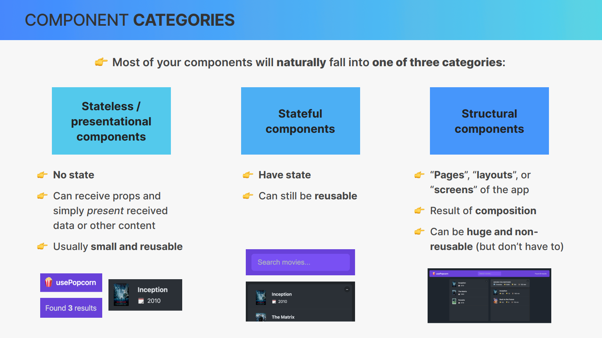


## 🔧 5. Lesson 110 — *Prop Drilling*

### 🧠 5.1 Context:

Prop Drilling is a pattern in React where data (props) are passed through multiple levels of intermediate components that don't need that data, just to reach the component that actually needs it. This pattern is common when state is located in a parent component (like `App.jsx`) and needs to be accessed by deeply nested components in the component tree.

**When does Prop Drilling occur?**
- When state is "lifted up" to a common parent component
- When multiple child components need to access the same state
- When there are several levels of nesting between the component that has the state and the one that needs it

**Example in this project:**
The `movies` state is defined in `App.jsx` and needs to reach:
1. `NumResult.jsx` (through `Navbar.jsx`) - to display the results count
2. `Movie.jsx` (through `Main.jsx` → `ListBox.jsx` → `MovieList.jsx`) - to render each movie

**Advantages of Prop Drilling:**
- ✅ Simple and straightforward for small/medium applications
- ✅ Easy to understand and follow the data flow
- ✅ Doesn't require additional libraries
- ✅ Makes the data flow explicit in the code

**Disadvantages of Prop Drilling:**
- ⚠️ Can become verbose when there are many levels of nesting
- ⚠️ Intermediate components must receive props they don't use directly
- ⚠️ Makes it harder to refactor component structure
- ⚠️ May indicate the need for a more robust state management solution (Context API, Redux, etc.)

**When to consider alternatives:**
- When prop drilling goes through more than 3-4 levels of components
- When multiple components in different branches of the tree need the same state
- When code becomes difficult to maintain due to too many intermediate props

In this lesson, we implement prop drilling to pass `movies` from `App.jsx` to the components that need it, demonstrating how this fundamental React pattern works.


### ⚙️ 5.2 Updating code according the context:

#### 5.2.1 Categorizing each Component:
| Stateless | Stateful | Structural |
|---|---|---|
| Logo | ListBox | NavBar|
| NumResults | Search | App|
| MovieList | WatchedBox | Main|
| Movie | -- | -- |
| WatchedSummary | -- | -- |
| WatchedMovieList | -- | -- |
| WatchedMovie | -- | -- |

> Component Tree:

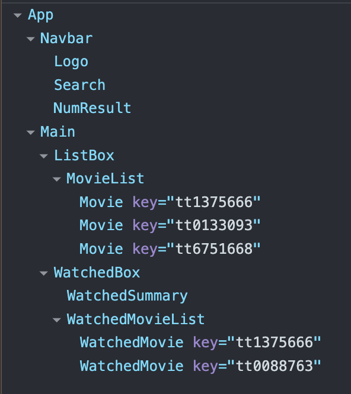

#### 5.2.2 Access to Movie Result dynamically lifting up `movie` prop from `App` to `NumResults`:


From `App.jsx` to `Navbar.jsx`:
```tsx
/* src/App.jsx */
import { useState } from "react";
import Navbar from "./components/Navbar";
import Main from "./components/Main";

const tempMovieData = [....];
const tempWatchedData = [....];

function App() {
  const [movies, setMovies] = useState(tempMovieData);  // 👈🏽 ✅
  return (
    <>
      <Navbar movies={movies} />  // 👈🏽 ✅
      <Main tempMovieData={tempMovieData} tempWatchedData={tempWatchedData} />
    </>
  );
}
export default App;
```

From `NavBar.jsx` to `NumResults.jsx`:
```tsx
/* src/components/Navbar.jsx */
import Logo from "./Logo";
import Search from "./Search";
import NumResult from "./NumResult";
const Navbar = ({ movies }) => {  // 👈🏽 ✅

  return (
    <nav className="nav-bar">
      <Logo />
      <Search />
      <NumResult movies={movies} />  // 👈🏽 ✅
    </nav>
  );
};

export default Navbar;
```

In `NumResults.jsx`:
```jsx
/* src/components/NumResult.jsx */
const NumResult = ({ movies }) => {  // 👈🏽 ✅
  return (
    <p className="num-results">
      Found <strong>{movies.length}</strong> results  // 👈🏽 ✅
    </p>
  );
};

export default NumResult;
```
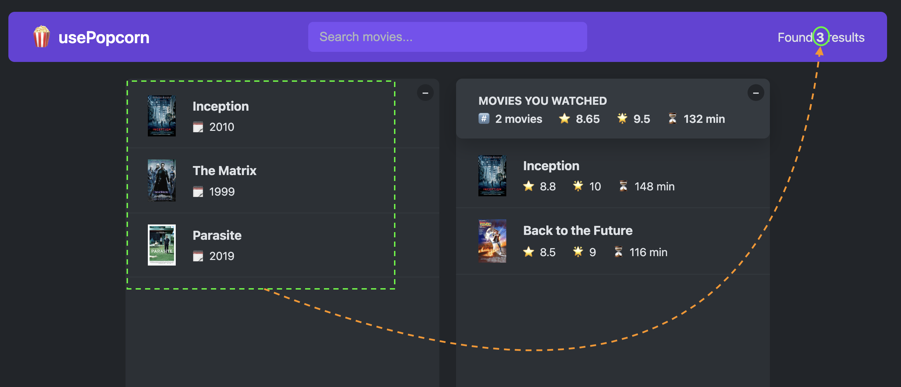


#### 5.2.3 Access to Movie lifting up `movie` prop from `App` to `MovieList`:
From  `App.jsx` to `Main`:
```jsx
/* src/App.jsx */
import { useState } from "react";
import Navbar from "./components/Navbar";
import Main from "./components/Main";

const tempMovieData = [....];
const tempWatchedData = [....];

function App() {
  const [movies, setMovies] = useState(tempMovieData);  // 👈🏽 ✅
  return (
    <>
      <Navbar movies={movies} />
      <Main movies={movies} tempWatchedData={tempWatchedData} />  // 👈🏽 ✅
    </>
  );
}
export default App;
```

From `Main.jsx` to `ListBox.jsx`:
```jsx
/* src/components/Main.jsx */
import ListBox from "./ListBox";
import WatchedBox from "./WatchedBox";

const Main = ({ movies, tempWatchedData }) => {  // 👈🏽 ✅
  return (
    <main className="main">
      <ListBox movies={movies} />  // 👈🏽 ✅
      <WatchedBox tempWatchedData={tempWatchedData} />
    </main>
  );
};

export default Main;
```


From `ListBox.jsx` from `MovieList.jsx`:
```jsx
/* src/components/ListBox.jsx */
import { useState } from "react";
import MovieList from "./MovieList";
const ListBox = ({ movies }) => {  // 👈🏽 ✅
  const [isOpen, setIsOpen] = useState(true);

  return (
    <div className="box">
      <button className="btn-toggle" onClick={() => setIsOpen((open) => !open)}>
        {isOpen ? "–" : "+"}
      </button>
      {isOpen && <MovieList movies={movies} />}  // 👈🏽 ✅
    </div>
  );
};

export default ListBox;
```


From `MovieList.jsx` to `Movie.jsx`:
```jsx
/* src/components/MovieList.jsx */
import Movie from "./Movie";

const MovieList = ({ movies }) => {
  return (
    <ul className="list">
      {movies?.map((movie) => (
        <Movie movie={movie} key={movie.imdbID} />
      ))}
    </ul>
  );
};

export default MovieList;
```

In `Movie.jsx`
```jsx
/* src/components/Movie.jsx */
const Movie = ({ movie }) => {
  return (
    <li>
      
      <h3>{movie.Title}</h3>
      <div>
        <p>
          <span>🗓</span>
          <span>{movie.Year}</span>
        </p>
      </div>
    </li>
  );
};

export default Movie;
```


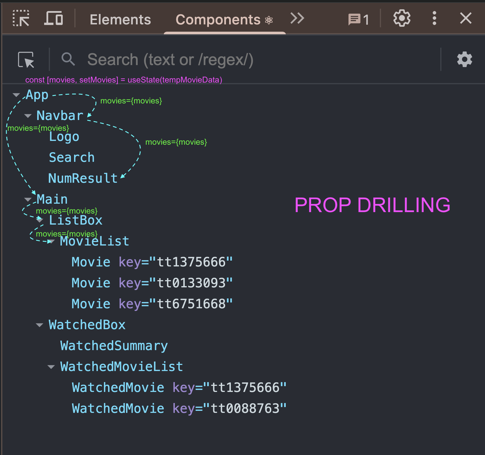

### 🐞 5.3 Issues:

| Issue | Status | Log/Error |
|---|---|---|
| **Excessive prop drilling for `movies`** | ⚠️ Identified | The `movies` prop is passed through 4 levels (App → Navbar → NumResult) and 5 levels (App → Main → ListBox → MovieList → Movie). Although functional, this can become difficult to maintain if the structure grows |
| **Intermediate components receive props they don't use** | ⚠️ Identified | `Navbar.jsx` and `Main.jsx` receive `movies` only to pass it to their children, they don't use it directly. This is characteristic of prop drilling but may indicate the need for Context API |
| **Inconsistency in prop names** | ⚠️ Identified | `WatchedBox.jsx` receives `tempWatchedData` while `ListBox.jsx` receives `movies`. Should be consistent: both should receive the same type of prop (without the `temp` prefix) |
| **Potential duplicate state** | ⚠️ Identified | `ListBox.jsx` could have its own local `movies` state (as seen in previous lessons), but now receives `movies` as a prop. Needs verification to avoid state duplication |
| **Incorrect import in WatchedBox.jsx** | ⚠️ Identified | Line 3: `import WatchedList from "./WatchedMovieList";` should be `import WatchedMovieList from "./WatchedMovieList";` - The import name doesn't match the component export |
| **Uncleaned commented code** | ℹ️ Low Priority | `WatchedBox.jsx` contains commented code (lines 7, 10-14, 22-42, 45-66) that should be removed to keep the code clean |

### 🧱 5.4 Pending Fixes (TODO)

```md
- [ ] Fix import in `WatchedBox.jsx`: Change `WatchedList` to `WatchedMovieList` to match the exported component name
- [ ] Standardize prop names: Change `tempWatchedData` to `watched` or `watchedMovies` to maintain consistency with `movies` in other components
- [ ] Verify and remove duplicate state: Ensure that `ListBox.jsx` doesn't have local `movies` state that conflicts with the received prop
- [ ] Clean up commented code: Remove all commented lines in `WatchedBox.jsx` (lines 7, 10-14, 22-42, 45-66) to keep the code clean and maintainable
- [ ] Consider Context API for `movies`: If prop drilling becomes more complex, evaluate using React Context API to share the `movies` state without passing through intermediate components
- [ ] Document prop flow: Create a diagram or documentation that clearly shows how the `movies` prop flows from `App.jsx` to the final components
- [ ] Add prop validation: Consider using PropTypes or TypeScript to validate that `movies` props are valid arrays in each component that receives them
- [ ] Optimize re-renders: Review if intermediate components like `Navbar` and `Main` are re-rendering unnecessarily when `movies` changes, and consider using `React.memo` if necessary
```


## 🔧 6. Lesson 111 — *Component Composition*

### 🧠 6.1 Context:

Component Composition is a powerful React pattern that allows building complex UIs by combining smaller, reusable components. Instead of creating monolithic components with many props, composition enables flexible and maintainable component architectures by using the `children` prop and other composition techniques.

**What is Component Composition?**

Component Composition is the practice of building complex components by combining simpler, reusable components. The key concept is that components can accept other components (or JSX) as props, most commonly through the special `children` prop, allowing parent components to control what content is rendered inside child components.

**When does Component Composition occur?**

- When you need to create reusable container components that can wrap different content
- When multiple components share similar structure but different content
- When you want to avoid prop drilling by passing JSX directly instead of data
- When building flexible, configurable components that can adapt to different use cases
- When creating layout components that need to accept dynamic content

**Examples in this project:**

1. **Current structure without composition**: `ListBox.jsx` and `WatchedBox.jsx` both have identical structure (a collapsible box with toggle button), but they're separate components with duplicated code:
   - Both have `<div className="box">`
   - Both have `<button className="btn-toggle">` with state management
   - Both conditionally render content based on `isOpen` state

2. **Potential composition pattern**: A generic `Box` component could be created that accepts `children` as a prop, eliminating duplication:
   ```jsx
   <Box>
     <MovieList movies={movies} />
   </Box>
   ```

3. **Structural composition**: `Navbar.jsx` and `Main.jsx` are already using composition by combining multiple child components (`Logo`, `Search`, `NumResult` in Navbar; `ListBox` and `WatchedBox` in Main).

**Advantages of Component Composition:**

- ✅ **Reduces code duplication**: Shared UI patterns can be extracted into reusable components
- ✅ **Increases flexibility**: Components become more adaptable to different use cases
- ✅ **Improves maintainability**: Changes to shared structure only need to be made in one place
- ✅ **Better separation of concerns**: Container components handle structure, child components handle content
- ✅ **More reusable**: Generic components can be used in multiple contexts
- ✅ **Easier to test**: Smaller, focused components are simpler to test individually

**Disadvantages of Component Composition:**

- ⚠️ **Can add abstraction layers**: Too many wrapper components can make code harder to follow
- ⚠️ **May require more component files**: Creating generic components increases the number of files
- ⚠️ **Potential over-engineering**: Not every similar structure needs a shared component
- ⚠️ **Learning curve**: Developers need to understand composition patterns to work effectively

**When to consider alternatives:**

- When components are truly unique and won't benefit from sharing structure
- When the abstraction would make the code less readable rather than more maintainable
- When the duplication is minimal and the components are unlikely to change together
- When performance is critical and additional component layers would impact rendering

**Connection to this lesson's practical implementation:**

In this lesson, we identify that `ListBox.jsx` and `WatchedBox.jsx` share the same collapsible box pattern. By applying Component Composition, we can create a generic `Box` component that handles the toggle functionality and structure, while accepting different content through the `children` prop. This demonstrates how composition can eliminate duplication and create more maintainable code.

### ⚙️ 6.2 Theory context:

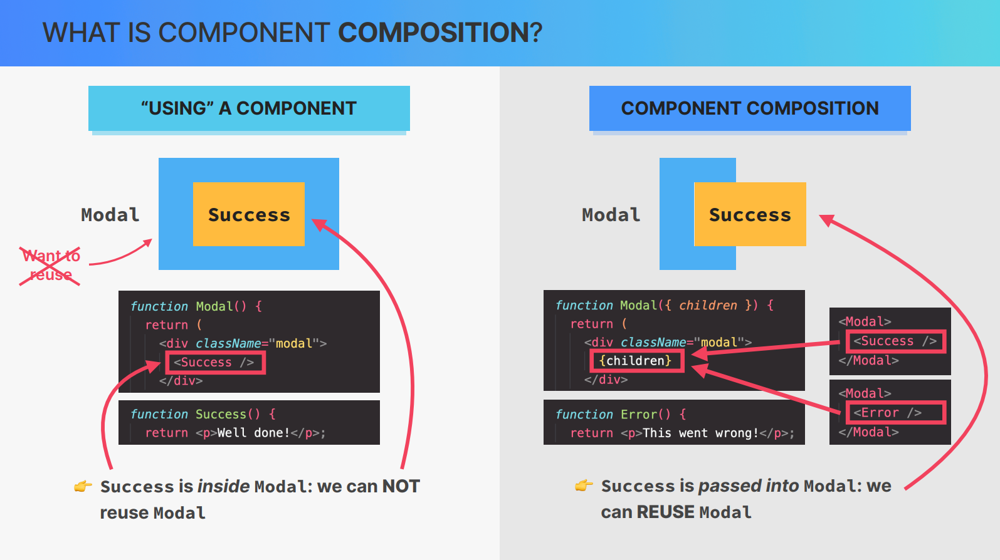
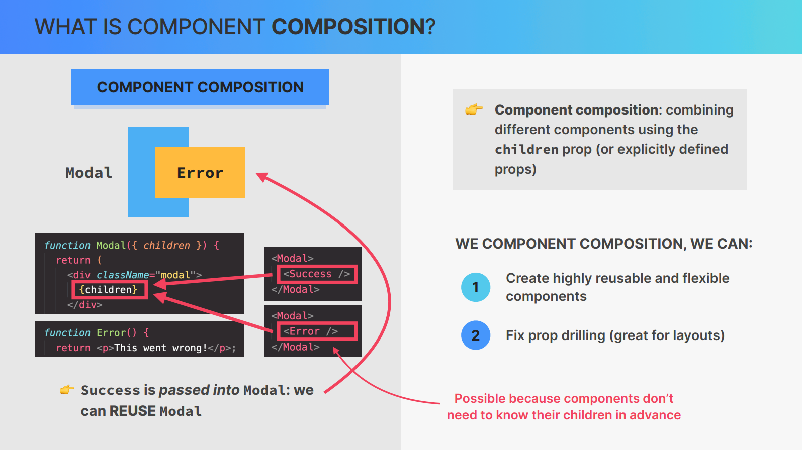

### 🐞 6.3 Issues:

| Issue | Status | Log/Error |
|---|---|---|
| **Code duplication between ListBox and WatchedBox** | ⚠️ Identified | Both `ListBox.jsx` (lines 7-13) and `WatchedBox.jsx` (lines 16-20) have identical structure: `<div className="box">`, toggle button with `isOpen` state, and conditional rendering. This violates DRY principle and makes maintenance harder |
| **Missing generic Box component** | ⚠️ Identified | No reusable `Box` component exists to handle the collapsible box pattern. The toggle functionality and structure are duplicated across multiple components |
| **Incorrect import name in WatchedBox.jsx** | ⚠️ Identified | Line 3: `import WatchedList from "./WatchedMovieList";` should be `import WatchedMovieList from "./WatchedMovieList";` - Component name doesn't match the actual export, causing potential runtime errors |
| **Commented code in WatchedBox.jsx** | ⚠️ Identified | Lines 7, 10-14, 22-42, and 45-66 contain commented-out code that should be removed for code cleanliness and maintainability |
| **Commented code in WatchedMovieList.jsx** | ⚠️ Identified | Lines 6-23 contain commented-out code that duplicates the `WatchedMovie` component implementation, should be cleaned up |
| **State management duplication** | ⚠️ Identified | Both `ListBox.jsx` and `WatchedBox.jsx` manage identical `isOpen` state independently. This could be abstracted into a reusable hook or component |
| **Inconsistent prop naming** | ⚠️ Identified | `WatchedBox.jsx` receives `tempWatchedData` while `ListBox.jsx` receives `movies`. Should standardize prop naming conventions (remove `temp` prefix) |
| **Missing composition pattern** | ⚠️ Identified | Components don't leverage the `children` prop pattern for flexible content composition, missing an opportunity to create more reusable and flexible components |

### 🧱 6.4 Pending Fixes (TODO)

```md
- [ ] Fix import naming in `WatchedBox.jsx`: Change `WatchedList` to `WatchedMovieList` on line 3 to match the actual component export
- [ ] Create generic `Box` component: Extract the collapsible box pattern from `ListBox.jsx` and `WatchedBox.jsx` into a reusable `Box.jsx` component that accepts `children` prop
- [ ] Refactor `ListBox.jsx` to use composition: Replace the box structure with `<Box><MovieList movies={movies} /></Box>` pattern
- [ ] Refactor `WatchedBox.jsx` to use composition: Replace the box structure with `<Box><WatchedSummary /> <WatchedMovieList /></Box>` pattern
- [ ] Extract toggle state logic: Consider creating a custom hook `useToggle` to manage `isOpen` state if it will be reused elsewhere
- [ ] Clean up commented code: Remove all commented-out code blocks from `WatchedBox.jsx` (lines 7, 10-14, 22-42, 45-66) and `WatchedMovieList.jsx` (lines 6-23)
- [ ] Standardize prop naming: Rename `tempWatchedData` to `watched` or `watchedMovies` throughout the codebase for consistency
- [ ] Update component documentation: Document the new `Box` component and its usage pattern in component hierarchy documentation
- [ ] Test composition pattern: Verify that the refactored components maintain the same functionality and behavior after applying composition
- [ ] Consider additional composition opportunities: Review other components (`Navbar`, `Main`) for potential composition improvements using `children` prop
```


## 🔧 7. Lesson 112 — *Fixing Prop Drilling With Composition (And Building a Layout)*

### 🧠 7.1 Context:

**Component Composition** is a powerful React pattern that allows you to build complex UIs by combining smaller, reusable components. Instead of passing data through multiple component levels (prop drilling), composition uses the `children` prop to inject content directly into parent components, creating more flexible and maintainable component hierarchies.

**What is Composition?**
Composition is the practice of building complex components by combining simpler ones. In React, this is achieved primarily through the `children` prop, which allows parent components to accept and render arbitrary content passed from their parent. This pattern enables components to act as "containers" or "layouts" that define structure while allowing content to be determined by the component's usage context.

**How Composition Solves Prop Drilling:**
In Lesson 110, we saw prop drilling where `movies` was passed through multiple levels:
- `App` → `Navbar` → `NumResult` (3 levels)
- `App` → `Main` → `ListBox` → `MovieList` → `Movie` (5 levels)

With composition, we eliminate intermediate prop passing:
- `Navbar` becomes a structural component that accepts `children`, removing the need to pass `movies` through it
- `Main` and `ListBox` similarly become layout components that don't need to know about the data they contain
- Data flows directly from `App` to the components that need it, bypassing intermediate components

**When Composition is Used:**
- When you have structural/layout components that don't need the data they contain
- When you want to create flexible, reusable container components
- When you want to reduce coupling between parent and child components
- When building layout components (Navbar, Main, Sidebar, Modal, etc.)
- When you want to avoid prop drilling through intermediate components

**Examples from this Project:**
1. **Navbar Component**: Transformed from receiving `movies` prop to accepting `children`, allowing `Search` and `NumResult` to be composed directly in `App.jsx`
2. **Main Component**: Changed from receiving `movies` to accepting `children`, enabling flexible composition of `ListBox` and `WatchedBox`
3. **ListBox Component**: Refactored to accept `children` instead of `movies`, making it a reusable container for any content

**Advantages of Composition:**
- ✅ **Eliminates prop drilling**: Data doesn't need to pass through components that don't use it
- ✅ **Increases flexibility**: Components can be reused with different content
- ✅ **Reduces coupling**: Parent components don't need to know about child component internals
- ✅ **Improves maintainability**: Changes to data structure don't affect intermediate components
- ✅ **Better separation of concerns**: Structural components focus on layout, not data management
- ✅ **More reusable**: Container components can be used in different contexts with different content

**Disadvantages of Composition:**
- ⚠️ **Can be less explicit**: Data flow might be less obvious when using `children`
- ⚠️ **Requires understanding**: Developers need to understand the composition pattern
- ⚠️ **Not always appropriate**: Some components legitimately need props to function
- ⚠️ **May require refactoring**: Existing prop-based components need to be refactored

**When to Consider Alternatives:**
- When components genuinely need the data they're passing through (not just forwarding)
- When using Context API would be more appropriate for deeply nested, widely-used state
- When the composition pattern makes the code less readable or more complex
- When you need to pass multiple unrelated props through many levels (consider Context API or state management)

**Building Layouts with Composition:**
This lesson also demonstrates how composition enables building flexible layout components. Components like `Navbar`, `Main`, and `ListBox` become layout structures that can be reused across different parts of an application with different content, following the principle of "structure vs. content" separation.


### ⚙️ 7.2 Updating code according the context:

#### 7.2.1 Working on the path from `App.jsx`  through `NavBar.jsx` to `NumResults.jsx`:
```tsx
/* src/components/Navbar.jsx */
//import Search from "./Search";
//import NumResult from "./NumResult";
import Logo from "./Logo";
const Navbar = ({ children }) => {
  return (
    <nav className="nav-bar">
      <Logo />
      {/*
        <Search />
        <NumResult movies={movies} />
      */}
      {children}. // 👈🏽 ✅
    </nav>
  );
};

export default Navbar;
```

And now in `App.jsx`:
```tsx
/* src/App.jsx */
import { useState } from "react";
import Navbar from "./components/Navbar";
import Main from "./components/Main";
import Search from "./components/Search";         // 👈🏽 ✅
import NumResult from "./components/NumResult";   // 👈🏽 ✅
const tempMovieData = [...];
const tempWatchedData = [...];
function App() {
  const [movies, setMovies] = useState(tempMovieData);
  return (
    <>
      <Navbar>                          // 👈🏽 ✅ no prop here!
        <Search />                      // 👈🏽 ✅
        <NumResult movies={movies} />   // 👈🏽 ✅
      </Navbar>
      <Main movies={movies} tempWatchedData={tempWatchedData} />
    </>
  );
}
export default App;
```


> Main Reasons:
1. `Separation of concerns and coupling`:
- `Logo`: presentational, no state or parent props needed. It’s part of Navbar’s visual structure.
- `Search` and `NumResult`: need access to `movies` state in `App`. If inside `Navbar`, `movies` would need to be passed through `Navbar`, increasing coupling. (Prop Drilling)

2. `Lifting state up`
- `movies` lives in `App` because it’s used in multiple places (NumResult, Main).
- `Search` likely updates `movies` (e.g., search results). Being in `App` lets it modify state directly without prop drilling.

3. `Composition with children`
- Navbar uses children, allowing content to be passed from the parent.
- Benefits:
  - `Navbar` is more flexible and reusable.
  - Content can vary by context.
  - `Logo` stays fixed in `Navbar` (base structure), while `Search` and `NumResult` are injected from outside.

4. `Data flow`
    ```
    App (has movies state)
      ├── Navbar (visual structure)
      │   ├── Logo (presentational, no dependencies)
      │   └── children (Search + NumResult that need movies)
      └── Main (also needs movies)
    ```
If Search were inside Navbar:
- `Navbar` would need `movies` and `setMovies`.
- `Navbar` would be coupled to `search` logic.
- Less flexible and harder to maintain.

5. `Single responsibility principle`
- `Navbar`: structure and layout of the navbar.
- `App`: state management and component coordination.
- `Search`: search logic (better placed near the state it manages).


#### 7.2.2 Working on the path from `App.jsx` through `Main.jsx` and `ListBox.jsx` to `MovieList.jsx`:
```tsx
/* src/components/ListBox.jsx */
import { useState } from "react";
//import MovieList from "./MovieList";
const ListBox = ({ children }) => {  // 👈🏽 ✅
  const [isOpen, setIsOpen] = useState(true);
  return (
    <div className="box">
      <button className="btn-toggle" onClick={() => setIsOpen((open) => !open)}>
        {isOpen ? "–" : "+"}
      </button>
      {/* isOpen && <MovieList movies={movies} /> */}
      {isOpen && children}  // 👈🏽 ✅
    </div>
  );
};
export default ListBox;
```

```tsx
/* src/components/Main.jsx */
//import WatchedBox from "./WatchedBox";
//import ListBox from "./ListBox";
const Main = ({ children }) => {  // 👈🏽 ✅
  return (
    <main className="main">
      {/* <ListBox movies={movies} /> */}
      {children}  // 👈🏽 ✅
    </main>
  );
};

export default Main;
```

```jsx
/* src/App.jsx */
import { useState } from "react";
import Navbar from "./components/Navbar";
import Main from "./components/Main";
import Search from "./components/Search";
import NumResult from "./components/NumResult";
import ListBox from "./components/ListBox";                 // 👈🏽 ✅
import MovieList from "./components/MovieList";             // 👈🏽 ✅
import WatchedBox from "./components/WatchedBox";           // 👈🏽 ✅
const tempMovieData = [....];
const tempWatchedData = [....];
function App() {
  const [movies, setMovies] = useState(tempMovieData);
  return (
    <>
      <Navbar>
        <Search />
        <NumResult movies={movies} />
      </Navbar>
      <Main>                                                // 👈🏽 ✅
        <ListBox>                                           // 👈🏽 ✅
          <MovieList movies={movies} />                     // 👈🏽 ✅
        </ListBox>                                          
      </Main>                                               
        <WatchedBox tempWatchedData={tempWatchedData} />    // 👈🏽 ✅
      </Main>
    </>
  );
}
export default App;
```


### 🐞 7.3 Issues:

| Issue | Status | Log/Error |
|---|---|---|
| **Syntax error in documentation example** | ⚠️ Identified | Line 1991 in documentation shows `{children}.` with a trailing dot, but actual code in `Navbar.jsx` is correct without the dot. Documentation should be updated to match the actual implementation |
| **WatchedBox still uses prop drilling pattern** | ⚠️ Identified | `WatchedBox.jsx` receives `tempWatchedData` directly from `App.jsx` instead of using composition pattern. It could be refactored to accept `children` like `Navbar` and `Main` for consistency. Current: `<WatchedBox tempWatchedData={tempWatchedData} />` |
| **Inconsistent prop naming convention** | ⚠️ Identified | `WatchedBox` receives `tempWatchedData` while other components receive `movies`. The `temp` prefix suggests temporary data and should be removed for consistency. Location: `src/App.jsx:69` and `src/components/WatchedBox.jsx:5` |
| **Search component not connected to movies state** | ℹ️ Low Priority | `Search.jsx` has its own local state but doesn't filter or update the `movies` state in `App.jsx`. This means search functionality is not implemented, only the UI exists. Future enhancement needed |
| **Composition pattern not fully applied** | ⚠️ Identified | While `Navbar` and `Main` use composition, `WatchedBox` still follows the old prop drilling pattern. For complete consistency, `WatchedBox` should be refactored to accept `WatchedSummary` and `WatchedMovieList` as children |

### 🧱 7.4 Pending Fixes (TODO)

```md
- [ ] Fix documentation syntax error: Remove trailing dot from `{children}.` example in section 7.2.1 (line 1991) to match actual code implementation
- [ ] Refactor WatchedBox to use composition pattern: Change `WatchedBox.jsx` to accept `children` prop instead of `tempWatchedData`, allowing `WatchedSummary` and `WatchedMovieList` to be composed in `App.jsx` similar to how `Navbar` and `Main` work
- [ ] Update App.jsx composition: After refactoring `WatchedBox`, update `App.jsx` to compose `WatchedSummary` and `WatchedMovieList` as children of `WatchedBox`, passing `watched` state directly to these components
- [ ] Rename tempWatchedData prop: Remove `temp` prefix from `tempWatchedData` variable and prop name for consistency with `movies` naming convention. Update in `src/App.jsx` and `src/components/WatchedBox.jsx`
- [ ] Implement search functionality: Connect `Search.jsx` component to `movies` state in `App.jsx` to enable actual movie filtering/searching functionality (currently only UI exists)
- [ ] Verify composition pattern consistency: Ensure all structural components (`Navbar`, `Main`, `ListBox`, `WatchedBox`) follow the same composition pattern using `children` prop for better code consistency and maintainability
- [ ] Update component documentation: Add comments explaining the composition pattern usage in refactored components (`Navbar.jsx`, `Main.jsx`, `ListBox.jsx`) for future developers
```

## 🔧 8. Lesson 113 — *Using Composition to Make a Reusable Box*

### 🧠 8.1 Context:

This lesson demonstrates the practical application of Component Composition to eliminate code duplication by creating a reusable `Box` component. After identifying that `ListBox.jsx` and `WatchedBox.jsx` share identical structural patterns (collapsible box with toggle functionality), we extract the common logic into a generic `Box` component that can be reused across the application.

**What is Code Duplication and Why Eliminate It?**

Code duplication occurs when the same or very similar code appears in multiple places. In this case, both `ListBox.jsx` and `WatchedBox.jsx` implemented the same collapsible box pattern:
- Both manage `isOpen` state using `useState`
- Both render a `<div className="box">` container
- Both have a toggle button with identical behavior
- Both conditionally render content based on `isOpen` state

**When Does This Pattern Occur?**

- When multiple components share the same UI structure and behavior
- When refactoring reveals repeated patterns across components
- When you want to create reusable, generic components
- When following the DRY (Don't Repeat Yourself) principle

**Examples from this Project:**

1. **Before refactoring**: `ListBox.jsx` and `WatchedBox.jsx` both contained duplicate code for the collapsible box pattern
2. **After refactoring**: A single `Box.jsx` component handles all collapsible box functionality, accepting any content through the `children` prop

**Advantages of Creating a Reusable Box Component:**

- ✅ **Eliminates duplication**: Single source of truth for the collapsible box pattern
- ✅ **Easier maintenance**: Changes to the box behavior only need to be made in one place
- ✅ **Increased reusability**: The `Box` component can be used anywhere a collapsible container is needed
- ✅ **Better separation of concerns**: `Box` handles structure/behavior, child components handle content
- ✅ **More flexible**: Can wrap any content, not just specific movie-related components
- ✅ **Consistent behavior**: All collapsible boxes behave identically across the application

**Disadvantages:**

- ⚠️ **Potential over-abstraction**: If the components were truly different, abstraction might not be beneficial
- ⚠️ **Requires refactoring**: Existing components need to be updated to use the new pattern
- ⚠️ **Learning curve**: Developers need to understand the composition pattern to use it effectively

**When to Consider Alternatives:**

- When components share structure but have significantly different behaviors
- When the abstraction would make the code less readable
- When the duplication is minimal and unlikely to change
- When performance considerations require component-specific optimizations

**Connection to this Lesson's Practical Implementation:**

In this lesson, we identify the duplication between `ListBox` and `WatchedBox`, create a generic `Box` component using the `children` prop pattern, and refactor `App.jsx` to use `Box` for both movie list and watched movies sections. This demonstrates how composition can eliminate duplication while maintaining flexibility and improving code maintainability.

### ⚙️ 8.2 Updating code according the context:
Make an assessment into `WatchBox.jsx` and `ListBox.jsx`

#### 8.2.1 Check it out how similar `WatchBox.jsx` and `ListBox.jsx` components are.
```tsx
/* src/components/WatchedBox.jsx */
import { useState } from "react";
import WatchedSummary from "./WatchedSummary";
import WatchedMovieList from "./WatchedMovieList";

const WatchedBox = ({ tempWatchedData }) => {
  const [isOpen, setisOpen] = useState(true);
  const [watched, setWatched] = useState(tempWatchedData);

  return (
    <div className="box">
      <button className="btn-toggle" onClick={() => setisOpen((open) => !open)}>
        {isOpen ? "–" : "+"}
      </button>
      {isOpen && (
        <>
          <WatchedSummary watched={watched} />
          <WatchedMovieList watched={watched} />
        </>
      )}
    </div>
  );
};

export default WatchedBox;
```

and

```tsx
/* src/components/ListBox.jsx */
import { useState } from "react";

const ListBox = ({ children }) => {
  const [isOpen, setIsOpen] = useState(true);

  return (
    <div className="box">
      <button className="btn-toggle" onClick={() => setIsOpen((open) => !open)}>
        {isOpen ? "–" : "+"}
      </button>
      {/* isOpen && <MovieList movies={movies} /> */}
      {isOpen && children}
    </div>
  );
};

export default ListBox;
```

What they Both components have in common:
- Manage local UI state `(isOpen)`
- Render the same UI pattern:
  - A container `(div.box)`
  - A `toggle` button
  - Conditional rendering based on `isOpen`
- Implement the same expand / collapse behavior

From a React point of view, they share the same structural and behavioral logic.
- ✅ Yes, they are very similar
- ⚠️ But `ListBox` is a more abstract, reusable component, while `WatchedBox` is feature-specific

#### 8.2.2 Create a General component named `Box.jsx`:
```tsx
/* src/components/Box.jsx */
import { useState } from "react";

const Box = ({ children }) => {
  const [isOpen, setIsOpen] = useState(true);

  return (
    <div className="box">
      <button className="btn-toggle" onClick={() => setIsOpen((open) => !open)}>
        {isOpen ? "–" : "+"}
      </button>
      {isOpen && children}
    </div>
  );
};

export default Box;
```

#### 8.2.3 Import `Box.jsx` component into `App.jsx`:
```tsx
/* src/App.jsx */
import { useState } from "react";
import Navbar from "./components/Navbar";
import Main from "./components/Main";
import Search from "./components/Search";
import NumResult from "./components/NumResult";

import Box from "./components/Box";  // 👈🏽 ✅
import MovieList from "./components/MovieList";  // 👈🏽 ✅
//import WatchedBox from "./components/WatchedBox";

const tempMovieData = [....];
const tempWatchedData = [....];

function App() {
  const [movies, setMovies] = useState(tempMovieData);

  return (
    <>
      <Navbar>
        <Search />
        <NumResult movies={movies} />
      </Navbar>
      <Main>
        <Box>  // 👈🏽 ✅
          <MovieList movies={movies} />
        </Box>
        {/* <WatchedBox tempWatchedData={tempWatchedData} /> */}
      </Main>
    </>
  );
}

export default App;
```

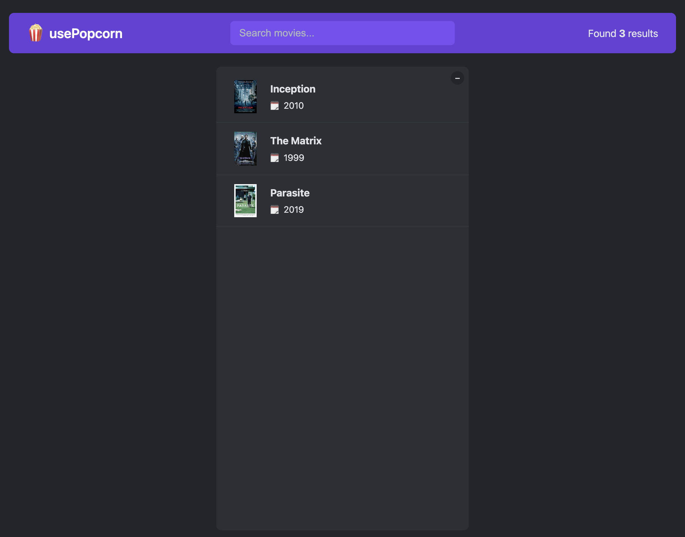

#### 8.2.4 Reuse `Box.jsx` component in order to replace `WatchedBox.jsx`:
```tsx
/* src/App.jsx */
import { useState } from "react";
import Navbar from "./components/Navbar";
import Main from "./components/Main";
import Search from "./components/Search";
import NumResult from "./components/NumResult";

import Box from "./components/Box";
import MovieList from "./components/MovieList";
import WatchedSummary from "./components/WatchedSummary";  // 👈🏽 ✅
import WatchedMovieList from "./components/WatchedMovieList";  // 👈🏽 ✅

const tempMovieData = [....];
const tempWatchedData = [....];

function App() {
  const [movies, setMovies] = useState(tempMovieData);

  return (
    <>
      <Navbar>
        <Search />
        <NumResult movies={movies} />
      </Navbar>
      <Main>
        <Box>
          <MovieList movies={movies} />
        </Box>
        {/* <WatchedBox tempWatchedData={tempWatchedData} /> */}
        <Box>  // 👈🏽 ✅
          <WatchedSummary watched={watched} />  // 👈🏽 ✅
          <WatchedMovieList watched={watched} />  // 👈🏽 ✅
        </Box>
      </Main>
    </>
  );
}

export default App;
```

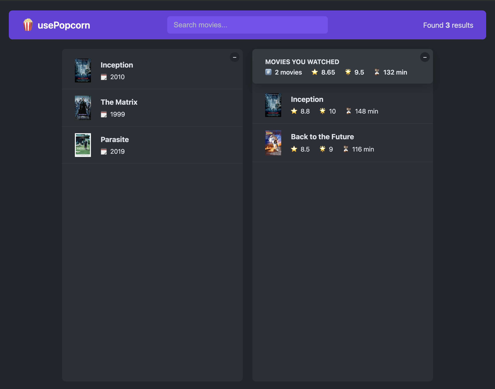

### 🐞 8.3 Issues:

| Issue | Status | Log/Error |
|---|---|---|
| **Unused ListBox component** | ⚠️ Identified | `ListBox.jsx` still exists in the codebase but is no longer used in `App.jsx` after refactoring to use `Box.jsx`. The component should be removed or documented as deprecated. Location: `src/components/ListBox.jsx` |
| **Unused WatchedBox component** | ⚠️ Identified | `WatchedBox.jsx` still exists but is no longer used in `App.jsx` after refactoring to use `Box.jsx`. The component should be removed since `Box.jsx` now handles this functionality. Location: `src/components/WatchedBox.jsx` |
| **Multiple commented code blocks in App.jsx** | ⚠️ Identified | `App.jsx` contains multiple commented code blocks: lines 69-71 (alternative `Box` usage with `children`), line 72 (`WatchedBox` usage), and lines 81-84 (alternative `Box` usage). Commented code should be removed for code cleanliness. Location: `src/App.jsx:69-71,72,81-84` |
| **Commented code in ListBox.jsx** | ⚠️ Identified | Line 11 in `ListBox.jsx` contains commented code: `{/* isOpen && <MovieList movies={movies} /> */}`. Since `ListBox` is no longer used, this file should be removed entirely. Location: `src/components/ListBox.jsx:11` |
| **Commented code in Main.jsx** | ⚠️ Identified | `Main.jsx` contains commented imports (lines 1-2) and commented JSX (line 7) related to deprecated `ListBox` and `WatchedBox` components. Should be cleaned up. Location: `src/components/Main.jsx:1-2,7` |
| **Commented code in WatchedMovieList.jsx** | ⚠️ Identified | Lines 6-23 in `WatchedMovieList.jsx` contain commented-out code that duplicates the `WatchedMovie` component implementation. Should be cleaned up. Location: `src/components/WatchedMovieList.jsx:6-23` |
| **Unused state setters** | ⚠️ Identified | `setMovies` and `setWatched` are declared but never used in `App.jsx`. Linter error: "Assigned a value but never used". These should either be used or prefixed with underscore if intentionally unused. Location: `src/App.jsx:58-59` |
| **Missing watched state in documentation example** | ⚠️ Identified | The code example in section 8.2.4 shows `watched` variable being used but doesn't show where it's defined. The actual `App.jsx` has `const [watched, setWatched] = useState(tempWatchedData);` but the documentation example omits this. Location: Documentation section 8.2.4 |
| **Inconsistent variable naming** | ℹ️ Low Priority | `App.jsx` uses `tempWatchedData` and `tempMovieData` as initial state but stores them in `watched` and `movies` state. The `temp` prefix suggests temporary data and should be removed for consistency. Consider renaming to `initialWatchedData`/`initialMovieData` or `watchedData`/`movieData`. Location: `src/App.jsx:12-55,58-59` |

### 🧱 8.4 Pending Fixes (TODO)

```md
- [ ] Remove unused `ListBox.jsx` component: Delete the file since `Box.jsx` now handles its functionality. Verify no other files import it before deletion
- [ ] Remove unused `WatchedBox.jsx` component: Delete the file since `Box.jsx` with composition pattern replaces it. Verify no other files import it before deletion
- [ ] Clean up commented code in `App.jsx`: Remove the commented `WatchedBox` usage on line 71 (`{/* <WatchedBox tempWatchedData={tempWatchedData} /> */}`)
- [ ] Clean up commented code in `WatchedMovieList.jsx`: Remove commented-out code blocks (lines 6-23) that duplicate `WatchedMovie` component implementation
- [ ] Update documentation example: Add missing `watched` state declaration in section 8.2.4 code example to match actual implementation: `const [watched, setWatched] = useState(tempWatchedData);`
- [ ] Standardize variable naming: Consider renaming `tempWatchedData` to `initialWatchedData` or `watchedData` throughout the codebase for better clarity and consistency
- [ ] Update component documentation: Document that `Box.jsx` is the reusable component for collapsible containers, replacing the previous `ListBox` and `WatchedBox` components
- [ ] Verify Box component usage: Ensure all instances of collapsible boxes in the application use the `Box` component for consistency
- [ ] Add PropTypes or TypeScript: Consider adding type validation to `Box.jsx` to ensure `children` prop is properly typed
- [ ] Review component imports: Check all component files to ensure no stale imports of `ListBox` or `WatchedBox` exist
```


## 🔧 9. Lesson 114 — *Passing Elements as Props (Alternative to children)*

### 🧠 9.1 Context:

**Passing Elements as Props** is an alternative pattern to using the `children` prop in React. Instead of wrapping content between component tags, you can pass JSX elements directly as named props. This lesson explores when and why you might use this pattern, and compares it to the more idiomatic `children` prop approach.

**What is Passing Elements as Props?**

Passing elements as props means accepting JSX elements through named props (like `element`, `header`, `footer`, `content`) instead of using the special `children` prop. For example:

- **With `children`**: `<Box><MovieList movies={movies} /></Box>`
- **With named prop**: `<Box element={<MovieList movies={movies} />} />`

**When does this pattern occur?**

- When you want to be explicit about what content is being passed
- When you need to pass multiple distinct content sections (e.g., `header`, `body`, `footer`)
- When you want to avoid the implicit `children` prop
- When building component APIs that require explicit prop names
- When you need to pass elements conditionally or dynamically

**Examples from this project:**

1. **Box component refactoring**: The `Box.jsx` component was changed from accepting `children` to accepting an `element` prop:
   - Before: `const Box = ({ children }) => { ... }`
   - After: `const Box = ({ element }) => { ... }`

2. **Usage in App.jsx**: Instead of wrapping content, elements are passed as props:
   - `<Box element={<MovieList movies={movies} />} />`
   - `<Box element={<><WatchedSummary /><WatchedMovieList /></>} />`

**Advantages of Passing Elements as Props:**

- ✅ **Explicit and clear**: The prop name makes it obvious what content is being passed
- ✅ **Multiple content sections**: Can accept multiple named props (e.g., `header`, `footer`, `content`)
- ✅ **Type safety**: Easier to validate specific prop types with TypeScript or PropTypes
- ✅ **Flexible naming**: Prop names can be descriptive of their purpose
- ✅ **Conditional passing**: Can conditionally pass elements based on logic

**Disadvantages of Passing Elements as Props:**

- ⚠️ **Less idiomatic**: Not the standard React pattern, which can confuse developers familiar with `children`
- ⚠️ **More verbose**: Requires explicit prop names instead of implicit wrapping
- ⚠️ **Less composable**: Doesn't leverage React's natural composition patterns
- ⚠️ **Less flexible**: Requires knowing prop names upfront, whereas `children` works with any content
- ⚠️ **Not scalable**: Adding more content sections requires adding more props

**When to consider alternatives:**

- **Use `children` when**: Your component wraps content (most common case)
- **Use named props when**: You need multiple distinct content sections with specific purposes
- **Use `children` when**: You want idiomatic React code that other developers will immediately understand
- **Use `children` when**: You want maximum flexibility and composability

**Performance considerations:**

There is **no meaningful performance difference** between using `children` and named props. Both approaches render React elements the same way. The choice is purely about API design and developer experience, not performance.

**Connection to this lesson's practical implementation:**

In this lesson, we demonstrate that while passing elements as props (`element`) is technically possible and works identically to `children`, the `children` prop is the recommended and idiomatic React pattern. The lesson shows both approaches side-by-side to illustrate that `children` is more composable, scalable, and follows React conventions. The final verdict is that `children` should be used when a component "wraps" content, which is the case for the `Box` component.

### ⚙️ 9.2 Updating code according the context:

#### 9.2.1 Changing `children` by `element` in order to send a prop.
```tsx
/* src/components/Box.jsx */
import { useState } from "react";

const Box = ({ element }) => {  // 👈🏽 ✅
  const [isOpen, setIsOpen] = useState(true);

  return (
    <div className="box">
      <button className="btn-toggle" onClick={() => setIsOpen((open) => !open)}>
        {isOpen ? "–" : "+"}
      </button>
      {isOpen && element}  // 👈🏽 ✅
    </div>
  );
};

export default Box;
```

#### 9.2.2 Applying this element in `App.jsx` component:
```tsx
/* src/App.jsx */
import { useState } from "react";
import Navbar from "./components/Navbar";
import Main from "./components/Main";
import Search from "./components/Search";
import NumResult from "./components/NumResult";

import Box from "./components/Box";
import MovieList from "./components/MovieList";
import WatchedSummary from "./components/WatchedSummary";
import WatchedMovieList from "./components/WatchedMovieList";

const tempMovieData = [....];
const tempWatchedData = [....];

function App() {
  const [movies, setMovies] = useState(tempMovieData);
  const [watched, setWatched] = useState(tempWatchedData);
  return (
    <>
      <Navbar>
        <Search />
        <NumResult movies={movies} />
      </Navbar>
      <Main>
        <Box element={<MovieList movies={movies} />} />  // 👈🏽 ✅
        {/* <Box>
          <MovieList movies={movies} />
        </Box> */}
        {/* <WatchedBox tempWatchedData={tempWatchedData} /> */}
        <Box
          element={  // 👈🏽 ✅
            <>
              <WatchedSummary watched={watched} />
              <WatchedMovieList watched={watched} />
            </>
          }
        />
        {/* <Box>
          <WatchedSummary watched={watched} />
          <WatchedMovieList watched={watched} />
        </Box> */}
      </Main>
    </>
  );
}

export default App;
```

> Performance & behavior
* No meaningful performance difference.
* Both render React elements the same way.

This is about API design, not speed.

✅ *Final verdict*

> There is no technical difference in rendering, but there is a big difference in design and intent.
* `element` → explicit, less idiomatic, more rigid
* `children` → idiomatic React, composable, scalable


💡 Rule of thumb

If your component “wraps” content → use `children`

👉 `children` is the correct and recommended choice.

### 🐞 9.3 Issues:

| Issue | Status | Log/Error |
|---|---|---|
| **Box component uses non-idiomatic `element` prop** | ⚠️ Identified | `Box.jsx` currently uses `element` prop instead of `children`, which is less idiomatic React. While functionally equivalent, `children` is the recommended pattern for components that wrap content. Location: `src/components/Box.jsx:3,11` |
| **Inconsistent composition patterns across components** | ⚠️ Identified | `Box.jsx` uses `element` prop while `Navbar.jsx`, `Main.jsx`, and `ListBox.jsx` use `children` prop. This inconsistency makes the codebase harder to understand and maintain. Location: Multiple files |
| **Commented code showing alternative `children` usage** | ⚠️ Identified | `App.jsx` contains commented code blocks (lines 69-71, 81-84) showing how `Box` would be used with `children` prop. This suggests uncertainty about which pattern to use and should be cleaned up. Location: `src/App.jsx:69-71,81-84` |
| **Missing documentation on prop choice** | ⚠️ Identified | No comments or documentation explaining why `element` prop was chosen over `children` in `Box.jsx`. Future developers may not understand the reasoning. Location: `src/components/Box.jsx` |
| **Potential confusion for React developers** | ℹ️ Low Priority | Using `element` instead of `children` may confuse developers familiar with React conventions, as `children` is the standard pattern for wrapper components. This could impact code readability and onboarding |

### 🧱 9.4 Pending Fixes (TODO)

```md
- [ ] Refactor `Box.jsx` to use `children` prop: Change `element` prop back to `children` to follow idiomatic React patterns and improve code consistency with other components (`Navbar`, `Main`, `ListBox`)
- [ ] Update `App.jsx` to use `children` pattern: Replace `<Box element={...} />` with `<Box>{...}</Box>` syntax to match React conventions and improve readability
- [ ] Remove commented code in `App.jsx`: Clean up commented code blocks showing alternative `children` usage (lines 69-71, 81-84) to keep codebase clean
- [ ] Standardize composition patterns: Ensure all wrapper components (`Box`, `Navbar`, `Main`, `ListBox`) use the same `children` prop pattern for consistency
- [ ] Add component documentation: Add comments in `Box.jsx` explaining why `children` is preferred over named props for wrapper components
- [ ] Update component hierarchy documentation: Document that `Box` component uses `children` prop pattern in the component hierarchy section
- [ ] Consider multiple content sections: If `Box` needs to support multiple distinct sections in the future (e.g., header, footer), consider using multiple named props (`header`, `footer`) while keeping `children` for main content
- [ ] Review other components: Check if any other components could benefit from using `children` prop instead of specific named props for better React idiomaticity
```


## 🔧 10. Lesson 115 — *Building a Reusable Star Rating Component*

### 🧠 10.1 Context:

**Reusable Components** are React components designed to be used in multiple places throughout an application with different configurations. They encapsulate common UI patterns and behaviors, making code more maintainable and consistent.

**StarRating Component** is a perfect example of a reusable component. It displays a visual rating system using stars, which can be configured with different maximum ratings (e.g., 5 stars, 10 stars) and reused across different parts of the application.

**When it occurs/is used:**
- When you need the same UI pattern in multiple places (e.g., rating movies, products, reviews)
- When you want to maintain consistency across the application
- When you need to reduce code duplication
- When building a design system or component library

**Examples from the project:**
- The `StarRating` component in `src/StarRating.jsx` accepts a `maxRating` prop to control how many stars are displayed
- It's currently used in `src/main.jsx` with different configurations: `<StarRating maxRating={5} />` and `<StarRating maxRating={10} />`
- The component uses `Array.from()` to dynamically generate stars based on the `maxRating` prop

**Advantages:**
- **DRY Principle**: Write once, use many times
- **Consistency**: Ensures the same look and behavior across the app
- **Maintainability**: Changes in one place affect all usages
- **Testability**: Easier to test a single component in isolation
- **Flexibility**: Props allow customization without code duplication
- **Reusability**: Can be shared across projects or teams

**Disadvantages:**
- **Over-engineering risk**: Creating reusable components for one-time use adds unnecessary complexity
- **Prop complexity**: Too many props can make components hard to use
- **Performance**: May need optimization for high-frequency updates
- **Abstraction overhead**: Sometimes a simple inline solution is clearer

**When to consider alternatives:**
- If the component is only used once, consider keeping it inline
- If props become too complex, consider composition patterns or multiple specialized components
- If performance is critical, consider memoization or more specific implementations
- If the component needs very different behaviors in different contexts, consider creating variants or separate components

**Connection to practical implementation:**
The `StarRating` component demonstrates the foundation of reusable components by accepting props (`maxRating`) to customize its behavior. This pattern will be extended in future lessons to add interactivity (clicking stars), state management (storing selected rating), and integration with the movie rating system.


### ⚙️ 10.2 Updating code according the context:

#### 10.2.1 Create `StarRating` component and comment other components.
```tsx
/* src/StarRating.jsx */
const StarRating = () => {
  return (
    <div>
      <div>
        {Array.from({ length: 5 }, (_, i) => (
          <span>S{i + 1}</span>
        ))}
      </div>
      <p>10</p>
    </div>
  );
};

export default StarRating;
```

#### 10.2.2 Add some simple style to `StarRating` component:
```tsx
/*  */
const containerStyle = {                          // 👈🏽 ✅
  display: "flex",
  alignItems: "center",
  gap: "16px",
};

const starContainerStyle = {                      // 👈🏽 ✅
  display: "flex",
  gap: "4px",
};

const textStyle = {                              // 👈🏽 ✅
  lineHeight: "1",
  gap: "0",
};

const StarRating = () => {
  return (
    <div style={containerStyle}>                {/* 👈🏽 ✅ */}
      <div style={starContainerStyle}>          {/* 👈🏽 ✅ */}
        {Array.from({ length: 5 }, (_, i) => (
          <span>S{i + 1}</span>
        ))}
      </div>
      <p style={textStyle}>10</p>               {/* 👈🏽 ✅ */}
    </div>
  );
};

export default StarRating;
```

#### 10.2.3 Adding the `maxrating` as prop:
```tsx
/* src/main.jsx */
import { StrictMode } from "react";
import { createRoot } from "react-dom/client";
// import './index.css'
// import App from './App.jsx'
import StarRating from "./StarRating.jsx";

createRoot(document.getElementById("root")).render(
  <StrictMode>
    {/* <App /> */}
    <StarRating maxRating={5} />    {/* 👈🏽 ✅ */}
    <StarRating maxRating={10} />   {/* 👈🏽 ✅ */}
  </StrictMode>
);
```


```jsx
/* src/StarRating.jsx */
const containerStyle = {
  display: "flex",
  alignItems: "center",
  gap: "16px",
};

const starContainerStyle = {
  display: "flex",
  gap: "4px",
};

const textStyle = {
  lineHeight: "1",
  gap: "0",
};

const StarRating = ({ maxRating = 3 }) => {                 {/* 👈🏽 ✅ */} 
  return (
    <div style={containerStyle}>
      <div style={starContainerStyle}>
        {Array.from({ length: maxRating }, (_, i) => (   // 👈🏽 ✅ 
          <span>S{i + 1}</span>
        ))}
      </div>
      <p style={textStyle}>10</p>
    </div>
  );
};

export default StarRating;
```

Notes:
* setting _by default_ `3 stars` when `main.jsx` has that: `<StarRating />`


### 🐞 10.3 Issues:

| Issue | Status | Log/Error |
|---|---|---|
| **Hardcoded rating display** | ⚠️ Identified | In `src/StarRating.jsx` line 25, the rating text is hardcoded as `10` instead of displaying a dynamic rating value. The component should accept a `rating` prop to display the actual rating. |
| **Missing rating prop** | ⚠️ Identified | The component doesn't accept a `rating` prop to display the current rating value. It only accepts `maxRating` to control the number of stars, but there's no way to show an actual rating. |
| **No interactivity** | ⚠️ Identified | The component is purely presentational. Users cannot click on stars to select a rating. This limits its reusability for interactive rating scenarios (e.g., user rating a movie). |
| **Missing accessibility features** | ⚠️ Identified | The component lacks ARIA attributes (`aria-label`, `role="radiogroup"`), keyboard navigation support, and screen reader compatibility. This makes it inaccessible for users relying on assistive technologies. |
| **No prop validation** | ℹ️ Low Priority | The component doesn't validate props (no PropTypes or TypeScript). Invalid values like negative numbers or non-numeric values could cause unexpected behavior. |
| **Styles defined outside component** | ℹ️ Low Priority | Style objects (`containerStyle`, `starContainerStyle`, `textStyle`) are defined outside the component. While this works, it could cause issues if multiple instances need different styles or if styles need to be dynamic based on props. |
| **Placeholder star display** | ⚠️ Identified | Stars are displayed as text `S{i + 1}` (e.g., "S1", "S2") instead of actual star icons or emojis. This is clearly a placeholder that needs to be replaced with proper star visualization. |
| **No default value handling** | ℹ️ Low Priority | While `maxRating` has a default value of `3` in the documentation example, the actual implementation in `src/StarRating.jsx` doesn't set a default, which could cause issues if the prop is undefined. |

### 🧱 10.4 Pending Fixes (TODO)

```md
- [ ] Add `rating` prop to `StarRating` component: Update `src/StarRating.jsx` to accept a `rating` prop and display it instead of the hardcoded "10" value (line 25)
- [ ] Replace placeholder star text with actual star icons: Replace `S{i + 1}` text (line 22) with star emojis (⭐) or SVG icons for proper visual representation
- [ ] Add default value for `maxRating` prop: Ensure `maxRating` has a default value (e.g., `maxRating = 5`) in the component definition to handle cases where the prop is not provided
- [ ] Implement interactive star selection: Add click handlers to stars allowing users to select a rating, and manage the selected rating state (will require useState hook)
- [ ] Add accessibility attributes: Include `aria-label`, `role="radiogroup"` or `role="button"`, `tabIndex`, and keyboard event handlers (`onKeyDown`) for full accessibility support
- [ ] Add prop validation: Implement PropTypes or convert to TypeScript to validate that `maxRating` and `rating` are positive numbers within acceptable ranges
- [ ] Consider moving styles inside component: Evaluate if styles should be moved inside the component or made dynamic based on props for better encapsulation
- [ ] Add visual feedback for selected stars: Implement visual distinction between selected and unselected stars (e.g., filled vs. empty stars, different colors)
- [ ] Handle edge cases: Add validation to ensure `rating` doesn't exceed `maxRating` and handle undefined/null values gracefully
- [ ] Add component documentation: Include JSDoc comments explaining props, usage examples, and component behavior
```

## 🔧 11. Lesson 116 — *Creating the Stars*

### 🧠 11.1 Context:

Creating the Stars component (`Star.jsx`) is a fundamental step in building a reusable and interactive star rating system. This lesson focuses on implementing a single star component that can display both filled and empty states, which will be used as building blocks for the complete rating interface.

**What is the Star Component?**

The `Star` component is a presentational React component that renders a single star icon using SVG. It can display two visual states:
- **Full star**: A filled star icon (used for selected/rated stars)
- **Empty star**: An outlined star icon (used for unselected/unrated stars)

**When is it Used?**

The Star component is used when building rating systems where users need to:
- Rate movies, products, services, or any content
- Display existing ratings visually
- Provide interactive feedback through visual states
- Create accessible rating interfaces

**Examples from the Project:**

In this project, the Star component is used in `StarRating.jsx` to create a rating interface:

```8:30:src/Star.jsx
const Star = ({ onRate, full }) => {
  return (
    <span role="button" style={starStyle} onClick={onRate}>
      {full ? (
        <svg xmlns="http://www.w3.org/2000/svg" viewBox="0 0 20 20" fill="#000" stroke="#000">
          <path d="M9.049 2.927c.3-.921 1.603-.921 1.902 0l1.07 3.292a1 1 0 00.95.69h3.462c.969 0 1.371 1.24.588 1.81l-2.8 2.034a1 1 0 00-.364 1.118l1.07 3.292c.3.921-.755 1.688-1.54 1.118l-2.8-2.034a1 1 0 00-1.175 0l-2.8 2.034c-.784.57-1.838-.197-1.539-1.118l1.07-3.292a1 1 0 00-.364-1.118L2.98 8.72c-.783-.57-.38-1.81.588-1.81h3.461a1 1 0 00.951-.69l1.07-3.292z" />
        </svg>
      ) : (
        <svg xmlns="http://www.w3.org/2000/svg" fill="none" viewBox="0 0 24 24" stroke="#000">
          <path
            strokeLinecap="round"
            strokeLinejoin="round"
            strokeWidth="{2}"
            d="M11.049 2.927c.3-.921 1.603-.921 1.902 0l1.519 4.674a1 1 0 00.95.69h4.915c.969 0 1.371 1.24.588 1.81l-3.976 2.888a1 1 0 00-.363 1.118l1.518 4.674c.3.922-.755 1.688-1.538 1.118l-3.976-2.888a1 1 0 00-1.176 0l-3.976 2.888c-.783.57-1.838-.197-1.538-1.118l1.518-4.674a1 1 0 00-.363-1.118l-3.976-2.888c-.784-.57-.38-1.81.588-1.81h4.914a1 1 0 00.951-.69l1.519-4.674z"
          />
        </svg>
      )}
    </span>
  );
};
```

The component receives two props:
- `onRate`: A callback function that handles click events
- `full`: A boolean that determines which star SVG to render

**Advantages:**

1. **Reusability**: The component can be used multiple times to create a rating system of any size
2. **Separation of Concerns**: Each star is responsible only for its own rendering and click handling
3. **Maintainability**: Changes to star appearance only need to be made in one place
4. **Flexibility**: Easy to extend with additional features (hover states, half-stars, animations)
5. **SVG Benefits**: Scalable vector graphics that look crisp at any size without additional assets

**Disadvantages:**

1. **SVG Complexity**: Inline SVG code can make the component harder to read
2. **Performance**: Multiple SVG elements might impact performance with very large rating systems (though negligible for typical use cases)
3. **Accessibility**: Requires additional work to make fully accessible (ARIA labels, keyboard navigation)
4. **Styling Limitations**: Hardcoded styles make it less flexible for theming

**When to Consider Alternatives:**

- **Icon Libraries**: Consider using icon libraries (React Icons, Font Awesome) if you need many different icons or want to reduce bundle size
- **Emoji Stars**: For simple use cases, emoji stars (⭐) might be sufficient and easier to implement
- **Image Sprites**: For complex animations or many icon variations, image sprites might be more performant
- **CSS-based Stars**: Pure CSS solutions can work but are less flexible for interactive states

**Connection to Practical Implementation:**

In this lesson, the Star component is created as a building block that will be used by `StarRating` to display multiple stars. The component uses conditional rendering (`full ? ... : ...`) to switch between filled and empty star SVGs, and accepts an `onRate` callback to handle user interactions. This pattern demonstrates the React principle of creating small, focused components that compose together to build more complex UIs.


### ⚙️ 11.2 Updating code according the context:

#### 11.2.1 Create `Star` component:
```tsx
/* src/Star.jsx */
const starStyle = {
  width: "48px",
  height: "48px",
  display: "block",
  cursor: "pointer",
};

const Star = () => {
  return (
    <span role="button" style={starStyle}>
      <svg xmlns="http://www.w3.org/2000/svg" viewBox="0 0 20 20" fill="#000" stroke="#000">
        <path d="M9.049 2.927c.3-.921 1.603-.921 1.902 0l1.07 3.292a1 1 0 00.95.69h3.462c.969 0 1.371 1.24.588 1.81l-2.8 2.034a1 1 0 00-.364 1.118l1.07 3.292c.3.921-.755 1.688-1.54 1.118l-2.8-2.034a1 1 0 00-1.175 0l-2.8 2.034c-.784.57-1.838-.197-1.539-1.118l1.07-3.292a1 1 0 00-.364-1.118L2.98 8.72c-.783-.57-.38-1.81.588-1.81h3.461a1 1 0 00.951-.69l1.07-3.292z" />
      </svg>
    </span>
  );
};
export default Star;

/*
FULL STAR
<svg
  xmlns="http://www.w3.org/2000/svg"
  viewBox="0 0 20 20"
  fill="#000"
  stroke="#000"
>
  <path
    d="M9.049 2.927c.3-.921 1.603-.921 1.902 0l1.07 3.292a1 1 0 00.95.69h3.462c.969 0 1.371 1.24.588 1.81l-2.8 2.034a1 1 0 00-.364 1.118l1.07 3.292c.3.921-.755 1.688-1.54 1.118l-2.8-2.034a1 1 0 00-1.175 0l-2.8 2.034c-.784.57-1.838-.197-1.539-1.118l1.07-3.292a1 1 0 00-.364-1.118L2.98 8.72c-.783-.57-.38-1.81.588-1.81h3.461a1 1 0 00.951-.69l1.07-3.292z"
  />
</svg>

EMPTY STAR
<svg
  xmlns="http://www.w3.org/2000/svg"
  fill="none"
  viewBox="0 0 24 24"
  stroke="#000"
>
  <path
    strokeLinecap="round"
    strokeLinejoin="round"
    strokeWidth="{2}"
    d="M11.049 2.927c.3-.921 1.603-.921 1.902 0l1.519 4.674a1 1 0 00.95.69h4.915c.969 0 1.371 1.24.588 1.81l-3.976 2.888a1 1 0 00-.363 1.118l1.518 4.674c.3.922-.755 1.688-1.538 1.118l-3.976-2.888a1 1 0 00-1.176 0l-3.976 2.888c-.783.57-1.838-.197-1.538-1.118l1.518-4.674a1 1 0 00-.363-1.118l-3.976-2.888c-.784-.57-.38-1.81.588-1.81h4.914a1 1 0 00.951-.69l1.519-4.674z"
  />
</svg>
*/
```

#### 11.2.2 Import `Star` component into `StarRating.jsx`:
```tsx
/* src/StarRating.jsx */
import Star from "./Star";  // 👈🏽 ✅
const containerStyle = {
  display: "flex",
  alignItems: "center",
  gap: "16px",
};
const starContainerStyle = {
  display: "flex",
  // gap: "4px",  // 👈🏽 ✅
};
const textStyle = {
  lineHeight: "1",
  gap: "0",
};
const StarRating = ({ maxRating }) => {
  return (
    <div style={containerStyle}>
      <div style={starContainerStyle}>
        {Array.from({ length: maxRating }, (_, i) => (
          <Star />  {/* 👈🏽 ✅ */}
        ))}
      </div>
      <p style={textStyle}>10</p>
    </div>
  );
};
export default StarRating;
```

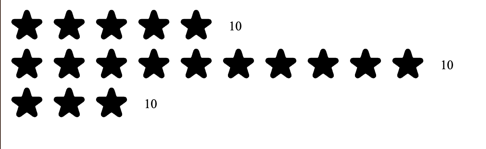

#### 11.2.3 Focus on Rating number displayed:
When user clicks on any of those stars, need to be display the current number in the paragraph element. So in case need to be rendered some in screen, using state is mandatory.
```tsx
/*  */
import { useState } from "react";                 // 👈🏽 ✅
import Star from "./Star";
const containerStyle = {....};
const starContainerStyle = {....};
const textStyle = {....};

const StarRating = ({ maxRating = 3 }) => {
  const [rating, setRating] = useState(0);
  return (
    <div style={containerStyle}>
      <div style={starContainerStyle}>
        {Array.from({ length: maxRating }, (_, i) => (
          <Star key={i} />
        ))}
      </div>
      <p style={textStyle}>{rating || ""}</p>     {/* 👈🏽 ✅ */}
    </div>
  );
};

export default StarRating;
```


#### 11.2.4 Adding the `onClick` event handler in `StarRating` as well as `Star` components:
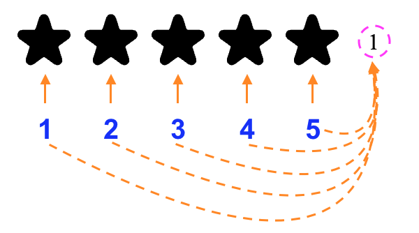

```jsx
/* src/StarRating.jsx */
import { useState } from "react";
import Star from "./Star";
const containerStyle = {....};
const starContainerStyle = {....};
const textStyle = {....};
const StarRating = ({ maxRating = 3 }) => {
  const [rating, setRating] = useState(1);                  // 👈🏽 ✅
  return (
    <div style={containerStyle}>
      <div style={starContainerStyle}>
        {Array.from({ length: maxRating }, (_, i) => (
          <Star key={i} onClick={() => setRating(i + 1)} /> {/* 👈🏽 ✅ */}
        ))}
      </div>
      <p style={textStyle}>{rating || ""}</p>
    </div>
  );
};
export default StarRating;
```

```tsx
/* src/Star.jsx */
const starStyle = {....};
const Star = ({ onClick }) => {                                 // 👈🏽 ✅
  return (
    <span role="button" style={starStyle} onClick={onClick}>    {/* 👈🏽 ✅ */}
      <svg xmlns="http://www.w3.org/2000/svg" viewBox="0 0 20 20" fill="#000" stroke="#000">
        <path d="M9.049 2.927c.3-.921 1.603-.921 1.902 0l1.07 3.292a1 1 0 00.95.69h3.462c.969 0 1.371 1.24.588 1.81l-2.8 2.034a1 1 0 00-.364 1.118l1.07 3.292c.3.921-.755 1.688-1.54 1.118l-2.8-2.034a1 1 0 00-1.175 0l-2.8 2.034c-.784.57-1.838-.197-1.539-1.118l1.07-3.292a1 1 0 00-.364-1.118L2.98 8.72c-.783-.57-.38-1.81.588-1.81h3.461a1 1 0 00.951-.69l1.07-3.292z" />
      </svg>
    </span>
  );
};
export default Star;
```

#### 11.2.5 Enhance this function due to confusing names:

```tsx
/* src/StarRating.jsx */
import { useState } from "react";
import Star from "./Star";
const containerStyle = {....};
const starContainerStyle = {....};
const textStyle = {....};
const StarRating = ({ maxRating = 3 }) => {
  const [rating, setRating] = useState(1);
  const handleRating = (rating) => {                            // 👈🏽 ✅
    setRating(rating);
  }
  return (
    <div style={containerStyle}>
      <div style={starContainerStyle}>
        {Array.from({ length: maxRating }, (_, i) => (
          <Star key={i} onRate={() => handleRating(i + 1)} />  {/* 👈🏽 ✅ */}
        ))}
      </div>
      <p style={textStyle}>{rating || ""}</p>
    </div>
  );
};
export default StarRating;
```

```tsx
/* src/Star.jsx */
const starStyle = {....};
const Star = ({ onRate }) => {                                // 👈🏽 ✅
  return (
    <span role="button" style={starStyle} onClick={onRate}>   {/* 👈🏽 ✅ */}
      <svg xmlns="http://www.w3.org/2000/svg" viewBox="0 0 20 20" fill="#000" stroke="#000">
        <path d="M9.049 2.927c.3-.921 1.603-.921 1.902 0l1.07 3.292a1 1 0 00.95.69h3.462c.969 0 1.371 1.24.588 1.81l-2.8 2.034a1 1 0 00-.364 1.118l1.07 3.292c.3.921-.755 1.688-1.54 1.118l-2.8-2.034a1 1 0 00-1.175 0l-2.8 2.034c-.784.57-1.838-.197-1.539-1.118l1.07-3.292a1 1 0 00-.364-1.118L2.98 8.72c-.783-.57-.38-1.81.588-1.81h3.461a1 1 0 00.951-.69l1.07-3.292z" />
      </svg>
    </span>
  );
};

export default Star;
```


#### 11.2.6 Handle the Full and Empty stars adding a `full` variable as prop:
```tsx
/* src/Star.jsx */
const starStyle = {....};
const Star = ({ onRate, full }) => {  // 👈🏽 ✅
  return (
    <span role="button" style={starStyle} onClick={onRate}>
      {full ? (  {/* 👈🏽 ✅ */}
        <svg xmlns="http://www.w3.org/2000/svg" viewBox="0 0 20 20" fill="#000" stroke="#000">
          <path d="M9.049 2.927c.3-.921 1.603-.921 1.902 0l1.07 3.292a1 1 0 00.95.69h3.462c.969 0 1.371 1.24.588 1.81l-2.8 2.034a1 1 0 00-.364 1.118l1.07 3.292c.3.921-.755 1.688-1.54 1.118l-2.8-2.034a1 1 0 00-1.175 0l-2.8 2.034c-.784.57-1.838-.197-1.539-1.118l1.07-3.292a1 1 0 00-.364-1.118L2.98 8.72c-.783-.57-.38-1.81.588-1.81h3.461a1 1 0 00.951-.69l1.07-3.292z" />
        </svg>
      ) : (  {/* 👈🏽 ✅ */}
        <svg xmlns="http://www.w3.org/2000/svg" fill="none" viewBox="0 0 24 24" stroke="#000">
          <path
            strokeLinecap="round"
            strokeLinejoin="round"
            strokeWidth="{2}"
            d="M11.049 2.927c.3-.921 1.603-.921 1.902 0l1.519 4.674a1 1 0 00.95.69h4.915c.969 0 1.371 1.24.588 1.81l-3.976 2.888a1 1 0 00-.363 1.118l1.518 4.674c.3.922-.755 1.688-1.538 1.118l-3.976-2.888a1 1 0 00-1.176 0l-3.976 2.888c-.783.57-1.838-.197-1.538-1.118l1.518-4.674a1 1 0 00-.363-1.118l-3.976-2.888c-.784-.57-.38-1.81.588-1.81h4.914a1 1 0 00.951-.69l1.519-4.674z"
          />
        </svg>
      )}
    </span>
  );
};
export default Star;
```

```tsx
/* src/StarRating.jsx */
import { useState } from "react";
import Star from "./Star";
const containerStyle = {....};
const starContainerStyle = {....};
const textStyle = {....};
const StarRating = ({ maxRating = 3 }) => {
  const [rating, setRating] = useState(1);
  const handleRating = (rating) => {
    setRating(rating);
  };
  return (
    <div style={containerStyle}>
      <div style={starContainerStyle}>
        {Array.from({ length: maxRating }, (_, i) => (
          <Star key={i} onRate={() => handleRating(i + 1)} full={rating >= i + 1} />  {/* 👈🏽 ✅ */}
        ))}
      </div>
      <p style={textStyle}>{rating || ""}</p>
    </div>
  );
};
export default StarRating;
```

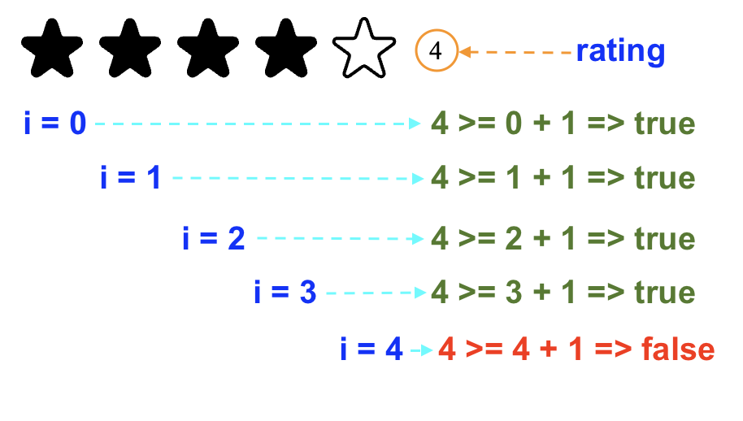

### 🐞 11.3 Issues:

| Issue | Status | Log/Error |
|---|---|---|
| **Incorrect strokeWidth syntax** | ⚠️ Identified | In `src/Star.jsx` line 20, `strokeWidth="{2}"` uses curly braces inside quotes, which renders as the literal string `"{2}"` instead of the number `2`. Should be `strokeWidth={2}` or `strokeWidth="2"`. This causes the empty star to render incorrectly with an invalid stroke width. |
| **Missing accessibility attributes** | ⚠️ Identified | The `Star` component in `src/Star.jsx` lacks essential accessibility features: no `aria-label` to describe the star's purpose, no `tabIndex` for keyboard navigation, and no `onKeyDown` handler for keyboard interaction. Users relying on screen readers or keyboard navigation cannot properly interact with the component. |
| **No prop validation** | ⚠️ Identified | The `Star` component doesn't validate its props (`onRate`, `full`). Missing `onRate` could cause runtime errors, and `full` could be undefined/null leading to unexpected rendering. No PropTypes or TypeScript types are defined to catch these issues during development. |
| **Missing error handling for onRate** | ⚠️ Identified | In `src/Star.jsx` line 10, `onClick={onRate}` will throw an error if `onRate` is undefined or null. The component should handle cases where the callback is not provided, either by providing a default no-op function or by conditionally rendering the click handler. |
| **Hardcoded SVG colors** | ℹ️ Low Priority | Both star SVGs use hardcoded `fill="#000"` and `stroke="#000"` (black), making them difficult to theme or customize. Colors should be configurable via props or CSS variables for better flexibility. |
| **Large SVG code blocks** | ℹ️ Low Priority | The inline SVG code in `src/Star.jsx` (lines 12-14 and 16-23) makes the component harder to read and maintain. Consider extracting SVGs to separate components or using an icon library for better code organization. |
| **Commented SVG examples** | ℹ️ Low Priority | Lines 31-62 in `src/Star.jsx` contain commented-out SVG examples that add noise to the codebase. These should be moved to documentation or removed if no longer needed. |
| **No hover state handling** | ℹ️ Low Priority | The component doesn't provide visual feedback on hover, which could improve user experience. Adding hover states would make the interactive nature of the stars more apparent to users. |
| **Inconsistent viewBox values** | ℹ️ Low Priority | The full star uses `viewBox="0 0 20 20"` while the empty star uses `viewBox="0 0 24 24"`. This inconsistency might cause slight visual misalignment or scaling differences between the two states. |

### 🧱 11.4 Pending Fixes (TODO)

```md
- [ ] Fix strokeWidth syntax in Star component: Change `strokeWidth="{2}"` to `strokeWidth={2}` in `src/Star.jsx` line 20 to properly set the stroke width for the empty star SVG
- [ ] Add accessibility attributes to Star component: Add `aria-label`, `tabIndex="0"`, and `onKeyDown` handler in `src/Star.jsx` to support keyboard navigation and screen readers
- [ ] Add prop validation: Implement PropTypes for `Star` component to validate `onRate` (function, required) and `full` (boolean, optional) props, or convert to TypeScript with proper type definitions
- [ ] Add default handler for onRate: Provide a default no-op function or conditional rendering in `src/Star.jsx` to prevent errors when `onRate` prop is not provided
- [ ] Make SVG colors configurable: Add `color` prop to `Star` component or use CSS variables to allow customization of star colors instead of hardcoded `#000`
- [ ] Extract SVG code to separate components: Create `FullStarIcon` and `EmptyStarIcon` components to improve code readability and maintainability in `src/Star.jsx`
- [ ] Remove or document commented SVG examples: Clean up commented code (lines 31-62) in `src/Star.jsx` by either removing it or moving to proper documentation
- [ ] Add hover state styling: Implement hover effects (e.g., scale transform or color change) to provide visual feedback when users hover over stars
- [ ] Standardize viewBox values: Use consistent `viewBox` dimensions for both full and empty star SVGs to ensure visual consistency
- [ ] Add keyboard event handler: Implement `handleKeyDown` function in `Star` component to allow rating selection using Enter or Space keys for better accessibility
```


## 🔧 12. Lesson 117 — *Handling Hover Events*

### 🧠 12.1 Context:

Hover events in React provide a way to detect when a user's mouse pointer enters or leaves an element, enabling interactive UI feedback and preview functionality. This lesson focuses on implementing hover interactions in the `StarRating` component to provide visual feedback before a user commits to a rating selection.

**What are hover events?**

Hover events in React are handled through two primary event handlers:
- `onMouseEnter`: Fires when the mouse pointer enters the element's boundaries
- `onMouseLeave`: Fires when the mouse pointer leaves the element's boundaries

These events are part of React's SyntheticEvent system, which wraps native browser events to provide a consistent API across different browsers.

**When and why they're used:**

Hover events are commonly used for:
- **Preview functionality**: Showing what would happen if the user interacts with an element (e.g., previewing a rating before clicking)
- **Visual feedback**: Highlighting interactive elements to indicate they're clickable
- **Tooltips and hints**: Displaying additional information when hovering over elements
- **Progressive disclosure**: Revealing hidden content or options on hover

In this project, hover events enable a "preview" mode where users can see how many stars would be filled before actually clicking to set a rating. This improves the user experience by providing immediate visual feedback.

**Examples from the project:**

In `src/StarRating.jsx`, hover events are used to manage a temporary rating state:
- `tempRating` state stores the preview rating while hovering
- `onHoverIn` callback sets the temporary rating when entering a star
- `onHoverOut` callback resets the temporary rating when leaving

The component uses conditional logic to display either the temporary rating (while hovering) or the actual rating (when not hovering):
```27:27:src/StarRating.jsx
  const displayedRating = tempRating || rating || "";
```

In `src/Star.jsx`, the hover handlers are connected to React's mouse events:
```15:17:src/Star.jsx
      onMouseEnter={onHoverIn}
      // onMouseLeave={() => console.log("Leave")}
      onMouseLeave={onHoverOut}
```

**Advantages:**
- **Improved UX**: Provides immediate visual feedback without requiring a click
- **Reduced errors**: Users can preview their selection before committing
- **Better discoverability**: Makes interactive elements more obvious
- **Native browser support**: Works across all modern browsers without additional libraries
- **Simple implementation**: Easy to add with minimal code changes

**Disadvantages:**
- **Not accessible on touch devices**: Hover events don't work on mobile/touch devices, requiring alternative interaction patterns
- **Accessibility concerns**: Keyboard-only users cannot trigger hover states, potentially missing important information
- **Potential performance issues**: Rapid mouse movements can trigger many events, though React's event delegation helps mitigate this
- **State management complexity**: Requires managing temporary state that may not match the actual state

**When to consider alternatives:**

- **Touch devices**: Use `onTouchStart` or `onTouchEnd` for mobile interactions, or rely on click/tap events
- **Keyboard accessibility**: Provide keyboard equivalents (e.g., `onFocus`/`onBlur`) for keyboard users
- **Complex interactions**: For more sophisticated hover behaviors, consider libraries like Framer Motion or CSS `:hover` pseudo-classes
- **Performance-critical scenarios**: If hover events cause performance issues, consider debouncing or throttling the handlers
- **Accessibility-first applications**: Prioritize keyboard and screen reader support, using hover as an enhancement rather than a requirement

**Connection to the lesson's practical implementation:**

This lesson demonstrates how hover events can enhance a rating component by allowing users to preview their selection. The implementation shows the pattern of using temporary state (`tempRating`) that doesn't persist until the user clicks, creating a smooth, intuitive interaction pattern that's common in modern web applications.


### ⚙️ 12.2 Updating code according the context:

#### 12.2.1 Handle the event hovering the stars:
```tsx
/* src/StarRating.jsx */
import { useState } from "react";
import Star from "./Star";
const containerStyle = {....};
const starContainerStyle = {....};
const textStyle = {....};
const StarRating = ({ maxRating = 3 }) => {
  const [rating, setRating] = useState(0);
  const [tempRating, setTempRating] = useState(0);  // 👈🏽 ✅
  const handleRating = (rating) => {
    setRating(rating);
  };
  return (
    <div style={containerStyle}>
      <div style={starContainerStyle}>
        {Array.from({ length: maxRating }, (_, i) => (
          <Star key={i} onRate={() => handleRating(i + 1)} full={rating >= i + 1} />
        ))}
      </div>
      <p style={textStyle}>{rating || ""}</p>
    </div>
  );
};
export default StarRating;
```

```tsx
/* src/Star.jsx */
const starStyle = {
  width: "48px",
  height: "48px",
  display: "block",
  cursor: "pointer",
};
const Star = ({ onRate, full }) => {
  return (
    <span
      role="button"
      style={starStyle}
      onClick={onRate}
      onMouseEnter={() => console.log("Enter")} {/* 👈🏽 ✅ */}
      onMouseLeave={() => console.log("Leave")} {/* 👈🏽 ✅ */}
    >
      {full ? (
        <svg xmlns="http://www.w3.org/2000/svg" viewBox="0 0 20 20" fill="#000" stroke="#000">
          <path d="M9.049 2.927c.3-.921 1.603-.921 1.902 0l1.07 3.292a1 1 0 00.95.69h3.462c.969 0 1.371 1.24.588 1.81l-2.8 2.034a1 1 0 00-.364 1.118l1.07 3.292c.3.921-.755 1.688-1.54 1.118l-2.8-2.034a1 1 0 00-1.175 0l-2.8 2.034c-.784.57-1.838-.197-1.539-1.118l1.07-3.292a1 1 0 00-.364-1.118L2.98 8.72c-.783-.57-.38-1.81.588-1.81h3.461a1 1 0 00.951-.69l1.07-3.292z" />
        </svg>
      ) : (
        <svg xmlns="http://www.w3.org/2000/svg" fill="none" viewBox="0 0 24 24" stroke="#000">
          <path
            strokeLinecap="round"
            strokeLinejoin="round"
            strokeWidth="{2}"
            d="M11.049 2.927c.3-.921 1.603-.921 1.902 0l1.519 4.674a1 1 0 00.95.69h4.915c.969 0 1.371 1.24.588 1.81l-3.976 2.888a1 1 0 00-.363 1.118l1.518 4.674c.3.922-.755 1.688-1.538 1.118l-3.976-2.888a1 1 0 00-1.176 0l-3.976 2.888c-.783.57-1.838-.197-1.538-1.118l1.518-4.674a1 1 0 00-.363-1.118l-3.976-2.888c-.784-.57-.38-1.81.588-1.81h4.914a1 1 0 00.951-.69l1.519-4.674z"
          />
        </svg>
      )}
    </span>
  );
};

export default Star;
```

Testing hover in and out into any star:
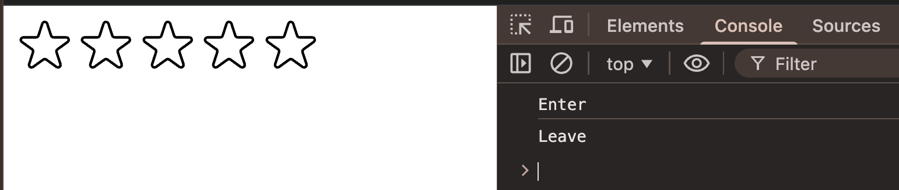

#### 12.2.2 APply the `onHoverIn` and `onHoverOut`:
```tsx
/* src/StarRating.jsx */
import { useState } from "react";
import Star from "./Star";
const containerStyle = {....};
const starContainerStyle = {....};
const textStyle = {....};
const StarRating = ({ maxRating = 3 }) => {
  const [rating, setRating] = useState(0);
  const [tempRating, setTempRating] = useState(0);
  const handleRating = (rating) => {
    setRating(rating);
  };
  return (
    <div style={containerStyle}>
      <div style={starContainerStyle}>
        {Array.from({ length: maxRating }, (_, i) => (
          <Star
            key={i}
            onRate={() => handleRating(i + 1)}
            full={rating >= i + 1}
            onHoverIn={() => setTempRating(i + 1)}    {/* 👈🏽 ✅ */}
            onHoverOut={() => setTempRating(0)}       {/* 👈🏽 ✅ */}
          />
        ))}
      </div>
      <p style={textStyle}>{rating || ""}</p>
    </div>
  );
};
export default StarRating;
```

In `Star.jsx` component:
```jsx
/* src/Star.jsx */
const starStyle = {
  width: "48px",
  height: "48px",
  display: "block",
  cursor: "pointer",
};
const Star = ({ onRate, full, onHoverIn, onHoverOut }) => {
  return (
    <span
      role="button"
      style={starStyle}
      onClick={onRate}
      // onMouseEnter={() => console.log("Enter")}
      onMouseEnter={onHoverIn}
      // onMouseLeave={() => console.log("Leave")}
      onMouseLeave={onHoverOut}
    >
      {full ? (
        <svg xmlns="http://www.w3.org/2000/svg" viewBox="0 0 20 20" fill="#000" stroke="#000">
          <path d="M9.049 2.927c.3-.921 1.603-.921 1.902 0l1.07 3.292a1 1 0 00.95.69h3.462c.969 0 1.371 1.24.588 1.81l-2.8 2.034a1 1 0 00-.364 1.118l1.07 3.292c.3.921-.755 1.688-1.54 1.118l-2.8-2.034a1 1 0 00-1.175 0l-2.8 2.034c-.784.57-1.838-.197-1.539-1.118l1.07-3.292a1 1 0 00-.364-1.118L2.98 8.72c-.783-.57-.38-1.81.588-1.81h3.461a1 1 0 00.951-.69l1.07-3.292z" />
        </svg>
      ) : (
        <svg xmlns="http://www.w3.org/2000/svg" fill="none" viewBox="0 0 24 24" stroke="#000">
          <path
            strokeLinecap="round"
            strokeLinejoin="round"
            strokeWidth="{2}"
            d="M11.049 2.927c.3-.921 1.603-.921 1.902 0l1.519 4.674a1 1 0 00.95.69h4.915c.969 0 1.371 1.24.588 1.81l-3.976 2.888a1 1 0 00-.363 1.118l1.518 4.674c.3.922-.755 1.688-1.538 1.118l-3.976-2.888a1 1 0 00-1.176 0l-3.976 2.888c-.783.57-1.838-.197-1.538-1.118l1.518-4.674a1 1 0 00-.363-1.118l-3.976-2.888c-.784-.57-.38-1.81.588-1.81h4.914a1 1 0 00.951-.69l1.519-4.674z"
          />
        </svg>
      )}
    </span>
  );
};

export default Star;
```

#### 12.2.3 Working out with `tempRating` and the `fullStar`:
```tsx
/* src/StarRating.jsx */
import { useState } from "react";
import Star from "./Star";
const containerStyle = {....};
const starContainerStyle = {....};
const textStyle = {....};
const StarRating = ({ maxRating = 3 }) => {
  const [rating, setRating] = useState(0);
  const [tempRating, setTempRating] = useState(0);
  const handleRating = (rating) => {
    setRating(rating);
  };
  return (
    <div style={containerStyle}>
      <div style={starContainerStyle}>
        {Array.from({ length: maxRating }, (_, i) => (
          <Star
            key={i}
            onRate={() => handleRating(i + 1)}
            full={tempRating ? tempRating >= i + 1 : rating >= i + 1} {/* 👈🏽 ✅ */}
            onHoverIn={() => setTempRating(i + 1)}
            onHoverOut={() => setTempRating(0)}   
          />
        ))}
      </div>
      <p style={textStyle}>{tempRating || rating || ""}</p>       {/* 👈🏽 ✅ */}
    </div>
  );
};
export default StarRating;
```

- Determines whether the `star` is filled or full.
- While hovering, the temporary rating (`tempRating`) is used to _**preview**_ the selection.
- When not hovering, the _**saved rating**_ (`rating`) is used instead.

### 🐞 12.3 Issues:

| Issue | Status | Log/Error |
|---|---|---|
| **Commented debug code in production** | ⚠️ Identified | In `src/Star.jsx` lines 14 and 16, there are commented-out `console.log` statements (`// onMouseEnter={() => console.log("Enter")}` and `// onMouseLeave={() => console.log("Leave")}`). These should be removed to keep the codebase clean and avoid confusion. Debug code should not remain in production code, even if commented. |
| **Inconsistent use of displayedRating variable** | ⚠️ Identified | In `src/StarRating.jsx` line 27, `displayedRating` is calculated but not used consistently. The `full` prop uses `displayedRating >= i + 1` (line 36), but the text display uses `tempRating || rating || ""` directly (line 42). This inconsistency could lead to bugs if the logic changes. Should use `displayedRating` consistently throughout or remove the variable if not needed. |
| **Missing default handlers for optional hover props** | ⚠️ Identified | The `Star` component in `src/Star.jsx` accepts `onHoverIn` and `onHoverOut` as props but doesn't provide default handlers. If these props are undefined, the component will pass `undefined` to `onMouseEnter` and `onMouseLeave`, which could cause runtime errors or unexpected behavior. Should provide default no-op functions: `onHoverIn = () => {}` and `onHoverOut = () => {}`. |
| **No prop validation for hover handlers** | ⚠️ Identified | The `Star` component doesn't validate that `onHoverIn` and `onHoverOut` are functions. If incorrect prop types are passed (e.g., strings or numbers), the component will fail at runtime. Should implement PropTypes or TypeScript to catch these issues during development. |
| **Hover state not accessible via keyboard** | ⚠️ Identified | The hover functionality only works with mouse interactions. Keyboard users cannot preview ratings using `onFocus`/`onBlur` events, creating an accessibility barrier. The component should provide equivalent functionality for keyboard navigation to ensure all users have the same experience. |
| **Potential memory leak with inline arrow functions** | ℹ️ Low Priority | In `src/StarRating.jsx` lines 37-38, inline arrow functions are created on every render (`onHoverIn={() => setTempRating(i + 1)}`). While React's reconciliation handles this efficiently, it could be optimized using `useCallback` for better performance, especially if the component re-renders frequently. |
| **No visual feedback for hover state** | ℹ️ Low Priority | While the hover events change the star fill state, there's no additional visual feedback (e.g., scale transform, color change, or shadow) to indicate the hover interaction. Adding CSS transitions or transform effects would enhance the user experience and make the hover state more obvious. |
| **tempRating state persists after mouse leave** | ℹ️ Low Priority | The `tempRating` state is reset to 0 on `onMouseLeave`, but if the user moves the mouse quickly or the event doesn't fire properly, the temporary rating might persist. Consider adding a cleanup effect or ensuring the state resets reliably. |

### 🧱 12.4 Pending Fixes (TODO)

```md
- [ ] Remove commented debug code: Delete commented `console.log` statements in `src/Star.jsx` lines 14 and 16 to clean up the codebase
- [ ] Standardize displayedRating usage: Use `displayedRating` consistently in both the `full` prop logic and text display in `src/StarRating.jsx`, or remove the variable if direct `tempRating || rating || ""` is preferred
- [ ] Add default handlers for hover props: Provide default no-op functions for `onHoverIn` and `onHoverOut` props in `src/Star.jsx` to prevent errors when props are undefined: `const Star = ({ onRate, full, onHoverIn = () => {}, onHoverOut = () => {} }) => { ... }`
- [ ] Add prop validation for hover handlers: Implement PropTypes or TypeScript types in `src/Star.jsx` to validate that `onHoverIn` and `onHoverOut` are functions, ensuring type safety and catching errors early
- [ ] Implement keyboard accessibility for hover: Add `onFocus` and `onBlur` event handlers in `src/Star.jsx` that mirror the hover functionality, allowing keyboard users to preview ratings by focusing on stars with Tab key
- [ ] Optimize inline arrow functions: Wrap hover handlers in `useCallback` in `src/StarRating.jsx` to prevent unnecessary function recreation on each render, improving performance: `const handleHoverIn = useCallback((rating) => setTempRating(rating), [])`
- [ ] Add visual hover feedback: Implement CSS transitions or transform effects (e.g., `transform: scale(1.1)` or color change) in `src/Star.jsx` to provide additional visual feedback when hovering over stars
- [ ] Add cleanup for tempRating state: Ensure `tempRating` resets reliably by adding a `useEffect` cleanup or handling edge cases where `onMouseLeave` might not fire properly in `src/StarRating.jsx`
```

## 🔧 13. Lesson 118 — *Props as a Component API*

### 🧠 13.1 Context:

**What is Props as a Component API?**

Props as a Component API is a fundamental concept in React that treats component props as the public interface or "API" of a component. Just like a REST API defines how external systems interact with a service, component props define how parent components interact with and configure child components. The props you define determine what data a component accepts, what callbacks it can trigger, and how it can be customized.

**When does this concept occur?**

- When designing reusable components that need to be configurable from the outside
- When creating component libraries or design systems
- When establishing clear contracts between parent and child components
- When deciding what should be configurable vs. hardcoded in a component
- When documenting component usage and requirements

**Examples from this project:**

1. **StarRating Component** (`StarRating.jsx`): Demonstrates a well-designed component API with:
   - **Configurable prop**: `maxRating` with a default value of 3, allowing customization
   - **Clear interface**: The component accepts one prop that controls its behavior
   ```19:19:src/StarRating.jsx
   const StarRating = ({ maxRating = 3 }) => {
   ```

2. **Box Component** (`Box.jsx`): Shows a simple API that accepts content:
   - **Single prop interface**: `element` prop defines what content to display
   - **Stateful wrapper**: Manages its own `isOpen` state while accepting external content
   ```3:3:src/components/Box.jsx
   const Box = ({ element }) => {
   ```

3. **Movie Component** (`Movie.jsx`): Demonstrates a pure presentational component API:
   - **Data prop**: Accepts `movie` object containing all necessary data
   - **No configuration needed**: Simple, focused API for displaying movie information
   ```1:1:src/components/Movie.jsx
   const Movie = ({ movie }) => {
   ```

4. **Star Component** (`Star.jsx`): Shows callback-based API:
   - **Multiple callback props**: `onRate`, `onHoverIn`, `onHoverOut` for user interactions
   - **State prop**: `full` boolean to control visual state
   - **Event-driven design**: Communicates user actions upward through callbacks
   ```8:8:src/Star.jsx
   const Star = ({ onRate, full, onHoverIn, onHoverOut }) => {
   ```

**Advantages of treating Props as a Component API:**

- ✅ **Clear contracts**: Developers know exactly what props a component expects
- ✅ **Reusability**: Well-designed prop APIs make components reusable across different contexts
- ✅ **Maintainability**: Changes to component internals don't affect the public API
- ✅ **Testability**: Components can be tested in isolation by passing mock props
- ✅ **Documentation**: Props serve as self-documenting code when properly named
- ✅ **Type safety**: With TypeScript or PropTypes, props can be validated at development time
- ✅ **Flexibility**: Default values allow components to work with minimal configuration
- ✅ **Separation of concerns**: Components focus on rendering, while props handle configuration

**Disadvantages of treating Props as a Component API:**

- ⚠️ **Prop drilling**: Can lead to passing props through many levels (though composition helps)
- ⚠️ **API design complexity**: Poorly designed prop APIs can make components hard to use
- ⚠️ **Over-engineering risk**: Simple components might not need extensive prop APIs
- ⚠️ **Maintenance burden**: Changing prop APIs can break existing usage
- ⚠️ **Lack of validation**: Without PropTypes or TypeScript, incorrect props can cause runtime errors
- ⚠️ **Documentation overhead**: Complex APIs require more documentation

**When to consider alternatives:**

- **Use Context API when**: Multiple deeply nested components need the same data (avoiding prop drilling)
- **Use composition when**: Structural components don't need to know about specific data
- **Use state management libraries when**: Props need to be shared across distant components
- **Use render props or hooks when**: Component logic needs to be shared but rendering varies
- **Keep props simple when**: Component has a single, clear purpose that doesn't need extensive configuration

**Best practices for Props as Component API:**

1. **Use descriptive prop names**: `onRate` is clearer than `onClick` for a star rating
2. **Provide default values**: Make optional props work without explicit values (`maxRating = 3`)
3. **Keep APIs focused**: Each component should have a single responsibility
4. **Use consistent naming**: Follow React conventions (`on*` for callbacks, `is*`/`has*` for booleans)
5. **Document prop types**: Use PropTypes or TypeScript to validate and document expected props
6. **Handle edge cases**: Consider what happens when props are `undefined`, `null`, or empty arrays

**Connection to this lesson's practical implementation:**

In this lesson, we learn that props are not just a way to pass data—they are the public interface of our components. A well-designed component API through props makes components predictable, reusable, and maintainable. The lesson emphasizes thinking about components as APIs: what inputs do they accept? What outputs do they produce? How can they be configured? This mindset helps create better component designs that are easier to use, test, and maintain.


### ⚙️ 13.2 Updating code according the context:

#### 13.2.1 Props as an API
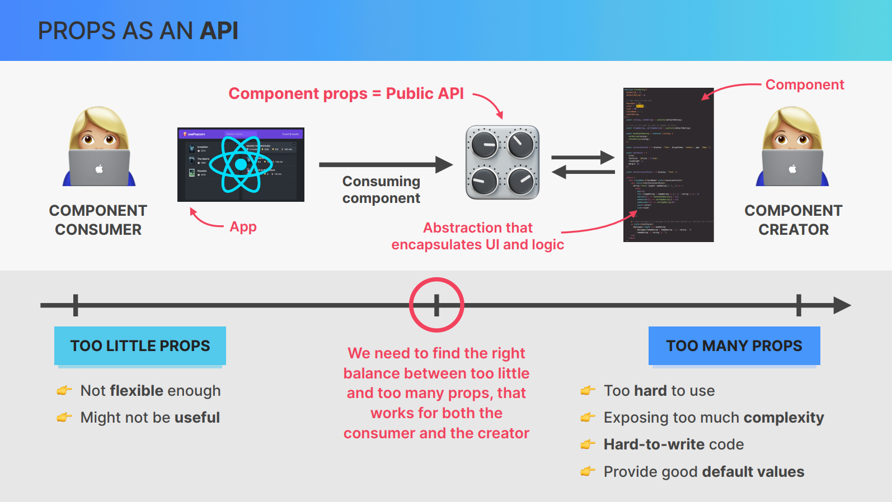

### 🐞 13.3 Issues:

| Issue | Status | Log/Error |
|---|---|---|
| **Missing PropTypes validation** | ⚠️ Identified | No PropTypes or TypeScript validation for component props. Components like `Movie`, `MovieList`, `WatchedSummary`, `WatchedMovieList`, `NumResult`, and `Box` don't validate prop types, which can lead to runtime errors if incorrect props are passed. Example: `Movie` expects `movie` prop but no validation ensures it's an object with required properties. |
| **Inconsistent default prop values** | ⚠️ Identified | Only `StarRating` component uses default prop values (`maxRating = 3`). Other components like `Box`, `MovieList`, `WatchedSummary` don't handle undefined props gracefully. If `movies` is undefined in `MovieList`, the optional chaining (`movies?.map`) prevents errors but the component renders nothing without clear feedback. |
| **Missing error handling for edge cases** | ⚠️ Identified | `WatchedSummary` component doesn't handle empty arrays or undefined `watched` prop. If `watched` is empty, it will calculate averages incorrectly (dividing by 0). The component should validate that `watched` exists and has items before performing calculations. Location: `src/components/WatchedSummary.jsx:4-6` |
| **No prop documentation** | ℹ️ Low Priority | Components lack JSDoc comments or prop documentation explaining what each prop does, its expected type, and whether it's required or optional. This makes it harder for developers to understand component APIs without reading the implementation. |
| **Inconsistent prop naming** | ℹ️ Low Priority | Some components use singular prop names (`movie` in `Movie`, `WatchedMovie`) while others use plural (`movies` in `MovieList`, `watched` in `WatchedSummary`). While not an error, consistent naming conventions would improve API clarity. |
| **Missing required prop validation** | ⚠️ Identified | Components don't validate that required props are provided. For example, `Movie` component requires `movie` prop but will crash if it's undefined when accessing `movie.Poster`, `movie.Title`, etc. Should use PropTypes or default to empty object/early return. |

### 🧱 13.4 Pending Fixes (TODO)

```md
- [ ] Add PropTypes validation to all components (`Movie`, `MovieList`, `WatchedSummary`, `WatchedMovieList`, `NumResult`, `Box`, `Star`, `StarRating`) to validate prop types and provide better error messages during development
- [ ] Add default prop values where appropriate (e.g., `Box` component should handle `element` being undefined, `MovieList` should default `movies` to empty array)
- [ ] Implement error handling in `WatchedSummary` component to handle empty `watched` array and prevent division by zero errors. Add early return or default values when `watched` is empty or undefined
- [ ] Add JSDoc comments to all components documenting prop types, descriptions, and whether they're required or optional (e.g., `@param {Object} movie - Movie object with Poster, Title, Year properties`)
- [ ] Add defensive checks in `Movie` and `WatchedMovie` components to handle undefined or null `movie` prop gracefully (early return or default empty object)
- [ ] Consider adding PropTypes package to `package.json` if not already present, or migrate to TypeScript for better type safety
- [ ] Add prop validation for `Star` component callbacks (`onRate`, `onHoverIn`, `onHoverOut`) to ensure they're functions before calling them
- [ ] Review and standardize prop naming conventions across all components (singular vs plural) for consistency
```


## 🔧 14. Lesson 119 — *Improving Reusability with Props*

### 🧠 14.1 Context:

**Props (Properties)** are a fundamental mechanism in React for passing data from parent components to child components. They enable component reusability by allowing components to be configured differently based on the data they receive, rather than having hardcoded values.

**When and Why Props are Used:**
- **Component Configuration**: Props allow components to be configured with different values (colors, sizes, behaviors) without modifying the component's internal code
- **Data Flow**: Props enable unidirectional data flow from parent to child, making the application's data flow predictable and easier to debug
- **Reusability**: By accepting props, a single component can be used in multiple contexts with different configurations
- **Separation of Concerns**: Props help separate component logic from component configuration, making components more maintainable

**Examples from the Project:**

In this lesson, the `StarRating` component was enhanced with multiple props to improve its reusability:

```14:14:src/StarRating.jsx
const StarRating = ({ maxRating = 3, color = "#fcc419", size = 48, className = "", messages = [], onSetRating }) => {
```

- **`maxRating`**: Controls how many stars are displayed (default: 3)
- **`color`**: Customizes the star color (default: "#fcc419")
- **`size`**: Controls the size of stars in pixels (default: 48)
- **`className`**: Allows external CSS styling
- **`messages`**: Array of custom messages to display instead of numeric rating
- **`onSetRating`**: Callback function to handle rating changes externally

The component is then reused with different configurations:

```11:12:src/main.jsx
    <StarRating maxRating={5} messages={["Terrible", "Bad", "Okay", "Good", "Excellent"]} />
    <StarRating maxRating={5} size={24} color="red" className="test" />
```

**Advantages:**
- ✅ **Reusability**: One component can serve multiple use cases
- ✅ **Flexibility**: Components can be customized without code duplication
- ✅ **Maintainability**: Changes to component logic only need to be made in one place
- ✅ **Testability**: Components can be easily tested with different prop combinations
- ✅ **Composition**: Components can be composed together to build complex UIs

**Disadvantages:**
- ❌ **Prop Drilling**: When props need to be passed through multiple component layers
- ❌ **Complexity**: Too many props can make components harder to understand and use
- ❌ **Type Safety**: Without TypeScript or PropTypes, prop types aren't enforced at runtime
- ❌ **Default Values**: Need to carefully consider default values to avoid unexpected behavior

**When to Consider Alternatives:**
- **Context API**: When props need to be passed through many component layers (prop drilling)
- **State Management Libraries**: For complex global state that many components need access to
- **Composition Patterns**: When component behavior varies significantly, consider composition over many conditional props
- **Render Props / Children**: When you need to pass rendering logic rather than just data

**Connection to Practical Implementation:**

The lesson demonstrates how adding props (`color`, `size`, `className`, `messages`, `onSetRating`) transforms `StarRating` from a hardcoded component into a flexible, reusable component that can be configured for different use cases throughout the application. The optional `onSetRating` prop also shows how to make components work both as controlled and uncontrolled components, further increasing flexibility.


### ⚙️ 14.2 Updating code according the context:

#### 14.2.1 Add `color` and `size` as props in `StarRating` and pass those props to `Star` component:
```tsx
/* src/StarRating.jsx */
import { useState } from "react";
import Star from "./Star";
const containerStyle = {
  display: "flex",
  alignItems: "center",
  gap: "16px",
};
const starContainerStyle = {
  display: "flex",
};
const StarRating = ({ maxRating = 3, color = "#fcc419", size = 48 }) => {  // 👈🏽 ✅
  const [rating, setRating] = useState(0);
  const [tempRating, setTempRating] = useState(0);
  const handleRating = (rating) => {
    setRating(rating);
  };
  const textStyle = {  // 👈🏽 ✅
    lineHeight: "1",
    gap: "0",
    color,  // 👈🏽 ✅
    fontSize: `${size / 1.5}px`,  // 👈🏽 ✅
  };
  const displayedRating = tempRating || rating || "";
  return (
    <div style={containerStyle}>
      <div style={starContainerStyle}>
        {Array.from({ length: maxRating }, (_, i) => (
          <Star
            key={i}
            onRate={() => handleRating(i + 1)}
            full={displayedRating >= i + 1}
            onHoverIn={() => setTempRating(i + 1)}
            onHoverOut={() => setTempRating(0)}
            color={color}   {/* 👈🏽 ✅ */}
            size={size}     {/* 👈🏽 ✅ */}
          />
        ))}
      </div>
      <p style={textStyle}>{tempRating || rating || ""}</p>
    </div>
  );
};
export default StarRating;
```

#### 14.2.2 Working with `color` and `size` as props in `Star` component:
```tsx
/* src/Star.jsx */
const Star = ({ onRate, full, onHoverIn, onHoverOut, color, size }) => {
  const starStyle = {  // 👈🏽 ✅
    width: `${size}px`,  // 👈🏽 ✅
    height: `${size}px`,  // 👈🏽 ✅
    display: "block",
    cursor: "pointer",
  };
  return (
    <span role="button" style={starStyle} onClick={onRate} onMouseEnter={onHoverIn} onMouseLeave={onHoverOut}>
      {full ? (
        <svg 
          xmlns="http://www.w3.org/2000/svg" 
          viewBox="0 0 20 20" 
          fill={color}    {/* 👈🏽 ✅ */}
          stroke={color}  {/* 👈🏽 ✅ */}
        >
          <path d="M9.049 2.927c.3-.921 1.603-.921 1.902 0l1.07 3.292a1 1 0 00.95.69h3.462c.969 0 1.371 1.24.588 1.81l-2.8 2.034a1 1 0 00-.364 1.118l1.07 3.292c.3.921-.755 1.688-1.54 1.118l-2.8-2.034a1 1 0 00-1.175 0l-2.8 2.034c-.784.57-1.838-.197-1.539-1.118l1.07-3.292a1 1 0 00-.364-1.118L2.98 8.72c-.783-.57-.38-1.81.588-1.81h3.461a1 1 0 00.951-.69l1.07-3.292z" />
        </svg>
      ) : (
        <svg 
          xmlns="http://www.w3.org/2000/svg" 
          fill="none" 
          viewBox="0 0 24 24" 
          stroke={color}  {/* 👈🏽 ✅ */}
        >
          <path
            strokeLinecap="round"
            strokeLinejoin="round"
            strokeWidth="{2}"
            d="M11.049 2.927c.3-.921 1.603-.921 1.902 0l1.519 4.674a1 1 0 00.95.69h4.915c.969 0 1.371 1.24.588 1.81l-3.976 2.888a1 1 0 00-.363 1.118l1.518 4.674c.3.922-.755 1.688-1.538 1.118l-3.976-2.888a1 1 0 00-1.176 0l-3.976 2.888c-.783.57-1.838-.197-1.538-1.118l1.518-4.674a1 1 0 00-.363-1.118l-3.976-2.888c-.784-.57-.38-1.81.588-1.81h4.914a1 1 0 00.951-.69l1.519-4.674z"
          />
        </svg>
      )}
    </span>
  );
};
export default Star;
```

Meanwhile in `main.jsx` reuses the `StarRating` component:
```jsx
/* src/main.jsx */
import { StrictMode } from "react";
import { createRoot } from "react-dom/client";
// import './index.css'
// import App from './App.jsx'
import StarRating from "./StarRating.jsx";

createRoot(document.getElementById("root")).render(
  <StrictMode>
    {/* <App /> */}
    <StarRating maxRating={5} />
    <StarRating maxRating={5} size={24} color="red" />  {/* 👈🏽 ✅ */}
  </StrictMode>
);
```


#### 14.2.3 Sending other props as `className` or `messages`:
```tsx
/* src/main.jsx */
import { StrictMode } from "react";
import { createRoot } from "react-dom/client";
// import './index.css'
// import App from './App.jsx'
import StarRating from "./StarRating.jsx";

createRoot(document.getElementById("root")).render(
  <StrictMode>
    {/* <App /> */}
    <StarRating maxRating={5} messages={["Terrible", "Bad", "Okay", "Good", "Excellent"]} />  {/* 👈🏽 ✅ */}
    <StarRating maxRating={5} size={24} color="red" className="test" />  {/* 👈🏽 ✅ */}
  </StrictMode>
);
```


In `StarRating`:
```jsx
/* src/StarRating.jsx */
import { useState } from "react";
import Star from "./Star";
const containerStyle = {
  display: "flex",
  alignItems: "center",
  gap: "16px",
};
const starContainerStyle = {
  display: "flex",
};
const StarRating = ({ 
  maxRating = 3, 
  color = "#fcc419", 
  size = 48, 
  className = "",     // 👈🏽 ✅
  messages = []       // 👈🏽 ✅
}) => {
  const [rating, setRating] = useState(0);
  const [tempRating, setTempRating] = useState(0);
  const handleRating = (rating) => {
    setRating(rating);
  };
  const textStyle = {
    lineHeight: "1",
    gap: "0",
    color,
    fontSize: `${size / 1.5}px`,
  };
  const displayedRating = tempRating || rating || "";
  return (
    <div style={containerStyle} className={className}>
      <div style={starContainerStyle}>
        {Array.from({ length: maxRating }, (_, i) => (
          <Star
            key={i}
            onRate={() => handleRating(i + 1)}
            full={displayedRating >= i + 1}
            onHoverIn={() => setTempRating(i + 1)}
            onHoverOut={() => setTempRating(0)}
            color={color}
            size={size}
          />
        ))}
      </div>
      <p style={textStyle}>
        {messages.length === maxRating                              {/* 👈🏽 ✅ */}
          ? messages[tempRating ? tempRating - 1 : rating - 1]      {/* 👈🏽 ✅ */}
          : tempRating || rating || ""}                             {/* 👈🏽 ✅ */}
      </p>
    </div>
  );
};
export default StarRating;
```
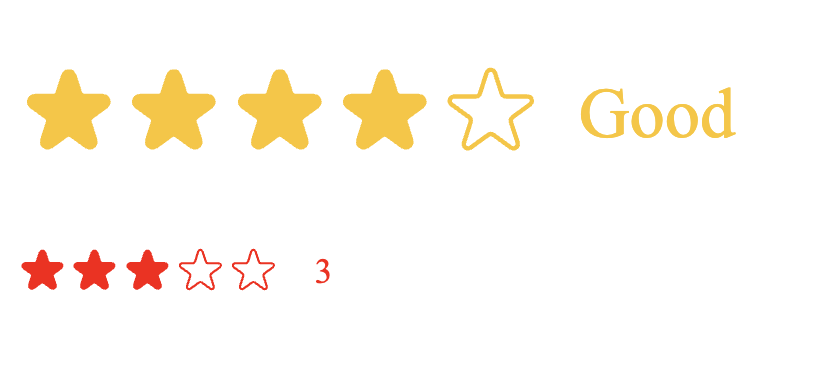

#### 14.2.3 Using the internal `rating` prop from `StarRating` for an external component:

> Create `Test` component which has inside the `StarRating` component:
```jsx
/* src/main.jsx */
import { StrictMode } from "react";
import { createRoot } from "react-dom/client";
// import './index.css'
// import App from './App.jsx'
import StarRating from "./StarRating.jsx";
import Test from "./components/Test.jsx";   // 👈🏽 ✅
createRoot(document.getElementById("root")).render(
  <StrictMode>
    {/* <App /> */}
    <StarRating maxRating={5} messages={["Terrible", "Bad", "Okay", "Good", "Excellent"]} />
    <StarRating maxRating={5} size={24} color="red" className="test" />
    <Test />      {/* 👈🏽 ✅ */}
  </StrictMode>
);
```


```jsx
/* src/components/Test.jsx 👈🏽 ✅ */
import StarRating from "../StarRating";
const Test = () => {
  return (
    <>
      <StarRating maxRating={10} color="blue" />
      <p>This movie was rate X stars</p>      {/* ⚠️ */}
    </>
  );
};
export default Test;
```
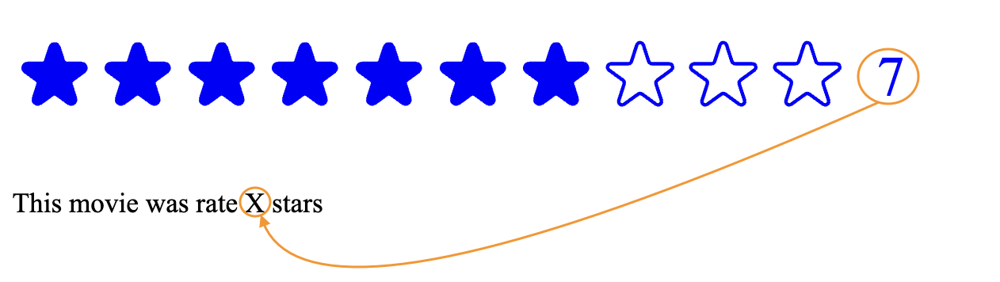

#### 14.2.4 Sending the external `onSetRating={setMovieRating}` props into `StarRating` component:
```jsx
/* src/components/Test.jsx */
import { useState } from "react";
import StarRating from "../StarRating";

const Test = () => {
  const [movieRating, setMovieRating] = useState(0);  // 👈🏽 ✅
  return (
    <>
      <StarRating maxRating={10} color="blue" onSetRating={setMovieRating}/>    {/* 👈🏽 ✅ */}
      <p>This movie was rate {movieRating} stars</p>                            {/* 👈🏽 ✅ */}
    </>
  );
};

export default Test;
```

#### 14.2.5 Receiving the `onSetRating` prop in `StarRating`:
```jsx
/* src/StarRating.jsx */
import { useState } from "react";
import Star from "./Star";
const containerStyle = {
  display: "flex",
  alignItems: "center",
  gap: "16px",
};
const starContainerStyle = {
  display: "flex",
};
const StarRating = ({ 
  maxRating = 3, 
  color = "#fcc419", 
  size = 48, 
  className = "", 
  messages = [], 
  onSetRating   {/* 👈🏽 ✅ */}
}) => {
  const [rating, setRating] = useState(0);
  const [tempRating, setTempRating] = useState(0);
  const handleRating = (rating) => {
    setRating(rating);
    onSetRating(rating);    // 👈🏽 ✅
  };
  const textStyle = {
    lineHeight: "1",
    gap: "0",
    color,
    fontSize: `${size / 1.5}px`,
  };
  const displayedRating = tempRating || rating || "";
  return (
    <div style={containerStyle} className={className}>
      <div style={starContainerStyle}>
        {Array.from({ length: maxRating }, (_, i) => (
          <Star
            key={i}
            onRate={() => handleRating(i + 1)}
            full={displayedRating >= i + 1}
            onHoverIn={() => setTempRating(i + 1)}
            onHoverOut={() => setTempRating(0)}
            color={color}
            size={size}
          />
        ))}
      </div>
      <p style={textStyle}>
        {messages.length === maxRating ? messages[tempRating ? tempRating - 1 : rating - 1] : tempRating || rating || ""}
      </p>
    </div>
  );
};
export default StarRating;
```
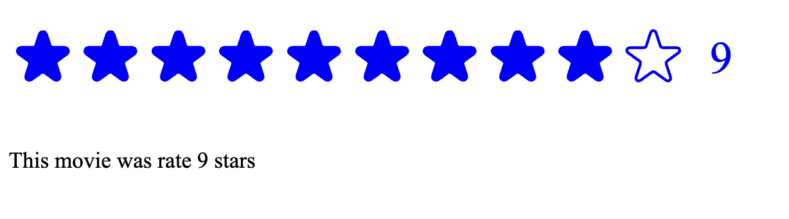

#### 14.2.6 Issue in `onSetRating` props in other `StarRating` instances without `Test`

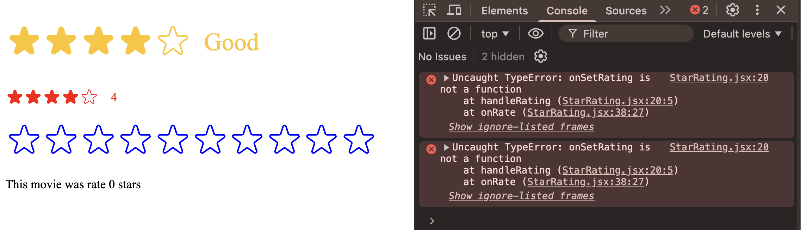

> Summary:
* Instances without `onSetRating` → break on click
* Because `onSetRating` is undefined

> Fixing:
```jsx
/* src/StarRating.jsx */
import { useState } from "react";
import Star from "./Star";
const containerStyle = {
  display: "flex",
  alignItems: "center",
  gap: "16px",
};
const starContainerStyle = {
  display: "flex",
};
const StarRating = ({ 
  maxRating = 3, 
  color = "#fcc419", 
  size = 48, 
  className = "", 
  messages = [], 
  onSetRating,    // 👈🏽 ✅ may be 'undefined'
}) => {
  const [rating, setRating] = useState(0);
  const [tempRating, setTempRating] = useState(0);
  const handleRating = (rating) => {
    setRating(rating);
    onSetRating?.(rating);    // 👈🏽 ✅
  };
  const textStyle = {
    lineHeight: "1",
    gap: "0",
    color,
    fontSize: `${size / 1.5}px`,
  };
  const displayedRating = tempRating || rating || "";
  return (
    <div style={containerStyle} className={className}>
      <div style={starContainerStyle}>
        {Array.from({ length: maxRating }, (_, i) => (
          <Star
            key={i}
            onRate={() => handleRating(i + 1)}
            full={displayedRating >= i + 1}
            onHoverIn={() => setTempRating(i + 1)}
            onHoverOut={() => setTempRating(0)}
            color={color}
            size={size}
          />
        ))}
      </div>
      <p style={textStyle}>
        {messages.length === maxRating ? messages[tempRating ? tempRating - 1 : rating - 1] : tempRating || rating || ""}
      </p>
    </div>
  );
};
export default StarRating;
```

##### ✅ Option 1: Default function (recommended)
You make sure onSetRating always exists:
```jsx
  const StarRating = ({
    maxRating = 3,
    color = "#fcc419",
    size = 48,
    className = "",
    messages = [],
    onSetRating = () => {}   // 👈🏽 empty function
  }) => {
```
> ✔️ Advantages:
* No errors
* The component can be used as controlled or uncontrolled
* Very common in reusable components

##### ✅ Option 2 – Check before calling
```jsx
const handleRating = (rating) => {
  setRating(rating);
  if (onSetRating) {
    onSetRating(rating);
  }
};
```
Or shorter:
```jsx
onSetRating?.(rating);
```
✔️ More explicit
* ❌ A bit more internal logic

##### ⚠️ Option 3 – Make it required (less flexible)
If you ALWAYS want someone to handle the rating:
```jsx
if (!onSetRating) {
  throw new Error("StarRating requires onSetRating prop");
}
```

* ❌ Reduces reusability
* ✔️ Useful in very specific components

### 🐞 14.3 Issues:

| Issue | Status | Log/Error |
|---|---|---|
| **Invalid strokeWidth prop value in Star component** | ⚠️ Identified | In `src/Star.jsx` line 20, `strokeWidth="{2}"` uses quotes around the number, making it a string instead of a number. Should be `strokeWidth={2}`. This may cause rendering inconsistencies in some browsers. |
| **Missing prop validation** | ℹ️ Low Priority | `StarRating` and `Star` components lack PropTypes or TypeScript types, making it easy to pass incorrect prop types without runtime warnings. |
| **No accessibility labels** | ⚠️ Identified | The `Star` component uses `role="button"` but lacks `aria-label` or `aria-describedby` attributes, making it less accessible for screen readers. |
| **Potential array index out of bounds** | ⚠️ Identified | In `StarRating.jsx` line 48, accessing `messages[tempRating ? tempRating - 1 : rating - 1]` could fail if `rating` is 0 and messages array is not empty. The check `messages.length === maxRating` doesn't prevent this edge case. |
| **Missing keyboard event handlers** | ⚠️ Identified | `Star` component only handles mouse events (`onClick`, `onMouseEnter`, `onMouseLeave`) but lacks keyboard support (`onKeyDown`) for accessibility compliance. |

### 🧱 14.4 Pending Fixes (TODO)

```md
- [ ] Fix `strokeWidth` prop in `Star.jsx` line 20: Change `strokeWidth="{2}"` to `strokeWidth={2}` to use a number instead of a string
- [ ] Add PropTypes or TypeScript types to `StarRating` component for prop validation (`maxRating`, `color`, `size`, `className`, `messages`, `onSetRating`)
- [ ] Add PropTypes or TypeScript types to `Star` component for prop validation (`onRate`, `full`, `onHoverIn`, `onHoverOut`, `color`, `size`)
- [ ] Add `aria-label` attribute to `Star` component's span element to improve accessibility for screen readers
- [ ] Add keyboard event handler (`onKeyDown`) to `Star` component to support keyboard navigation (Enter/Space keys)
- [ ] Fix potential array index out of bounds in `StarRating.jsx` line 48: Add validation to ensure `rating` is greater than 0 before accessing `messages` array
- [ ] Add `tabIndex={0}` to `Star` component's span element to make it keyboard focusable
- [ ] Consider adding `defaultProps` or using default parameters consistently for all optional props in `StarRating`
- [ ] Add error boundary or validation for `messages` array length to ensure it matches `maxRating` when provided
- [ ] Document prop types and usage examples in component comments or README
```

## 🔧 15. Lesson 120 — *PropTypes*

### 🧠 15.1 Context:

**PropTypes** is a runtime type-checking library for React that allows developers to validate the types of props passed to components. It provides a way to document and enforce the expected data types for component props, helping catch bugs during development and serving as inline documentation for component APIs.

**What are PropTypes?**

PropTypes is a separate package (`prop-types`) that enables type validation for React component props. It allows developers to specify the expected types for each prop (e.g., `string`, `number`, `array`, `object`, `function`) and whether they are required or optional. When props don't match the specified types, PropTypes emits warnings in the browser console during development.

**When are PropTypes used?**

- **During development**: To catch type mismatches and incorrect prop usage before they cause runtime errors
- **For documentation**: To serve as self-documenting code that shows what props a component expects
- **In JavaScript projects**: When not using TypeScript, PropTypes provides a way to add type safety
- **For component libraries**: To help consumers understand the component API and catch errors early
- **For team collaboration**: To make component contracts explicit and reduce bugs from miscommunication

**Examples from this project:**

1. **StarRating component** (`src/StarRating.jsx`): Demonstrates PropTypes implementation:
   ```55:62:src/StarRating.jsx
   StarRating.propTypes = {
     maxRating: PropTypes.number,
     color: PropTypes.string,
     size: PropTypes.number,
     className: PropTypes.string,
     messages: PropTypes.arrayOf(PropTypes.string),
     onSetRating: PropTypes.func,
   };
   ```
   - Validates that `maxRating` and `size` are numbers
   - Ensures `color` and `className` are strings
   - Validates `messages` is an array of strings
   - Confirms `onSetRating` is a function

2. **Missing PropTypes in other components**: Components like `Movie`, `MovieList`, `Box`, `Star`, `WatchedSummary`, and `WatchedMovie` don't have PropTypes validation, which means:
   - No type checking for props
   - No warnings if incorrect types are passed
   - Less clear component APIs

**Advantages of PropTypes:**

- ✅ **Early bug detection**: Catches type mismatches during development before they cause runtime errors
- ✅ **Self-documenting code**: PropTypes serve as inline documentation showing expected prop types
- ✅ **Better developer experience**: IDE autocomplete and warnings help developers use components correctly
- ✅ **Team collaboration**: Makes component contracts explicit, reducing miscommunication
- ✅ **Runtime validation**: Unlike TypeScript (compile-time), PropTypes validate at runtime
- ✅ **Easy to add**: Simple to implement without major refactoring
- ✅ **Flexible validation**: Supports custom validators for complex validation logic

**Disadvantages of PropTypes:**

- ⚠️ **React 19 limitation**: In React 19, PropTypes warnings are NOT displayed (React stopped calling `checkPropTypes` internally). This is expected behavior, not a bug
- ⚠️ **Runtime overhead**: Adds small performance cost during development (though minimal)
- ⚠️ **No compile-time checking**: Unlike TypeScript, errors are only caught at runtime
- ⚠️ **Optional by default**: Props are optional unless explicitly marked as `.isRequired`
- ⚠️ **Not removed in production**: PropTypes code remains in production builds (though it doesn't validate)
- ⚠️ **Limited type system**: Less powerful than TypeScript's type system
- ⚠️ **Maintenance burden**: Must be kept in sync with actual prop usage

**When to consider alternatives:**

- **Use TypeScript when**: You want compile-time type checking, better IDE support, and more powerful type system
- **Use JSDoc comments when**: You want documentation without runtime validation overhead
- **Skip PropTypes when**: Using TypeScript (redundant), or in React 19 where warnings don't appear
- **Use default parameters when**: You want to provide fallback values but don't need type validation
- **Use runtime validation libraries when**: You need more sophisticated validation (e.g., Yup, Zod)

**Important note about React 19:**

In React 19, PropTypes validation is effectively disabled. React no longer calls `checkPropTypes` internally, so:
- No warnings are displayed in the console
- No errors are thrown
- The code doesn't break, but PropTypes are simply ignored
- The import still works, but React doesn't execute the validation

This means PropTypes in React 19 projects serve primarily as documentation rather than runtime validation. For actual type checking in React 19, TypeScript is the recommended approach.

**Connection to this lesson's practical implementation:**

In this lesson, we learn how to add PropTypes to React components to validate prop types. The lesson demonstrates adding PropTypes to the `StarRating` component, showing how to specify types for each prop. However, it's important to understand that in React 19, these validations won't produce warnings, making PropTypes more of a documentation tool than a validation tool. The lesson emphasizes the importance of type safety and component API documentation, even if the runtime validation aspect is limited in React 19.


### ⚙️ 15.2 Updating code according the context:

#### 15.2.1 Adding `PropTypes` in `StarRating` component:

Previously run the following command:
```bash
npm install prop-types
```
And now in `StarRating`:
```tsx
/* src/StarRating.jsx */
import { useState } from "react";
import Star from "./Star";
import PropTypes from "prop-types";  // 👈🏽 ✅
const containerStyle = {
  display: "flex",
  alignItems: "center",
  gap: "16px",
};
const starContainerStyle = {
  display: "flex",
};
const StarRating = ({ maxRating = 3, color = "#fcc419", size = 48, className = "", messages = [], onSetRating }) => {
  const [rating, setRating] = useState(0);
  const [tempRating, setTempRating] = useState(0);
  const handleRating = (rating) => {
    setRating(rating);
    onSetRating?.(rating);
  };
  const textStyle = {
    lineHeight: "1",
    gap: "0",
    color,
    fontSize: `${size / 1.5}px`,
  };
  const displayedRating = tempRating || rating || "";
  return (
    <div style={containerStyle} className={className}>
      <div style={starContainerStyle}>
        {Array.from({ length: maxRating }, (_, i) => (
          <Star
            key={i}
            onRate={() => handleRating(i + 1)}
            full={displayedRating >= i + 1}
            onHoverIn={() => setTempRating(i + 1)}
            onHoverOut={() => setTempRating(0)}
            color={color}
            size={size}
          />
        ))}
      </div>
      <p style={textStyle}>
        {messages.length === maxRating ? messages[tempRating ? tempRating - 1 : rating - 1] : tempRating || rating || ""}
      </p>
    </div>
  );
};
StarRating.propTypes = {  // 👈🏽 ✅
  maxRating: PropTypes.number,
  color: PropTypes.string,
  size: PropTypes.number,
  className: PropTypes.string,
  messages: PropTypes.arrayOf(PropTypes.string),
  onSetRating: PropTypes.func,
};
export default StarRating;
```

#### 15.2.2 Consider the following comments:
👉 In React 19, `prop-types` does NOT emit warnings — neither in development mode nor in `StrictMode`.

This is not a bug; it is expected behavior.

#### 🧠 What actually happened (short and clear story)

- `prop-types` still exists as a library
- React 19 stopped calling it internally
- React no longer executes `checkPropTypes`

Because of this:

- no warnings
- no errors
- no logs
- even when the type is completely invalid (e.g. `"luiggie"`)

📌 The import does not fail  
📌 The code does not break  
📌 React simply ignores it


### 🐞 15.3 Issues:

| Issue | Status | Log/Error |
|---|---|---|
| **PropTypes not working in React 19** | ⚠️ Identified | React 19 no longer calls `checkPropTypes` internally, so PropTypes validation in `StarRating.jsx` (lines 55-62) doesn't emit warnings even when incorrect prop types are passed. This is expected behavior in React 19, not a bug. Example: Passing `maxRating="invalid"` (string instead of number) won't show any warning. |
| **Missing PropTypes in most components** | ⚠️ Identified | Only `StarRating` component has PropTypes validation. Components like `Movie`, `MovieList`, `Box`, `Star`, `WatchedSummary`, `WatchedMovie`, `WatchedMovieList`, `NumResult`, `Search`, `Navbar`, and `Main` lack PropTypes, making their APIs unclear and prone to runtime errors if incorrect props are passed. |
| **No required prop validation** | ⚠️ Identified | In `StarRating.propTypes`, all props are optional (no `.isRequired`). Critical props like `onSetRating` should be marked as required if they're essential for component functionality. Also, `Movie` component requires `movie` prop but has no validation, causing crashes if `movie` is undefined when accessing `movie.Poster`, `movie.Title`, etc. |
| **Missing PropTypes for Star component** | ⚠️ Identified | `Star.jsx` component receives multiple props (`onRate`, `full`, `onHoverIn`, `onHoverOut`, `color`, `size`) but has no PropTypes validation. If incorrect types are passed (e.g., `full="true"` instead of boolean), no warning is shown. Location: `src/Star.jsx:1` |
| **WatchedSummary lacks prop validation** | ⚠️ Identified | `WatchedSummary` component expects `watched` array but has no PropTypes. If `watched` is undefined or not an array, the component will crash when calling `watched.map()` (line 4). Additionally, empty arrays cause division by zero in the `average` function. Location: `src/components/WatchedSummary.jsx:1-6` |
| **Movie and WatchedMovie missing object shape validation** | ⚠️ Identified | `Movie` and `WatchedMovie` components expect `movie` prop to be an object with specific properties (`Poster`, `Title`, `Year`, `imdbID`, etc.), but PropTypes only validate it's an object, not its shape. Should use `PropTypes.shape()` to validate required properties. Locations: `src/components/Movie.jsx:1`, `src/components/WatchedMovie.jsx:1` |
| **Box component missing element prop validation** | ⚠️ Identified | `Box` component expects `element` prop (JSX element) but has no PropTypes. Should validate it's a valid React element using `PropTypes.element`. If `element` is undefined, the component renders nothing without clear feedback. Location: `src/components/Box.jsx:3` |
| **MovieList doesn't validate movies array** | ⚠️ Identified | `MovieList` component expects `movies` array but has no PropTypes. Uses optional chaining (`movies?.map`) which prevents crashes but renders nothing silently if `movies` is undefined. Should validate array type and potentially array contents. Location: `src/components/MovieList.jsx:3` |
| **PropTypes import present but ineffective** | ℹ️ Low Priority | `prop-types` package is installed (`package.json:13`) and imported in `StarRating.jsx` (line 3), but due to React 19 behavior, it serves only as documentation. Consider removing it or migrating to TypeScript for actual type checking. |
| **Inconsistent prop type definitions** | ℹ️ Low Priority | `StarRating.propTypes` uses basic types but doesn't specify ranges or constraints (e.g., `maxRating` should be positive, `size` should be reasonable). Could use custom validators for more robust validation. Location: `src/StarRating.jsx:55-62` |

### 🧱 15.4 Pending Fixes (TODO)

```md
- [ ] Add PropTypes validation to `Movie` component: Validate `movie` prop as required object with shape containing `Poster`, `Title`, `Year`, and `imdbID` properties using `PropTypes.shape()`. Location: `src/components/Movie.jsx`
- [ ] Add PropTypes validation to `WatchedMovie` component: Validate `movie` prop as required object with shape containing `Poster`, `Title`, `imdbRating`, `userRating`, and `runtime` properties. Location: `src/components/WatchedMovie.jsx`
- [ ] Add PropTypes validation to `MovieList` component: Validate `movies` prop as required array of objects. Consider using `PropTypes.arrayOf(PropTypes.object)` or more specific shape validation. Location: `src/components/MovieList.jsx:3`
- [ ] Add PropTypes validation to `WatchedSummary` component: Validate `watched` prop as required array. Add defensive check to handle empty arrays and prevent division by zero in `average` function. Location: `src/components/WatchedSummary.jsx:1-6`
- [ ] Add PropTypes validation to `Box` component: Validate `element` prop as required React element using `PropTypes.element`. Location: `src/components/Box.jsx:3`
- [ ] Add PropTypes validation to `Star` component: Validate all props (`onRate`, `full`, `onHoverIn`, `onHoverOut`, `color`, `size`) with appropriate types. Mark callbacks as required functions. Location: `src/Star.jsx:1`
- [ ] Mark required props in `StarRating.propTypes`: Add `.isRequired` to props that are essential for component functionality (e.g., `onSetRating` if it's always needed). Review which props should be required vs optional. Location: `src/StarRating.jsx:55-62`
- [ ] Add custom validators for `StarRating` props: Add validation functions to ensure `maxRating` is positive, `size` is reasonable, and `messages` array length matches `maxRating` when provided. Use `PropTypes.oneOf()` or custom validator functions. Location: `src/StarRating.jsx:55-62`
- [ ] Add PropTypes to remaining components: Add PropTypes validation to `WatchedMovieList`, `NumResult`, `Search`, `Navbar`, and `Main` components to complete type validation across the application
- [ ] Consider migrating to TypeScript: Given React 19's limitation with PropTypes, evaluate migrating the project to TypeScript for compile-time type checking and better IDE support. This would provide actual type safety instead of documentation-only PropTypes
- [ ] Add default prop values where appropriate: For components with optional props, consider adding `defaultProps` or default parameters to handle undefined values gracefully (e.g., `Box` component should handle `element` being undefined)
- [ ] Document PropTypes limitations in React 19: Add comments or documentation explaining that PropTypes serve as documentation in React 19 and won't emit warnings, helping developers understand the current behavior
- [ ] Add PropTypes validation for nested objects: Use `PropTypes.shape()` for complex objects like `movie` prop to validate nested properties and catch errors when accessing `movie.Poster`, `movie.Title`, etc.
- [ ] Review and remove unused PropTypes: If migrating to TypeScript or deciding PropTypes aren't needed, remove `prop-types` dependency and PropTypes definitions to reduce bundle size
```


---

🔥 🔥 🔥 

## 🔧 XX. Lesson YYY — *{{TITLE_NAME}}*

### 🧠 XX.1 Context:


### ⚙️ XX.2 Updating code according the context:

#### XX.2.1
```tsx
/*  */

```

#### XX.2.2
```tsx
/*  */

```

### 🐞 XX.3 Issues:
- **first issue**: something..

| Issue | Status | Log/Error |
|---|---|---|

### 🧱 XX.4 Pending Fixes (TODO)

```md
- [ ]
```
