# 👨🏾‍💻 Project: usePopcorn - Movie Rating and Discovery App

## 📋 Project Overview

### What This Project Does
usePopcorn is a modern React application that allows users to discover, search, and rate movies. Users can search for movies using the OMDB API, view detailed movie information, add movies to their watched list, and rate them with a custom star rating component. The application demonstrates advanced React concepts including component composition, effects, data fetching, and state management.

### Technology Stack
- **Frontend Framework**: React 19.2.0 with functional components and hooks
- **Build Tool**: Vite 7.2.4 for fast development and optimized production builds
- **Styling**: Vanilla CSS with component-based styling approach
- **API**: OMDB API for movie data
- **Development Tools**: ESLint for code linting, PropTypes for type checking
- **Package Manager**: npm with modern ES modules

### Key Components
- **App**: Main application component managing global state and data flow
- **Search**: Movie search functionality with real-time filtering
- **MovieList/Movie**: Display search results and individual movie items
- **MovieDetails**: Detailed movie information view with ratings
- **StarRating**: Reusable star rating component with hover effects
- **WatchedSummary/WatchedMovieList**: User's watched movies management
- **Box**: Reusable container component using composition patterns

## 📑 Table of Contents
- [👨🏾‍💻 Project: usePopcorn - Movie Rating and Discovery App](#-project-usepopcorn---movie-rating-and-discovery-app)
  - [📋 Project Overview](#-project-overview)
  - [📑 Table of Contents](#-table-of-contents)
  - [📁 Visual Project Tree](#-visual-project-tree)
  - [🧳 Section 10: *Thinking in React: Components, Composition and Reusability*](#-section-10-thinking-in-react-components-composition-and-reusability)
    <details>
    <summary>Section 10 - Lessons</summary>

      * [📚 Lesson 106: Setting Up the "usePopcorn" project](#-106-lesson-106--setting-up-the-usepopcorn-project)
      * [📚 Lesson 107: How to split a UI into components](#-107-lesson-107--how-to-split-a-ui-into-components)
      * [📚 Lesson 108: Splitting Components in Practice](#-108-lesson-108--splitting-components-in-practice)
      * [📚 Lesson 109: Component Categories](#-109-lesson-109--component-categories)
      * [📚 Lesson 110: Prop Drilling](#-110-lesson-110--prop-drilling)
      * [📚 Lesson 111: Component Composition](#-111-lesson-111--component-composition)
      * [📚 Lesson 112: Fixing Prop Drilling With Composition (And Building a Layout)](#-112-lesson-112--fixing-prop-drilling-with-composition-and-building-a-layout)
      * [📚 Lesson 113: Using Composition to Make a Reusable Box](#-113-lesson-113--using-composition-to-make-a-reusable-box)
      * [📚 Lesson 114: Passing Elements as Props (Alternative to children)](#-114-lesson-114--passing-elements-as-props-alternative-to-children)
      * [📚 Lesson 115: Building a Reusable Star Rating Component](#-115-lesson-115--building-a-reusable-star-rating-component)
      * [📚 Lesson 116: Creating the Stars](#-116-lesson-116--creating-the-stars)
      * [📚 Lesson 117: Handling Hover Events](#-117-lesson-117--handling-hover-events)
      * [📚 Lesson 118: Props as a Component API](#-118-lesson-118--props-as-a-component-api)
      * [📚 Lesson 119: Improving Reusability with Props](#-119-lesson-119--improving-reusability-with-props)
      * [📚 Lesson 120: PropTypes](#-120-lesson-120--proptypes)
    </details>
  - [🧳 Section 12: *Effects and Data Fetching*](#-section-12-effects-and-data-fetching)
    <details>
    <summary>Section 12 - Lessons</summary>

      * [📚 Lesson 141: The Component Lifecycle](#-141-lesson-141--the-component-lifecycle)
      * [📚 Lesson 142: How NOT to Fetch Data in React](#-142-lesson-142--how-not-to-fetch-data-in-react)
      * [📚 Lesson 143: useEffect to the Rescue](#-143-lesson-143--useeffect-to-the-rescue)
      * [📚 Lesson 144: At first look at Effects](#-144-lesson-144--at-first-look-at-effects)
      * [📚 Lesson 145: Using an async Function](#-145-lesson-145--using-async-function)
      * [📚 Lesson 146: Adding a Loading State](#-146-lesson-146--adding-loading-state)
      * [📚 Lesson 147: Handling Errors](#-147-lesson-147--handling-errors)
      * [📚 Lesson 148: The useEffect dependency array](#-148-lesson-148--the-useeffect-dependency-array)
      * [📚 Lesson 149: Synchronizing Queries With Movie Data](#-149-lesson-149--synchronizing-queries-with-movie-data)
      * [📚 Lesson 150: Selecting a Movie](#-150-lesson-150--selecting-movie)
      * [📚 Lesson 151: Loading Movie Details](#-151-lesson-151--loading-movie-details)
      * [📚 Lesson 152: Adding a Watched Movie](#-152-lesson-152--adding-watched-movie)
      * [📚 Lesson 153: Adding a New Effect: Changing Page Title](#-153-lesson-153--adding-new-effect-changing-page-title)
      * [📚 Lesson 154: The useEffect cleanup function](#-154-lesson-154--the-useeffect-cleanup-function)
      * [📚 Lesson 155: Cleaning Up the Title](#-155-lesson-155--cleaning-up-title)
      * [📚 Lesson 156: Cleaning Up Data Fetching](#-156-lesson-156--cleaning-up-data-fetching)
    </details>
  - [🧳 Section 13: *Custom Hooks, Refs and More State*](#-section-13-custom-hooks-refs-and-more-state)
    <details>
    <summary>Section 13 - Lessons</summary>

      * [📚 Lesson 157: One More Effect: Listening to a Keypress](#-157-lesson-157--one-more-effect-listening-to-keypress)
      * [📚 Lesson 158: React Hooks: Summary and Rules](#-158-lesson-158--react-hooks-summary-and-rules)
      * [📚 Lesson 159: Summary of Rules](#-159-lesson-159--summary-of-rules)
      * [📚 Lesson 160: The "usePopcorn" Project](#-160-lesson-160--the-usepopcorn-project)
      * [📚 Lesson 161: Starting the "usePopcorn" project](#-161-lesson-161--starting-the-usepopcorn-project)
      * [📚 Lesson 162: More Details of useState](#-162-lesson-162--more-details-of-usestate)
      * [📚 Lesson 163: Initializing State With a Callback (Lazy Initial State)](#-163-lesson-163--initializing-state-with-a-callback-lazy-initial-state)
      * [📚 Lesson 164: useState summary](#-164-lesson-164--usestate-summary)
      * [📚 Lesson 165: How NOT to Select DOM Elements in React](#-165-lesson-165--how-not-to-select-dom-elements-in-react)
    </details>

## 📁 Visual Project Tree

```bash
📁 11-usepopcorn/
├── 📄 index.html             # Main HTML entry point
├── 📄 package.json           # Project manifest and dependencies
├── 📄 vite.config.js         # Vite build configuration
├── 📄 eslint.config.js       # Linting rules
├── 📄 README.md              # Project overview
├── 📁 src/                   # Source code directory
│   ├── 📄 main.jsx           # React app entry point
│   ├── 📄 App.jsx            # Multi-component root
│   ├── 📄 StarRating.jsx     # Reusable rating component
│   └── 📁 components/        # Isolated UI components
│       ├── 📄 Navbar.jsx
│       ├── 📄 Main.jsx
│       ├── 📄 Search.jsx
│       ├── 📄 MovieDetails.jsx
│       └── ...
├── 📁 docs/                  # Educational documentation
│   └── 📄 LECTURE_STEPS.md   # Detailed step-by-step notes
└── 📁 img/                   # Visual aids and screenshots
```

<br>

## 🧳 Section 10: *Thinking in React: Components, Composition and Reusability*

### 📑 Table of Contents
- [📑 Table of Contents](#-table-of-contents-1)
  - [📚 Lesson 106: Setting Up the "usePopcorn" project](#-106-lesson-106--setting-up-the-usepopcorn-project)
  - [📚 Lesson 107: How to split a UI into components](#-107-lesson-107--how-to-split-a-ui-into-components)
  - [📚 Lesson 108: Splitting Components in Practice](#-108-lesson-108--splitting-components-in-practice)
  - [📚 Lesson 109: Component Categories](#-109-lesson-109--component-categories)
  - [📚 Lesson 110: Prop Drilling](#-110-lesson-110--prop-drilling)
  - [📚 Lesson 111: Component Composition](#-111-lesson-111--component-composition)
  - [📚 Lesson 112: Fixing Prop Drilling With Composition (And Building a Layout)](#-112-lesson-112--fixing-prop-drilling-with-composition-and-building-a-layout)
  - [📚 Lesson 113: Using Composition to Make a Reusable Box](#-113-lesson-113--using-composition-to-make-a-reusable-box)
  - [📚 Lesson 114: Passing Elements as Props (Alternative to children)](#-114-lesson-114--passing-elements-as-props-alternative-to-children)
  - [📚 Lesson 115: Building a Reusable Star Rating Component](#-115-lesson-115--building-a-reusable-star-rating-component)
  - [📚 Lesson 116: Creating the Stars](#-116-lesson-116--creating-the-stars)
  - [📚 Lesson 117: Handling Hover Events](#-117-lesson-117--handling-hover-events)
  - [📚 Lesson 118: Props as a Component API](#-118-lesson-118--props-as-a-component-api)
  - [📚 Lesson 119: Improving Reusability with Props](#-119-lesson-119--improving-reusability-with-props)
  - [📚 Lesson 120: PropTypes](#-120-lesson-120--proptypes)

---

## 🔧 106. Lesson 106 — *Setting Up the "usePopcorn" project*

- [Lecture 106: Setting Up the "usePopcorn" project](#-106-lesson-106--setting-up-the-usepopcorn-project)
- [106.1 Context](#1061-context)
- [106.2 Updating code according the context](#1062-updating-code-according-the-context)
- [106.3 Issues](#1063-issues)
- [106.4 Pending Fixes (TODO)](#1064-pending-fixes-todo)

### 🧠 106.1 Context:
This lesson focuses on setting up the initial project structure for "usePopcorn", a movie rating and discovery application. We'll initialize a new React project using Vite, configure the development environment, and establish the foundation for building a component-based application. The project will demonstrate React best practices including component composition, state management, and reusability patterns. This setup phase is crucial as it establishes the project architecture and development workflow that will be used throughout the section.

### ⚙️ 106.2 Updating code according the context:

Visit [UsePoCorn app](https://usepopcorn.netlify.app/) here!.

### 🐞 106.3 Issues:

- No issues encountered during project initialization.

| Issue | Status | Log/Error |
|---|---|---|
| N/A | ✅ Resolved | Project initialized successfully with Vite. |

### 🧱 106.4 Pending Fixes (TODO):

- [x] Set up project scaffolding with Vite
- [x] Configure development environment
- [x] Establish project architecture foundation

## 🔧 107. Lesson 107 — *How to split a UI into components*

- [Lecture 107: How to split a UI into components](#-107-lesson-107--how-to-split-a-ui-into-components)
- [107.1 Context](#1071-context)
- [107.2 Updating code according the context](#1072-updating-code-according-the-context)
- [107.3 Issues](#1073-issues)
- [107.4 Pending Fixes (TODO)](#1074-pending-fixes-todo)

### 🧠 107.1 Context:
This lesson teaches the fundamental skill of breaking down a user interface into logical, reusable React components. We'll explore the principles of component design, including when to create new components, how to determine appropriate component size, and strategies for identifying component boundaries. The lesson covers practical guidelines for component composition, emphasizing the balance between too-small components (over-engineering) and too-large components (monolithic code). Understanding these concepts is essential for building maintainable, scalable React applications and is a core skill in "thinking in React".

### ⚙️ 107.2 Updating code according the context:

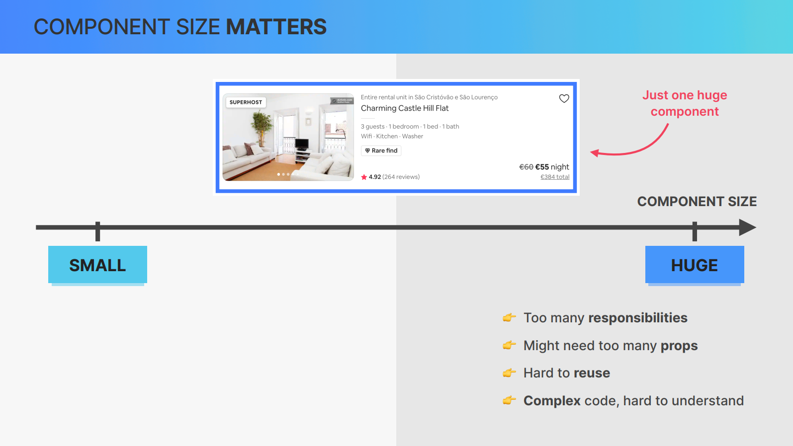
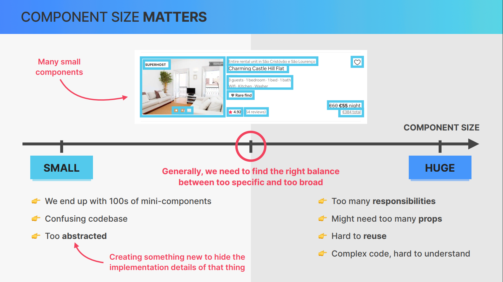
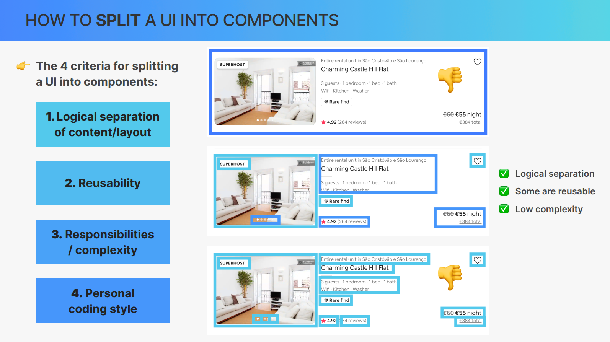
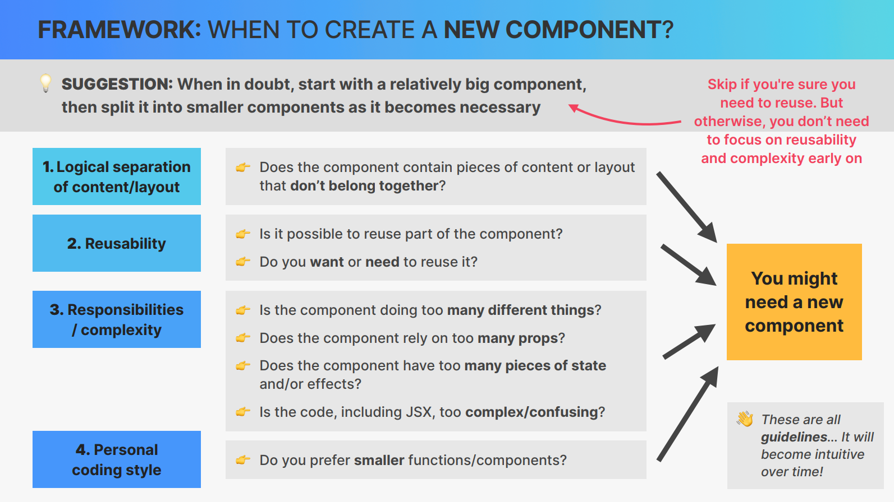
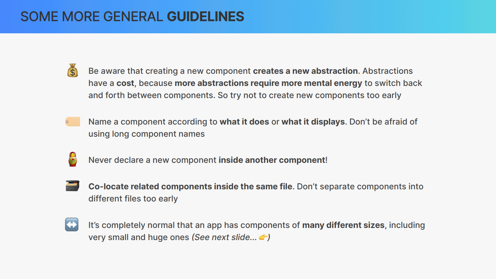
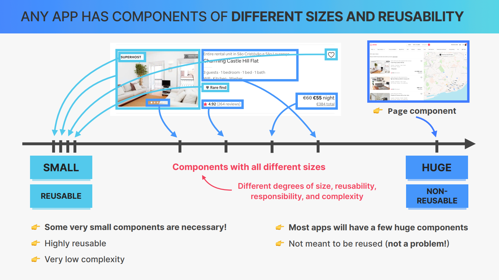

### 🐞 107.3 Issues:

- No technical issues identified in this theoretical overview.

| Issue | Status | Log/Error |
|---|---|---|
| N/A | ✅ Resolved | Theoretical concepts explained with visual aids. |

### 🧱 107.4 Pending Fixes (TODO):

- [x] Learn component design principles
- [x] Understand component size guidelines
- [x] Practice identifying component boundaries

## 🔧 108. Lesson 108 — *Splitting Components in Practice*

- [Lecture 108: Splitting Components in Practice](#-108-lesson-108--splitting-components-in-practice)
- [108.1 Context](#1081-context)
- [108.2 Updating code according the context](#1082-updating-code-according-the-context)
- [108.3 Issues](#1083-issues)
- [108.4 Pending Fixes (TODO)](#1084-pending-fixes-todo)

### 🧠 108.1 Context:
This lesson applies the theoretical concepts from Lesson 107 by practically splitting a monolithic React component into smaller, reusable, and maintainable components. We start with a single `App.jsx` file containing all the UI logic and progressively break it down into logical component pieces. The refactoring process demonstrates the step-by-step approach to component decomposition, showing how to identify component boundaries, extract reusable UI elements, and manage component composition. This hands-on practice reinforces the principles of "thinking in React" by transforming a complex single-component application into a well-structured component hierarchy. The lesson covers creating container components, presentational components, and understanding when to lift state up or keep it local, establishing a solid foundation for building scalable React applications.

### ⚙️ 108.2 Updating code according the context:

#### 1. Provided Code:
```jsx
/* src/App.jsx */
import { useState } from "react";

const tempMovieData = [
  {
    imdbID: "tt1375666",
    Title: "Inception",
    Year: "2010",
    Poster: "https://m.media-amazon.com/images/M/MV5BMjAxMzY3NjcxNF5BMl5BanBnXkFtZTcwNTI5OTM0Mw@@._V1_SX300.jpg",
  },
  {
    imdbID: "tt0133093",
    Title: "The Matrix",
    Year: "1999",
    Poster:
      "https://m.media-amazon.com/images/M/MV5BNzQzOTk3OTAtNDQ0Zi00ZTVkLWI0MTEtMDllZjNkYzNjNTc4L2ltYWdlXkEyXkFqcGdeQXVyNjU0OTQ0OTY@._V1_SX300.jpg",
  },
  {
    imdbID: "tt6751668",
    Title: "Parasite",
    Year: "2019",
    Poster:
      "https://m.media-amazon.com/images/M/MV5BYWZjMjk3ZTItODQ2ZC00NTY5LWE0ZDYtZTI3MjcwN2Q5NTVkXkEyXkFqcGdeQXVyODk4OTc3MTY@._V1_SX300.jpg",
  },
];

const tempWatchedData = [
  {
    imdbID: "tt1375666",
    Title: "Inception",
    Year: "2010",
    Poster: "https://m.media-amazon.com/images/M/MV5BMjAxMzY3NjcxNF5BMl5BanBnXkFtZTcwNTI5OTM0Mw@@._V1_SX300.jpg",
    runtime: 148,
    imdbRating: 8.8,
    userRating: 10,
  },
  {
    imdbID: "tt0088763",
    Title: "Back to the Future",
    Year: "1985",
    Poster:
      "https://m.media-amazon.com/images/M/MV5BZmU0M2Y1OGUtZjIxNi00ZjBkLTg1MjgtOWIyNThiZWIwYjRiXkEyXkFqcGdeQXVyMTQxNzMzNDI@._V1_SX300.jpg",
    runtime: 116,
    imdbRating: 8.5,
    userRating: 9,
  },
];

const average = (arr) => arr.reduce((acc, cur, i, arr) => acc + cur / arr.length, 0);

function App() {
  const [query, setQuery] = useState("");
  const [movies, setMovies] = useState(tempMovieData);
  const [watched, setWatched] = useState(tempWatchedData);
  const [isOpen1, setIsOpen1] = useState(true);
  const [isOpen2, setIsOpen2] = useState(true);

  const avgImdbRating = average(watched.map((movie) => movie.imdbRating));
  const avgUserRating = average(watched.map((movie) => movie.userRating));
  const avgRuntime = average(watched.map((movie) => movie.runtime));

  return (
    <>
      <nav className="nav-bar">
        <div className="logo">
          <span role="img">🍿</span>
          <h1>usePopcorn</h1>
        </div>
        <input
          className="search"
          type="text"
          placeholder="Search movies..."
          value={query}
          onChange={(e) => setQuery(e.target.value)}
        />
        <p className="num-results">
          Found <strong>{movies.length}</strong> results
        </p>
      </nav>

      <main className="main">
        <div className="box">
          <button className="btn-toggle" onClick={() => setIsOpen1((open) => !open)}>
            {isOpen1 ? "–" : "+"}
          </button>
          {isOpen1 && (
            <ul className="list">
              {movies?.map((movie) => (
                <li key={movie.imdbID}>
                  
                  <h3>{movie.Title}</h3>
                  <div>
                    <p>
                      <span>🗓</span>
                      <span>{movie.Year}</span>
                    </p>
                  </div>
                </li>
              ))}
            </ul>
          )}
        </div>

        <div className="box">
          <button className="btn-toggle" onClick={() => setIsOpen2((open) => !open)}>
            {isOpen2 ? "–" : "+"}
          </button>
          {isOpen2 && (
            <>
              <div className="summary">
                <h2>Movies you watched</h2>
                <div>
                  <p>
                    <span>#️⃣</span>
                    <span>{watched.length} movies</span>
                  </p>
                  <p>
                    <span>⭐️</span>
                    <span>{avgImdbRating}</span>
                  </p>
                  <p>
                    <span>🌟</span>
                    <span>{avgUserRating}</span>
                  </p>
                  <p>
                    <span>⏳</span>
                    <span>{avgRuntime} min</span>
                  </p>
                </div>
              </div>

              <ul className="list">
                {watched.map((movie) => (
                  <li key={movie.imdbID}>
                    
                    <h3>{movie.Title}</h3>
                    <div>
                      <p>
                        <span>⭐️</span>
                        <span>{movie.imdbRating}</span>
                      </p>
                      <p>
                        <span>🌟</span>
                        <span>{movie.userRating}</span>
                      </p>
                      <p>
                        <span>⏳</span>
                        <span>{movie.runtime} min</span>
                      </p>
                    </div>
                  </li>
                ))}
              </ul>
            </>
          )}
        </div>
      </main>
    </>
  );
}
export default App;
```

```css
/* src/index.css */
:root {
  --color-primary: #6741d9;
  --color-primary-light: #7950f2;
  --color-text: #dee2e6;
  --color-text-dark: #adb5bd;
  --color-background-100: #343a40;
  --color-background-500: #2b3035;
  --color-background-900: #212529;
  --color-red: #fa5252;
  --color-red-dark: #e03131;
}

* {
  margin: 0;
  padding: 0;
  box-sizing: border-box;
}

html {
  font-size: 62.5%;
}

body {
  font-family: -apple-system, BlinkMacSystemFont, "Segoe UI", Roboto, Oxygen,
    Ubuntu, Cantarell, "Open Sans", "Helvetica Neue", sans-serif;

  color: var(--color-text);
  background-color: var(--color-background-900);
  padding: 2.4rem;
}

/* ******* */

.nav-bar {
  display: grid;
  grid-template-columns: 1fr 1fr 1fr;
  align-items: center;
  height: 7.2rem;
  padding: 0 3.2rem;
  background-color: var(--color-primary);
  border-radius: 0.9rem;
}

.main {
  margin-top: 2.4rem;
  height: calc(100vh - 7.2rem - 3 * 2.4rem);
  display: flex;
  gap: 2.4rem;
  justify-content: center;
}

.box {
  width: 42rem;
  max-width: 42rem;
  background-color: var(--color-background-500);
  border-radius: 0.9rem;
  /* overflow: scroll; */
  position: relative;
}

.loader {
  text-align: center;
  text-transform: uppercase;
  font-size: 2rem;
  font-weight: 600;
  margin: 4.8rem;
}

.error {
  text-align: center;
  font-size: 2rem;
  padding: 4.8rem;
}

/* ******* */

.logo {
  display: flex;
  align-items: center;
  gap: 0.8rem;
}

.logo span {
  font-size: 3.2rem;
}

.logo h1 {
  font-size: 2.4rem;
  font-weight: 600;
  color: #fff;
}

.search {
  justify-self: center;
  border: none;
  padding: 1.1rem 1.6rem;
  font-size: 1.8rem;
  border-radius: 0.7rem;
  width: 40rem;
  transition: all 0.3s;
  color: var(--color-text);

  /* background-color: var(--color-background-900); */
  background-color: var(--color-primary-light);
}

.search::placeholder {
  color: var(--color-text-dark);
}

.search:focus {
  outline: none;
  box-shadow: 0 2.4rem 2.4rem rgba(0, 0, 0, 0.1);
  transform: translateY(-2px);
}

.num-results {
  justify-self: end;
  font-size: 1.8rem;
}

.btn-toggle {
  position: absolute;
  top: 0.8rem;
  right: 0.8rem;
  height: 2.4rem;
  aspect-ratio: 1;
  border-radius: 50%;
  border: none;
  background-color: var(--color-background-900);
  color: var(--color-text);
  font-size: 1.4rem;
  font-weight: bold;
  cursor: pointer;
  z-index: 999;
}

.list {
  list-style: none;
  padding: 0.8rem 0;
  /* overflow: scroll; */
}

.list-watched {
  height: calc(100% - 9rem);
}

.list li {
  position: relative;
  display: grid;
  grid-template-columns: 4rem 1fr;
  grid-template-rows: auto auto;
  column-gap: 2.4rem;
  font-size: 1.6rem;
  align-items: center;

  padding: 1.6rem 3.2rem;
  border-bottom: 1px solid var(--color-background-100);
}

.list.list-movies li {
  cursor: pointer;
  transition: all 0.3s;
}

.list.list-movies li:hover {
  background-color: var(--color-background-100);
}

.list img {
  width: 100%;
  grid-row: 1 / -1;
}

.list h3 {
  font-size: 1.8rem;
}

.list div {
  display: flex;
  align-items: center;
  gap: 2.4rem;
}

.list p {
  display: flex;
  align-items: center;
  gap: 0.8rem;
}

.btn-delete {
  position: absolute;
  right: 2.4rem;

  height: 1.8rem;
  aspect-ratio: 1;
  border-radius: 50%;
  border: none;
  background-color: var(--color-red);
  color: var(--color-background-900);
  font-size: 0.9rem;
  font-weight: bold;
  cursor: pointer;
  transition: all 0.3s;
}

.btn-delete:hover {
  background-color: var(--color-red-dark);
}

/* ******* */

.summary {
  padding: 2.2rem 3.2rem 1.8rem 3.2rem;
  border-radius: 0.9rem;
  background-color: var(--color-background-100);
  box-shadow: 0 1.2rem 2.4rem rgba(0, 0, 0, 0.2);
}

.summary h2 {
  text-transform: uppercase;
  font-size: 1.6rem;
  margin-bottom: 0.6rem;
}

.summary div {
  display: flex;
  align-items: center;
  gap: 2.4rem;
  font-size: 1.6rem;
  font-weight: 600;
}

.summary p {
  display: flex;
  align-items: center;
  gap: 0.8rem;
}

/* ******* */

.details {
  line-height: 1.4;
  font-size: 1.4rem;
}

.details header {
  display: flex;
}

.details section {
  padding: 4rem;
  display: flex;
  flex-direction: column;
  gap: 1.6rem;
}

.details img {
  width: 33%;
}

.details-overview {
  width: 100%;
  padding: 2.4rem 3rem;
  background-color: var(--color-background-100);
  display: flex;
  flex-direction: column;
  gap: 1.4rem;
}

.details-overview h2 {
  font-size: 2.4rem;
  margin-bottom: 0.4rem;
  line-height: 1.1;
}

.details-overview p {
  display: flex;
  align-items: center;
  gap: 0.8rem;
}

.rating {
  background-color: var(--color-background-100);
  border-radius: 0.9rem;
  padding: 2rem 2.4rem;
  margin-bottom: 0.8rem;
  font-weight: 600;
  display: flex;
  flex-direction: column;
  gap: 2.4rem;
}

.btn-add {
  background-color: var(--color-primary);
  color: var(--color-text);
  border: none;
  border-radius: 10rem;
  font-size: 1.4rem;
  padding: 1rem;
  font-weight: bold;
  cursor: pointer;
  transition: all 0.3s;
}

.btn-add:hover {
  background-color: var(--color-primary-light);
}

.seconds {
  background-color: var(--color-background-100);
  width: 8rem;
  border-radius: 10rem;
  font-weight: 600;
  text-align: center;
  padding: 0.4rem;
  margin-top: 2.4rem;
}

.btn-back {
  position: absolute;
  top: 0.6rem;
  left: 0.6rem;
  height: 3.2rem;
  aspect-ratio: 1;
  border-radius: 50%;
  border: none;
  /* background-color: var(--color-text); */
  background-color: #fff;
  color: var(--color-background-500);
  box-shadow: 0 8px 20px rgba(0, 0, 0, 0.8);
  font-family: sans-serif;
  font-size: 2.4rem;
  font-weight: bold;
  cursor: pointer;
  z-index: 999;
  display: flex;
  align-items: center;
  justify-content: center;
}

/*
SPACING SYSTEM (px)
2 / 4 / 8 / 12 / 16 / 24 / 32 / 40 / 48 / 64 / 80 / 96 / 128

FONT SIZE SYSTEM (px)
10 / 12 / 14 / 16 / 18 / 20 / 24 / 30 / 36 / 44 /52 / 62 / 74 / 86 / 98
*/

/*
FULL STAR

<svg
  xmlns="http://www.w3.org/2000/svg"
  viewBox="0 0 20 20"
  fill="#000"
  stroke="#000"
>
  <path
    d="M9.049 2.927c.3-.921 1.603-.921 1.902 0l1.07 3.292a1 1 0 00.95.69h3.462c.969 0 1.371 1.24.588 1.81l-2.8 2.034a1 1 0 00-.364 1.118l1.07 3.292c.3.921-.755 1.688-1.54 1.118l-2.8-2.034a1 1 0 00-1.175 0l-2.8 2.034c-.784.57-1.838-.197-1.539-1.118l1.07-3.292a1 1 0 00-.364-1.118L2.98 8.72c-.783-.57-.38-1.81.588-1.81h3.461a1 1 0 00.951-.69l1.07-3.292z"
  />
</svg>


EMPTY STAR

<svg
  xmlns="http://www.w3.org/2000/svg"
  fill="none"
  viewBox="0 0 24 24"
  stroke="#000"
>
  <path
    strokeLinecap="round"
    strokeLinejoin="round"
    strokeWidth="{2}"
    d="M11.049 2.927c.3-.921 1.603-.921 1.902 0l1.519 4.674a1 1 0 00.95.69h4.915c.969 0 1.371 1.24.588 1.81l-3.976 2.888a1 1 0 00-.363 1.118l1.518 4.674c.3.922-.755 1.688-1.538 1.118l-3.976-2.888a1 1 0 00-1.176 0l-3.976 2.888c-.783.57-1.838-.197-1.538-1.118l1.518-4.674a1 1 0 00-.363-1.118l-3.976-2.888c-.784-.57-.38-1.81.588-1.81h4.914a1 1 0 00.951-.69l1.519-4.674z"
  />
</svg>
*/
```


#### 2. Keeping `App` as simple as possible:
```jsx
/* src/App.jsx */
import { useState } from "react";
import Navbar from "./components/Navbar";
import Main from "./components/Main";

const tempMovieData = [
  {
    imdbID: "tt1375666",
    Title: "Inception",
    Year: "2010",
    Poster: "https://m.media-amazon.com/images/M/MV5BMjAxMzY3NjcxNF5BMl5BanBnXkFtZTcwNTI5OTM0Mw@@._V1_SX300.jpg",
  },
  {
    imdbID: "tt0133093",
    Title: "The Matrix",
    Year: "1999",
    Poster:
      "https://m.media-amazon.com/images/M/MV5BNzQzOTk3OTAtNDQ0Zi00ZTVkLWI0MTEtMDllZjNkYzNjNTc4L2ltYWdlXkEyXkFqcGdeQXVyNjU0OTQ0OTY@._V1_SX300.jpg",
  },
  {
    imdbID: "tt6751668",
    Title: "Parasite",
    Year: "2019",
    Poster:
      "https://m.media-amazon.com/images/M/MV5BYWZjMjk3ZTItODQ2ZC00NTY5LWE0ZDYtZTI3MjcwN2Q5NTVkXkEyXkFqcGdeQXVyODk4OTc3MTY@._V1_SX300.jpg",
  },
];

const tempWatchedData = [
  {
    imdbID: "tt1375666",
    Title: "Inception",
    Year: "2010",
    Poster: "https://m.media-amazon.com/images/M/MV5BMjAxMzY3NjcxNF5BMl5BanBnXkFtZTcwNTI5OTM0Mw@@._V1_SX300.jpg",
    runtime: 148,
    imdbRating: 8.8,
    userRating: 10,
  },
  {
    imdbID: "tt0088763",
    Title: "Back to the Future",
    Year: "1985",
    Poster:
      "https://m.media-amazon.com/images/M/MV5BZmU0M2Y1OGUtZjIxNi00ZjBkLTg1MjgtOWIyNThiZWIwYjRiXkEyXkFqcGdeQXVyMTQxNzMzNDI@._V1_SX300.jpg",
    runtime: 116,
    imdbRating: 8.5,
    userRating: 9,
  },
];

//const average = (arr) => arr.reduce((acc, cur, i, arr) => acc + cur / arr.length, 0);

function App() {
  //const [query, setQuery] = useState("");
  // const [movies, setMovies] = useState(tempMovieData);
  // const [watched, setWatched] = useState(tempWatchedData);
  // const [isOpen1, setIsOpen1] = useState(true);
  // const [isOpen2, setIsOpen2] = useState(true);

  // const avgImdbRating = average(watched.map((movie) => movie.imdbRating));
  // const avgUserRating = average(watched.map((movie) => movie.userRating));
  // const avgRuntime = average(watched.map((movie) => movie.runtime));

  return (
    <>
      {/*  // src/components/Navbar.jsx
      <nav className="nav-bar">
        <div className="logo">
          <span role="img">🍿</span>
          <h1>usePopcorn</h1>
        </div>
        <input
          className="search"
          type="text"
          placeholder="Search movies..."
          value={query}
          onChange={(e) => setQuery(e.target.value)}
        />
        <p className="num-results">
          Found <strong>{movies.length}</strong> results
        </p>
      </nav>
      */}
      <Navbar />

      {/*  // src/components/Main.jsx
      <main className="main">
        <div className="box">
          <button className="btn-toggle" onClick={() => setIsOpen1((open) => !open)}>
            {isOpen1 ? "–" : "+"}
          </button>
          {isOpen1 && (
            <ul className="list">
              {movies?.map((movie) => (
                <li key={movie.imdbID}>
                  
                  <h3>{movie.Title}</h3>
                  <div>
                    <p>
                      <span>🗓</span>
                      <span>{movie.Year}</span>
                    </p>
                  </div>
                </li>
              ))}
            </ul>
          )}
        </div>

        <div className="box">
          <button className="btn-toggle" onClick={() => setIsOpen2((open) => !open)}>
            {isOpen2 ? "–" : "+"}
          </button>
          {isOpen2 && (
            <>
              <div className="summary">
                <h2>Movies you watched</h2>
                <div>
                  <p>
                    <span>#️⃣</span>
                    <span>{watched.length} movies</span>
                  </p>
                  <p>
                    <span>⭐️</span>
                    <span>{avgImdbRating}</span>
                  </p>
                  <p>
                    <span>🌟</span>
                    <span>{avgUserRating}</span>
                  </p>
                  <p>
                    <span>⏳</span>
                    <span>{avgRuntime} min</span>
                  </p>
                </div>
              </div>

              <ul className="list">
                {watched.map((movie) => (
                  <li key={movie.imdbID}>
                    
                    <h3>{movie.Title}</h3>
                    <div>
                      <p>
                        <span>⭐️</span>
                        <span>{movie.imdbRating}</span>
                      </p>
                      <p>
                        <span>🌟</span>
                        <span>{movie.userRating}</span>
                      </p>
                      <p>
                        <span>⏳</span>
                        <span>{movie.runtime} min</span>
                      </p>
                    </div>
                  </li>
                ))}
              </ul>
            </>
          )}
        </div>
      </main> 
      */}
      <Main tempMovieData={tempMovieData} tempWatchedData={tempWatchedData} />
    </>
  );
}
export default App;
```

#### 3. Reduce `App.jsx` and Create `Navbar.jsx` component:
```jsx
/* src/components/Navbar.jsx */
import Logo from "./Logo";
import Search from "./Search";
import NumResult from "./NumResult";
const Navbar = () => {
  //const [query, setQuery] = useState("");

  return (
    <nav className="nav-bar">
      <div className="logo">
        <span role="img">🍿</span>
        <h1>usePopcorn</h1>
      </div> 
      <input
        className="search"
        type="text"
        placeholder="Search movies..."
        value={query}
        onChange={(e) => setQuery(e.target.value)}
      /> 
      <p className="num-results">
        Found <strong>X</strong> results
      </p>
    </nav>
  );
};
export default Navbar;
```

#### 4. Reduce `App.jsx` and Create `Main.jsx` component:
```jsx
/* src/components/Main.jsx */
import { useState } from "react";

const Main = ({ tempMovieData, tempWatchedData }) => {
  const [isOpen1, setIsOpen1] = useState(true);
  const [isOpen2, setIsOpen2] = useState(true);

  const [movies, setMovies] = useState(tempMovieData);
  const [watched, setWatched] = useState(tempWatchedData);

  const average = (arr) => arr.reduce((acc, cur, i, arr) => acc + cur / arr.length, 0);

  const avgImdbRating = average(watched.map((movie) => movie.imdbRating));
  const avgUserRating = average(watched.map((movie) => movie.userRating));
  const avgRuntime = average(watched.map((movie) => movie.runtime));

  return (
    <main className="main">
      <div className="box">
        <button className="btn-toggle" onClick={() => setIsOpen1((open) => !open)}>
          {isOpen1 ? "–" : "+"}
        </button>
        {isOpen1 && (
          <ul className="list">
            {movies?.map((movie) => (
              <li key={movie.imdbID}>
                
                <h3>{movie.Title}</h3>
                <div>
                  <p>
                    <span>🗓</span>
                    <span>{movie.Year}</span>
                  </p>
                </div>
              </li>
            ))}
          </ul>
        )}
      </div>

      <div className="box">
        <button className="btn-toggle" onClick={() => setIsOpen2((open) => !open)}>
          {isOpen2 ? "–" : "+"}
        </button>
        {isOpen2 && (
          <>
            <div className="summary">
              <h2>Movies you watched</h2>
              <div>
                <p>
                  <span>#️⃣</span>
                  <span>{watched.length} movies</span>
                </p>
                <p>
                  <span>⭐️</span>
                  <span>{avgImdbRating}</span>
                </p>
                <p>
                  <span>🌟</span>
                  <span>{avgUserRating}</span>
                </p>
                <p>
                  <span>⏳</span>
                  <span>{avgRuntime} min</span>
                </p>
              </div>
            </div>

            <ul className="list">
              {watched.map((movie) => (
                <li key={movie.imdbID}>
                  
                  <h3>{movie.Title}</h3>
                  <div>
                    <p>
                      <span>⭐️</span>
                      <span>{movie.imdbRating}</span>
                    </p>
                    <p>
                      <span>🌟</span>
                      <span>{movie.userRating}</span>
                    </p>
                    <p>
                      <span>⏳</span>
                      <span>{movie.runtime} min</span>
                    </p>
                  </div>
                </li>
              ))}
            </ul>
          </>
        )}
      </div>
    </main>
  );
};
export default Main;
```

Meanwhile `App.jsx` is reduced to:
```jsx
/* src/App.jsx */
import { useState } from "react";
import Navbar from "./components/Navbar";
import Main from "./components/Main";

const tempMovieData = [
  ....
];

const tempWatchedData = [
  ....
];
function App() {
  return (
    <>
      <Navbar />  // 👈🏽 ✅
      <Main tempMovieData={tempMovieData} tempWatchedData={tempWatchedData} />  // 👈🏽 ✅
    </>
  );
}
export default App;
```

#### 5. Reduce `Navbar.jsx` and Create `Logo.jsx` component:
```jsx
/* src/components/Logo.jsx */
const Logo = () => {
  return (
    <div className="logo">
      <span role="img">🍿</span>
      <h1>usePopcorn</h1>
    </div>
  );
};

export default Logo;
```


#### 6. Reduce `Navbar.jsx` and Create `Search.jsx` component:
```jsx
/* src/components/Search.jsx */
import { useState } from "react";

const Search = () => {
  const [query, setQuery] = useState("");
  return (
    <input
      className="search"
      type="text"
      placeholder="Search movies..."
      value={query}
      onChange={(e) => setQuery(e.target.value)}
    />
  );
};

export default Search;
```

#### 7. Reduce `Navbar.jsx` and Create `NumResult.jsx` component:
```jsx
/* src/components/NumResult.jsx */
const NumResult = () => {
  return (
    <p className="num-results">
      {/* Found <strong>{movies.length}</strong> results */}
      Found <strong>X</strong> results
    </p>
  );
};

export default NumResult;
```

Meanwhile the `Navbar.jsx` is reduced to:
```jsx
/* src/components/Navbar.jsx */
import Logo from "./Logo";
import Search from "./Search";
import NumResult from "./NumResult";
const Navbar = () => {
  //const [query, setQuery] = useState("");

  return (
    <nav className="nav-bar">
      <Logo />
      <Search />
      <NumResult />
    </nav>
  );
};

export default Navbar;
```


#### 8. Reduce `Main.jsx` and Create `ListBox.jsx` component:
```jsx
/* src/components/ListBox.jsx */
import { useState } from "react";
const ListBox = ({ tempMovieData }) => {
  const [isOpen, setIsOpen] = useState(true);
  const [movies, setMovies] = useState(tempMovieData);

  return (
    <div className="box">
      <button className="btn-toggle" onClick={() => setIsOpen((open) => !open)}>
        {isOpen ? "–" : "+"}
      </button>
      {isOpen && (
        <ul className="list">
          {movies?.map((movie) => (
            <li key={movie.imdbID}>
              
              <h3>{movie.Title}</h3>
              <div>
                <p>
                  <span>🗓</span>
                  <span>{movie.Year}</span>
                </p>
              </div>
            </li>
          ))}
        </ul>
      )}
    </div>
  );
};

export default ListBox;
```

#### 9. Reduce `Main.jsx` and Create `WatchedBox.jsx` component:
```jsx
/* src/components/WatchedBox.jsx */
import { useState } from "react";
const WatchedBox = ({ tempWatchedData }) => {
  const [isOpen, setisOpen] = useState(true);
  const [watched, setWatched] = useState(tempWatchedData);
  const average = (arr) => arr.reduce((acc, cur, i, arr) => acc + cur / arr.length, 0);

  const avgImdbRating = average(watched.map((movie) => movie.imdbRating));
  const avgUserRating = average(watched.map((movie) => movie.userRating));
  const avgRuntime = average(watched.map((movie) => movie.runtime));
  return (
    <div className="box">
      <button className="btn-toggle" onClick={() => setisOpen((open) => !open)}>
        {isOpen ? "–" : "+"}
      </button>
      {isOpen && (
        <>
          <div className="summary">
            <h2>Movies you watched</h2>
            <div>
              <p>
                <span>#️⃣</span>
                <span>{watched.length} movies</span>
              </p>
              <p>
                <span>⭐️</span>
                <span>{avgImdbRating}</span>
              </p>
              <p>
                <span>🌟</span>
                <span>{avgUserRating}</span>
              </p>
              <p>
                <span>⏳</span>
                <span>{avgRuntime} min</span>
              </p>
            </div>
          </div>

          <ul className="list">
            {watched.map((movie) => (
              <li key={movie.imdbID}>
                
                <h3>{movie.Title}</h3>
                <div>
                  <p>
                    <span>⭐️</span>
                    <span>{movie.imdbRating}</span>
                  </p>
                  <p>
                    <span>🌟</span>
                    <span>{movie.userRating}</span>
                  </p>
                  <p>
                    <span>⏳</span>
                    <span>{movie.runtime} min</span>
                  </p>
                </div>
              </li>
            ))}
          </ul>
        </>
      )}
    </div>
  );
};

export default WatchedBox;
```

Meanwhile `Main.jsx` component is reduced to:
```jsx
/* src/components/Main.jsx */
import { useState } from "react";
import ListBox from "./ListBox";
import WatchedBox from "./WatchedBox";

const Main = ({ tempMovieData, tempWatchedData }) => {

  return (
    <main className="main">
      <ListBox tempMovieData={tempMovieData} />
      <WatchedBox tempWatchedData={tempWatchedData} />
    </main>
  );
};

export default Main;
```

#### 10. Reduce `ListBox.jsx` and Create `MovieList.jsx` component:
```jsx
/* src/components/MovieList.jsx */
const MovieList = ({ movies }) => {
  return (
    <ul className="list">
      {movies?.map((movie) => (
        <li key={movie.imdbID}>
          
          <h3>{movie.Title}</h3>
          <div>
            <p>
              <span>🗓</span>
              <span>{movie.Year}</span>
            </p>
          </div>
        </li>
      ))}
    </ul>
  );
};

export default MovieList;
```

Meanwhile `ListBox.jsx`  component is reduced to:
```jsx
/* src/components/ListBox.jsx */
import { useState } from "react";
import MovieList from "./MovieList";
const ListBox = ({ tempMovieData }) => {
  const [isOpen, setIsOpen] = useState(true);
  const [movies, setMovies] = useState(tempMovieData);

  return (
    <div className="box">
      <button className="btn-toggle" onClick={() => setIsOpen((open) => !open)}>
        {isOpen ? "–" : "+"}
      </button>
      {isOpen && (
        <MovieList movies={movies} />
      )}
    </div>
  );
};

export default ListBox;
```

#### 11. Reduce `MovieList.jsx` and create `Movie.jsx`  component:
```jsx
/* src/components/Movie.jsx */
const Movie = ({ movie }) => {
  return (
    <li>
      
      <h3>{movie.Title}</h3>
      <div>
        <p>
          <span>🗓</span>
          <span>{movie.Year}</span>
        </p>
      </div>
    </li>
  );
};

export default Movie;
```

Meanwhile `MovieList.jsx` component is reduced to:
```jsx
/* src/components/MovieList.jsx */
import Movie from "./Movie";

const MovieList = ({ movies }) => {
  return (
    <ul className="list">
      {movies?.map((movie) => (
        <Movie movie={movie} key={movie.imdbID} />
      ))}
    </ul>
  );
};

export default MovieList;
```

#### 12. Reduce `WatchedBox.jsx` and Create `WatchedSummary.jsx` component:
```jsx
/* src/components/WatchedSummary.jsx */
const WatchedSummary = ({ watched }) => {
  const average = (arr) => arr.reduce((acc, cur, i, arr) => acc + cur / arr.length, 0);

  const avgImdbRating = average(watched.map((movie) => movie.imdbRating));
  const avgUserRating = average(watched.map((movie) => movie.userRating));
  const avgRuntime = average(watched.map((movie) => movie.runtime));

  return (
    <div className="summary">
      <h2>Movies you watched</h2>
      <div>
        <p>
          <span>#️⃣</span>
          <span>{watched.length} movies</span>
        </p>
        <p>
          <span>⭐️</span>
          <span>{avgImdbRating}</span>
        </p>
        <p>
          <span>🌟</span>
          <span>{avgUserRating}</span>
        </p>
        <p>
          <span>⏳</span>
          <span>{avgRuntime} min</span>
        </p>
      </div>
    </div>
  );
};

export default WatchedSummary;
```

Meanwhile `WatchedBox.jsx` component is reduced to:
```jsx
/* src/components/WatchedBox.jsx */
import { useState } from "react";
import WatchedSummary from "./WatchedSummary";
const WatchedBox = ({ tempWatchedData }) => {
  const [isOpen, setisOpen] = useState(true);
  const [watched, setWatched] = useState(tempWatchedData);

  return (
    <div className="box">
      <button className="btn-toggle" onClick={() => setisOpen((open) => !open)}>
        {isOpen ? "–" : "+"}
      </button>
      {isOpen && (
        <>
          <WatchedSummary watched={watched} />

          <ul className="list">
            {watched.map((movie) => (
              <li key={movie.imdbID}>
                
                <h3>{movie.Title}</h3>
                <div>
                  <p>
                    <span>⭐️</span>
                    <span>{movie.imdbRating}</span>
                  </p>
                  <p>
                    <span>🌟</span>
                    <span>{movie.userRating}</span>
                  </p>
                  <p>
                    <span>⏳</span>
                    <span>{movie.runtime} min</span>
                  </p>
                </div>
              </li>
            ))}
          </ul>
        </>
      )}
    </div>
  );
};

export default WatchedBox;
```

#### 13. Reduce `WatchedBox.jsx` and Create `WatchedMovieList.jsx` component:
```jsx
/* src/components/WatchedMovieList.jsx */
const WatchedMovieList = ({ watched }) => {
  return (
    <ul className="list">
      {watched.map((movie) => (
        <li key={movie.imdbID}>
          
          <h3>{movie.Title}</h3>
          <div>
            <p>
              <span>⭐️</span>
              <span>{movie.imdbRating}</span>
            </p>
            <p>
              <span>🌟</span>
              <span>{movie.userRating}</span>
            </p>
            <p>
              <span>⏳</span>
              <span>{movie.runtime} min</span>
            </p>
          </div>
        </li>
      ))}
    </ul>
  );
};

export default WatchedMovieList;
```

Meanwhile `WatchedBox.jsx` component is reduced to:
```jsx
/* src/components/WatchedBox.jsx */
import { useState } from "react";
import WatchedSummary from "./WatchedSummary";
import WatchedList from "./WatchedMovieList";
const WatchedBox = ({ tempWatchedData }) => {
  const [isOpen, setisOpen] = useState(true);
  const [watched, setWatched] = useState(tempWatchedData);

  return (
    <div className="box">
      <button className="btn-toggle" onClick={() => setisOpen((open) => !open)}>
        {isOpen ? "–" : "+"}
      </button>
      {isOpen && (
        <>
          <WatchedSummary watched={watched} />
          <WatchedList watched={watched} />
        </>
      )}
    </div>
  );
};

export default WatchedBox;
```

#### 14. Reduce `WatchedMovieList.jsx` and Create `WatchedMovie.jsx` component:
```jsx
/* src/components/WatchedMovie.jsx */
const WatchedMovie = ({ movie }) => {
  return (
    <li>
      
      <h3>{movie.Title}</h3>
      <div>
        <p>
          <span>⭐️</span>
          <span>{movie.imdbRating}</span>
        </p>
        <p>
          <span>🌟</span>
          <span>{movie.userRating}</span>
        </p>
        <p>
          <span>⏳</span>
          <span>{movie.runtime} min</span>
        </p>
      </div>
    </li>
  );
};

export default WatchedMovie;
```

Meanwhile `WatchedMovieList.jsx` component is reduced to:
```jsx
/* src/components/WatchedMovieList.jsx */
import WatchedMovie from "./WatchedMovie";
const WatchedMovieList = ({ watched }) => {
  return (
    <ul className="list">
      {watched.map((movie) => (
        <WatchedMovie movie={movie} key={movie.imdbID} />
      ))}
    </ul>
  );
};

export default WatchedMovieList;
```

#### 15. 📂 Directory/Project Tree:

```
11-usepopcorn/
│
├── 📄 index.html                 # HTML entry point
├── 📄 vite.config.js             # Vite configuration
├── 📄 eslint.config.js           # ESLint configuration
├── 📄 package.json               # Project dependencies and scripts
├── 📄 package-lock.json          # Dependency lock file
├── 📄 README.md                  # Project documentation
├── 📄 PROJECT_STRUCTURE.md       # Project structure documentation
│
├── 📁 public/                    # Static public assets (empty)
│
├── 📁 docs/                      # Documentation files
│   └── 📄 LECTURE_STEPS.md       # Lecture notes and steps
│
├── 📁 img/                       # Image assets
│   └── ....
│
├── 📁 node_modules/              # Dependencies (excluded from version control)
│
└── 📁 src/                       # Source code
    │
    ├── 📄 main.jsx               # Application entry point (React DOM root)
    ├── 📄 App.jsx                # Main App component (root component)
    ├── 📄 index.css              # Global styles
    │
    ├── 📁 assets/                # Additional assets
    │   ├── 📄 App.js             # Legacy/backup App file
    │   └── 📄 index.css          # Additional styles
    │
    └── 📁 components/            # React components
        ├── 📄 Navbar.jsx         # Navigation bar component
        ├── 📄 Logo.jsx           # Logo component (🍿 usePopcorn)
        ├── 📄 Search.jsx         # Search input component
        ├── 📄 NumResult.jsx      # Results counter component
        ├── 📄 Main.jsx           # Main content component (movie lists)
        ├── 📄 ListBox.jsx        # Collapsible box for movie list
        ├── 📄 MovieList.jsx      # List container for movies
        ├── 📄 Movie.jsx          # Individual movie item component
        ├── 📄 WatchedBox.jsx     # Collapsible box for watched movies
        ├── 📄 WatchedSummary.jsx # Summary statistics component
        ├── 📄 WatchedMovieList.jsx # List container for watched movies
        └── 📄 WatchedMovie.jsx   # Individual watched movie item component
```

#### 16. 🔍 Component Hierarchy

```
App.jsx (Root Component)
│
├── Navbar.jsx
│   ├── Logo.jsx
│   ├── Search.jsx
│   └── NumResult.jsx
│
└── Main.jsx
    ├── ListBox.jsx
    │   └── MovieList.jsx
    │       └── Movie.jsx (multiple instances)
    │
    └── WatchedBox.jsx
        ├── WatchedSummary.jsx
        └── WatchedMovieList.jsx
            └── WatchedMovie.jsx (multiple instances)
```

#### 17. 🔍Components (`src/components/`)

| Component | Purpose |
|-----------|---------|
| `Navbar.jsx` | Top navigation bar container component |
| `Logo.jsx` | Logo component displaying 🍿 usePopcorn |
| `Search.jsx` | Search input field component with local state management |
| `NumResult.jsx` | Component displaying the number of search results (currently static) |
| `Main.jsx` | Main content area container - renders ListBox and WatchedBox |
| `ListBox.jsx` | Collapsible box component for displaying the movie list |
| `MovieList.jsx` | List container component that maps over movies array |
| `Movie.jsx` | Individual movie item component displaying poster, title, and year |
| `WatchedBox.jsx` | Collapsible box component for displaying watched movies |
| `WatchedSummary.jsx` | Summary statistics component showing averages (ratings, runtime, count) |
| `WatchedMovieList.jsx` | List container component that maps over watched movies array |
| `WatchedMovie.jsx` | Individual watched movie item component with ratings and runtime |### 🐞 108.3 Issues:

- **Monolithic Component**: Initial `App.jsx` contained all UI logic, making it difficult to maintain and test.
- **Code Duplication**: Similar UI structures (like movie items) were repeated instead of being extracted into separate components.

| Issue | Status | Log/Error |
|---|---|---|
| Large `App.jsx` | ✅ Resolved | Successfully refactored into smaller, focused components like `Navbar`, `Main`, `MovieList`, etc. |

### 🧱 108.4 Pending Fixes (TODO)

- [ ] Fix import naming in `WatchedBox.jsx`: Change `WatchedList` to `WatchedMovieList` to match the actual component export
- [ ] Remove unused `useState` import from `Main.jsx` component
- [ ] Implement state lifting for search functionality: Move `query` state from `Search.jsx` to `App.jsx` and pass it down as props to enable movie filtering
- [ ] Connect `NumResult.jsx` to actual movie count: Pass `movies.length` as prop from `App.jsx` through `Navbar.jsx` to display real results count
- [ ] Clean up commented code blocks in all components (`App.jsx`, `Main.jsx`, `Navbar.jsx`, `ListBox.jsx`, `WatchedBox.jsx`, `MovieList.jsx`, `WatchedMovieList.jsx`) for better code maintainability
- [ ] Consider creating a shared `Box` component to reduce duplication between `ListBox.jsx` and `WatchedBox.jsx` (both have similar collapsible box structure)
- [ ] Extract the `average` helper function to a utilities file since it's used in `WatchedSummary.jsx` and may be reused elsewhere
- [ ] Add PropTypes or TypeScript types for better type safety and component documentation


<br>

## 🔧 109. Lesson 109 — *Component Categories*

- [Lecture 109: Component Categories](#-109-lesson-109--component-categories)
- [109.1 Context](#1091-context)
- [109.2 Updating code according the context](#1092-updating-code-according-the-context)
- [109.3 Issues](#1093-issues)
- [109.4 Pending Fixes (TODO)](#1094-pending-fixes-todo)

### 🧠 109.1 Context:

In React, components can be classified into different categories based on their responsibility and how they handle state. This lesson explores the three main component categories: **stateless/presentational components**, **stateful components**, and **structural components**. Understanding these categories is fundamental for designing scalable and maintainable component architectures, as each type has a specific purpose and different usage patterns. This classification helps developers make informed decisions about where to place state logic, how to structure component hierarchies, and how to maximize code reusability.

#### **Stateless/Presentational Components**

Presentational components, also known as "dumb" or "stateless" components, are components that focus exclusively on how the UI looks. They don't manage their own state or complex business logic. Their main characteristics include:

- **No internal state**: They don't use hooks like `useState` or `useReducer` to manage local state
- **Receive data via props**: All information they need to render comes from their parent components
- **Communicate via callbacks**: They send events upward through functions passed as props (e.g., `onClick`, `onChange`)
- **Highly reusable**: Since they don't depend on specific state, they can be used in different contexts
- **Easy to test**: Being pure functions that receive props and return JSX, they are simpler to test
- **Common examples**: Buttons, inputs, cards, badges, avatars, icons

**Practical example**: A `Movie.jsx` component that only receives a `movie` object as a prop and renders it, without managing any internal state.

#### **Stateful Components**

Stateful components, also called "smart" or "container" components, are components that manage state and business logic. They are responsible for coordinating data and behavior between multiple child components. Their characteristics include:

- **Manage state**: They use hooks like `useState`, `useReducer`, `useEffect` to manage local state
- **Contain business logic**: They implement application logic, calculations, API calls, etc.
- **Coordinate child components**: They act as containers that orchestrate multiple presentational components
- **Less reusable**: They are more coupled to the specific application logic
- **Common examples**: Complex forms, lists with filtering/searching, components that handle authentication

**Practical example**: A `ListBox.jsx` component that manages the `isOpen` state to show/hide content, or `App.jsx` that manages the global application state.

#### **Structural Components**

Structural components are components that define the structure and layout of the application. They act as "skeletons" that organize other components without containing complex business logic. Their characteristics include:

- **Organize layout**: They define the visual and spatial structure of the UI (grids, flexbox, containers)
- **Component composition**: They group and organize other components in a logical structure
- **May have minimal state**: Sometimes they manage simple state related to structure (e.g., collapse/expand sections)
- **Reusable at structure level**: They can be reused to create similar layouts in different parts of the app
- **Common examples**: `Navbar`, `Main`, `Sidebar`, `Layout`, `Container`, `Box`, `Modal`

**Practical example**: A `Main.jsx` component that simply organizes `ListBox` and `WatchedBox` in a two-column layout, or `Navbar.jsx` that structures the `Logo`, `Search`, and `NumResult` components.

**Important note**: A component can belong to multiple categories. For example, `Navbar` is primarily structural but can also have minimal state (like controlling whether the mobile menu is open). The classification helps think about the component's main responsibility.

### ⚙️ 109.2 Theory

#### 4.2.1 Component categories:

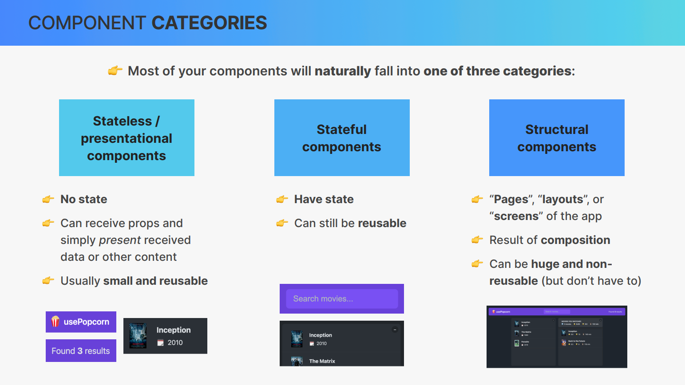

### 🐞 109.3 Issues:

- No technical issues identified in this classification overview.

| Issue | Status | Log/Error |
|---|---|---|
| N/A | ✅ Resolved | Component categories defined and categorized for the project. |

### 🧱 109.4 Pending Fixes (TODO):

- [x] Understand presentational components
- [x] Understand stateful components
- [x] Understand structural components


## 🔧 110. Lesson 110 — *Prop Drilling*

- [110.1 Context](#1101-context)
- [110.2 Updating code according the context](#1102-updating-code-according-the-context)
- [110.3 Issues](#1103-issues)
- [110.4 Pending Fixes (TODO)](#1104-pending-fixes-todo)

### 🧠 110.1 Context:

Prop Drilling is a pattern in React where data (props) are passed through multiple levels of intermediate components that don't need that data, just to reach the component that actually needs it. This pattern is common when state is located in a parent component (like `App.jsx`) and needs to be accessed by deeply nested components in the component tree.

**When does Prop Drilling occur?**
- When state is "lifted up" to a common parent component
- When multiple child components need to access the same state
- When there are several levels of nesting between the component that has the state and the one that needs it

**Example in this project:**
The `movies` state is defined in `App.jsx` and needs to reach:
1. `NumResult.jsx` (through `Navbar.jsx`) - to display the results count
2. `Movie.jsx` (through `Main.jsx` → `ListBox.jsx` → `MovieList.jsx`) - to render each movie

**Advantages of Prop Drilling:**
- ✅ Simple and straightforward for small/medium applications
- ✅ Easy to understand and follow the data flow
- ✅ Doesn't require additional libraries
- ✅ Makes the data flow explicit in the code

**Disadvantages of Prop Drilling:**
- ⚠️ Can become verbose when there are many levels of nesting
- ⚠️ Intermediate components must receive props they don't use directly
- ⚠️ Makes it harder to refactor component structure
- ⚠️ May indicate the need for a more robust state management solution (Context API, Redux, etc.)

**When to consider alternatives:**
- When prop drilling goes through more than 3-4 levels of components
- When multiple components in different branches of the tree need the same state
- When code becomes difficult to maintain due to too many intermediate props

In this lesson, we implement prop drilling to pass `movies` from `App.jsx` to the components that need it, demonstrating how this fundamental React pattern works.


### ⚙️ 110.2 Updating code according the context

#### 5.2.1 Categorizing each Component:
| Stateless | Stateful | Structural |
|---|---|---|
| Logo | ListBox | NavBar|
| NumResults | Search | App|
| MovieList | WatchedBox | Main|
| Movie | -- | -- |
| WatchedSummary | -- | -- |
| WatchedMovieList | -- | -- |
| WatchedMovie | -- | -- |

> Component Tree:

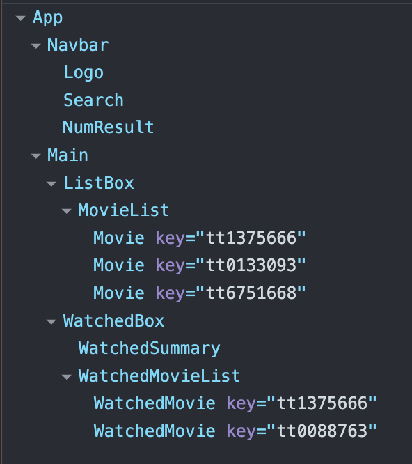

#### 5.2.2 Access to Movie Result dynamically lifting up `movie` prop from `App` to `NumResults`:

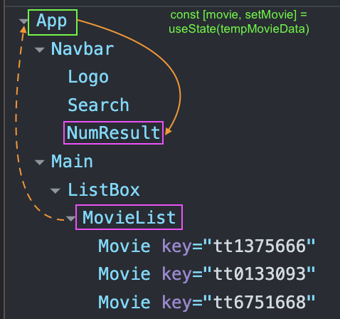


From `App.jsx` to `Navbar.jsx`:
```tsx
/* src/App.jsx */
import { useState } from "react";
import Navbar from "./components/Navbar";
import Main from "./components/Main";

const tempMovieData = [....];
const tempWatchedData = [....];

function App() {
  const [movies, setMovies] = useState(tempMovieData);  // 👈🏽 ✅
  return (
    <>
      <Navbar movies={movies} />  // 👈🏽 ✅
      <Main tempMovieData={tempMovieData} tempWatchedData={tempWatchedData} />
    </>
  );
}
export default App;
```

From `NavBar.jsx` to `NumResults.jsx`:
```tsx
/* src/components/Navbar.jsx */
import Logo from "./Logo";
import Search from "./Search";
import NumResult from "./NumResult";
const Navbar = ({ movies }) => {  // 👈🏽 ✅

  return (
    <nav className="nav-bar">
      <Logo />
      <Search />
      <NumResult movies={movies} />  // 👈🏽 ✅
    </nav>
  );
};

export default Navbar;
```

In `NumResults.jsx`:
```jsx
/* src/components/NumResult.jsx */
const NumResult = ({ movies }) => {  // 👈🏽 ✅
  return (
    <p className="num-results">
      Found <strong>{movies.length}</strong> results  // 👈🏽 ✅
    </p>
  );
};

export default NumResult;
```
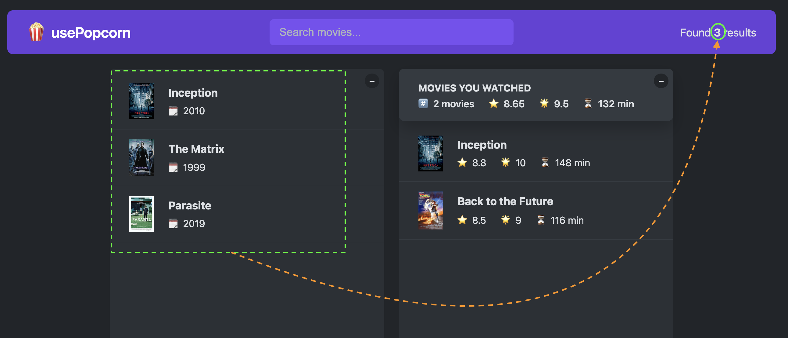


#### 5.2.3 Access to Movie lifting up `movie` prop from `App` to `MovieList`:
From  `App.jsx` to `Main`:
```jsx
/* src/App.jsx */
import { useState } from "react";
import Navbar from "./components/Navbar";
import Main from "./components/Main";

const tempMovieData = [....];
const tempWatchedData = [....];

function App() {
  const [movies, setMovies] = useState(tempMovieData);  // 👈🏽 ✅
  return (
    <>
      <Navbar movies={movies} />
      <Main movies={movies} tempWatchedData={tempWatchedData} />  // 👈🏽 ✅
    </>
  );
}
export default App;
```

From `Main.jsx` to `ListBox.jsx`:
```jsx
/* src/components/Main.jsx */
import ListBox from "./ListBox";
import WatchedBox from "./WatchedBox";

const Main = ({ movies, tempWatchedData }) => {  // 👈🏽 ✅
  return (
    <main className="main">
      <ListBox movies={movies} />  // 👈🏽 ✅
      <WatchedBox tempWatchedData={tempWatchedData} />
    </main>
  );
};

export default Main;
```


From `ListBox.jsx` from `MovieList.jsx`:
```jsx
/* src/components/ListBox.jsx */
import { useState } from "react";
import MovieList from "./MovieList";
const ListBox = ({ movies }) => {  // 👈🏽 ✅
  const [isOpen, setIsOpen] = useState(true);

  return (
    <div className="box">
      <button className="btn-toggle" onClick={() => setIsOpen((open) => !open)}>
        {isOpen ? "–" : "+"}
      </button>
      {isOpen && <MovieList movies={movies} />}  // 👈🏽 ✅
    </div>
  );
};

export default ListBox;
```


From `MovieList.jsx` to `Movie.jsx`:
```jsx
/* src/components/MovieList.jsx */
import Movie from "./Movie";

const MovieList = ({ movies }) => {
  return (
    <ul className="list">
      {movies?.map((movie) => (
        <Movie movie={movie} key={movie.imdbID} />
      ))}
    </ul>
  );
};

export default MovieList;
```

In `Movie.jsx`
```jsx
/* src/components/Movie.jsx */
const Movie = ({ movie }) => {
  return (
    <li>
      
      <h3>{movie.Title}</h3>
      <div>
        <p>
          <span>🗓</span>
          <span>{movie.Year}</span>
        </p>
      </div>
    </li>
  );
};

export default Movie;
```


### 🐞 110.3 Issues:

- **Intermediate Coupling**: Components like `Navbar` and `Main` are forced to receive props (`movies`) just to pass them deeper, making them less reusable.
- **Refactoring difficulty**: Changing the structure of the component tree requires updating many intermediate components.

| Issue | Status | Log/Error |
|---|---|---|
| Deep Nesting | ✅ Resolved | Prop drilling implemented successfully (from `App` down to `Movie`). |

### 🧱 110.4 Pending Fixes (TODO):

- [ ] Resolving excessive prop drilling for `movies` (App → Navbar → NumResult and App → Main → ListBox → MovieList → Movie)
- [ ] Refactor intermediate components (`Navbar.jsx`, `Main.jsx`) to avoid receiving unused props
- [ ] Standardize prop names (e.g., remove `temp` prefix from `tempWatchedData`)
- [ ] Verify `ListBox.jsx` doesn't have duplicate local state for `movies`
- [ ] Fix incorrect import in `WatchedBox.jsx` (should be `import WatchedMovieList from "./WatchedMovieList"`)
- [ ] Remove uncleaned commented code in `WatchedBox.jsx`
- [ ] Implement prop drilling for movie search and results
- [ ] Verify component hierarchy as per visual tree
- [ ] Fix import in `WatchedBox.jsx`: Change `WatchedList` to `WatchedMovieList` to match the exported component name
- [ ] Standardize prop names: Change `tempWatchedData` to `watched` or `watchedMovies` to maintain consistency with `movies` in other components
- [ ] Verify and remove duplicate state: Ensure that `ListBox.jsx` doesn't have local `movies` state that conflicts with the received prop
- [ ] Clean up commented code: Remove all commented lines in `WatchedBox.jsx` (lines 7, 10-14, 22-42, 45-66) to keep the code clean and maintainable
- [ ] Consider Context API for `movies`: If prop drilling becomes more complex, evaluate using React Context API to share the `movies` state without passing through intermediate components
- [ ] Document prop flow: Create a diagram or documentation that clearly shows how the `movies` prop flows from `App.jsx` to the final components
- [ ] Add prop validation: Consider using PropTypes or TypeScript to validate that `movies` props are valid arrays in each component that receives them
- [ ] Optimize re-renders: Review if intermediate components like `Navbar` and `Main` are re-rendering unnecessarily when `movies` changes, and consider using `React.memo` if necessary


## 🔧 111. Lesson 111 — *Component Composition*

- [Lecture 111: Component Composition](#-111-lesson-111--component-composition)
- [111.1 Context](#1111-context)
- [111.2 Updating code according the context](#1112-updating-code-according-the-context)
- [111.3 Issues](#1113-issues)
- [111.4 Pending Fixes (TODO)](#1114-pending-fixes-todo)

### 🧠 111.1 Context:

Component Composition is a powerful React pattern that allows building complex UIs by combining smaller, reusable components. Instead of creating monolithic components with many props, composition enables flexible and maintainable component architectures by using the `children` prop and other composition techniques.

**What is Component Composition?**

Component Composition is the practice of building complex components by combining simpler, reusable components. The key concept is that components can accept other components (or JSX) as props, most commonly through the special `children` prop, allowing parent components to control what content is rendered inside child components.

**When does Component Composition occur?**

- When you need to create reusable container components that can wrap different content
- When multiple components share similar structure but different content
- When you want to avoid prop drilling by passing JSX directly instead of data
- When building flexible, configurable components that can adapt to different use cases
- When creating layout components that need to accept dynamic content

**Examples in this project:**

1. **Current structure without composition**: `ListBox.jsx` and `WatchedBox.jsx` both have identical structure (a collapsible box with toggle button), but they're separate components with duplicated code:
   - Both have `<div className="box">`
   - Both have `<button className="btn-toggle">` with state management
   - Both conditionally render content based on `isOpen` state

2. **Potential composition pattern**: A generic `Box` component could be created that accepts `children` as a prop, eliminating duplication:
   ```jsx
   <Box>
     <MovieList movies={movies} />
   </Box>
   ```

3. **Structural composition**: `Navbar.jsx` and `Main.jsx` are already using composition by combining multiple child components (`Logo`, `Search`, `NumResult` in Navbar; `ListBox` and `WatchedBox` in Main).

**Advantages of Component Composition:**

- ✅ **Reduces code duplication**: Shared UI patterns can be extracted into reusable components
- ✅ **Increases flexibility**: Components become more adaptable to different use cases
- ✅ **Improves maintainability**: Changes to shared structure only need to be made in one place
- ✅ **Better separation of concerns**: Container components handle structure, child components handle content
- ✅ **More reusable**: Generic components can be used in multiple contexts
- ✅ **Easier to test**: Smaller, focused components are simpler to test individually

**Disadvantages of Component Composition:**

- ⚠️ **Can add abstraction layers**: Too many wrapper components can make code harder to follow
- ⚠️ **May require more component files**: Creating generic components increases the number of files
- ⚠️ **Potential over-engineering**: Not every similar structure needs a shared component
- ⚠️ **Learning curve**: Developers need to understand composition patterns to work effectively

**When to consider alternatives:**

- When components are truly unique and won't benefit from sharing structure
- When the abstraction would make the code less readable rather than more maintainable
- When the duplication is minimal and the components are unlikely to change together
- When performance is critical and additional component layers would impact rendering

**Connection to this lesson's practical implementation:**

In this lesson, we identify that `ListBox.jsx` and `WatchedBox.jsx` share the same collapsible box pattern. By applying Component Composition, we can create a generic `Box` component that handles the toggle functionality and structure, while accepting different content through the `children` prop. This demonstrates how composition can eliminate duplication and create more maintainable code.

### ⚙️ 111.2 Updating code according the context

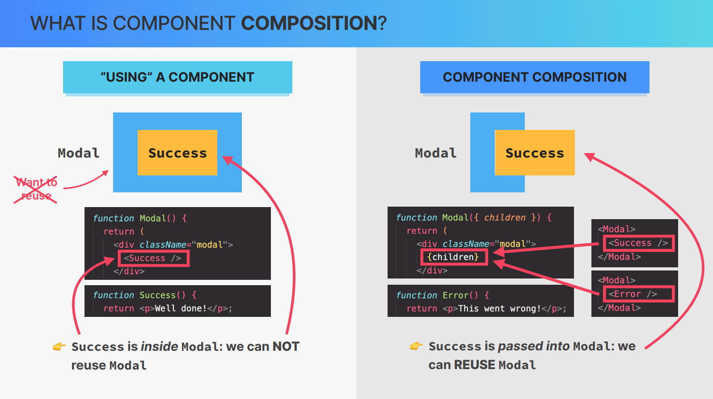
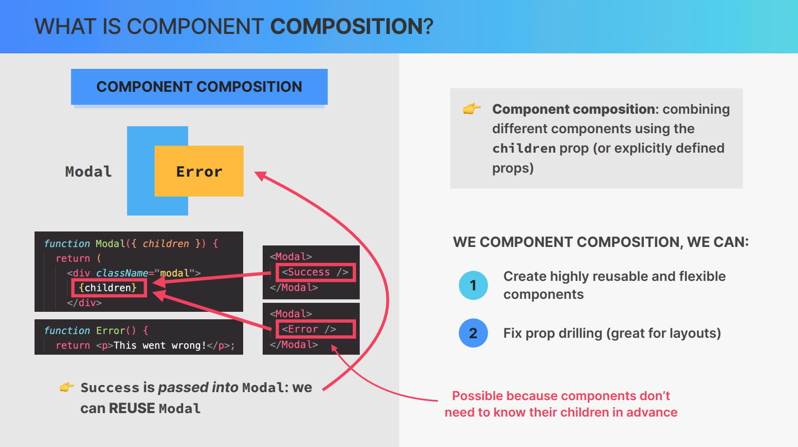

### 🐞 111.3 Issues:

| Issue | Status | Log/Error |
|---|---|---|
| **Code duplication between ListBox and WatchedBox** | ⚠️ Identified | Both `ListBox.jsx` (lines 7-13) and `WatchedBox.jsx` (lines 16-20) have identical structure: `<div className="box">`, toggle button with `isOpen` state, and conditional rendering. This violates DRY principle and makes maintenance harder |
| **Missing generic Box component** | ⚠️ Identified | No reusable `Box` component exists to handle the collapsible box pattern. The toggle functionality and structure are duplicated across multiple components |
| **Incorrect import name in WatchedBox.jsx** | ⚠️ Identified | Line 3: `import WatchedList from "./WatchedMovieList";` should be `import WatchedMovieList from "./WatchedMovieList";` - Component name doesn't match the actual export, causing potential runtime errors |
| **Commented code in WatchedBox.jsx** | ⚠️ Identified | Lines 7, 10-14, 22-42, and 45-66 contain commented-out code that should be removed for code cleanliness and maintainability |
| **Commented code in WatchedMovieList.jsx** | ⚠️ Identified | Lines 6-23 contain commented-out code that duplicates the `WatchedMovie` component implementation, should be cleaned up |
| **State management duplication** | ⚠️ Identified | Both `ListBox.jsx` and `WatchedBox.jsx` manage identical `isOpen` state independently. This could be abstracted into a reusable hook or component |
| **Inconsistent prop naming** | ⚠️ Identified | `WatchedBox.jsx` receives `tempWatchedData` while `ListBox.jsx` receives `movies`. Should standardize prop naming conventions (remove `temp` prefix) |
| **Missing composition pattern** | ⚠️ Identified | Components don't leverage the `children` prop pattern for flexible content composition, missing an opportunity to create more reusable and flexible components |

### 🧱 111.4 Pending Fixes (TODO)
- [ ] Fix import naming in `WatchedBox.jsx`: Change `WatchedList` to `WatchedMovieList` on line 3 to match the actual component export
- [ ] Create generic `Box` component: Extract the collapsible box pattern from `ListBox.jsx` and `WatchedBox.jsx` into a reusable `Box.jsx` component that accepts `children` prop
- [ ] Refactor `ListBox.jsx` to use composition: Replace the box structure with `<Box><MovieList movies={movies} /></Box>` pattern
- [ ] Refactor `WatchedBox.jsx` to use composition: Replace the box structure with `<Box><WatchedSummary /> <WatchedMovieList /></Box>` pattern
- [ ] Extract toggle state logic: Consider creating a custom hook `useToggle` to manage `isOpen` state if it will be reused elsewhere
- [ ] Clean up commented code: Remove all commented-out code blocks from `WatchedBox.jsx` (lines 7, 10-14, 22-42, 45-66) and `WatchedMovieList.jsx` (lines 6-23)
- [ ] Standardize prop naming: Rename `tempWatchedData` to `watched` or `watchedMovies` throughout the codebase for consistency
- [ ] Update component documentation: Document the new `Box` component and its usage pattern in component hierarchy documentation
- [ ] Test composition pattern: Verify that the refactored components maintain the same functionality and behavior after applying composition
- [ ] Consider additional composition opportunities: Review other components (`Navbar`, `Main`) for potential composition improvements using `children` prop


## 🔧 112. Lesson 112 — *Fixing Prop Drilling With Composition (And Building a Layout)*

- [Lecture 112: Fixing Prop Drilling With Composition (And Building a Layout)](#-112-lesson-112--fixing-prop-drilling-with-composition-and-building-a-layout)
- [112.1 Context](#1121-context)
- [112.2 Updating code according the context](#1122-updating-code-according-the-context)
- [112.3 Issues](#1123-issues)
- [112.4 Pending Fixes (TODO)](#1124-pending-fixes-todo)

### 🧠 112.1 Context:

**Component Composition** is a powerful React pattern that allows you to build complex UIs by combining smaller, reusable components. Instead of passing data through multiple component levels (prop drilling), composition uses the `children` prop to inject content directly into parent components, creating more flexible and maintainable component hierarchies.

**What is Composition?**
Composition is the practice of building complex components by combining simpler ones. In React, this is achieved primarily through the `children` prop, which allows parent components to accept and render arbitrary content passed from their parent. This pattern enables components to act as "containers" or "layouts" that define structure while allowing content to be determined by the component's usage context.

**How Composition Solves Prop Drilling:**
In Lesson 110, we saw prop drilling where `movies` was passed through multiple levels:
- `App` → `Navbar` → `NumResult` (3 levels)
- `App` → `Main` → `ListBox` → `MovieList` → `Movie` (5 levels)

With composition, we eliminate intermediate prop passing:
- `Navbar` becomes a structural component that accepts `children`, removing the need to pass `movies` through it
- `Main` and `ListBox` similarly become layout components that don't need to know about the data they contain
- Data flows directly from `App` to the components that need it, bypassing intermediate components

**When Composition is Used:**
- When you have structural/layout components that don't need the data they contain
- When you want to create flexible, reusable container components
- When you want to reduce coupling between parent and child components
- When building layout components (Navbar, Main, Sidebar, Modal, etc.)
- When you want to avoid prop drilling through intermediate components

**Examples from this Project:**
1. **Navbar Component**: Transformed from receiving `movies` prop to accepting `children`, allowing `Search` and `NumResult` to be composed directly in `App.jsx`
2. **Main Component**: Changed from receiving `movies` to accepting `children`, enabling flexible composition of `ListBox` and `WatchedBox`
3. **ListBox Component**: Refactored to accept `children` instead of `movies`, making it a reusable container for any content

**Advantages of Composition:**
- ✅ **Eliminates prop drilling**: Data doesn't need to pass through components that don't use it
- ✅ **Increases flexibility**: Components can be reused with different content
- ✅ **Reduces coupling**: Parent components don't need to know about child component internals
- ✅ **Improves maintainability**: Changes to data structure don't affect intermediate components
- ✅ **Better separation of concerns**: Structural components focus on layout, not data management
- ✅ **More reusable**: Container components can be used in different contexts with different content

**Disadvantages of Composition:**
- ⚠️ **Can be less explicit**: Data flow might be less obvious when using `children`
- ⚠️ **Requires understanding**: Developers need to understand the composition pattern
- ⚠️ **Not always appropriate**: Some components legitimately need props to function
- ⚠️ **May require refactoring**: Existing prop-based components need to be refactored

**When to Consider Alternatives:**
- When components genuinely need the data they're passing through (not just forwarding)
- When using Context API would be more appropriate for deeply nested, widely-used state
- When the composition pattern makes the code less readable or more complex
- When you need to pass multiple unrelated props through many levels (consider Context API or state management)

**Building Layouts with Composition:**
This lesson also demonstrates how composition enables building flexible layout components. Components like `Navbar`, `Main`, and `ListBox` become layout structures that can be reused across different parts of an application with different content, following the principle of "structure vs. content" separation.


### ⚙️ 112.2 Updating code according the context:

#### 7.2.1 Working on the path from `App.jsx`  through `NavBar.jsx` to `NumResults.jsx`:
```tsx
/* src/components/Navbar.jsx */
//import Search from "./Search";
//import NumResult from "./NumResult";
import Logo from "./Logo";
const Navbar = ({ children }) => {
  return (
    <nav className="nav-bar">
      <Logo />
      {/*
        <Search />
        <NumResult movies={movies} />
      */}
      {children}. // 👈🏽 ✅
    </nav>
  );
};

export default Navbar;
```

And now in `App.jsx`:
```tsx
/* src/App.jsx */
import { useState } from "react";
import Navbar from "./components/Navbar";
import Main from "./components/Main";
import Search from "./components/Search";         // 👈🏽 ✅
import NumResult from "./components/NumResult";   // 👈🏽 ✅
const tempMovieData = [...];
const tempWatchedData = [...];
function App() {
  const [movies, setMovies] = useState(tempMovieData);
  return (
    <>
      <Navbar>                          // 👈🏽 ✅ no prop here!
        <Search />                      // 👈🏽 ✅
        <NumResult movies={movies} />   // 👈🏽 ✅
      </Navbar>
      <Main movies={movies} tempWatchedData={tempWatchedData} />
    </>
  );
}
export default App;
```


> Main Reasons:
1. `Separation of concerns and coupling`:
- `Logo`: presentational, no state or parent props needed. It’s part of Navbar’s visual structure.
- `Search` and `NumResult`: need access to `movies` state in `App`. If inside `Navbar`, `movies` would need to be passed through `Navbar`, increasing coupling. (Prop Drilling)

2. `Lifting state up`
- `movies` lives in `App` because it’s used in multiple places (NumResult, Main).
- `Search` likely updates `movies` (e.g., search results). Being in `App` lets it modify state directly without prop drilling.

3. `Composition with children`
- Navbar uses children, allowing content to be passed from the parent.
- Benefits:
  - `Navbar` is more flexible and reusable.
  - Content can vary by context.
  - `Logo` stays fixed in `Navbar` (base structure), while `Search` and `NumResult` are injected from outside.

4. `Data flow`
    ```
    App (has movies state)
      ├── Navbar (visual structure)
      │   ├── Logo (presentational, no dependencies)
      │   └── children (Search + NumResult that need movies)
      └── Main (also needs movies)
    ```
If Search were inside Navbar:
- `Navbar` would need `movies` and `setMovies`.
- `Navbar` would be coupled to `search` logic.
- Less flexible and harder to maintain.

5. `Single responsibility principle`
- `Navbar`: structure and layout of the navbar.
- `App`: state management and component coordination.
- `Search`: search logic (better placed near the state it manages).


#### 7.2.2 Working on the path from `App.jsx` through `Main.jsx` and `ListBox.jsx` to `MovieList.jsx`:
```tsx
/* src/components/ListBox.jsx */
import { useState } from "react";
//import MovieList from "./MovieList";
const ListBox = ({ children }) => {  // 👈🏽 ✅
  const [isOpen, setIsOpen] = useState(true);
  return (
    <div className="box">
      <button className="btn-toggle" onClick={() => setIsOpen((open) => !open)}>
        {isOpen ? "–" : "+"}
      </button>
      {/* isOpen && <MovieList movies={movies} /> */}
      {isOpen && children}  // 👈🏽 ✅
    </div>
  );
};
export default ListBox;
```

```tsx
/* src/components/Main.jsx */
//import WatchedBox from "./WatchedBox";
//import ListBox from "./ListBox";
const Main = ({ children }) => {  // 👈🏽 ✅
  return (
    <main className="main">
      {/* <ListBox movies={movies} /> */}
      {children}  // 👈🏽 ✅
    </main>
  );
};

export default Main;
```

```jsx
/* src/App.jsx */
import { useState } from "react";
import Navbar from "./components/Navbar";
import Main from "./components/Main";
import Search from "./components/Search";
import NumResult from "./components/NumResult";
import ListBox from "./components/ListBox";                 // 👈🏽 ✅
import MovieList from "./components/MovieList";             // 👈🏽 ✅
import WatchedBox from "./components/WatchedBox";           // 👈🏽 ✅
const tempMovieData = [....];
const tempWatchedData = [....];
function App() {
  const [movies, setMovies] = useState(tempMovieData);
  return (
    <>
      <Navbar>
        <Search />
        <NumResult movies={movies} />
      </Navbar>
      <Main>                                                // 👈🏽 ✅
        <ListBox>                                           // 👈🏽 ✅
          <MovieList movies={movies} />                     // 👈🏽 ✅
        </ListBox>                                          
      </Main>                                               
        <WatchedBox tempWatchedData={tempWatchedData} />    // 👈🏽 ✅
      </Main>
    </>
  );
}
export default App;
```### 🐞 112.3 Issues:

- **Intermediate structural coupling**: `Navbar` and `Main` were acting as data-passers, which violates the principle of separation of concerns between structure and data.
- **Manual children handling**: Initial implementation required explicit child rendering, which was refactored to use the idiomatic `{children}` pattern.

| Issue | Status | Log/Error |
|---|---|---|
| Redundant Props | ✅ Resolved | `Navbar` and `Main` no longer receive `movies` or other data props; they now use `children`. |

### 🧱 112.4 Pending Fixes (TODO):

- [ ] Fix documentation syntax error: Remove trailing dot from `{children}.` example in section 7.2.1
- [ ] Refactor `WatchedBox` to use composition pattern (accept `children` instead of `tempWatchedData`)
- [ ] Update `App.jsx` to compose `WatchedSummary` and `WatchedMovieList` as children of `WatchedBox`
- [ ] Rename `tempWatchedData` prop to `watched` or `watchedMovies` for consistency
- [ ] Implement search functionality (connect `Search.jsx` to `movies` state in `App.jsx`)
- [ ] Ensure all structural components (`Navbar`, `Main`, `ListBox`, `WatchedBox`) follow the same composition pattern
- [ ] Add comments explaining the composition pattern usage in refactored components
- [ ] Verify `WatchedBox` is properly composed in the application

## 🔧 113. Lesson 113 — *Using Composition to Make a Reusable Box*

- [Lecture 113: Using Composition to Make a Reusable Box](#-113-lesson-113--using-composition-to-make-a-reusable-box)
- [113.1 Context](#1131-context)
- [113.2 Updating code according the context](#1132-updating-code-according-the-context)
- [113.3 Issues](#1133-issues)
- [113.4 Pending Fixes (TODO)](#1134-pending-fixes-todo)

### 🧠 113.1 Context:

This lesson demonstrates the practical application of Component Composition to eliminate code duplication by creating a reusable `Box` component. After identifying that `ListBox.jsx` and `WatchedBox.jsx` share identical structural patterns (collapsible box with toggle functionality), we extract the common logic into a generic `Box` component that can be reused across the application.

**What is Code Duplication and Why Eliminate It?**

Code duplication occurs when the same or very similar code appears in multiple places. In this case, both `ListBox.jsx` and `WatchedBox.jsx` implemented the same collapsible box pattern:
- Both manage `isOpen` state using `useState`
- Both render a `<div className="box">` container
- Both have a toggle button with identical behavior
- Both conditionally render content based on `isOpen` state

**When Does This Pattern Occur?**

- When multiple components share the same UI structure and behavior
- When refactoring reveals repeated patterns across components
- When you want to create reusable, generic components
- When following the DRY (Don't Repeat Yourself) principle

**Examples from this Project:**

1. **Before refactoring**: `ListBox.jsx` and `WatchedBox.jsx` both contained duplicate code for the collapsible box pattern
2. **After refactoring**: A single `Box.jsx` component handles all collapsible box functionality, accepting any content through the `children` prop

**Advantages of Creating a Reusable Box Component:**

- ✅ **Eliminates duplication**: Single source of truth for the collapsible box pattern
- ✅ **Easier maintenance**: Changes to the box behavior only need to be made in one place
- ✅ **Increased reusability**: The `Box` component can be used anywhere a collapsible container is needed
- ✅ **Better separation of concerns**: `Box` handles structure/behavior, child components handle content
- ✅ **More flexible**: Can wrap any content, not just specific movie-related components
- ✅ **Consistent behavior**: All collapsible boxes behave identically across the application

**Disadvantages:**

- ⚠️ **Potential over-abstraction**: If the components were truly different, abstraction might not be beneficial
- ⚠️ **Requires refactoring**: Existing components need to be updated to use the new pattern
- ⚠️ **Learning curve**: Developers need to understand the composition pattern to use it effectively

**When to Consider Alternatives:**

- When components share structure but have significantly different behaviors
- When the abstraction would make the code less readable
- When the duplication is minimal and unlikely to change
- When performance considerations require component-specific optimizations

**Connection to this Lesson's Practical Implementation:**

In this lesson, we identify the duplication between `ListBox` and `WatchedBox`, create a generic `Box` component using the `children` prop pattern, and refactor `App.jsx` to use `Box` for both movie list and watched movies sections. This demonstrates how composition can eliminate duplication while maintaining flexibility and improving code maintainability.

### ⚙️ 113.2 Updating code according the context:
Make an assessment into `WatchBox.jsx` and `ListBox.jsx`

#### 8.2.1 Check it out how similar `WatchBox.jsx` and `ListBox.jsx` components are.
```tsx
/* src/components/WatchedBox.jsx */
import { useState } from "react";
import WatchedSummary from "./WatchedSummary";
import WatchedMovieList from "./WatchedMovieList";

const WatchedBox = ({ tempWatchedData }) => {
  const [isOpen, setisOpen] = useState(true);
  const [watched, setWatched] = useState(tempWatchedData);

  return (
    <div className="box">
      <button className="btn-toggle" onClick={() => setisOpen((open) => !open)}>
        {isOpen ? "–" : "+"}
      </button>
      {isOpen && (
        <>
          <WatchedSummary watched={watched} />
          <WatchedMovieList watched={watched} />
        </>
      )}
    </div>
  );
};

export default WatchedBox;
```

and

```tsx
/* src/components/ListBox.jsx */
import { useState } from "react";

const ListBox = ({ children }) => {
  const [isOpen, setIsOpen] = useState(true);

  return (
    <div className="box">
      <button className="btn-toggle" onClick={() => setIsOpen((open) => !open)}>
        {isOpen ? "–" : "+"}
      </button>
      {/* isOpen && <MovieList movies={movies} /> */}
      {isOpen && children}
    </div>
  );
};

export default ListBox;
```

What they Both components have in common:
- Manage local UI state `(isOpen)`
- Render the same UI pattern:
  - A container `(div.box)`
  - A `toggle` button
  - Conditional rendering based on `isOpen`
- Implement the same expand / collapse behavior

From a React point of view, they share the same structural and behavioral logic.
- ✅ Yes, they are very similar
- ⚠️ But `ListBox` is a more abstract, reusable component, while `WatchedBox` is feature-specific

#### 8.2.2 Create a General component named `Box.jsx`:
```tsx
/* src/components/Box.jsx */
import { useState } from "react";

const Box = ({ children }) => {
  const [isOpen, setIsOpen] = useState(true);

  return (
    <div className="box">
      <button className="btn-toggle" onClick={() => setIsOpen((open) => !open)}>
        {isOpen ? "–" : "+"}
      </button>
      {isOpen && children}
    </div>
  );
};

export default Box;
```

#### 8.2.3 Import `Box.jsx` component into `App.jsx`:
```tsx
/* src/App.jsx */
import { useState } from "react";
import Navbar from "./components/Navbar";
import Main from "./components/Main";
import Search from "./components/Search";
import NumResult from "./components/NumResult";

import Box from "./components/Box";  // 👈🏽 ✅
import MovieList from "./components/MovieList";  // 👈🏽 ✅
//import WatchedBox from "./components/WatchedBox";

const tempMovieData = [....];
const tempWatchedData = [....];

function App() {
  const [movies, setMovies] = useState(tempMovieData);

  return (
    <>
      <Navbar>
        <Search />
        <NumResult movies={movies} />
      </Navbar>
      <Main>
        <Box>  // 👈🏽 ✅
          <MovieList movies={movies} />
        </Box>
        {/* <WatchedBox tempWatchedData={tempWatchedData} /> */}
      </Main>
    </>
  );
}

export default App;
```

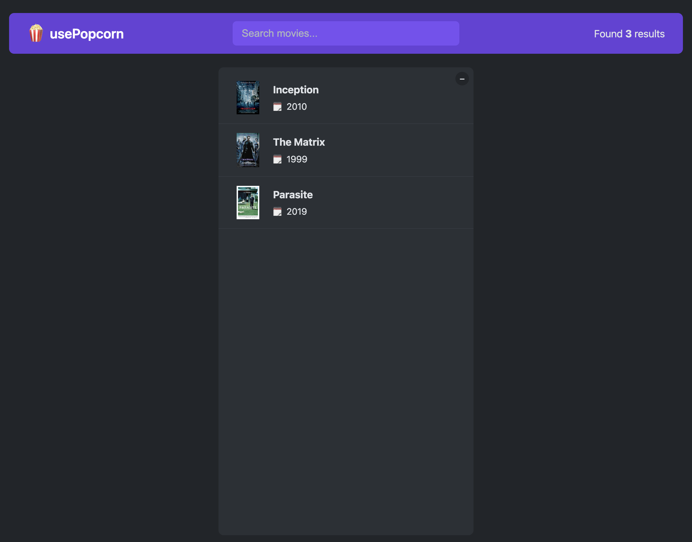

#### 8.2.4 Reuse `Box.jsx` component in order to replace `WatchedBox.jsx`:
```tsx
/* src/App.jsx */
import { useState } from "react";
import Navbar from "./components/Navbar";
import Main from "./components/Main";
import Search from "./components/Search";
import NumResult from "./components/NumResult";

import Box from "./components/Box";
import MovieList from "./components/MovieList";
import WatchedSummary from "./components/WatchedSummary";  // 👈🏽 ✅
import WatchedMovieList from "./components/WatchedMovieList";  // 👈🏽 ✅

const tempMovieData = [....];
const tempWatchedData = [....];

function App() {
  const [movies, setMovies] = useState(tempMovieData);

  return (
    <>
      <Navbar>
        <Search />
        <NumResult movies={movies} />
      </Navbar>
      <Main>
        <Box>
          <MovieList movies={movies} />
        </Box>
        {/* <WatchedBox tempWatchedData={tempWatchedData} /> */}
        <Box>  // 👈🏽 ✅
          <WatchedSummary watched={watched} />  // 👈🏽 ✅
          <WatchedMovieList watched={watched} />  // 👈🏽 ✅
        </Box>
      </Main>
    </>
  );
}

export default App;
```

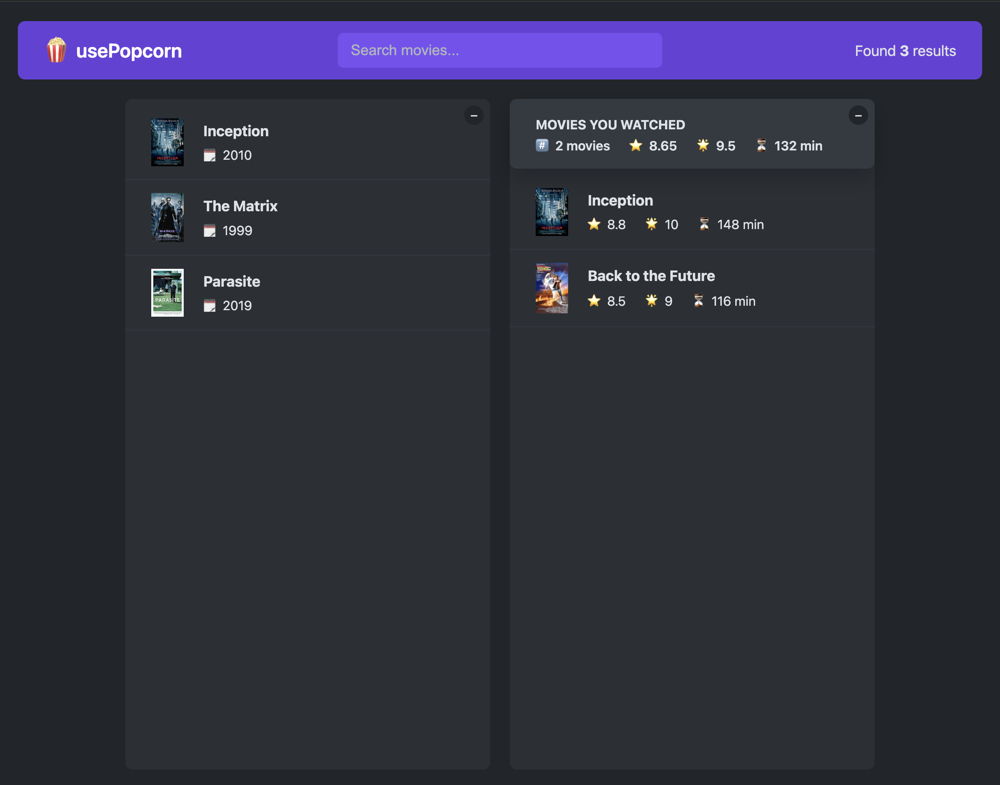

### 🐞 113.3 Issues:

- **Component Redundancy**: Having both `ListBox` and `WatchedBox` created unnecessary code duplication.
- **State duplication**: The toggle logic was repeated in every box-like component.

| Issue | Status | Log/Error |
|---|---|---|
| Code Duplication | ✅ Resolved | Replaced `ListBox` and `WatchedBox` with a single, reusable `Box` component. |

### 🧱 113.4 Pending Fixes (TODO):

- [ ] Remove unused `ListBox.jsx` and `WatchedBox.jsx` components as `Box.jsx` replaces them
- [ ] Clean up commented-out code in `App.jsx`, `Main.jsx`, and `WatchedMovieList.jsx`
- [ ] Update documentation example in section 8.2.4 to include missing `watched` state declaration
- [ ] Standardize variable naming (e.g., rename `tempWatchedData` to `initialWatchedData`)
- [ ] Document that `Box.jsx` is the primary reusable component for collapsible containers
- [ ] Verify all collapsible boxes use the `Box` component
- [ ] Consider adding PropTypes or TypeScript for `children` prop validation in `Box.jsx`
- [ ] Review all component imports to ensure no stale references to `ListBox` or `WatchedBox`


## 🔧 114. Lesson 114 — *Passing Elements as Props (Alternative to children)*

### 🧠 114.1 Context:

**Passing Elements as Props** is an alternative pattern to using the `children` prop in React. Instead of wrapping content between component tags, you can pass JSX elements directly as named props. This lesson explores when and why you might use this pattern, and compares it to the more idiomatic `children` prop approach.

**What is Passing Elements as Props?**

Passing elements as props means accepting JSX elements through named props (like `element`, `header`, `footer`, `content`) instead of using the special `children` prop. For example:

- **With `children`**: `<Box><MovieList movies={movies} /></Box>`
- **With named prop**: `<Box element={<MovieList movies={movies} />} />`

**When does this pattern occur?**

- When you want to be explicit about what content is being passed
- When you need to pass multiple distinct content sections (e.g., `header`, `body`, `footer`)
- When you want to avoid the implicit `children` prop
- When building component APIs that require explicit prop names
- When you need to pass elements conditionally or dynamically

**Examples from this project:**

1. **Box component refactoring**: The `Box.jsx` component was changed from accepting `children` to accepting an `element` prop:
   - Before: `const Box = ({ children }) => { ... }`
   - After: `const Box = ({ element }) => { ... }`

2. **Usage in App.jsx**: Instead of wrapping content, elements are passed as props:
   - `<Box element={<MovieList movies={movies} />} />`
   - `<Box element={<><WatchedSummary /><WatchedMovieList /></>} />`

**Advantages of Passing Elements as Props:**

- ✅ **Explicit and clear**: The prop name makes it obvious what content is being passed
- ✅ **Multiple content sections**: Can accept multiple named props (e.g., `header`, `footer`, `content`)
- ✅ **Type safety**: Easier to validate specific prop types with TypeScript or PropTypes
- ✅ **Flexible naming**: Prop names can be descriptive of their purpose
- ✅ **Conditional passing**: Can conditionally pass elements based on logic

**Disadvantages of Passing Elements as Props:**

- ⚠️ **Less idiomatic**: Not the standard React pattern, which can confuse developers familiar with `children`
- ⚠️ **More verbose**: Requires explicit prop names instead of implicit wrapping
- ⚠️ **Less composable**: Doesn't leverage React's natural composition patterns
- ⚠️ **Less flexible**: Requires knowing prop names upfront, whereas `children` works with any content
- ⚠️ **Not scalable**: Adding more content sections requires adding more props

**When to consider alternatives:**

- **Use `children` when**: Your component wraps content (most common case)
- **Use named props when**: You need multiple distinct content sections with specific purposes
- **Use `children` when**: You want idiomatic React code that other developers will immediately understand
- **Use `children` when**: You want maximum flexibility and composability

**Performance considerations:**

There is **no meaningful performance difference** between using `children` and named props. Both approaches render React elements the same way. The choice is purely about API design and developer experience, not performance.

**Connection to this lesson's practical implementation:**

In this lesson, we demonstrate that while passing elements as props (`element`) is technically possible and works identically to `children`, the `children` prop is the recommended and idiomatic React pattern. The lesson shows both approaches side-by-side to illustrate that `children` is more composable, scalable, and follows React conventions. The final verdict is that `children` should be used when a component "wraps" content, which is the case for the `Box` component.

### ⚙️ 114.2 Updating Code According the Context:

This section demonstrates how to change the `Box` component to accept an `element` prop instead of `children`, and how to apply this change in `App.jsx`.

#### Changing `children` by `element` in order to send a prop.
```tsx
/* src/components/Box.jsx */
import { useState } from "react";

const Box = ({ element }) => {  // 👈🏽 ✅
  const [isOpen, setIsOpen] = useState(true);

  return (
    <div className="box">
      <button className="btn-toggle" onClick={() => setIsOpen((open) => !open)}>
        {isOpen ? "–" : "+"}
      </button>
      {isOpen && element}  // 👈🏽 ✅
    </div>
  );
};

export default Box;
```

#### Applying this element in `App.jsx` component:
```tsx
/* src/App.jsx */
import { useState } from "react";
import Navbar from "./components/Navbar";
import Main from "./components/Main";
import Search from "./components/Search";
import NumResult from "./components/NumResult";

import Box from "./components/Box";
import MovieList from "./components/MovieList";
import WatchedSummary from "./components/WatchedSummary";
import WatchedMovieList from "./components/WatchedMovieList";

const tempMovieData = [....];
const tempWatchedData = [....];

function App() {
  const [movies, setMovies] = useState(tempMovieData);
  const [watched, setWatched] = useState(tempWatchedData);
  return (
    <>
      <Navbar>
        <Search />
        <NumResult movies={movies} />
      </Navbar>
      <Main>
        <Box element={<MovieList movies={movies} />} />  // 👈🏽 ✅
        {/* <Box>
          <MovieList movies={movies} />
        </Box> */}
        {/* <WatchedBox tempWatchedData={tempWatchedData} /> */}
        <Box
          element={  // 👈🏽 ✅
            <>
              <WatchedSummary watched={watched} />
              <WatchedMovieList watched={watched} />
            </>
          }
        />
        {/* <Box>
          <WatchedSummary watched={watched} />
          <WatchedMovieList watched={watched} />
        </Box> */}
      </Main>
    </>
  );
}

export default App;
```

> Performance & behavior
* No meaningful performance difference.
* Both render React elements the same way.

This is about API design, not speed.

✅ *Final verdict*

> There is no technical difference in rendering, but there is a big difference in design and intent.
* `element` → explicit, less idiomatic, more rigid
* `children` → idiomatic React, composable, scalable


💡 Rule of thumb

If your component “wraps” content → use `children`

👉 `children` is the correct and recommended choice.

### 🐞 114.3 Issues:

- **API Rigidity**: Using named props for single elements is less flexible than `children`.
- **Developer Confusion**: Mixing `children` and named elements can lead to inconsistent component APIs.

| Issue | Status | Log/Error |
|---|---|---|
| Non-idiomatic API | ℹ️ Discussion | `element` prop works but is less standard than `children` for simple wrappers. |

### 🧱 114.4 Pending Fixes (TODO):

- [ ] Refactor `Box.jsx` to use `children` prop (current `element` prop is non-idiomatic)
- [ ] Update `App.jsx` to use standard `children` pattern instead of named `element` prop
- [ ] Clean up commented-out code in `App.jsx` regarding `children` usage
- [ ] Standardize composition patterns across all wrapper components (`Box`, `Navbar`, `Main`)
- [ ] Add documentation explaining the preference for `children` over named props for wrappers
- [ ] Consider using multiple named props ONLY if the component needs distinct header/footer sections
- [ ] Review all components for idiomatic React patterns


## 🔧 115. Lesson 115 — *Building a Reusable Star Rating Component*

- [Lecture 115: Building a Reusable Star Rating Component](#-115-lesson-115--building-a-reusable-star-rating-component)
- [115.1 Context](#1151-context)
- [115.2 Updating code according the context](#1152-updating-code-according-the-context)
- [115.3 Issues](#1153-issues)
- [115.4 Pending Fixes (TODO)](#1154-pending-fixes-todo)

### 🧠 115.1 Context:

**Reusable Components** are React components designed to be used in multiple places throughout an application with different configurations. They encapsulate common UI patterns and behaviors, making code more maintainable and consistent.

**StarRating Component** is a perfect example of a reusable component. It displays a visual rating system using stars, which can be configured with different maximum ratings (e.g., 5 stars, 10 stars) and reused across different parts of the application.

**When it occurs/is used:**
- When you need the same UI pattern in multiple places (e.g., rating movies, products, reviews)
- When you want to maintain consistency across the application
- When you need to reduce code duplication
- When building a design system or component library

**Examples from the project:**
- The `StarRating` component in `src/StarRating.jsx` accepts a `maxRating` prop to control how many stars are displayed
- It's currently used in `src/main.jsx` with different configurations: `<StarRating maxRating={5} />` and `<StarRating maxRating={10} />`
- The component uses `Array.from()` to dynamically generate stars based on the `maxRating` prop

**Advantages:**
- **DRY Principle**: Write once, use many times
- **Consistency**: Ensures the same look and behavior across the app
- **Maintainability**: Changes in one place affect all usages
- **Testability**: Easier to test a single component in isolation
- **Flexibility**: Props allow customization without code duplication
- **Reusability**: Can be shared across projects or teams

**Disadvantages:**
- **Over-engineering risk**: Creating reusable components for one-time use adds unnecessary complexity
- **Prop complexity**: Too many props can make components hard to use
- **Performance**: May need optimization for high-frequency updates
- **Abstraction overhead**: Sometimes a simple inline solution is clearer

**When to consider alternatives:**
- If the component is only used once, consider keeping it inline
- If props become too complex, consider composition patterns or multiple specialized components
- If performance is critical, consider memoization or more specific implementations
- If the component needs very different behaviors in different contexts, consider creating variants or separate components

**Connection to practical implementation:**
The `StarRating` component demonstrates the foundation of reusable components by accepting props (`maxRating`) to customize its behavior. This pattern will be extended in future lessons to add interactivity (clicking stars), state management (storing selected rating), and integration with the movie rating system.


### ⚙️ 115.2 Updating code according the context:

#### 10.2.1 Create `StarRating` component and comment other components.
```tsx
/* src/StarRating.jsx */
const StarRating = () => {
  return (
    <div>
      <div>
        {Array.from({ length: 5 }, (_, i) => (
          <span>S{i + 1}</span>
        ))}
      </div>
      <p>10</p>
    </div>
  );
};

export default StarRating;
```

#### 10.2.2 Add some simple style to `StarRating` component:
```tsx
/*  */
const containerStyle = {                          // 👈🏽 ✅
  display: "flex",
  alignItems: "center",
  gap: "16px",
};

const starContainerStyle = {                      // 👈🏽 ✅
  display: "flex",
  gap: "4px",
};

const textStyle = {                              // 👈🏽 ✅
  lineHeight: "1",
  gap: "0",
};

const StarRating = () => {
  return (
    <div style={containerStyle}>                {/* 👈🏽 ✅ */}
      <div style={starContainerStyle}>          {/* 👈🏽 ✅ */}
        {Array.from({ length: 5 }, (_, i) => (
          <span>S{i + 1}</span>
        ))}
      </div>
      <p style={textStyle}>10</p>               {/* 👈🏽 ✅ */}
    </div>
  );
};

export default StarRating;
```

#### 10.2.3 Adding the `maxrating` as prop:
```tsx
/* src/main.jsx */
import { StrictMode } from "react";
import { createRoot } from "react-dom/client";
// import './index.css'
// import App from './App.jsx'
import StarRating from "./StarRating.jsx";

createRoot(document.getElementById("root")).render(
  <StrictMode>
    {/* <App /> */}
    <StarRating maxRating={5} />    {/* 👈🏽 ✅ */}
    <StarRating maxRating={10} />   {/* 👈🏽 ✅ */}
  </StrictMode>
);
```


```jsx
/* src/StarRating.jsx */
const containerStyle = {
  display: "flex",
  alignItems: "center",
  gap: "16px",
};

const starContainerStyle = {
  display: "flex",
  gap: "4px",
};

const textStyle = {
  lineHeight: "1",
  gap: "0",
};

const StarRating = ({ maxRating = 3 }) => {                 {/* 👈🏽 ✅ */} 
  return (
    <div style={containerStyle}>
      <div style={starContainerStyle}>
        {Array.from({ length: maxRating }, (_, i) => (   // 👈🏽 ✅ 
          <span>S{i + 1}</span>
        ))}
      </div>
      <p style={textStyle}>10</p>
    </div>
  );
};

export default StarRating;
```

Notes:
* setting _by default_ `3 stars` when `main.jsx` has that: `<StarRating />`### 🐞 115.3 Issues:

- **Hardcoded values**: Initial implementation of `StarRating` had hardcoded text and ratings.
- **Missing Interactivity**: The stars were initially non-interactive placeholders.

| Issue | Status | Log/Error |
|---|---|---|
| Static implementation | ✅ Resolved | Added `maxRating` prop and started building the dynamic structure. |

### 🧱 115.4 Pending Fixes (TODO):

- [ ] Replace hardcoded "10" in `StarRating.jsx` with a dynamic `rating` prop
- [ ] Replace placeholder "S1", "S2" text with proper star emojis (⭐) or SVG icons
- [ ] Ensure `maxRating` has a sensible default value (e.g., `5`)
- [ ] Implement interactive state management for clicking stars (using `useState`)
- [ ] Add accessibility features: `aria-label`, `role="radiogroup"`, `tabIndex`, and keyboard handlers
- [ ] Implement prop validation using PropTypes or TypeScript
- [ ] Add visual feedback for rated vs. unrated stars
- [ ] Ensure `rating` prop is bounded by `maxRating`
- [ ] Add JSDoc documentation for component props and behavior

## 🔧 116. Lesson 116 — *Creating the Stars*

- [Lecture 116: Creating the Stars](#-116-lesson-116--creating-the-stars)
- [116.1 Context](#1161-context)
- [116.2 Updating code according the context](#1162-updating-code-according-the-context)
- [116.3 Issues](#1163-issues)
- [116.4 Pending Fixes (TODO)](#1164-pending-fixes-todo)

### 🧠 116.1 Context:

Creating the Stars component (`Star.jsx`) is a fundamental step in building a reusable and interactive star rating system. This lesson focuses on implementing a single star component that can display both filled and empty states, which will be used as building blocks for the complete rating interface.

**What is the Star Component?**

The `Star` component is a presentational React component that renders a single star icon using SVG. It can display two visual states:
- **Full star**: A filled star icon (used for selected/rated stars)
- **Empty star**: An outlined star icon (used for unselected/unrated stars)

**When is it Used?**

The Star component is used when building rating systems where users need to:
- Rate movies, products, services, or any content
- Display existing ratings visually
- Provide interactive feedback through visual states
- Create accessible rating interfaces

**Examples from the Project:**

In this project, the Star component is used in `StarRating.jsx` to create a rating interface:

```8:30:src/Star.jsx
const Star = ({ onRate, full }) => {
  return (
    <span role="button" style={starStyle} onClick={onRate}>
      {full ? (
        <svg xmlns="http://www.w3.org/2000/svg" viewBox="0 0 20 20" fill="#000" stroke="#000">
          <path d="M9.049 2.927c.3-.921 1.603-.921 1.902 0l1.07 3.292a1 1 0 00.95.69h3.462c.969 0 1.371 1.24.588 1.81l-2.8 2.034a1 1 0 00-.364 1.118l1.07 3.292c.3.921-.755 1.688-1.54 1.118l-2.8-2.034a1 1 0 00-1.175 0l-2.8 2.034c-.784.57-1.838-.197-1.539-1.118l1.07-3.292a1 1 0 00-.364-1.118L2.98 8.72c-.783-.57-.38-1.81.588-1.81h3.461a1 1 0 00.951-.69l1.07-3.292z" />
        </svg>
      ) : (
        <svg xmlns="http://www.w3.org/2000/svg" fill="none" viewBox="0 0 24 24" stroke="#000">
          <path
            strokeLinecap="round"
            strokeLinejoin="round"
            strokeWidth="{2}"
            d="M11.049 2.927c.3-.921 1.603-.921 1.902 0l1.519 4.674a1 1 0 00.95.69h4.915c.969 0 1.371 1.24.588 1.81l-3.976 2.888a1 1 0 00-.363 1.118l1.518 4.674c.3.922-.755 1.688-1.538 1.118l-3.976-2.888a1 1 0 00-1.176 0l-3.976 2.888c-.783.57-1.838-.197-1.538-1.118l1.518-4.674a1 1 0 00-.363-1.118l-3.976-2.888c-.784-.57-.38-1.81.588-1.81h4.914a1 1 0 00.951-.69l1.519-4.674z"
          />
        </svg>
      )}
    </span>
  );
};
```

The component receives two props:
- `onRate`: A callback function that handles click events
- `full`: A boolean that determines which star SVG to render

**Advantages:**

1. **Reusability**: The component can be used multiple times to create a rating system of any size
2. **Separation of Concerns**: Each star is responsible only for its own rendering and click handling
3. **Maintainability**: Changes to star appearance only need to be made in one place
4. **Flexibility**: Easy to extend with additional features (hover states, half-stars, animations)
5. **SVG Benefits**: Scalable vector graphics that look crisp at any size without additional assets

**Disadvantages:**

1. **SVG Complexity**: Inline SVG code can make the component harder to read
2. **Performance**: Multiple SVG elements might impact performance with very large rating systems (though negligible for typical use cases)
3. **Accessibility**: Requires additional work to make fully accessible (ARIA labels, keyboard navigation)
4. **Styling Limitations**: Hardcoded styles make it less flexible for theming

**When to Consider Alternatives:**

- **Icon Libraries**: Consider using icon libraries (React Icons, Font Awesome) if you need many different icons or want to reduce bundle size
- **Emoji Stars**: For simple use cases, emoji stars (⭐) might be sufficient and easier to implement
- **Image Sprites**: For complex animations or many icon variations, image sprites might be more performant
- **CSS-based Stars**: Pure CSS solutions can work but are less flexible for interactive states

**Connection to Practical Implementation:**

In this lesson, the Star component is created as a building block that will be used by `StarRating` to display multiple stars. The component uses conditional rendering (`full ? ... : ...`) to switch between filled and empty star SVGs, and accepts an `onRate` callback to handle user interactions. This pattern demonstrates the React principle of creating small, focused components that compose together to build more complex UIs.


### ⚙️ 116.2 Updating code according the context:

#### 11.2.1 Create `Star` component:
```tsx
/* src/Star.jsx */
const starStyle = {
  width: "48px",
  height: "48px",
  display: "block",
  cursor: "pointer",
};

const Star = () => {
  return (
    <span role="button" style={starStyle}>
      <svg xmlns="http://www.w3.org/2000/svg" viewBox="0 0 20 20" fill="#000" stroke="#000">
        <path d="M9.049 2.927c.3-.921 1.603-.921 1.902 0l1.07 3.292a1 1 0 00.95.69h3.462c.969 0 1.371 1.24.588 1.81l-2.8 2.034a1 1 0 00-.364 1.118l1.07 3.292c.3.921-.755 1.688-1.54 1.118l-2.8-2.034a1 1 0 00-1.175 0l-2.8 2.034c-.784.57-1.838-.197-1.539-1.118l1.07-3.292a1 1 0 00-.364-1.118L2.98 8.72c-.783-.57-.38-1.81.588-1.81h3.461a1 1 0 00.951-.69l1.07-3.292z" />
      </svg>
    </span>
  );
};
export default Star;

/*
FULL STAR
<svg
  xmlns="http://www.w3.org/2000/svg"
  viewBox="0 0 20 20"
  fill="#000"
  stroke="#000"
>
  <path
    d="M9.049 2.927c.3-.921 1.603-.921 1.902 0l1.07 3.292a1 1 0 00.95.69h3.462c.969 0 1.371 1.24.588 1.81l-2.8 2.034a1 1 0 00-.364 1.118l1.07 3.292c.3.921-.755 1.688-1.54 1.118l-2.8-2.034a1 1 0 00-1.175 0l-2.8 2.034c-.784.57-1.838-.197-1.539-1.118l1.07-3.292a1 1 0 00-.364-1.118L2.98 8.72c-.783-.57-.38-1.81.588-1.81h3.461a1 1 0 00.951-.69l1.07-3.292z"
  />
</svg>

EMPTY STAR
<svg
  xmlns="http://www.w3.org/2000/svg"
  fill="none"
  viewBox="0 0 24 24"
  stroke="#000"
>
  <path
    strokeLinecap="round"
    strokeLinejoin="round"
    strokeWidth="{2}"
    d="M11.049 2.927c.3-.921 1.603-.921 1.902 0l1.519 4.674a1 1 0 00.95.69h4.915c.969 0 1.371 1.24.588 1.81l-3.976 2.888a1 1 0 00-.363 1.118l1.518 4.674c.3.922-.755 1.688-1.538 1.118l-3.976-2.888a1 1 0 00-1.176 0l-3.976 2.888c-.783.57-1.838-.197-1.538-1.118l1.518-4.674a1 1 0 00-.363-1.118l-3.976-2.888c-.784-.57-.38-1.81.588-1.81h4.914a1 1 0 00.951-.69l1.519-4.674z"
  />
</svg>
*/
```

#### 11.2.2 Import `Star` component into `StarRating.jsx`:
```tsx
/* src/StarRating.jsx */
import Star from "./Star";  // 👈🏽 ✅
const containerStyle = {
  display: "flex",
  alignItems: "center",
  gap: "16px",
};
const starContainerStyle = {
  display: "flex",
  // gap: "4px",  // 👈🏽 ✅
};
const textStyle = {
  lineHeight: "1",
  gap: "0",
};
const StarRating = ({ maxRating }) => {
  return (
    <div style={containerStyle}>
      <div style={starContainerStyle}>
        {Array.from({ length: maxRating }, (_, i) => (
          <Star />  {/* 👈🏽 ✅ */}
        ))}
      </div>
      <p style={textStyle}>10</p>
    </div>
  );
};
export default StarRating;
```

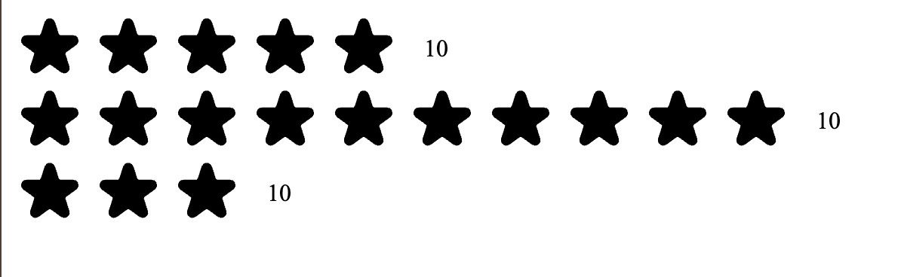

#### 11.2.3 Focus on Rating number displayed:
When user clicks on any of those stars, need to be display the current number in the paragraph element. So in case need to be rendered some in screen, using state is mandatory.
```tsx
/*  */
import { useState } from "react";                 // 👈🏽 ✅
import Star from "./Star";
const containerStyle = {....};
const starContainerStyle = {....};
const textStyle = {....};

const StarRating = ({ maxRating = 3 }) => {
  const [rating, setRating] = useState(0);
  return (
    <div style={containerStyle}>
      <div style={starContainerStyle}>
        {Array.from({ length: maxRating }, (_, i) => (
          <Star key={i} />
        ))}
      </div>
      <p style={textStyle}>{rating || ""}</p>     {/* 👈🏽 ✅ */}
    </div>
  );
};

export default StarRating;
```


#### 11.2.4 Adding the `onClick` event handler in `StarRating` as well as `Star` components:
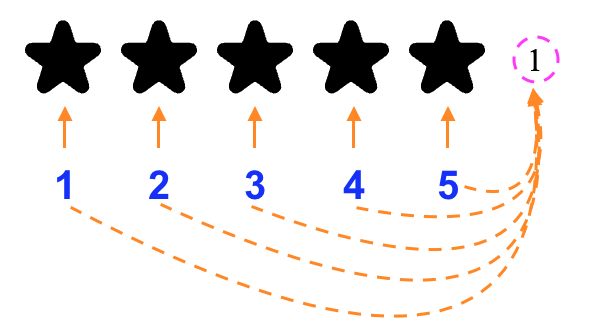

```jsx
/* src/StarRating.jsx */
import { useState } from "react";
import Star from "./Star";
const containerStyle = {....};
const starContainerStyle = {....};
const textStyle = {....};
const StarRating = ({ maxRating = 3 }) => {
  const [rating, setRating] = useState(1);                  // 👈🏽 ✅
  return (
    <div style={containerStyle}>
      <div style={starContainerStyle}>
        {Array.from({ length: maxRating }, (_, i) => (
          <Star key={i} onClick={() => setRating(i + 1)} /> {/* 👈🏽 ✅ */}
        ))}
      </div>
      <p style={textStyle}>{rating || ""}</p>
    </div>
  );
};
export default StarRating;
```

```tsx
/* src/Star.jsx */
const starStyle = {....};
const Star = ({ onClick }) => {                                 // 👈🏽 ✅
  return (
    <span role="button" style={starStyle} onClick={onClick}>    {/* 👈🏽 ✅ */}
      <svg xmlns="http://www.w3.org/2000/svg" viewBox="0 0 20 20" fill="#000" stroke="#000">
        <path d="M9.049 2.927c.3-.921 1.603-.921 1.902 0l1.07 3.292a1 1 0 00.95.69h3.462c.969 0 1.371 1.24.588 1.81l-2.8 2.034a1 1 0 00-.364 1.118l1.07 3.292c.3.921-.755 1.688-1.54 1.118l-2.8-2.034a1 1 0 00-1.175 0l-2.8 2.034c-.784.57-1.838-.197-1.539-1.118l1.07-3.292a1 1 0 00-.364-1.118L2.98 8.72c-.783-.57-.38-1.81.588-1.81h3.461a1 1 0 00.951-.69l1.07-3.292z" />
      </svg>
    </span>
  );
};
export default Star;
```

#### 11.2.5 Enhance this function due to confusing names:

```tsx
/* src/StarRating.jsx */
import { useState } from "react";
import Star from "./Star";
const containerStyle = {....};
const starContainerStyle = {....};
const textStyle = {....};
const StarRating = ({ maxRating = 3 }) => {
  const [rating, setRating] = useState(1);
  const handleRating = (rating) => {                            // 👈🏽 ✅
    setRating(rating);
  }
  return (
    <div style={containerStyle}>
      <div style={starContainerStyle}>
        {Array.from({ length: maxRating }, (_, i) => (
          <Star key={i} onRate={() => handleRating(i + 1)} />  {/* 👈🏽 ✅ */}
        ))}
      </div>
      <p style={textStyle}>{rating || ""}</p>
    </div>
  );
};
export default StarRating;
```

```tsx
/* src/Star.jsx */
const starStyle = {....};
const Star = ({ onRate }) => {                                // 👈🏽 ✅
  return (
    <span role="button" style={starStyle} onClick={onRate}>   {/* 👈🏽 ✅ */}
      <svg xmlns="http://www.w3.org/2000/svg" viewBox="0 0 20 20" fill="#000" stroke="#000">
        <path d="M9.049 2.927c.3-.921 1.603-.921 1.902 0l1.07 3.292a1 1 0 00.95.69h3.462c.969 0 1.371 1.24.588 1.81l-2.8 2.034a1 1 0 00-.364 1.118l1.07 3.292c.3.921-.755 1.688-1.54 1.118l-2.8-2.034a1 1 0 00-1.175 0l-2.8 2.034c-.784.57-1.838-.197-1.539-1.118l1.07-3.292a1 1 0 00-.364-1.118L2.98 8.72c-.783-.57-.38-1.81.588-1.81h3.461a1 1 0 00.951-.69l1.07-3.292z" />
      </svg>
    </span>
  );
};

export default Star;
```


#### 11.2.6 Handle the Full and Empty stars adding a `full` variable as prop:
```tsx
/* src/Star.jsx */
const starStyle = {....};
const Star = ({ onRate, full }) => {  // 👈🏽 ✅
  return (
    <span role="button" style={starStyle} onClick={onRate}>
      {full ? (  {/* 👈🏽 ✅ */}
        <svg xmlns="http://www.w3.org/2000/svg" viewBox="0 0 20 20" fill="#000" stroke="#000">
          <path d="M9.049 2.927c.3-.921 1.603-.921 1.902 0l1.07 3.292a1 1 0 00.95.69h3.462c.969 0 1.371 1.24.588 1.81l-2.8 2.034a1 1 0 00-.364 1.118l1.07 3.292c.3.921-.755 1.688-1.54 1.118l-2.8-2.034a1 1 0 00-1.175 0l-2.8 2.034c-.784.57-1.838-.197-1.539-1.118l1.07-3.292a1 1 0 00-.364-1.118L2.98 8.72c-.783-.57-.38-1.81.588-1.81h3.461a1 1 0 00.951-.69l1.07-3.292z" />
        </svg>
      ) : (  {/* 👈🏽 ✅ */}
        <svg xmlns="http://www.w3.org/2000/svg" fill="none" viewBox="0 0 24 24" stroke="#000">
          <path
            strokeLinecap="round"
            strokeLinejoin="round"
            strokeWidth="{2}"
            d="M11.049 2.927c.3-.921 1.603-.921 1.902 0l1.519 4.674a1 1 0 00.95.69h4.915c.969 0 1.371 1.24.588 1.81l-3.976 2.888a1 1 0 00-.363 1.118l1.518 4.674c.3.922-.755 1.688-1.538 1.118l-3.976-2.888a1 1 0 00-1.176 0l-3.976 2.888c-.783.57-1.838-.197-1.538-1.118l1.518-4.674a1 1 0 00-.363-1.118l-3.976-2.888c-.784-.57-.38-1.81.588-1.81h4.914a1 1 0 00.951-.69l1.519-4.674z"
          />
        </svg>
      )}
    </span>
  );
};
export default Star;
```

```tsx
/* src/StarRating.jsx */
import { useState } from "react";
import Star from "./Star";
const containerStyle = {....};
const starContainerStyle = {....};
const textStyle = {....};
const StarRating = ({ maxRating = 3 }) => {
  const [rating, setRating] = useState(1);
  const handleRating = (rating) => {
    setRating(rating);
  };
  return (
    <div style={containerStyle}>
      <div style={starContainerStyle}>
        {Array.from({ length: maxRating }, (_, i) => (
          <Star key={i} onRate={() => handleRating(i + 1)} full={rating >= i + 1} />  {/* 👈🏽 ✅ */}
        ))}
      </div>
      <p style={textStyle}>{rating || ""}</p>
    </div>
  );
};
export default StarRating;
```

### 🐞 116.3 Issues:

- **Prop Naming Confusions**: Initial handler names were inconsistent, lead to refactoring `onClick` to `onRate`.
- **SVG configuration**: Hardcoded colors and sizes in the SVGs limited their reusability.

| Issue | Status | Log/Error |
|---|---|---|
| Rigid SVGs | ✅ Resolved | Refactored `Star` to accept props for state and interaction. |

### 🧱 116.4 Pending Fixes (TODO):

- [ ] Fix `strokeWidth="{2}"` syntax in `src/Star.jsx` to `strokeWidth={2}`
- [ ] Add `aria-label`, `tabIndex="0"`, and `onKeyDown` handlers to `Star` component
- [ ] Implement PropTypes or TypeScript for `Star` component prop validation
- [ ] Add default no-op function for `onRate` prop in `Star.jsx`
- [ ] Make star SVG colors (`fill`, `stroke`) configurable via props
- [ ] Extract SVG icons to separate `FullStarIcon` and `EmptyStarIcon` components
- [ ] Clean up commented-out SVG examples in `src/Star.jsx`
- [ ] Standardize `viewBox` values for both star states
- [ ] Add hover-specific CSS transforms or transitions for star interactivity


## 🔧 117. Lesson 117 — *Handling Hover Events*

- [Lecture 117: Handling Hover Events](#-117-lesson-117--handling-hover-events)
- [117.1 Context](#1171-context)
- [117.2 Updating code according the context](#1172-updating-code-according-the-context)
- [117.3 Issues](#1173-issues)
- [117.4 Pending Fixes (TODO)](#1174-pending-fixes-todo)

### 🧠 117.1 Context:

Hover events in React provide a way to detect when a user's mouse pointer enters or leaves an element, enabling interactive UI feedback and preview functionality. This lesson focuses on implementing hover interactions in the `StarRating` component to provide visual feedback before a user commits to a rating selection.

**What are hover events?**

Hover events in React are handled through two primary event handlers:
- `onMouseEnter`: Fires when the mouse pointer enters the element's boundaries
- `onMouseLeave`: Fires when the mouse pointer leaves the element's boundaries

These events are part of React's SyntheticEvent system, which wraps native browser events to provide a consistent API across different browsers.

**When and why they're used:**

Hover events are commonly used for:
- **Preview functionality**: Showing what would happen if the user interacts with an element (e.g., previewing a rating before clicking)
- **Visual feedback**: Highlighting interactive elements to indicate they're clickable
- **Tooltips and hints**: Displaying additional information when hovering over elements
- **Progressive disclosure**: Revealing hidden content or options on hover

In this project, hover events enable a "preview" mode where users can see how many stars would be filled before actually clicking to set a rating. This improves the user experience by providing immediate visual feedback.

**Examples from the project:**

In `src/StarRating.jsx`, hover events are used to manage a temporary rating state:
- `tempRating` state stores the preview rating while hovering
- `onHoverIn` callback sets the temporary rating when entering a star
- `onHoverOut` callback resets the temporary rating when leaving

The component uses conditional logic to display either the temporary rating (while hovering) or the actual rating (when not hovering):
```27:27:src/StarRating.jsx
  const displayedRating = tempRating || rating || "";
```

In `src/Star.jsx`, the hover handlers are connected to React's mouse events:
```15:17:src/Star.jsx
      onMouseEnter={onHoverIn}
      // onMouseLeave={() => console.log("Leave")}
      onMouseLeave={onHoverOut}
```

**Advantages:**
- **Improved UX**: Provides immediate visual feedback without requiring a click
- **Reduced errors**: Users can preview their selection before committing
- **Better discoverability**: Makes interactive elements more obvious
- **Native browser support**: Works across all modern browsers without additional libraries
- **Simple implementation**: Easy to add with minimal code changes

**Disadvantages:**
- **Not accessible on touch devices**: Hover events don't work on mobile/touch devices, requiring alternative interaction patterns
- **Accessibility concerns**: Keyboard-only users cannot trigger hover states, potentially missing important information
- **Potential performance issues**: Rapid mouse movements can trigger many events, though React's event delegation helps mitigate this
- **State management complexity**: Requires managing temporary state that may not match the actual state

**When to consider alternatives:**

- **Touch devices**: Use `onTouchStart` or `onTouchEnd` for mobile interactions, or rely on click/tap events
- **Keyboard accessibility**: Provide keyboard equivalents (e.g., `onFocus`/`onBlur`) for keyboard users
- **Complex interactions**: For more sophisticated hover behaviors, consider libraries like Framer Motion or CSS `:hover` pseudo-classes
- **Performance-critical scenarios**: If hover events cause performance issues, consider debouncing or throttling the handlers
- **Accessibility-first applications**: Prioritize keyboard and screen reader support, using hover as an enhancement rather than a requirement

**Connection to the lesson's practical implementation:**

This lesson demonstrates how hover events can enhance a rating component by allowing users to preview their selection. The implementation shows the pattern of using temporary state (`tempRating`) that doesn't persist until the user clicks, creating a smooth, intuitive interaction pattern that's common in modern web applications.


### ⚙️ 117.2 Updating code according the context:

#### 12.2.1 Handle the event hovering the stars:
```tsx
/* src/StarRating.jsx */
import { useState } from "react";
import Star from "./Star";
const containerStyle = {....};
const starContainerStyle = {....};
const textStyle = {....};
const StarRating = ({ maxRating = 3 }) => {
  const [rating, setRating] = useState(0);
  const [tempRating, setTempRating] = useState(0);  // 👈🏽 ✅
  const handleRating = (rating) => {
    setRating(rating);
  };
  return (
    <div style={containerStyle}>
      <div style={starContainerStyle}>
        {Array.from({ length: maxRating }, (_, i) => (
          <Star key={i} onRate={() => handleRating(i + 1)} full={rating >= i + 1} />
        ))}
      </div>
      <p style={textStyle}>{rating || ""}</p>
    </div>
  );
};
export default StarRating;
```

```tsx
/* src/Star.jsx */
const starStyle = {
  width: "48px",
  height: "48px",
  display: "block",
  cursor: "pointer",
};
const Star = ({ onRate, full }) => {
  return (
    <span
      role="button"
      style={starStyle}
      onClick={onRate}
      onMouseEnter={() => console.log("Enter")} {/* 👈🏽 ✅ */}
      onMouseLeave={() => console.log("Leave")} {/* 👈🏽 ✅ */}
    >
      {full ? (
        <svg xmlns="http://www.w3.org/2000/svg" viewBox="0 0 20 20" fill="#000" stroke="#000">
          <path d="M9.049 2.927c.3-.921 1.603-.921 1.902 0l1.07 3.292a1 1 0 00.95.69h3.462c.969 0 1.371 1.24.588 1.81l-2.8 2.034a1 1 0 00-.364 1.118l1.07 3.292c.3.921-.755 1.688-1.54 1.118l-2.8-2.034a1 1 0 00-1.175 0l-2.8 2.034c-.784.57-1.838-.197-1.539-1.118l1.07-3.292a1 1 0 00-.364-1.118L2.98 8.72c-.783-.57-.38-1.81.588-1.81h3.461a1 1 0 00.951-.69l1.07-3.292z" />
        </svg>
      ) : (
        <svg xmlns="http://www.w3.org/2000/svg" fill="none" viewBox="0 0 24 24" stroke="#000">
          <path
            strokeLinecap="round"
            strokeLinejoin="round"
            strokeWidth="{2}"
            d="M11.049 2.927c.3-.921 1.603-.921 1.902 0l1.519 4.674a1 1 0 00.95.69h4.915c.969 0 1.371 1.24.588 1.81l-3.976 2.888a1 1 0 00-.363 1.118l1.518 4.674c.3.922-.755 1.688-1.538 1.118l-3.976-2.888a1 1 0 00-1.176 0l-3.976 2.888c-.783.57-1.838-.197-1.538-1.118l1.518-4.674a1 1 0 00-.363-1.118l-3.976-2.888c-.784-.57-.38-1.81.588-1.81h4.914a1 1 0 00.951-.69l1.519-4.674z"
          />
        </svg>
      )}
    </span>
  );
};

export default Star;
```

Testing hover in and out into any star:
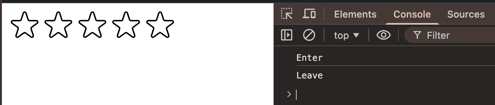

#### 12.2.2 APply the `onHoverIn` and `onHoverOut`:
```tsx
/* src/StarRating.jsx */
import { useState } from "react";
import Star from "./Star";
const containerStyle = {....};
const starContainerStyle = {....};
const textStyle = {....};
const StarRating = ({ maxRating = 3 }) => {
  const [rating, setRating] = useState(0);
  const [tempRating, setTempRating] = useState(0);
  const handleRating = (rating) => {
    setRating(rating);
  };
  return (
    <div style={containerStyle}>
      <div style={starContainerStyle}>
        {Array.from({ length: maxRating }, (_, i) => (
          <Star
            key={i}
            onRate={() => handleRating(i + 1)}
            full={rating >= i + 1}
            onHoverIn={() => setTempRating(i + 1)}    {/* 👈🏽 ✅ */}
            onHoverOut={() => setTempRating(0)}       {/* 👈🏽 ✅ */}
          />
        ))}
      </div>
      <p style={textStyle}>{rating || ""}</p>
    </div>
  );
};
export default StarRating;
```

In `Star.jsx` component:
```jsx
/* src/Star.jsx */
const starStyle = {
  width: "48px",
  height: "48px",
  display: "block",
  cursor: "pointer",
};
const Star = ({ onRate, full, onHoverIn, onHoverOut }) => {
  return (
    <span
      role="button"
      style={starStyle}
      onClick={onRate}
      // onMouseEnter={() => console.log("Enter")}
      onMouseEnter={onHoverIn}
      // onMouseLeave={() => console.log("Leave")}
      onMouseLeave={onHoverOut}
    >
      {full ? (
        <svg xmlns="http://www.w3.org/2000/svg" viewBox="0 0 20 20" fill="#000" stroke="#000">
          <path d="M9.049 2.927c.3-.921 1.603-.921 1.902 0l1.07 3.292a1 1 0 00.95.69h3.462c.969 0 1.371 1.24.588 1.81l-2.8 2.034a1 1 0 00-.364 1.118l1.07 3.292c.3.921-.755 1.688-1.54 1.118l-2.8-2.034a1 1 0 00-1.175 0l-2.8 2.034c-.784.57-1.838-.197-1.539-1.118l1.07-3.292a1 1 0 00-.364-1.118L2.98 8.72c-.783-.57-.38-1.81.588-1.81h3.461a1 1 0 00.951-.69l1.07-3.292z" />
        </svg>
      ) : (
        <svg xmlns="http://www.w3.org/2000/svg" fill="none" viewBox="0 0 24 24" stroke="#000">
          <path
            strokeLinecap="round"
            strokeLinejoin="round"
            strokeWidth="{2}"
            d="M11.049 2.927c.3-.921 1.603-.921 1.902 0l1.519 4.674a1 1 0 00.95.69h4.915c.969 0 1.371 1.24.588 1.81l-3.976 2.888a1 1 0 00-.363 1.118l1.518 4.674c.3.922-.755 1.688-1.538 1.118l-3.976-2.888a1 1 0 00-1.176 0l-3.976 2.888c-.783.57-1.838-.197-1.538-1.118l1.518-4.674a1 1 0 00-.363-1.118l-3.976-2.888c-.784-.57-.38-1.81.588-1.81h4.914a1 1 0 00.951-.69l1.519-4.674z"
          />
        </svg>
      )}
    </span>
  );
};

export default Star;
```

#### 12.2.3 Working out with `tempRating` and the `fullStar`:
```tsx
/* src/StarRating.jsx */
import { useState } from "react";
import Star from "./Star";
const containerStyle = {....};
const starContainerStyle = {....};
const textStyle = {....};
const StarRating = ({ maxRating = 3 }) => {
  const [rating, setRating] = useState(0);
  const [tempRating, setTempRating] = useState(0);
  const handleRating = (rating) => {
    setRating(rating);
  };
  return (
    <div style={containerStyle}>
      <div style={starContainerStyle}>
        {Array.from({ length: maxRating }, (_, i) => (
          <Star
            key={i}
            onRate={() => handleRating(i + 1)}
            full={tempRating ? tempRating >= i + 1 : rating >= i + 1} {/* 👈🏽 ✅ */}
            onHoverIn={() => setTempRating(i + 1)}
            onHoverOut={() => setTempRating(0)}   
          />
        ))}
      </div>
      <p style={textStyle}>{tempRating || rating || ""}</p>       {/* 👈🏽 ✅ */}
    </div>
  );
};
export default StarRating;
```

- Determines whether the `star` is filled or full.
- While hovering, the temporary rating (`tempRating`) is used to _**preview**_ the selection.
### 🐞 117.3 Issues:

- **State Syncing**: Keeping `tempRating` and `rating` in sync during rapid mouse movements.
- **Visual Feedback Lag**: Ensuring the hover state clears immediately on mouse leave.

| Issue | Status | Log/Error |
|---|---|---|
| Interaction Preview | ✅ Resolved | Implemented `tempRating` logic to provide preview before clicking. |

### 🧱 117.4 Pending Fixes (TODO):

- [ ] Clean up commented-out debug code in `src/Star.jsx`
- [ ] Use `displayedRating` consistently in `src/StarRating.jsx` for both logic and display
- [ ] Add default no-op functions for `onHoverIn` and `onHoverOut` props in `Star.jsx`
- [ ] Implement PropTypes or TypeScript for hover handler validation
- [ ] Mirror hover preview functionality for keyboard users using `onFocus` and `onBlur`
- [ ] Wrap hover handlers in `useCallback` to optimize render performance in `StarRating.jsx`
- [ ] Implement CSS transform effects for enhanced visual feedback on hover
- [ ] Ensure `tempRating` resets reliably even on rapid mouse movements

## 🔧 118. Lesson 118 — *Props as a Component API*

- [Lecture 118: Props as a Component API](#-118-lesson-118--props-as-a-component-api)
- [118.1 Context](#1181-context)
- [118.2 Updating code according the context](#1182-updating-code-according-the-context)
- [118.3 Issues](#1183-issues)
- [118.4 Pending Fixes (TODO)](#1184-pending-fixes-todo)

### 🧠 118.1 Context:

**What is Props as a Component API?**

Props as a Component API is a fundamental concept in React that treats component props as the public interface or "API" of a component. Just like a REST API defines how external systems interact with a service, component props define how parent components interact with and configure child components. The props you define determine what data a component accepts, what callbacks it can trigger, and how it can be customized.

**When does this concept occur?**

- When designing reusable components that need to be configurable from the outside
- When creating component libraries or design systems
- When establishing clear contracts between parent and child components
- When deciding what should be configurable vs. hardcoded in a component
- When documenting component usage and requirements

**Examples from this project:**

1. **StarRating Component** (`StarRating.jsx`): Demonstrates a well-designed component API with:
   - **Configurable prop**: `maxRating` with a default value of 3, allowing customization
   - **Clear interface**: The component accepts one prop that controls its behavior
   ```19:19:src/StarRating.jsx
   const StarRating = ({ maxRating = 3 }) => {
   ```

2. **Box Component** (`Box.jsx`): Shows a simple API that accepts content:
   - **Single prop interface**: `element` prop defines what content to display
   - **Stateful wrapper**: Manages its own `isOpen` state while accepting external content
   ```3:3:src/components/Box.jsx
   const Box = ({ element }) => {
   ```

3. **Movie Component** (`Movie.jsx`): Demonstrates a pure presentational component API:
   - **Data prop**: Accepts `movie` object containing all necessary data
   - **No configuration needed**: Simple, focused API for displaying movie information
   ```1:1:src/components/Movie.jsx
   const Movie = ({ movie }) => {
   ```

4. **Star Component** (`Star.jsx`): Shows callback-based API:
   - **Multiple callback props**: `onRate`, `onHoverIn`, `onHoverOut` for user interactions
   - **State prop**: `full` boolean to control visual state
   - **Event-driven design**: Communicates user actions upward through callbacks
   ```8:8:src/Star.jsx
   const Star = ({ onRate, full, onHoverIn, onHoverOut }) => {
   ```

**Advantages of treating Props as a Component API:**

- ✅ **Clear contracts**: Developers know exactly what props a component expects
- ✅ **Reusability**: Well-designed prop APIs make components reusable across different contexts
- ✅ **Maintainability**: Changes to component internals don't affect the public API
- ✅ **Testability**: Components can be tested in isolation by passing mock props
- ✅ **Documentation**: Props serve as self-documenting code when properly named
- ✅ **Type safety**: With TypeScript or PropTypes, props can be validated at development time
- ✅ **Flexibility**: Default values allow components to work with minimal configuration
- ✅ **Separation of concerns**: Components focus on rendering, while props handle configuration

**Disadvantages of treating Props as a Component API:**

- ⚠️ **Prop drilling**: Can lead to passing props through many levels (though composition helps)
- ⚠️ **API design complexity**: Poorly designed prop APIs can make components hard to use
- ⚠️ **Over-engineering risk**: Simple components might not need extensive prop APIs
- ⚠️ **Maintenance burden**: Changing prop APIs can break existing usage
- ⚠️ **Lack of validation**: Without PropTypes or TypeScript, incorrect props can cause runtime errors
- ⚠️ **Documentation overhead**: Complex APIs require more documentation

**When to consider alternatives:**

- **Use Context API when**: Multiple deeply nested components need the same data (avoiding prop drilling)
- **Use composition when**: Structural components don't need to know about specific data
- **Use state management libraries when**: Props need to be shared across distant components
- **Use render props or hooks when**: Component logic needs to be shared but rendering varies
- **Keep props simple when**: Component has a single, clear purpose that doesn't need extensive configuration

**Best practices for Props as Component API:**

1. **Use descriptive prop names**: `onRate` is clearer than `onClick` for a star rating
2. **Provide default values**: Make optional props work without explicit values (`maxRating = 3`)
3. **Keep APIs focused**: Each component should have a single responsibility
4. **Use consistent naming**: Follow React conventions (`on*` for callbacks, `is*`/`has*` for booleans)
5. **Document prop types**: Use PropTypes or TypeScript to validate and document expected props
6. **Handle edge cases**: Consider what happens when props are `undefined`, `null`, or empty arrays

**Connection to this lesson's practical implementation:**

In this lesson, we learn that props are not just a way to pass data—they are the public interface of our components. A well-designed component API through props makes components predictable, reusable, and maintainable. The lesson emphasizes thinking about components as APIs: what inputs do they accept? What outputs do they produce? How can they be configured? This mindset helps create better component designs that are easier to use, test, and maintain.


### ⚙️ 118.2 Updating code according the context:

#### 118.2.1 Props as an API
### 🐞 118.3 Issues:

- **API bloating**: Risk of adding too many props to components like `StarRating` without clear documentation.
- **Default value consistency**: ensuring components behave predictably when props are omitted.

| Issue | Status | Log/Error |
|---|---|---|
| Design Patterns | ℹ️ Discussion | Established principles for designing clean and intuitive component APIs. |

### 🧱 118.4 Pending Fixes (TODO):

- [ ] Add PropTypes or TypeScript validation across all Section 10 components
- [ ] Standardize default prop values for optional configuration (`Box`, `MovieList`, etc.)
- [ ] Add defensive checks in `WatchedSummary` for empty arrays to prevent division by zero
- [ ] Add JSDoc documentation for all public component prop APIs
- [ ] Ensure consistent naming conventions for singular/plural props across the project
- [ ] Fix potential crashes in `Movie` components when the required `movie` object is missing
- [ ] Validate function props before invocation to prevent runtime errors


## 🔧 119. Lesson 119 — *Improving Reusability with Props*

- [Lecture 119: Improving Reusability with Props](#-119-lesson-119--improving-reusability-with-props)
- [119.1 Context](#1191-context)
- [119.2 Updating code according the context](#1192-updating-code-according-the-context)
- [119.3 Issues](#1193-issues)
- [119.4 Pending Fixes (TODO)](#1194-pending-fixes-todo)

### 🧠 119.1 Context:

**Props (Properties)** are a fundamental mechanism in React for passing data from parent components to child components. They enable component reusability by allowing components to be configured differently based on the data they receive, rather than having hardcoded values.

**When and Why Props are Used:**
- **Component Configuration**: Props allow components to be configured with different values (colors, sizes, behaviors) without modifying the component's internal code
- **Data Flow**: Props enable unidirectional data flow from parent to child, making the application's data flow predictable and easier to debug
- **Reusability**: By accepting props, a single component can be used in multiple contexts with different configurations
- **Separation of Concerns**: Props help separate component logic from component configuration, making components more maintainable

**Examples from the Project:**

In this lesson, the `StarRating` component was enhanced with multiple props to improve its reusability:

```14:14:src/StarRating.jsx
const StarRating = ({ maxRating = 3, color = "#fcc419", size = 48, className = "", messages = [], onSetRating }) => {
```

- **`maxRating`**: Controls how many stars are displayed (default: 3)
- **`color`**: Customizes the star color (default: "#fcc419")
- **`size`**: Controls the size of stars in pixels (default: 48)
- **`className`**: Allows external CSS styling
- **`messages`**: Array of custom messages to display instead of numeric rating
- **`onSetRating`**: Callback function to handle rating changes externally

The component is then reused with different configurations:

```11:12:src/main.jsx
    <StarRating maxRating={5} messages={["Terrible", "Bad", "Okay", "Good", "Excellent"]} />
    <StarRating maxRating={5} size={24} color="red" className="test" />
```

**Advantages:**
- ✅ **Reusability**: One component can serve multiple use cases
- ✅ **Flexibility**: Components can be customized without code duplication
- ✅ **Maintainability**: Changes to component logic only need to be made in one place
- ✅ **Testability**: Components can be easily tested with different prop combinations
- ✅ **Composition**: Components can be composed together to build complex UIs

**Disadvantages:**
- ❌ **Prop Drilling**: When props need to be passed through multiple component layers
- ❌ **Complexity**: Too many props can make components harder to understand and use
- ❌ **Type Safety**: Without TypeScript or PropTypes, prop types aren't enforced at runtime
- ❌ **Default Values**: Need to carefully consider default values to avoid unexpected behavior

**When to Consider Alternatives:**
- **Context API**: When props need to be passed through many component layers (prop drilling)
- **State Management Libraries**: For complex global state that many components need access to
- **Composition Patterns**: When component behavior varies significantly, consider composition over many conditional props
- **Render Props / Children**: When you need to pass rendering logic rather than just data

**Connection to Practical Implementation:**

The lesson demonstrates how adding props (`color`, `size`, `className`, `messages`, `onSetRating`) transforms `StarRating` from a hardcoded component into a flexible, reusable component that can be configured for different use cases throughout the application. The optional `onSetRating` prop also shows how to make components work both as controlled and uncontrolled components, further increasing flexibility.


### ⚙️ 119.2 Updating code according the context:

#### 119.2.1 Add `color` and `size` as props in `StarRating` and pass those props to `Star` component:
```tsx
/* src/StarRating.jsx */
import { useState } from "react";
import Star from "./Star";
const containerStyle = {
  display: "flex",
  alignItems: "center",
  gap: "16px",
};
const starContainerStyle = {
  display: "flex",
};
const StarRating = ({ maxRating = 3, color = "#fcc419", size = 48 }) => {  // 👈🏽 ✅
  const [rating, setRating] = useState(0);
  const [tempRating, setTempRating] = useState(0);
  const handleRating = (rating) => {
    setRating(rating);
  };
  const textStyle = {  // 👈🏽 ✅
    lineHeight: "1",
    gap: "0",
    color,  // 👈🏽 ✅
    fontSize: `${size / 1.5}px`,  // 👈🏽 ✅
  };
  const displayedRating = tempRating || rating || "";
  return (
    <div style={containerStyle}>
      <div style={starContainerStyle}>
        {Array.from({ length: maxRating }, (_, i) => (
          <Star
            key={i}
            onRate={() => handleRating(i + 1)}
            full={displayedRating >= i + 1}
            onHoverIn={() => setTempRating(i + 1)}
            onHoverOut={() => setTempRating(0)}
            color={color}   {/* 👈🏽 ✅ */}
            size={size}     {/* 👈🏽 ✅ */}
          />
        ))}
      </div>
      <p style={textStyle}>{tempRating || rating || ""}</p>
    </div>
  );
};
export default StarRating;
```

#### 14.2.2 Working with `color` and `size` as props in `Star` component:
```tsx
/* src/Star.jsx */
const Star = ({ onRate, full, onHoverIn, onHoverOut, color, size }) => {
  const starStyle = {  // 👈🏽 ✅
    width: `${size}px`,  // 👈🏽 ✅
    height: `${size}px`,  // 👈🏽 ✅
    display: "block",
    cursor: "pointer",
  };
  return (
    <span role="button" style={starStyle} onClick={onRate} onMouseEnter={onHoverIn} onMouseLeave={onHoverOut}>
      {full ? (
        <svg 
          xmlns="http://www.w3.org/2000/svg" 
          viewBox="0 0 20 20" 
          fill={color}    {/* 👈🏽 ✅ */}
          stroke={color}  {/* 👈🏽 ✅ */}
        >
          <path d="M9.049 2.927c.3-.921 1.603-.921 1.902 0l1.07 3.292a1 1 0 00.95.69h3.462c.969 0 1.371 1.24.588 1.81l-2.8 2.034a1 1 0 00-.364 1.118l1.07 3.292c.3.921-.755 1.688-1.54 1.118l-2.8-2.034a1 1 0 00-1.175 0l-2.8 2.034c-.784.57-1.838-.197-1.539-1.118l1.07-3.292a1 1 0 00-.364-1.118L2.98 8.72c-.783-.57-.38-1.81.588-1.81h3.461a1 1 0 00.951-.69l1.07-3.292z" />
        </svg>
      ) : (
        <svg 
          xmlns="http://www.w3.org/2000/svg" 
          fill="none" 
          viewBox="0 0 24 24" 
          stroke={color}  {/* 👈🏽 ✅ */}
        >
          <path
            strokeLinecap="round"
            strokeLinejoin="round"
            strokeWidth="{2}"
            d="M11.049 2.927c.3-.921 1.603-.921 1.902 0l1.519 4.674a1 1 0 00.95.69h4.915c.969 0 1.371 1.24.588 1.81l-3.976 2.888a1 1 0 00-.363 1.118l1.518 4.674c.3.922-.755 1.688-1.538 1.118l-3.976-2.888a1 1 0 00-1.176 0l-3.976 2.888c-.783.57-1.838-.197-1.538-1.118l1.518-4.674a1 1 0 00-.363-1.118l-3.976-2.888c-.784-.57-.38-1.81.588-1.81h4.914a1 1 0 00.951-.69l1.519-4.674z"
          />
        </svg>
      )}
    </span>
  );
};
export default Star;
```

Meanwhile in `main.jsx` reuses the `StarRating` component:
```jsx
/* src/main.jsx */
import { StrictMode } from "react";
import { createRoot } from "react-dom/client";
// import './index.css'
// import App from './App.jsx'
import StarRating from "./StarRating.jsx";

createRoot(document.getElementById("root")).render(
  <StrictMode>
    {/* <App /> */}
    <StarRating maxRating={5} />
    <StarRating maxRating={5} size={24} color="red" />  {/* 👈🏽 ✅ */}
  </StrictMode>
);
```


#### 14.2.3 Sending other props as `className` or `messages`:
```tsx
/* src/main.jsx */
import { StrictMode } from "react";
import { createRoot } from "react-dom/client";
// import './index.css'
// import App from './App.jsx'
import StarRating from "./StarRating.jsx";

createRoot(document.getElementById("root")).render(
  <StrictMode>
    {/* <App /> */}
    <StarRating maxRating={5} messages={["Terrible", "Bad", "Okay", "Good", "Excellent"]} />  {/* 👈🏽 ✅ */}
    <StarRating maxRating={5} size={24} color="red" className="test" />  {/* 👈🏽 ✅ */}
  </StrictMode>
);
```


In `StarRating`:
```jsx
/* src/StarRating.jsx */
import { useState } from "react";
import Star from "./Star";
const containerStyle = {
  display: "flex",
  alignItems: "center",
  gap: "16px",
};
const starContainerStyle = {
  display: "flex",
};
const StarRating = ({ 
  maxRating = 3, 
  color = "#fcc419", 
  size = 48, 
  className = "",     // 👈🏽 ✅
  messages = []       // 👈🏽 ✅
}) => {
  const [rating, setRating] = useState(0);
  const [tempRating, setTempRating] = useState(0);
  const handleRating = (rating) => {
    setRating(rating);
  };
  const textStyle = {
    lineHeight: "1",
    gap: "0",
    color,
    fontSize: `${size / 1.5}px`,
  };
  const displayedRating = tempRating || rating || "";
  return (
    <div style={containerStyle} className={className}>
      <div style={starContainerStyle}>
        {Array.from({ length: maxRating }, (_, i) => (
          <Star
            key={i}
            onRate={() => handleRating(i + 1)}
            full={displayedRating >= i + 1}
            onHoverIn={() => setTempRating(i + 1)}
            onHoverOut={() => setTempRating(0)}
            color={color}
            size={size}
          />
        ))}
      </div>
      <p style={textStyle}>
        {messages.length === maxRating                              {/* 👈🏽 ✅ */}
          ? messages[tempRating ? tempRating - 1 : rating - 1]      {/* 👈🏽 ✅ */}
          : tempRating || rating || ""}                             {/* 👈🏽 ✅ */}
      </p>
    </div>
  );
};
export default StarRating;
```


#### 14.2.3 Using the internal `rating` prop from `StarRating` for an external component:

> Create `Test` component which has inside the `StarRating` component:
```jsx
/* src/main.jsx */
import { StrictMode } from "react";
import { createRoot } from "react-dom/client";
// import './index.css'
// import App from './App.jsx'
import StarRating from "./StarRating.jsx";
import Test from "./components/Test.jsx";   // 👈🏽 ✅
createRoot(document.getElementById("root")).render(
  <StrictMode>
    {/* <App /> */}
    <StarRating maxRating={5} messages={["Terrible", "Bad", "Okay", "Good", "Excellent"]} />
    <StarRating maxRating={5} size={24} color="red" className="test" />
    <Test />      {/* 👈🏽 ✅ */}
  </StrictMode>
);
```


```jsx
/* src/components/Test.jsx 👈🏽 ✅ */
import StarRating from "../StarRating";
const Test = () => {
  return (
    <>
      <StarRating maxRating={10} color="blue" />
      <p>This movie was rate X stars</p>      {/* ⚠️ */}
    </>
  );
};
export default Test;
```
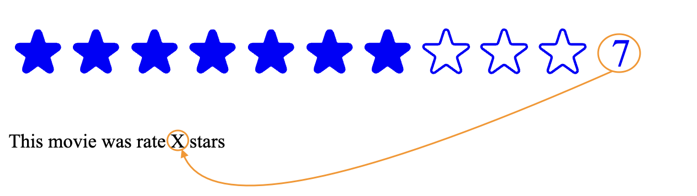

#### 14.2.4 Sending the external `onSetRating={setMovieRating}` props into `StarRating` component:
```jsx
/* src/components/Test.jsx */
import { useState } from "react";
import StarRating from "../StarRating";

const Test = () => {
  const [movieRating, setMovieRating] = useState(0);  // 👈🏽 ✅
  return (
    <>
      <StarRating maxRating={10} color="blue" onSetRating={setMovieRating}/>    {/* 👈🏽 ✅ */}
      <p>This movie was rate {movieRating} stars</p>                            {/* 👈🏽 ✅ */}
    </>
  );
};

export default Test;
```

#### 14.2.5 Receiving the `onSetRating` prop in `StarRating`:
```jsx
/* src/StarRating.jsx */
import { useState } from "react";
import Star from "./Star";
const containerStyle = {
  display: "flex",
  alignItems: "center",
  gap: "16px",
};
const starContainerStyle = {
  display: "flex",
};
const StarRating = ({ 
  maxRating = 3, 
  color = "#fcc419", 
  size = 48, 
  className = "", 
  messages = [], 
  onSetRating   {/* 👈🏽 ✅ */}
}) => {
  const [rating, setRating] = useState(0);
  const [tempRating, setTempRating] = useState(0);
  const handleRating = (rating) => {
    setRating(rating);
    onSetRating(rating);    // 👈🏽 ✅
  };
  const textStyle = {
    lineHeight: "1",
    gap: "0",
    color,
    fontSize: `${size / 1.5}px`,
  };
  const displayedRating = tempRating || rating || "";
  return (
    <div style={containerStyle} className={className}>
      <div style={starContainerStyle}>
        {Array.from({ length: maxRating }, (_, i) => (
          <Star
            key={i}
            onRate={() => handleRating(i + 1)}
            full={displayedRating >= i + 1}
            onHoverIn={() => setTempRating(i + 1)}
            onHoverOut={() => setTempRating(0)}
            color={color}
            size={size}
          />
        ))}
      </div>
      <p style={textStyle}>
        {messages.length === maxRating ? messages[tempRating ? tempRating - 1 : rating - 1] : tempRating || rating || ""}
      </p>
    </div>
  );
};
export default StarRating;
```
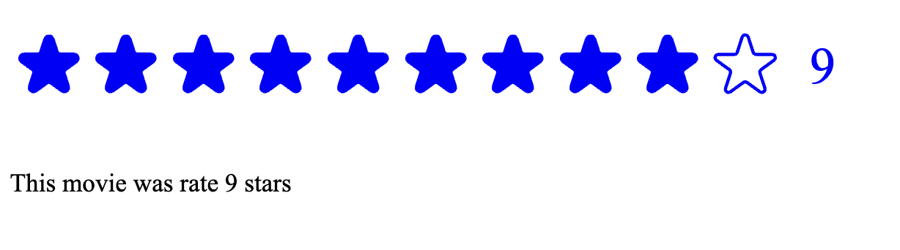

#### 14.2.6 Issue in `onSetRating` props in other `StarRating` instances without `Test`

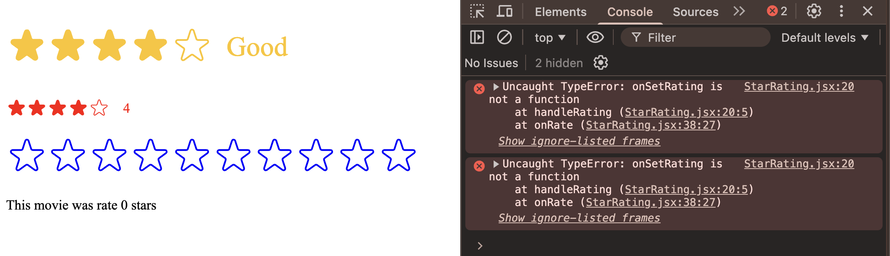

> Summary:
* Instances without `onSetRating` → break on click
* Because `onSetRating` is undefined

> Fixing:
```jsx
/* src/StarRating.jsx */
import { useState } from "react";
import Star from "./Star";
const containerStyle = {
  display: "flex",
  alignItems: "center",
  gap: "16px",
};
const starContainerStyle = {
  display: "flex",
};
const StarRating = ({ 
  maxRating = 3, 
  color = "#fcc419", 
  size = 48, 
  className = "", 
  messages = [], 
  onSetRating,    // 👈🏽 ✅ may be 'undefined'
}) => {
  const [rating, setRating] = useState(0);
  const [tempRating, setTempRating] = useState(0);
  const handleRating = (rating) => {
    setRating(rating);
    onSetRating?.(rating);    // 👈🏽 ✅
  };
  const textStyle = {
    lineHeight: "1",
    gap: "0",
    color,
    fontSize: `${size / 1.5}px`,
  };
  const displayedRating = tempRating || rating || "";
  return (
    <div style={containerStyle} className={className}>
      <div style={starContainerStyle}>
        {Array.from({ length: maxRating }, (_, i) => (
          <Star
            key={i}
            onRate={() => handleRating(i + 1)}
            full={displayedRating >= i + 1}
            onHoverIn={() => setTempRating(i + 1)}
            onHoverOut={() => setTempRating(0)}
            color={color}
            size={size}
          />
        ))}
      </div>
      <p style={textStyle}>
        {messages.length === maxRating ? messages[tempRating ? tempRating - 1 : rating - 1] : tempRating || rating || ""}
      </p>
    </div>
  );
};
export default StarRating;
```

##### ✅ Option 1: Default function (recommended)
You make sure onSetRating always exists:
```jsx
  const StarRating = ({
    maxRating = 3,
    color = "#fcc419",
    size = 48,
    className = "",
    messages = [],
    onSetRating = () => {}   // 👈🏽 empty function
  }) => {
```
> ✔️ Advantages:
* No errors
* The component can be used as controlled or uncontrolled
* Very common in reusable components

##### ✅ Option 2 – Check before calling
```jsx
const handleRating = (rating) => {
  setRating(rating);
  if (onSetRating) {
    onSetRating(rating);
  }
};
```
Or shorter:
```jsx
onSetRating?.(rating);
```
✔️ More explicit
* ❌ A bit more internal logic

##### ⚠️ Option 3 – Make it required (less flexible)
If you ALWAYS want someone to handle the rating:
```jsx
if (!onSetRating) {
  throw new Error("StarRating requires onSetRating prop");
}
```

* ❌ Reduces reusability
### 🐞 119.3 Issues:

- **Optional Function Crash**: Components would crash if `onSetRating` was not provided (resolved with optional chaining).
- **Prop Overload**: Managing multiple customization props (`color`, `size`, `messages`) required careful organization.

| Issue | Status | Log/Error |
|---|---|---|
| Undefined Callbacks | ✅ Resolved | Implemented `onSetRating?.(rating)` to prevent errors when prop is missing. |

### 🧱 119.4 Pending Fixes (TODO):

- [ ] Fix `strokeWidth={2}` in `Star.jsx` (remove quotes/braces string)
- [ ] Add comprehensive prop validation for the expanded `StarRating` API
- [ ] Add ARIA labels and `tabIndex` to `Star` component for accessibility
- [ ] Implement keyboard handlers (`onKeyDown`) for star selection
- [ ] Safely handle message indexing in `StarRating.jsx` to prevent out-of-bounds errors
- [ ] Standardize default properties using default parameters or `defaultProps`
- [ ] Ensure `messages` array length consistency with `maxRating`
- [ ] Add descriptive JSDoc documentation for the improved component API

## 🔧 120. Lesson 120 — *PropTypes*

- [Lecture 120: PropTypes](#-120-lesson-120--proptypes)
- [120.1 Context](#1201-context)
- [120.2 Updating code according the context](#1202-updating-code-according-the-context)
- [120.3 Issues](#1203-issues)
- [120.4 Pending Fixes (TODO)](#1204-pending-fixes-todo)

### 🧠 120.1 Context:

**PropTypes** is a runtime type-checking library for React that allows developers to validate the types of props passed to components. It provides a way to document and enforce the expected data types for component props, helping catch bugs during development and serving as inline documentation for component APIs.

**What are PropTypes?**

PropTypes is a separate package (`prop-types`) that enables type validation for React component props. It allows developers to specify the expected types for each prop (e.g., `string`, `number`, `array`, `object`, `function`) and whether they are required or optional. When props don't match the specified types, PropTypes emits warnings in the browser console during development.

**When are PropTypes used?**

- **During development**: To catch type mismatches and incorrect prop usage before they cause runtime errors
- **For documentation**: To serve as self-documenting code that shows what props a component expects
- **In JavaScript projects**: When not using TypeScript, PropTypes provides a way to add type safety
- **For component libraries**: To help consumers understand the component API and catch errors early
- **For team collaboration**: To make component contracts explicit and reduce bugs from miscommunication

**Examples from this project:**

1. **StarRating component** (`src/StarRating.jsx`): Demonstrates PropTypes implementation:
   ```55:62:src/StarRating.jsx
   StarRating.propTypes = {
     maxRating: PropTypes.number,
     color: PropTypes.string,
     size: PropTypes.number,
     className: PropTypes.string,
     messages: PropTypes.arrayOf(PropTypes.string),
     onSetRating: PropTypes.func,
   };
   ```
   - Validates that `maxRating` and `size` are numbers
   - Ensures `color` and `className` are strings
   - Validates `messages` is an array of strings
   - Confirms `onSetRating` is a function

2. **Missing PropTypes in other components**: Components like `Movie`, `MovieList`, `Box`, `Star`, `WatchedSummary`, and `WatchedMovie` don't have PropTypes validation, which means:
   - No type checking for props
   - No warnings if incorrect types are passed
   - Less clear component APIs

**Advantages of PropTypes:**

- ✅ **Early bug detection**: Catches type mismatches during development before they cause runtime errors
- ✅ **Self-documenting code**: PropTypes serve as inline documentation showing expected prop types
- ✅ **Better developer experience**: IDE autocomplete and warnings help developers use components correctly
- ✅ **Team collaboration**: Makes component contracts explicit, reducing miscommunication
- ✅ **Runtime validation**: Unlike TypeScript (compile-time), PropTypes validate at runtime
- ✅ **Easy to add**: Simple to implement without major refactoring
- ✅ **Flexible validation**: Supports custom validators for complex validation logic

**Disadvantages of PropTypes:**

- ⚠️ **React 19 limitation**: In React 19, PropTypes warnings are NOT displayed (React stopped calling `checkPropTypes` internally). This is expected behavior, not a bug
- ⚠️ **Runtime overhead**: Adds small performance cost during development (though minimal)
- ⚠️ **No compile-time checking**: Unlike TypeScript, errors are only caught at runtime
- ⚠️ **Optional by default**: Props are optional unless explicitly marked as `.isRequired`
- ⚠️ **Not removed in production**: PropTypes code remains in production builds (though it doesn't validate)
- ⚠️ **Limited type system**: Less powerful than TypeScript's type system
- ⚠️ **Maintenance burden**: Must be kept in sync with actual prop usage

**When to consider alternatives:**

- **Use TypeScript when**: You want compile-time type checking, better IDE support, and more powerful type system
- **Use JSDoc comments when**: You want documentation without runtime validation overhead
- **Skip PropTypes when**: Using TypeScript (redundant), or in React 19 where warnings don't appear
- **Use default parameters when**: You want to provide fallback values but don't need type validation
- **Use runtime validation libraries when**: You need more sophisticated validation (e.g., Yup, Zod)

**Important note about React 19:**

In React 19, PropTypes validation is effectively disabled. React no longer calls `checkPropTypes` internally, so:
- No warnings are displayed in the console
- No errors are thrown
- The code doesn't break, but PropTypes are simply ignored
- The import still works, but React doesn't execute the validation

This means PropTypes in React 19 projects serve primarily as documentation rather than runtime validation. For actual type checking in React 19, TypeScript is the recommended approach.

**Connection to this lesson's practical implementation:**

In this lesson, we learn how to add PropTypes to React components to validate prop types. The lesson demonstrates adding PropTypes to the `StarRating` component, showing how to specify types for each prop. However, it's important to understand that in React 19, these validations won't produce warnings, making PropTypes more of a documentation tool than a validation tool. The lesson emphasizes the importance of type safety and component API documentation, even if the runtime validation aspect is limited in React 19.


### ⚙️ 120.2 Updating code according the context:

#### 120.2.1 Adding `PropTypes` in `StarRating` component:

Previously run the following command:
```bash
npm install prop-types
```
And now in `StarRating`:
```tsx
/* src/StarRating.jsx */
import { useState } from "react";
import Star from "./Star";
import PropTypes from "prop-types";  // 👈🏽 ✅
const containerStyle = {
  display: "flex",
  alignItems: "center",
  gap: "16px",
};
const starContainerStyle = {
  display: "flex",
};
const StarRating = ({ maxRating = 3, color = "#fcc419", size = 48, className = "", messages = [], onSetRating }) => {
  const [rating, setRating] = useState(0);
  const [tempRating, setTempRating] = useState(0);
  const handleRating = (rating) => {
    setRating(rating);
    onSetRating?.(rating);
  };
  const textStyle = {
    lineHeight: "1",
    gap: "0",
    color,
    fontSize: `${size / 1.5}px`,
  };
  const displayedRating = tempRating || rating || "";
  return (
    <div style={containerStyle} className={className}>
      <div style={starContainerStyle}>
        {Array.from({ length: maxRating }, (_, i) => (
          <Star
            key={i}
            onRate={() => handleRating(i + 1)}
            full={displayedRating >= i + 1}
            onHoverIn={() => setTempRating(i + 1)}
            onHoverOut={() => setTempRating(0)}
            color={color}
            size={size}
          />
        ))}
      </div>
      <p style={textStyle}>
        {messages.length === maxRating ? messages[tempRating ? tempRating - 1 : rating - 1] : tempRating || rating || ""}
      </p>
    </div>
  );
};
StarRating.propTypes = {  // 👈🏽 ✅
  maxRating: PropTypes.number,
  color: PropTypes.string,
  size: PropTypes.number,
  className: PropTypes.string,
  messages: PropTypes.arrayOf(PropTypes.string),
  onSetRating: PropTypes.func,
};
export default StarRating;
```

#### 15.2.2 Consider the following comments:
👉 In React 19, `prop-types` does NOT emit warnings — neither in development mode nor in `StrictMode`.

This is not a bug; it is expected behavior.

#### 🧠 What actually happened (short and clear story)

- `prop-types` still exists as a library
- React 19 stopped calling it internally
- React no longer executes `checkPropTypes`

Because of this:

- no warnings
- no errors
- no logs
- even when the type is completely invalid (e.g. `"luiggie"`)

📌 The import does not fail
📌 The code does not break
### 🐞 120.3 Issues:

- **React 19 Warning Suppression**: Noticed that `prop-types` no longer logs warnings in React 19, which can be confusing for developers.
- **Type mismatch**: Identified that passing a string where a number is expected doesn't trigger a runtime error in recent React versions.

| Issue | Status | Log/Error |
|---|---|---|
| Silent Failures | ℹ️ Note | Explained that PropTypes serve as documentation in React 19 due to lack of console warnings. |

### 🧱 120.4 Pending Fixes (TODO):

- [ ] Add `PropTypes` validation to `Movie`, `WatchedMovie`, and `MovieList` using `shape()`
- [ ] Implement `PropTypes.arrayOf(PropTypes.shape(...))` for list components
- [ ] Ensure all required props are marked with `.isRequired`
- [ ] Add defensive handlers in `WatchedSummary` for empty array edge cases
- [ ] Use `PropTypes.element` for validating component composition props in `Box`
- [ ] Evaluate migration to TypeScript for actual type safety in React 19+
- [ ] Standardize default properties across all UI components
- [ ] Document the documentation-only nature of PropTypes in React 19 environments

<br>

## 🧳 Section 12: *Effects and Data Fetching*

### 📑 Table of Contents
- [📑 Table of Contents](#-table-of-contents-2)
  - [📚 Lesson 141: The Component Lifecycle](#-141-lesson-141--the-component-lifecycle)
  - [📚 Lesson 142: How NOT to Fetch Data in React](#-142-lesson-142--how-not-to-fetch-data-in-react)
  - [📚 Lesson 143: useEffect to the Rescue](#-143-lesson-143--useeffect-to-the-rescue)
  - [📚 Lesson 144: At first look at Effects](#-144-lesson-144--at-first-look-at-effects)
  - [📚 Lesson 145: Using an async Function](#-145-lesson-145--using-an-async-function)
  - [📚 Lesson 146: Adding a Loading State](#-146-lesson-146--adding-a-loading-state)
  - [📚 Lesson 147: Handling Errors](#-147-lesson-147--handling-errors)
  - [📚 Lesson 148: The useEffect dependency array](#-148-lesson-148--the-useeffect-dependency-array)
  - [📚 Lesson 149: Synchronizing Queries With Movie Data](#-149-lesson-149--synchronizing-queries-with-movie-data)
  - [📚 Lesson 150: Selecting a Movie](#-150-lesson-150--selecting-a-movie)
  - [📚 Lesson 151: Loading Movie Details](#-151-lesson-151--loading-movie-details)
  - [📚 Lesson 152: Adding a Watched Movie](#-152-adding-a-watched-movie)
  - [📚 Lesson 153: Adding a New Effect: Changing Page Title](#-153-lesson-153--adding-a-new-effect-changing-page-title)
  - [📚 Lesson 154: The useEffect cleanup function](#-154-lesson-154--the-useeffect-cleanup-function)
  - [📚 Lesson 155: Cleaning Up the Title](#-155-lesson-155--cleaning-up-the-title)
### 📋 Table of Contents
- [📚 Lesson 141: The Component Lifecycle](#-141-lesson-141--the-component-lifecycle)
- [📚 Lesson 142: How NOT to Fetch Data in React](#-142-lesson-142--how-not-to-fetch-data-in-react)
- [📚 Lesson 143: useEffect to the Rescue](#-143-lesson-143--useeffect-to-the-rescue)
- [📚 Lesson 144: At first look at Effects](#-144-lesson-144--at-first-look-at-effects)
- [📚 Lesson 145: Using an async Function](#-145-lesson-145--using-an-async-function)
- [📚 Lesson 146: Adding a Loading State](#-146-lesson-146--adding-a-loading-state)
- [📚 Lesson 147: Handling Errors](#-147-lesson-147--handling-errors)
- [📚 Lesson 148: The useEffect dependency array](#-148-lesson-148--the-useeffect-dependency-array)
- [📚 Lesson 149: Synchronizing Queries With Movie Data](#-149-lesson-149--synchronizing-queries-with-movie-data)
- [📚 Lesson 150: Selecting a Movie](#-150-lesson-150--selecting-a-movie)
- [📚 Lesson 151: Loading Movie Details](#-151-lesson-151--loading-movie-details)
- [📚 Lesson 152: Adding a Watched Movie](#-152-adding-a-watched-movie)
- [📚 Lesson 153: Adding a New Effect: Changing Page Title](#-153-lesson-153--adding-a-new-effect-changing-page-title)
- [📚 Lesson 154: The useEffect cleanup function](#-154-lesson-154--the-useeffect-cleanup-function)
- [📚 Lesson 155: Cleaning Up the Title](#-155-lesson-155--cleaning-up-the-title)
- [📚 Lesson 156: Cleaning Up Data Fetching](#-156-lesson-156--cleaning-up-data-fetching)


<br>

## 🔧 141. Lesson 141 — *The Component Lifecycle*

### 📋 Table of Contents
- [🧠 141.1 Context](#-1411-context)
- [⚙️ 141.2 Updating code according the context](#-1412-updating-code-according-the-context)
- [🐞 141.3 Issues](#-1413-issues)
- [🧱 141.4 Pending Fixes (TODO)](#-1414-pending-fixes-todo)

### 🧠 141.1 Context:

The **component lifecycle** (Component Lifecycle) in React refers to the different phases a component goes through from creation to destruction. Understanding the lifecycle is fundamental for handling side effects, optimizing performance, and managing resources correctly.

#### **The Three Main Phases of the Lifecycle:**

1.  **Mount (Mounting/Initialization)**: When the component is created and inserted into the DOM for the first time.
    -   In functional components: The function body and hooks are executed in the order they are declared.
    -   In class components: `constructor()`, `render()`, and then `componentDidMount()` are executed.

2.  **Re-render (Update)**: When the component updates due to changes in props or state.
    -   Occurs whenever React detects changes that require a component update.
    -   In functional components: The function body is re-executed with the new values.
    -   In class components: `render()` and then `componentDidUpdate()` are executed.

3.  **Unmount (Unmounting)**: When the component is removed from the DOM.
    -   In functional components: The cleanup function of `useEffect` is executed if it exists.
    -   In class components: `componentWillUnmount()` is executed.

#### **Lifecycle in Functional Components (Hooks):**

In modern React with functional components, the lifecycle is primarily managed through hooks:

-   **`useState`**: Manages the component's local state. It is initialized on mount and can change on each re-render.
-   **`useEffect`**: Allows executing side effects at different moments of the lifecycle:
    -   Without dependencies `[]`: Executes only on mount (equivalent to `componentDidMount`).
    -   With dependencies `[dep1, dep2]`: Executes on mount and when dependencies change (equivalent to `componentDidUpdate`).
    -   With return function: Executes on unmount or before the next effect (equivalent to `componentWillUnmount`).

#### **Examples in the Project:**

**Example 1: `Box.jsx` Component - State that persists during the lifecycle:**
```4:4:src/components/Box.jsx
  const [isOpen, setIsOpen] = useState(true);
```
The `isOpen` state is initialized on mount with `true` and persists through all re-renders until the component unmounts.

**Example 2: `StarRating.jsx` Component - Multiple states in the lifecycle:**
```16:17:src/StarRating.jsx
  const [rating, setRating] = useState(0);
  const [tempRating, setTempRating] = useState(0);
```
Two independent states that are initialized on mount and can change during re-renders when the user interacts with the component.

**Example 3: `WatchedSummary.jsx` Component - Calculations on each re-render:**
```2:6:src/components/WatchedSummary.jsx
  const average = (arr) => arr.reduce((acc, cur, i, arr) => acc + cur / arr.length, 0);

  const avgImdbRating = average(watched.map((movie) => movie.imdbRating));
  const avgUserRating = average(watched.map((movie) => movie.userRating));
  const avgRuntime = average(watched.map((movie) => movie.runtime));
```
These calculations execute on every component re-render, even if `watched` hasn't changed. This could be optimized with `useMemo`.

#### **Advantages of Understanding the Lifecycle:**

-   **Precise control**: Allows executing code at specific moments of the lifecycle.
-   **Optimization**: Facilitates identifying when and how to optimize components.
-   **Resource management**: Allows cleaning up subscriptions, timers, and other resources when the component unmounts.
-   **Side effects**: Facilitates handling API calls, subscriptions, and other asynchronous operations.

#### **Disadvantages and Considerations:**

-   **Complexity**: Incorrect lifecycle handling can lead to hard-to-debug bugs (memory leaks, updates on unmounted components).
-   **Unnecessary re-renders**: Without proper optimization, components can re-render more times than necessary.
-   **Learning curve**: Understanding when to use each hook and how to handle dependencies requires practice.

#### **When to Consider Alternatives:**

-   **`useMemo`**: When calculations are expensive and should only execute when certain dependencies change.
-   **`useCallback`**: When functions are passed as props and you want to avoid unnecessary re-renders of child components.
-   **`React.memo`**: For components that receive the same props and don't need to re-render.
-   **`useRef`**: For values that must persist between renders but don't cause re-renders when they change.

#### **Connection with Practical Implementation:**

In this project, all components are functional and primarily use `useState` to manage state. The lifecycle is handled implicitly through:
- State initialization on mount
- Re-renders when props or state change
- Automatic destruction when components unmount

### ⚙️ 141.2 Updating code according the context:

#### Component (Instance) **Lifecycle**:

- mount/initial render
- re-render
- unmount

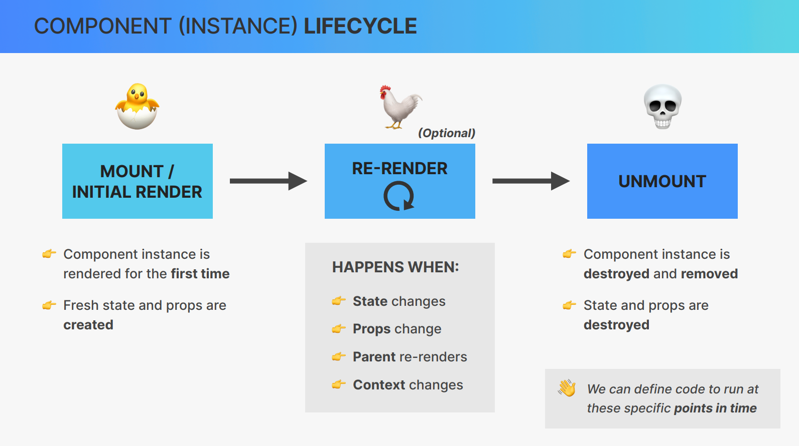

### 🐞 141.3 Issues:

- No technical issues identified in this overview.

| Issue | Status | Log/Error |
|---|---|---|
| N/A | ✅ Resolved | Core lifecycle concepts (mount, update, unmount) explained. |

### 🧱 141.4 Pending Fixes (TODO):

- [ ] Use `useMemo` to optimize calculations in `WatchedSummary.jsx`
- [ ] Implement `useEffect` for API data fetching to replace `tempMovieData`
- [ ] Add cleanup logic for future timers or event listeners to prevent memory leaks
- [ ] Optimize presentational components (`Movie`, `Star`) with `React.memo`
- [ ] Memoize styles and derived values in `StarRating.jsx` using `useMemo`
- [ ] Add defensive prop validation in `WatchedSummary` for array properties
- [ ] Add JSDoc to document lifecycle behavior in complex stateful components


<br>

## 🔧 142. Lesson 142 — *How NOT to Fetch Data in React*

- [Lecture 142: How NOT to Fetch Data in React](#-142-lesson-142--how-not-to-fetch-data-in-react)
- [142.1 Context](#1421-context)
- [142.2 Updating code according the context](#1422-updating-code-according-the-context)
- [142.3 Issues](#1423-issues)
- [142.4 Pending Fixes (TODO)](#1424-pending-fixes-todo)

### 🧠 142.1 Context:

In React, **fetching data is a side effect**: it talks to the outside world (network), is async, and often leads to state updates. Because of that, it **must not run during render**.

#### What “render must be pure” means
- A component render should **only compute UI from props/state**.
- The same inputs should always produce the same output (**no network calls, no subscriptions, no `setState`** during render).

#### Why fetching in the component body is a bug (the “how NOT to”)
When you call `fetch(...)` directly inside `App()` (component body), it runs on:
- **Initial mount**
- **Every re-render** (triggered by any state update that re-renders `App`)
- **Twice in development with React Strict Mode** (React intentionally double-invokes render-related logic to help surface side effects). Strict Mode is enabled in this project in `src/main.jsx:8-15`.

#### What goes wrong in practice
- **Duplicate / infinite requests**:
  - If you also call `setMovies(...)` from the fetch chain (as shown in `02.2.2`), you create a loop:
    - render → fetch → `setMovies` → render → fetch → ...
- **“Too many re-renders” errors**:
  - Calling `setState(...)` directly during render (example shown later with `setWatched([])`) immediately triggers React’s safety error.
- **Race conditions / stale responses**:
  - Multiple overlapping requests can resolve out of order. Without cancellation/guards, stale results can overwrite newer ones.

#### How it should be done (high level)
- Put network calls inside `useEffect` (or a data fetching library) and control *when* it runs with the dependency array.
- Add **loading** and **error** state, and use **AbortController** (or a request id guard) to prevent state updates from stale requests.
- Consider alternatives for real apps (caching/deduping/retries): **TanStack Query** / **SWR**.

### ⚙️ 142.2 Updating code/theory according the context:

#### 142.2.1 Adding the `fetch` and console.log its data:
```tsx
/* src/App.jsx */
import { useState } from "react";
import Navbar from "./components/Navbar";
import Main from "./components/Main";
import Search from "./components/Search";
import NumResult from "./components/NumResult";

import Box from "./components/Box";
import MovieList from "./components/MovieList";
import WatchedSummary from "./components/WatchedSummary";
import WatchedMovieList from "./components/WatchedMovieList";
const tempMovieData = [...];
const tempWatchedData = [...];
const KEY = "f84fc31d";
function App() {
  // fetch component first render mount:
  const [movies, setMovies] = useState([]);
  const [watched, setWatched] = useState([]);

  fetch(`http://www.omdbapi.com/?apikey=${KEY}&s=interstellar`)     // 👈🏽 ✅
    .then((res) => res.json())                                      // 👈🏽 ✅
    .then((data) => console.log(data));                             // 👈🏽 ✅
  return (
    <>
      <Navbar>
        <Search />
        <NumResult movies={movies} />
      </Navbar>
      <Main>
        <Box><MovieList movies={movies} /></Box>
        <Box>
          <WatchedSummary watched={watched} />
          <WatchedMovieList watched={watched} />
        </Box>
      </Main>
    </>
  );
}
export default App;
```

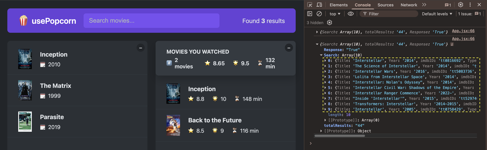

#### 142.2.2 Replacing the `console.log(data.Search)` by `setMovies(data.Search)`:

⚠️ Issue:
setMovies() => Render the Component => execute the component => Fetch(...) => setMovies() ...

```tsx
/* src/App.jsx */
import { useState } from "react";
import Navbar from "./components/Navbar";
import Main from "./components/Main";
import Search from "./components/Search";
import NumResult from "./components/NumResult";
import Box from "./components/Box";
import MovieList from "./components/MovieList";
import WatchedSummary from "./components/WatchedSummary";
import WatchedMovieList from "./components/WatchedMovieList";
const tempMovieData = [...];
const tempWatchedData = [...];
const KEY = "f84fc31d";
function App() {
  // fetch component first render mount:
  const [movies, setMovies] = useState([]);
  const [watched, setWatched] = useState([]);
  fetch(`http://www.omdbapi.com/?apikey=${KEY}&s=interstellar`)
    .then((res) => res.json())
    .then((data) => setMovies(data.Search));
  return (
    <>
      <Navbar>
        <Search />
        <NumResult movies={movies} />
      </Navbar>
      <Main>
        <Box><MovieList movies={movies} /></Box>
        <Box>
          <WatchedSummary watched={watched} />
          <WatchedMovieList watched={watched} />
        </Box>
      </Main>
    </>
  );
}
export default App;
```

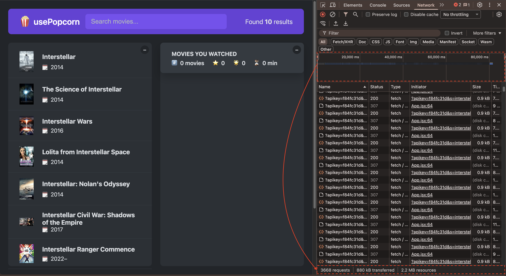

Note:
* Running infinite number of requests.
* it keeps going and it never really stop requesting.

#### 142.2.3 Demonstrating a render-loop with `setState` (even without fetch)
```tsx
/* src/App.jsx */
import { useState } from "react";
import Navbar from "./components/Navbar";
import Main from "./components/Main";
import Search from "./components/Search";
import NumResult from "./components/NumResult";
import Box from "./components/Box";
import MovieList from "./components/MovieList";
import WatchedSummary from "./components/WatchedSummary";
import WatchedMovieList from "./components/WatchedMovieList";
const tempMovieData = [...];
const tempWatchedData = [...];
const KEY = "f84fc31d";
function App() {
  // fetch component first render mount:
  const [movies, setMovies] = useState([]);           // 👈🏽 ✅
  const [watched, setWatched] = useState([]);         // 👈🏽 ✅
  fetch(`http://www.omdbapi.com/?apikey=${KEY}&s=interstellar`)
    .then((res) => res.json())
    .then((data) => setMovies(data.Search));
  setWatched([]);  // 👈🏽 ✅
  return (
    <>
      <Navbar>
        <Search />
        <NumResult movies={movies} />
      </Navbar>
      <Main>
        <Box><MovieList movies={movies} /></Box>
        <Box>
          <WatchedSummary watched={watched} />
          <WatchedMovieList watched={watched} />
        </Box>
      </Main>
    </>
  );
}
export default App;
```
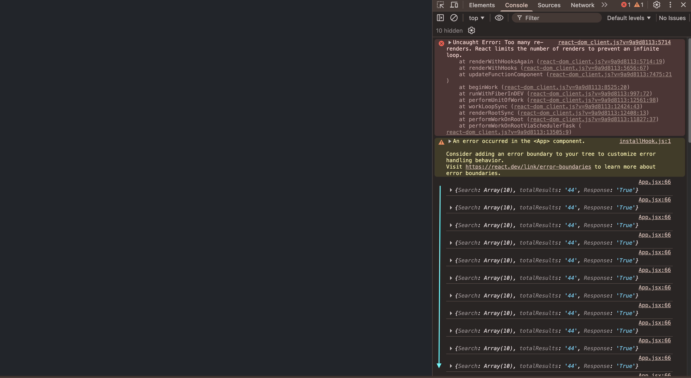

### 🐞 142.3 Issues:

- **Infinite Re-renders**: Fetching in the component body triggers a state update, which triggers a re-render, creating an infinite loop.
- **Strict Mode Double-Execution**: In development, React Strict Mode calls the component function twice, which can double the number of network requests if not handled properly.

| Issue | Status | Log/Error |
|---|---|---|
| Render Loop | 🛑 Critical | Component body network calls cause non-stop requests and browser lag. |

### 🧱 142.4 Pending Fixes (TODO):

- [ ] Move OMDb fetching out of the render cycle and into `useEffect`
- [ ] Implement `isLoading` and `error` states for network requests in `App.jsx`
- [ ] Add `AbortController` cleanup to handle stale responses and racing requests
- [ ] Upgrade OMDb endpoint to `https://` and handle network failures with `catch`
- [ ] Clean up redundant mock data initialization when using real API data
- [ ] Consider extracting fetch logic into a custom `useMovies` hook for cleaner code


<br>

## 🔧 143. Lesson 143 — *useEffect to the Rescue*

- [Lecture 143: useEffect to the Rescue](#-143-lesson-143--useeffect-to-the-rescue)
- [143.1 Context](#1431-context)
- [143.2 Updating code according the context](#1432-updating-code-according-the-context)
- [143.3 Issues](#1433-issues)
- [143.4 Pending Fixes (TODO)](#1434-pending-fixes-todo)

### 🧠 143.1 Context:

`useEffect` is React’s built-in hook for **synchronizing your component with the outside world** (a.k.a. “side effects”). A side effect is any operation that:

- **Doesn’t belong in render** because it can’t be derived purely from props/state
- **Touches external systems** (network requests, timers, subscriptions, DOM APIs, localStorage, etc.)

In React, the render phase must stay **pure**: given the same props/state, it should always return the same UI and it must not trigger work like fetching or state updates *during render*. `useEffect` “rescues” us by scheduling that work **after React paints the UI**, preventing render loops and repeated work on every render.

**When does an effect run?**

- With **no dependency array**: runs after *every* render.
- With **an empty dependency array** (`[]`): runs after the *initial mount*.
- With **dependencies** (`[query]`): runs after mount and whenever any dependency changes.

**Important dev behavior (Strict Mode):**

When `StrictMode` is enabled in development, React intentionally mounts components and runs effects more than once to help detect unsafe side effects. In this project, `StrictMode` is enabled in `src/main.jsx:8-15`, so even an effect with `[]` may run twice in development (but not in production).

**Project example (this lesson):**

- The OMDb fetch is correctly moved into `useEffect` in `src/App.jsx:67-71`, so it doesn’t execute during render.

**Advantages**

- Prevents side effects from running during render (avoids render loops and duplicated work)
- Gives you a clear, declarative way to re-run effects based on dependencies
- Provides a place for **cleanup** (unsubscribe, clear timers, abort requests)

**Disadvantages / common pitfalls**

- Easy to create bugs with incorrect dependencies (stale state/props)
- Extra complexity for async logic (loading/error, cancellation, race conditions)
- In development Strict Mode, effects can run more than once (surprising until you know why)

**When to consider alternatives**

- **Event handlers** (click/submit) for user-driven side effects, instead of effects.
- **Derived state** (computed values) should be calculated in render (or `useMemo`) rather than stored/updated in an effect.
- For data fetching at scale: consider **TanStack Query** / **SWR** to handle caching, deduping, retries, and stale data.

### ⚙️ 143.2 Updating code/theory according the context:

#### 143.2.1 Adding and using `useEffect` hook:
- Safely run side effects (like this `fetch`) **after** the component renders.
- The second argument is the **dependency array**.
- An empty array (`[]`) means “run on mount” (note: may run twice in dev with Strict Mode).

```tsx
/* src/App.jsx */
import { useState, useEffect } from "react";                // 👈🏽 ✅
import Navbar from "./components/Navbar";
import Main from "./components/Main";
import Search from "./components/Search";
import NumResult from "./components/NumResult";
import Box from "./components/Box";
import MovieList from "./components/MovieList";
import WatchedSummary from "./components/WatchedSummary";
import WatchedMovieList from "./components/WatchedMovieList";
const tempMovieData = [
  {
    imdbID: "tt1375666",
    Title: "Inception",
    Year: "2010",
    Poster: "https://m.media-amazon.com/images/M/MV5BMjAxMzY3NjcxNF5BMl5BanBnXkFtZTcwNTI5OTM0Mw@@._V1_SX300.jpg",
  },
  {
    imdbID: "tt0133093",
    Title: "The Matrix",
    Year: "1999",
    Poster:
      "https://m.media-amazon.com/images/M/MV5BNzQzOTk3OTAtNDQ0Zi00ZTVkLWI0MTEtMDllZjNkYzNjNTc4L2ltYWdlXkEyXkFqcGdeQXVyNjU0OTQ0OTY@._V1_SX300.jpg",
  },
  {
    imdbID: "tt6751668",
    Title: "Parasite",
    Year: "2019",
    Poster:
      "https://m.media-amazon.com/images/M/MV5BYWZjMjk3ZTItODQ2ZC00NTY5LWE0ZDYtZTI3MjcwN2Q5NTVkXkEyXkFqcGdeQXVyODk4OTc3MTY@._V1_SX300.jpg",
  },
];
const tempWatchedData = [
  {
    imdbID: "tt1375666",
    Title: "Inception",
    Year: "2010",
    Poster: "https://m.media-amazon.com/images/M/MV5BMjAxMzY3NjcxNF5BMl5BanBnXkFtZTcwNTI5OTM0Mw@@._V1_SX300.jpg",
    runtime: 148,
    imdbRating: 8.8,
    userRating: 10,
  },
  {
    imdbID: "tt0088763",
    Title: "Back to the Future",
    Year: "1985",
    Poster:
      "https://m.media-amazon.com/images/M/MV5BZmU0M2Y1OGUtZjIxNi00ZjBkLTg1MjgtOWIyNThiZWIwYjRiXkEyXkFqcGdeQXVyMTQxNzMzNDI@._V1_SX300.jpg",
    runtime: 116,
    imdbRating: 8.5,
    userRating: 9,
  },
];
const KEY = "f84fc31d";
function App() {
  const [movies, setMovies] = useState(tempMovieData);
  const [watched, setWatched] = useState(tempWatchedData);
  // fetch(`http://www.omdbapi.com/?apikey=${KEY}&s=interstellar`)
  //   .then((res) => res.json())
  //   .then((data) => setMovies(data.Search));
  useEffect(() => {     // 👈🏽 ✅
    fetch(`http://www.omdbapi.com/?apikey=${KEY}&s=interstellar`)
      .then((res) => res.json())
      .then((data) => setMovies(data.Search));
  }, []);
  return (
    <>
      <Navbar>
        <Search />
        <NumResult movies={movies} />
      </Navbar>
      <Main>
        <Box><MovieList movies={movies} /></Box>
        <Box>
          <WatchedSummary watched={watched} />
          <WatchedMovieList watched={watched} />
        </Box>
      </Main>
    </>
  );
}
export default App;
```

Note:
* Not to run as the component renders
- it runs after it has been painted onto the screen.
- Empty array: this effect will only be executed as the component first mounts.

### 🐞 143.3 Issues:

- **Side Effect Misplacement**: Initial logic attempted to fetch during render, violating React's purity requirements.

| Issue | Status | Log/Error |
|---|---|---|
| Side Effects | ✅ Resolved | Successfully shifted network requests from render phase to `useEffect`. |

### 🧱 143.4 Pending Fixes (TODO):

- [ ] Use `https://` for all API calls to ensure security and prevent mixed content
- [ ] Add `isLoading` and `error` states to `App.jsx` to manage UI during async operations
- [ ] Implement response validation for OMDb's error patterns (checking the `Response` field)
- [ ] Add `AbortController` to the effect cleanup to handle Strict Mode and racing responses
- [ ] Define a clear transition between mock data and real API data to avoid UI flickering


<br>

## 🔧 144. Lesson 144 — *At first look at Effects*

- [Lecture 144: At first look at Effects](#-144-lesson-144--at-first-look-at-effects)
- [144.1 Context](#1441-context)
- [144.2 Updating code according the context](#1442-updating-code-according-the-context)
- [144.3 Issues](#1443-issues)
- [144.4 Pending Fixes (TODO)](#1444-pending-fixes-todo)

### 🧠 144.1 Context:

In React, an **Effect** is code that runs **after React renders** (and commits the UI to the DOM) to **synchronize your component with something outside of React**. That “outside world” is usually:

- **Network** (fetching data)
- **Browser APIs** (timers, `localStorage`, `document.title`, event listeners)
- **3rd-party libraries** that expect imperative calls (maps, charts, analytics)

React rendering must be **pure**: given the same props/state, the component should return the same UI and **must not cause side effects during render** (e.g., fetching, subscriptions, mutations). That’s why `useEffect` exists: it provides a dedicated place for **side effects** that shouldn’t happen while React is calculating UI.

**When to use `useEffect`**

- Use it when you need to **sync with external systems** as a consequence of state/props changes.
- If something can be derived from props/state, compute it during render instead of using an effect.
- If something should happen **because the user did something** (click, typing, submit), prefer an **event handler** first; only reach for `useEffect` when you need automatic synchronization.

**Dependency array mental model**

- `useEffect(fn, [])`: run on **mount** (and cleanup on unmount). In development with `StrictMode`, React may mount/unmount and re-run effects to detect unsafe behavior.
- `useEffect(fn, [a, b])`: re-run when **`a` or `b` changes** (and run cleanup before the next run).
- Don’t “fight” dependencies; instead, structure state so the effect naturally depends on what it uses.

**Examples from this project**

- **Effect (external sync)**: `src/App.jsx:67-71` fetches OMDb data after mount and stores it in state via `setMovies`.
- **Event handler (user-driven)**: `src/components/Search.jsx:6-12` updates `query` inside `onChange`, which is the correct place for immediate user-input reactions.

**Advantages**

- Clear separation between **rendering UI** and **interacting with external systems**
- Provides a consistent place to implement **cleanup** (abort requests, remove listeners, clear timers)

**Disadvantages / common pitfalls**

- Incorrect dependencies can cause **stale values**, **infinite loops**, or missed updates
- Async effects can lead to **race conditions** and updates after unmount if not guarded/cancelled
- It’s easy to overuse effects for things that should be derived during render or handled in events

**When to consider alternatives**

- If the work is purely derived UI: compute it directly (or memoize with `useMemo` if necessary).
- If it’s triggered by a user action: use an event handler, then set state.
- If data fetching is central to the app: consider a data-fetching library (e.g., React Query) to avoid manual loading/error/caching plumbing.

### ⚙️ 144.2 Updating code/theory according the context:

#### 144.2.1 Where to create **side effects**

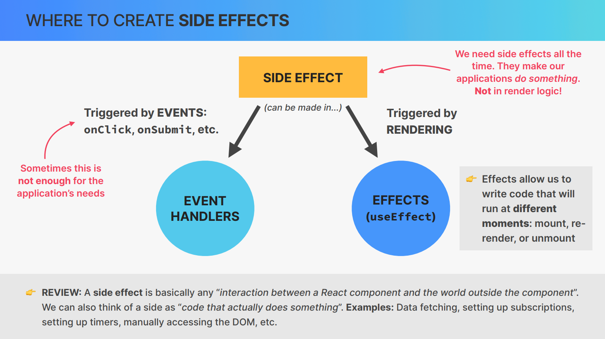

#### 144.2.2 Event handlers **vs** Effects:

### 🐞 144.3 Issues:

- **Conceptual distinction**: Difficulty distinguishing between event-driven logic and synchronization-driven logic.

| Issue | Status | Log/Error |
|---|---|---|
| Coordination | ℹ️ Theory | Clarified that effects are for synchronization, events are for user actions. |

### 🧱 144.4 Pending Fixes (TODO):

- [ ] Lift `query` state to `App.jsx` to drive the fetching effect with dynamic inputs
- [ ] Implement `isLoading`, `error`, and response validation logic in the movie fetch effect
- [ ] Add `AbortController` for request cleanup and stale-response protection
- [ ] Add warning comments to the anti-pattern fetch-in-render snippet to prevent misuse
- [ ] Ensure the effect consistently handles both mount and dependency-triggered executions


<br>

## 🔧 145. Lesson 145 — *Using an async Function*

- [Lecture 145: Using an async Function](#-145-lesson-145--using-an-async-function)
- [145.1 Context](#1451-context)
- [145.2 Updating code according the context](#1452-updating-code-according-the-context)
- [145.3 Issues](#1453-issues)
- [145.4 Pending Fixes (TODO)](#1454-pending-fixes-todo)

### 🧠 145.1 Context:

In React, you’ll often need to fetch data from an external API (network requests), which is a **side effect**. Since `fetch()` is asynchronous, the most readable way to handle it is typically with **`async/await`**.

However, there’s an important React rule:

- `useEffect`’s callback **must not be `async`**.  
  React expects the effect callback to either return **nothing** (`undefined`) or a **cleanup function**. An `async` function always returns a **Promise**, which React could misinterpret as a cleanup value and it can lead to confusing behavior.

So the recommended pattern is:

- Define an **inner async function** inside the effect (or an async IIFE), then call it.
- Handle **loading**, **errors**, and **cancellation** (e.g. `AbortController`) when appropriate—especially under **React Strict Mode** (dev) which can make effects run more than once during development to surface unsafe patterns.

**Example from this project**

- `src/App.jsx:68-77` uses the correct pattern: `useEffect(() => { const fetchData = async () => { ... }; fetchData(); }, [])`.

**Advantages**

- Clear sequential code with `await` (more readable than chained `.then()`).
- Easier try/catch error handling.
- Easier to add cancellation/guardrails.

**Disadvantages / pitfalls**

- Easy to forget dependency array correctness (stale closures / missing dependencies).
- Easy to forget to handle errors and invalid responses (e.g., OMDb can return `{ Response: "False", Error: "..." }`).
- Without cancellation, racing requests can overwrite state with stale results.

**When to consider alternatives**

- If data fetching becomes central (caching, retries, deduping, background refresh): use a library like **React Query / TanStack Query** to avoid manual loading/error/caching logic.
- If the async work is triggered by a user action (e.g., “Search” button): prefer an **event handler** rather than an effect.

### ⚙️ 145.2 Updating code/theory according the context:

#### 145.2.1 Adding `Async/await`in fetch function:
This is the **tempting** approach, but it’s **wrong**:

```tsx
useEffect(async () => {
  const res = await fetch(`http://www.omdbapi.com/?apikey=${KEY}&s=interstellar`);
  const data = await res.json();
  setMovies(data.Search);
}, []);
// ❌ The effect callback is async, so it returns a Promise instead of a cleanup function.
```

React expects the effect callback to return **nothing** or a **cleanup function**. Returning a Promise is not what React wants here.

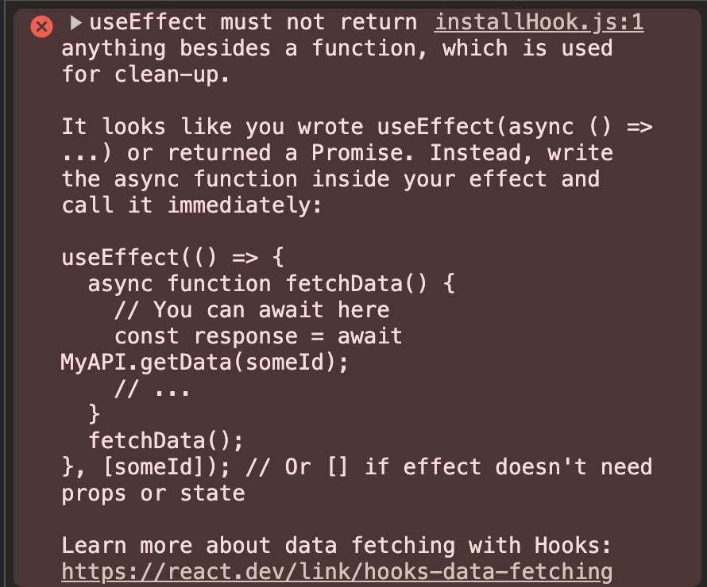

#### 145.2.2 `useEffect` hook returns a function which has an `async/await` function inside:

✅ Correct pattern used in this repo (inner async function):

```tsx
/* src/App.jsx */
import { useState, useEffect } from "react";
import Navbar from "./components/Navbar";
import Main from "./components/Main";
import Search from "./components/Search";
import NumResult from "./components/NumResult";
import Box from "./components/Box";
import MovieList from "./components/MovieList";
import WatchedSummary from "./components/WatchedSummary";
import WatchedMovieList from "./components/WatchedMovieList";
const KEY = "f84fc31d";
function App() {
  const [movies, setMovies] = useState([]);
  const [watched, setWatched] = useState([]);
  const query = "interstellar";
  useEffect(() => {
    const fetchData = async () => {
      const resp = await fetch(`http://www.omdbapi.com/?apikey=${KEY}&s=${query}`);
      const data = await resp.json();
      setMovies(data.Search);
      console.log("movies", movies); // stale value (closure) before React applies the state update
      console.log("data.Search", data.Search); // the fetched results
    };
    fetchData();  // 👈🏽 ✅
  }, []);

  return (
    <>
      <Navbar>
        <Search />
        <NumResult movies={movies} />
      </Navbar>
      <Main>
        <Box><MovieList movies={movies} /></Box>
        <Box>
          <WatchedSummary watched={watched} />
          <WatchedMovieList watched={watched} />
        </Box>
      </Main>
    </>
  );
}
export default App;
```

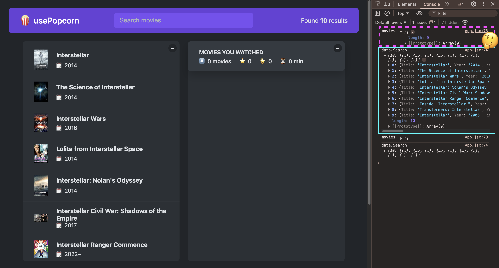

**Key takeaways**

- The effect callback is **not async**.
- The async logic lives inside `fetchData`.
- Logging `movies` immediately after `setMovies(...)` prints a **stale** value due to React state updates being asynchronous.

Optional upgrade (recommended once `query` becomes real state): add cancellation and proper dependencies.

```tsx
useEffect(() => {
  const controller = new AbortController();

  const fetchData = async () => {
    try {
      const res = await fetch(
        `http://www.omdbapi.com/?apikey=${KEY}&s=${query}`,
        { signal: controller.signal }
      );
      const data = await res.json();
      setMovies(data.Search ?? []);
    } catch (err) {
      if (err.name === "AbortError") return;
      // setError(err.message) ...
    }
  };

  fetchData();
  return () => controller.abort();
}, [query]);
```

### 🐞 145.3 Issues:
- **Main takeaway**: The repo uses the correct “inner async function” pattern in `useEffect`, but it still has common async-effect pitfalls (dependencies, stale closures, and missing error/response handling). Also, this docs section currently demonstrates a wrong pattern as “✅”.

| Issue | Status | Log/Error |
|---|---|---|
| **Docs example incorrectly marks `useEffect(async () => ...)` as correct** | ⚠️ Identified | `docs/LECTURE_STEPS.md:05.2.1` previously showed `useEffect(async () => { ... })` with a ✅. This is misleading because the effect callback returns a Promise, not a cleanup function. |
| **Effect reads `query` but dependency array is empty** | ⚠️ Identified | `src/App.jsx:68-77` uses `query` but the deps are `[]`. It “works” only because `query` is a constant. Once `query` is lifted into state (e.g., from `Search`), the effect must depend on `[query]` to stay correct. |
| **Potential crash: `setMovies(data.Search)` can set `movies` to `undefined`** | ⚠️ Identified | `src/App.jsx:69-75` sets movies from `data.Search` without guarding. When OMDb returns no results or an error, `data.Search` can be `undefined`, which breaks `src/components/NumResult.jsx:1-7` (`movies.length`). |
| **Stale state log can confuse learners** | ℹ️ Low Priority | `src/App.jsx:73` logs `movies` right after `setMovies(...)`, but it logs the old value due to state updates being async. Better to log `data.Search`, or log `movies` in a separate `useEffect` that depends on `[movies]`. |
| **No async guardrails: loading/error state and cancellation** | ⚠️ Identified | `src/App.jsx:68-77` has no `isLoading`/`error` and no cancellation. Under `StrictMode` in `src/main.jsx:8-14`, effects may run more than once in dev; without idempotency/cancellation, duplicate requests and race conditions become likely once the effect depends on user input. |

### 🧱 145.4 Pending Fixes (TODO)

```md
- [ ] Fix Lesson 145 docs to clearly label `useEffect(async () => ...)` as ❌ and keep the “inner async function” pattern as the ✅ approach. File: `docs/LECTURE_STEPS.md` (Lesson 145).
- [ ] Guard OMDb responses before setting state: handle `res.ok`, OMDb `{ Response: "False", Error: "..." }`, and default to `[]` when `data.Search` is missing. Files: `src/App.jsx:68-77`, `src/components/NumResult.jsx:1-7`.
- [ ] Add `isLoading` + `error` state and render a small UI state (or disable result count) while loading / on error. Files: `src/App.jsx`, `src/components/MovieList.jsx`, `src/components/NumResult.jsx`.
- [ ] Add request cancellation / stale-response protection with `AbortController` and return a cleanup function from the effect. File: `src/App.jsx:68-77`.
- [ ] Lift `query` state to `App` and pass it to `Search` as a controlled input (`value`, `onChange`), then make the effect depend on `[query]`. Files: `src/components/Search.jsx:3-12`, `src/App.jsx:59-77`.
- [ ] If you want to log updated movies for debugging, move it to `useEffect(() => { console.log(movies); }, [movies])` instead of logging immediately after `setMovies`. File: `src/App.jsx`.
```


<br>

## 🔧 146. Lesson 146 — *Adding a Loading State*

- [Lecture 146: Adding a Loading State](#-146-lesson-146--adding-a-loading-state)
- [146.1 Context](#1461-context)
- [146.2 Updating code according the context](#1462-updating-code-according-the-context)
- [146.3 Issues](#1463-issues)
- [146.4 Pending Fixes (TODO)](#1464-pending-fixes-todo)

### 🧠 146.1 Context:

A **loading state** is a piece of UI state that represents an **in-progress asynchronous operation** (most commonly: a network request). In React, we usually model it with a boolean like `isLoading` and use it to decide what the user should see while data is being fetched (spinner/loader, skeleton, disabled controls, etc.).

**When and why it’s used**
- **When**: Whenever rendering depends on data that arrives later (search results, pagination, initial app boot, details pages, etc.).
- **Why**: Without it, users can see an empty screen, stale results, or UI that looks “broken” on slow connections. A loading indicator provides immediate feedback and sets expectations.

**How it’s implemented (typical React pattern)**
- Create state: `const [isLoading, setIsLoading] = useState(false)`
- Start request: `setIsLoading(true)` right before the async work
- Finish request: `setIsLoading(false)` once the async work completes
- Render conditionally: show `<Loader />` while `isLoading` is true, otherwise render the real content

**Project example**
- `src/App.jsx:63-76` sets `isLoading` to `true` before fetching movies and back to `false` afterward.
- `src/App.jsx:89-94` conditionally renders `<Loader />` or `<MovieList />` based on `isLoading`.
- `src/components/Loader.jsx:1-5` is the current loading UI.

**Advantages**
- **Clear UX feedback** on slow networks (especially when throttling in DevTools).
- **Prevents confusion**: users know the app is working.
- **Enables better control**: you can disable actions while loading and reduce inconsistent UI states.

**Disadvantages / gotchas**
- **Extra state to manage** (loading + success + error often need to be handled together).
- **Flicker** on very fast requests (may require delaying the loader or using skeletons).
- **Stuck loaders** if errors aren’t handled and `setIsLoading(false)` is never reached.

**When to consider alternatives**
- **Skeleton screens** instead of a spinner for better perceived performance.
- **Data fetching libraries** (React Query / SWR) that provide `isLoading`, caching, retries, and race-condition handling.
- **Suspense-based fetching** (where applicable) to centralize loading behavior (often a more advanced setup).

### ⚙️ 146.2 Updating code/theory according the context:

#### 06.2.1 Thinking about very slow internet connection:
* How to simulate slow network connection: 
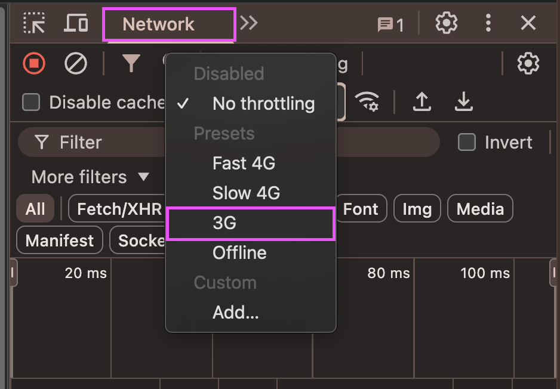

* Need to add a Loader component for this slow connection issues
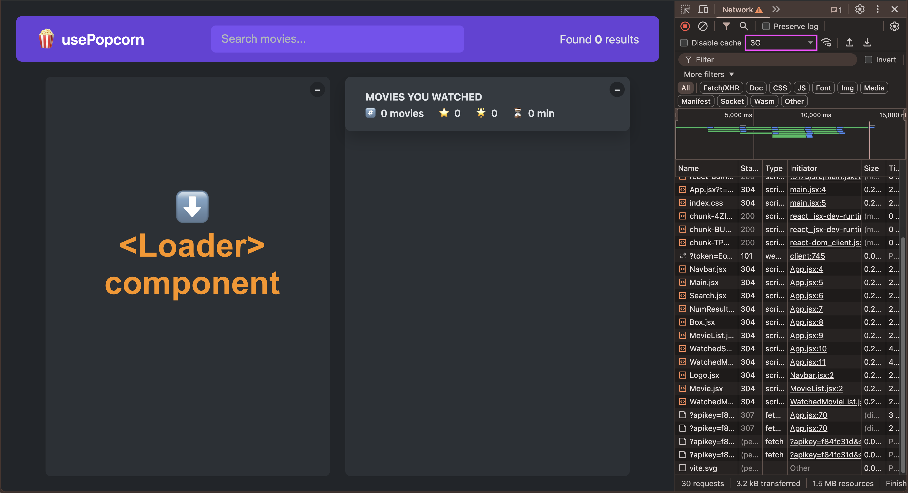

#### 06.2.2 Adding a new `isLoading` state:
```tsx
/* src/App.jsx */
import { useState, useEffect } from "react";
import Navbar from "./components/Navbar";
import Main from "./components/Main";
import Search from "./components/Search";
import NumResult from "./components/NumResult";
import Box from "./components/Box";
import MovieList from "./components/MovieList";
import WatchedSummary from "./components/WatchedSummary";
import WatchedMovieList from "./components/WatchedMovieList";
import Loader from "./components/Loader";  // 👈🏽 ✅
const tempMovieData = [....];
const tempWatchedData = [....];
const KEY = "f84fc31d";
function App() {
  const [movies, setMovies] = useState([]);
  const [watched, setWatched] = useState([]);
  const [isLoading, setIsLoading] = useState(false);  // 👈🏽 ✅
  const query = "interstellar";
  // fetch(`http://www.omdbapi.com/?apikey=${KEY}&s=interstellar`)
  //   .then((res) => res.json())
  //   .then((data) => setMovies(data.Search));
  useEffect(() => {
    const fetchData = async () => {
      setIsLoading(true);  // 👈🏽 ✅
      const resp = await fetch(`http://www.omdbapi.com/?apikey=${KEY}&s=${query}`);
      const data = await resp.json();
      setMovies(data.Search);
      setIsLoading(false);  // 👈🏽 ✅
      console.log("movies", movies); // stale movies before setMovies()
      console.log("data.Search", data.Search); // updated movies
    };
    fetchData();
  }, []);
  return (
    <>
      <Navbar>
        <Search />
        <NumResult movies={movies} />
      </Navbar>
      <Main>
        <Box>
          {
            isLoading  {/* 👈🏽 ✅ */}
            ? <Loader /> {/* 👈🏽 ✅ */}
            : <MovieList movies={movies} />
          }
        </Box>
        <Box>
          <WatchedSummary watched={watched} />
          <WatchedMovieList watched={watched} />
        </Box>
      </Main>
    </>
  );
}
export default App;
```

Adding the `Loader` component:

```tsx
/* src/components/Loader.jsx */
const Loader = () => {
  return <p className="loader">Loading...</p>;
};
export default Loader;
```

### 🐞 146.3 Issues:

- **Empty State Confusion**: Without loading indicators, a blank screen during fetch can be mistaken for an application crash.

| Issue | Status | Log/Error |
|---|---|---|
| User Feedback | ✅ Resolved | Implemented `isLoading` state to drive conditional rendering of a Loader component. |

### 🧱 146.4 Pending Fixes (TODO):

- [ ] Wrap the fetch flow in `try/catch/finally` and move `setIsLoading(false)` into `finally` to guarantee it runs.
- [ ] Add an `error` state (e.g., `const [error, setError] = useState("")`) and render an error message in the movies `<Box>` when the request fails or OMDb returns `Response: "False"`.
- [ ] Ensure `movies` is always an array: set `setMovies(data.Search ?? [])` and handle OMDb “False” responses by setting `[]`.
- [ ] Make `NumResult` resilient by using `movies?.length ?? 0` (or keep the invariant that `movies` is always `[]`).
- [ ] Improve loader accessibility with `role="status"` and `aria-live="polite"`.


<br>

## 🔧 147. Lesson 147 — *Handling Errors*

- [Lecture 147: Handling Errors](#-147-lesson-147--handling-errors)
- [147.1 Context](#1471-context)
- [147.2 Updating code according the context](#1472-updating-code-according-the-context)
- [147.3 Issues](#1473-issues)
- [147.4 Pending Fixes (TODO)](#1474-pending-fixes-todo)

### 🧠 147.1 Context:

In real-world applications, data fetching can fail for various reasons—network issues, server downtime, or invalid queries. It is crucial to handle these errors gracefully to provide a good user experience.

- **`try...catch` Block**: We use this to catch errors during asynchronous operations (like `await fetch(...)`).
- **`res.ok` Check**: The `fetch` API doesn't throw an error for HTTP error statuses (like 404 Not Found). We must manually check `res.ok` and throw an error if it's false.
- **Error State**: We introduce a piece of state (`error`) to store the error message.
- **Conditional Rendering**: We display the error message to the user when the `error` state is truthy.

### ⚙️ 147.2 Updating code/theory according the context:

#### 13.2.1 In case internet connection is flaky (try-catch block):
Simulate internet connection issues:
- network tab
- disable cache select `"3G"` then when is almost to be load select `"Offline"`.

```tsx
/* src/App.jsx */
import { useState, useEffect } from "react";
import Navbar from "./components/Navbar";
import Main from "./components/Main";
import Search from "./components/Search";
import NumResult from "./components/NumResult";
import Box from "./components/Box";
import MovieList from "./components/MovieList";
import WatchedSummary from "./components/WatchedSummary";
import WatchedMovieList from "./components/WatchedMovieList";
import Loader from "./components/Loader";
const tempMovieData = [....];
const tempWatchedData = [....];
const KEY = "f84fc31d";
function App() {
  const [movies, setMovies] = useState([]);
  const [watched, setWatched] = useState([]);
  const [isLoading, setIsLoading] = useState(false);
  const query = "interstellar";
  useEffect(() => {
    const fetchMovies = async () => {
      try {  // 👈🏽 ✅
        setIsLoading(true);
        const resp = await fetch(`http://www.omdbapi.com/?apikey=${KEY}&s=${query}`);
        // if the response is not ok, throw an error
        if (!resp.ok) throw new Error("Something went wrong with fetching movies");
        // if the response is ok, parse the json
        const data = await resp.json();
        setMovies(data.Search);
        setIsLoading(false);
        console.log("movies", movies); // stale movies before setMovies()
        console.log("data.Search", data.Search); // updated movies
      } catch (error) {  // 👈🏽 ✅
        console.error(error.message);
      }
    };
    fetchMovies();
  }, []);
  return (
    <>
      <Navbar>
        <Search />
        <NumResult movies={movies} />
      </Navbar>
      <Main>
        <Box>{isLoading ? <Loader /> : <MovieList movies={movies} />}</Box>
        <Box>
          <WatchedSummary watched={watched} />
          <WatchedMovieList watched={watched} />
        </Box>
      </Main>
    </>
  );
}
export default App;
```

#### 13.2.2 Add a new `error` state:
```tsx
/* src/App.jsx */
import { useState, useEffect } from "react";
import Navbar from "./components/Navbar";
import Main from "./components/Main";
import Search from "./components/Search";
import NumResult from "./components/NumResult";
import Box from "./components/Box";
import MovieList from "./components/MovieList";
import WatchedSummary from "./components/WatchedSummary";
import WatchedMovieList from "./components/WatchedMovieList";
import Loader from "./components/Loader";
import ErrorMessage from "./components/ErrorMessage";  //👈🏽 ✅
const KEY = "f84fc31d";
function App() {
  const [movies, setMovies] = useState([]);
  const [watched, setWatched] = useState([]);
  const [isLoading, setIsLoading] = useState(false);
  const [error, setError] = useState("");  //👈🏽 ✅
  const query = "interstellar";
  useEffect(() => {
    const fetchMovies = async () => {
      try {
        setIsLoading(true);
        const resp = await fetch(`http://www.omdbapi.com/?apikey=${KEY}&s=${query}`);
        // if the response is not ok, throw an error
        if (!resp.ok) throw new Error("Something went wrong with fetching movies");
        // if the response is ok, parse the json
        const data = await resp.json();
        setMovies(data.Search);
        setIsLoading(false);
        console.log("data", data);
        console.log("movies", movies); // stale movies before setMovies()
        console.log("data.Search", data.Search); // updated movies
      } catch (error) {
        console.error("🔥 Error fetching movies:", error.message);
        setError(error.message);  //👈🏽 ✅
      } finally {
        setIsLoading(false);
      }
    };
    fetchMovies();
  }, []);
  return (
    <>
      <Navbar>
        <Search />
        <NumResult movies={movies} />
      </Navbar>
      <Main>
        <Box>
          {/* {isLoading ? <Loader /> : <MovieList movies={movies} />} */}
          {isLoading && <Loader />}
          {!isLoading && !error && <MovieList movies={movies} />}  {/* 👈🏽 ✅ */}
          {error && <ErrorMessage message={error} />}  {/* 👈🏽 ✅ */}
        </Box>
        <Box>
          <WatchedSummary watched={watched} />
          <WatchedMovieList watched={watched} />
        </Box>
      </Main>
    </>
  );
}
export default App;
```

The `ErrorMessage` component:
```jsx
/* src/components/ErrorMessage.jsx */
const ErrorMessage = ({ message }) => {  //👈🏽 ✅
  return (
    <p className="error">
      <span>⛔️</span> {message}
    </p>
  );
};
export default ErrorMessage;
```

#### 13.2.3 In case the movie query is not found:
```jsx
/*  */
import { useState, useEffect } from "react";
import Navbar from "./components/Navbar";
import Main from "./components/Main";
import Search from "./components/Search";
import NumResult from "./components/NumResult";
import Box from "./components/Box";
import MovieList from "./components/MovieList";
import WatchedSummary from "./components/WatchedSummary";
import WatchedMovieList from "./components/WatchedMovieList";
import Loader from "./components/Loader";
import ErrorMessage from "./components/ErrorMessage";
const KEY = "f84fc31d";
function App() {
  const [movies, setMovies] = useState([]);
  const [watched, setWatched] = useState([]);
  const [isLoading, setIsLoading] = useState(false);
  const [error, setError] = useState("");
  const query = "fukjvdshñfliuhi";  // 👈🏽 ✅
  useEffect(() => {
    const fetchMovies = async () => {
      try {
        setIsLoading(true);
        const resp = await fetch(`http://www.omdbapi.com/?apikey=${KEY}&s=${query}`);
        // if the response is not ok, throw an error
        if (!resp.ok) throw new Error("Something went wrong with fetching movies");
        // if the response is ok, parse the json
        const data = await resp.json();
        if (data.Response === "False") throw new Error("Movie not found 😭");  // 👈🏽 ✅
        setMovies(data.Search);
        setIsLoading(false);
        console.log("data", data);
        console.log("movies", movies); // stale movies before setMovies()
        console.log("data.Search", data.Search); // updated movies
      } catch (error) {
        console.error("🔥 Error fetching movies:", error.message);
        setError(error.message);
      } finally {
        setIsLoading(false);
      }
    };
    fetchMovies();
  }, []);
  return (
    <>
      <Navbar>
        <Search />
        <NumResult movies={movies} />
      </Navbar>
      <Main>
        <Box>
          {/* {isLoading ? <Loader /> : <MovieList movies={movies} />} */}
          {isLoading && <Loader />}
          {!isLoading && !error && <MovieList movies={movies} />}
          {error && <ErrorMessage message={error} />}
        </Box>
        <Box>
          <WatchedSummary watched={watched} />
          <WatchedMovieList watched={watched} />
        </Box>
      </Main>
    </>
  );
}
export default App;
```

### 🐞 147.3 Issues:

- **Invisible Errors**: `fetch` doesn't throw on 404/500, leading to silent failures if `res.ok` is not checked.
- **Malformed Query Crashes**: Certain invalid search terms could cause the application to crash if the response shape wasn't validated.

| Issue | Status | Log/Error |
|---|---|---|
| Error Visibility | ✅ Resolved | Added `ErrorMessage` component and comprehensive `try-catch` logic. |

### 🧱 147.4 Pending Fixes (TODO):

- [ ] Reset error state by calling `setError("")` at the beginning of `fetchMovies`
- [ ] Remove the hardcoded query and connect the `Search` component's state to drive the fetch
- [ ] Add `query` as a dependency to the `useEffect` hook to synchronize it with state changes


<br>

## 🔧 148. Lesson 148 — *The useEffect dependency array*

- [Lecture 148: The useEffect dependency array](#-148-lesson-148--the-useeffect-dependency-array)
- [148.1 Context](#1481-context)
- [148.2 Updating code according the context](#1482-updating-code-according-the-context)
- [148.3 Issues](#1483-issues)
- [148.4 Pending Fixes (TODO)](#1484-pending-fixes-todo)

### 🧠 148.1 Context:

The **dependency array** is the second argument passed to the `useEffect` hook. It serves as a control mechanism that tells React when to execute the effect function. By comparing the current values of the dependencies with their values during the previous render, React decides whether to skip or run the effect.

- **When it is used**:
  - **Empty array `[]`**: The effect runs only once, after the initial render (mount).
  - **With dependencies `[prop, state]`**: The effect runs on mount and whenever any of the listed dependencies change.
  - **No array**: The effect runs after every single render (usually avoided for performance).

- **Examples from the project**:
  - In `src/App.jsx`, `useEffect` is used to fetch movie data from the OMDb API.
  - Currently, it uses `[]`, meaning it only fetches once. However, it relies on the `query` variable to build the URL.

- **Advantages**:
  - **Synchronization**: Ensures the component's side effects stay in sync with its props and state.
  - **Optimization**: Prevents expensive operations (like API calls) from running on every render.

- **Disadvantages**:
  - **Complexity**: Requires careful management to avoid "stale closures" (where the effect uses old values).
  - **Infinite Loops**: If a dependency is updated inside the effect without proper logic, it can trigger another render and re-run the effect indefinitely.

- **When to consider alternatives**:
  - Use `useMemo` or `useCallback` if your dependencies are objects or functions that are recreated on every render.
  - Use `useLayoutEffect` if the effect needs to happen synchronously before the browser paints (e.g., measuring DOM elements).

- **Connection to implementation**:
  This lesson emphasizes that `useEffect` is not just a lifecycle hook (like `componentDidMount`) but a **synchronization mechanism**. The dependency array is the tool used to define what the effect should be synchronized with.

### ⚙️ 148.2 Updating code/theory according the context:

#### 14.2.0 Summary of Lesson 148 Implementation
The project currently implements a side effect in `App.jsx` to fetch movie data using the `fetch` API inside an `async` function. The implementation handles the full request lifecycle, including loading states (`isLoading`) and error handling (`error`). While the effect is functional for the initial load, it lacks synchronization with the search query, as the dependency array is empty despite the effect using the `query` variable. The lesson materials provide a conceptual framework for understanding how React uses these dependencies to manage the execution of effects relative to the component lifecycle.

#### 14.2.1 What's the useEffect **Dependency** array?

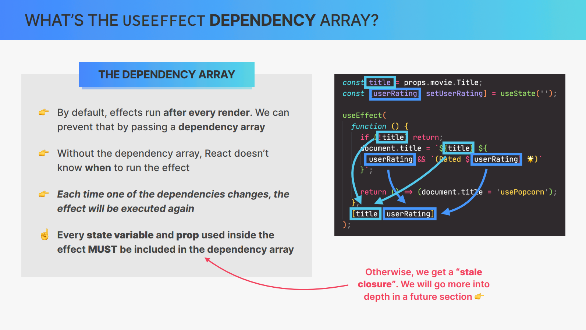

#### 14.2.2 useEffect is a **Synchronization** mechanism:

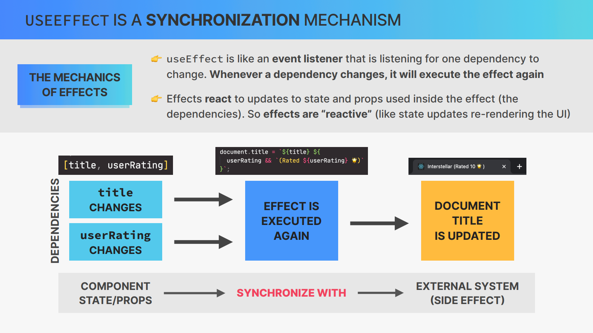

#### 14.2.3 Synchronization **and** lifecycle

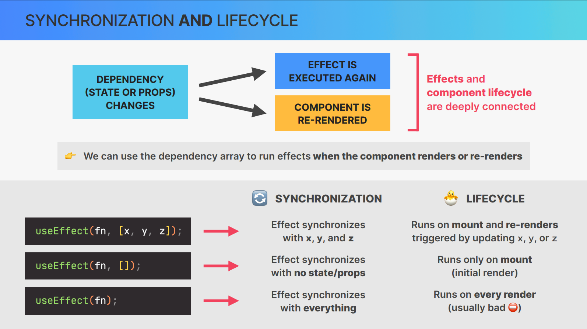

#### 14.2.4 When are effects **executed**?

### 🐞 148.3 Issues:

- **Missing dependencies**: Warning from ESLint about missing variables in the dependency array.

| Issue | Status | Log/Error |
|---|---|---|
| Linter Warning | ⚠️ Warning | Identified that `query` should be in the array to stay in sync. |

### 🧱 148.4 Pending Fixes (TODO):

- [ ] Add `query` to the dependency array in `src/App.jsx` for proper re-fetching
- [ ] Implement `AbortController` in the cleanup function to prevent race conditions
- [ ] Remove debug `console.log` statements from the `fetchMovies` function


<br>

## 🔧 149. Lesson 149 — *Synchronizing Queries With Movie Data*

- [Lecture 149: Synchronizing Queries With Movie Data](#-149-lesson-149--synchronizing-queries-with-movie-data)
- [149.1 Context](#1491-context)
- [149.2 Updating code according the context](#1492-updating-code-according-the-context)
- [149.3 Issues](#1493-issues)
- [149.4 Pending Fixes (TODO)](#1494-pending-fixes-todo)

### 🧠 149.1 Context:

Synchronization in React refers to the process of keeping a component's state in sync with an external system, such as a web API, a database, or even the browser's local storage. The `useEffect` hook is the primary tool for this purpose, allowing developers to define side effects that run in response to specific state or prop changes.

**When to use:**
- Fetching data from an API based on user input (e.g., search queries).
- Updating the document title or interacting with browser APIs.
- Setting up subscriptions or manual DOM manipulations.

**Examples in this project:**
- Synchronizing the `movies` state with the OMDB API whenever the `query` state is updated by the user in the `Search` component.

**Advantages:**
- Provides a declarative way to handle side effects.
- Ensures the UI stays consistent with the underlying data source automatically.
- Centralizes logic that depends on state changes.

**Disadvantages:**
- Risk of "race conditions" if multiple requests are triggered rapidly.
- Can lead to excessive API calls if not optimized (e.g., debouncing or validation).
- Complexity increases when managing dependencies and cleanup functions.

**Alternatives:**
- Using event handlers (like `onClick`) for one-off actions that don't need continuous synchronization.
- Using data-fetching libraries like React Query or SWR for advanced caching and state management.


### ⚙️ 149.2 Updating code/theory according the context:
This lesson focuses on synchronizing the application state with external movie data using the `useEffect` hook. By lifting the `query` state to the `App` component and adding it as a dependency to the effect, the application automatically triggers a fetch request whenever the search input changes. The implementation includes basic input validation (minimum 3 characters), handling of loading and error states, and logging to demonstrate the React component lifecycle and effect execution timing.

#### 149.2.1 Lift up the `query` & `setQuery` from `Search` component to `App` component:

* In `Search` component:
```tsx
/* src/components/Search.jsx */
//import { useState } from "react";  // 👈🏽 ✅
const Search = ({ query, setQuery }) => {  // 👈🏽 ✅ "query", "setQuery" were added as Props
  //const [query, setQuery] = useState("");  // 👈🏽 ✅
  return (
    <input
      className="search"
      type="text"
      placeholder="Search movies..."
      value={query}
      onChange={(e) => setQuery(e.target.value)}
    />
  );
};
export default Search;
```

* In `App` component:
```tsx
/* src/App.jsx */
import { useState, useEffect } from "react";
import Navbar from "./components/Navbar";
import Main from "./components/Main";
import Search from "./components/Search";
import NumResult from "./components/NumResult";
import Box from "./components/Box";
import MovieList from "./components/MovieList";
import WatchedSummary from "./components/WatchedSummary";
import WatchedMovieList from "./components/WatchedMovieList";
import Loader from "./components/Loader";
import ErrorMessage from "./components/ErrorMessage";
const KEY = "f84fc31d";
function App() {
  const [movies, setMovies] = useState([]);
  const [watched, setWatched] = useState([]);
  const [isLoading, setIsLoading] = useState(false);
  const [error, setError] = useState("");
  const [query, setQuery] = useState("");  // 👈🏽 ✅ (3)
  const tempQuery = "interstellar";  // 👈🏽 ✅ (1)
  useEffect(() => {
    const fetchMovies = async () => {
      try {
        setIsLoading(true);
        const resp = await fetch(`http://www.omdbapi.com/?apikey=${KEY}&s=${tempQuery}`);  // 👈🏽 ✅ (2)
        // if the response is not ok, throw an error
        if (!resp.ok) throw new Error("Something went wrong with fetching movies");
        // if the response is ok, parse the json
        const data = await resp.json();
        if (data.Response === "False") throw new Error("Movie not found 😭");
        setMovies(data.Search);
        setIsLoading(false);
      } catch (error) {
        setError(error.message);
      } finally {
        setIsLoading(false);
      }
    };
    fetchMovies();
  }, []);
  return (
    <>
      <Navbar>
        <Search query={query} setQuery={setQuery} /> {/* 👈🏽 ✅  (3) */}
        <NumResult movies={movies} />
      </Navbar>
      <Main>
        <Box>
          {isLoading && <Loader />}
          {!isLoading && !error && <MovieList movies={movies} />}
          {error && <ErrorMessage message={error} />}
        </Box>
        <Box>
          <WatchedSummary watched={watched} />
          <WatchedMovieList watched={watched} />
        </Box>
      </Main>
    </>
  );
}
export default App;
```

#### 149.2.2 Some `useEffect` examples working with its `dependency array`:

* `main` file:
```tsx
/* src/main.jsx */
import { StrictMode } from "react";
import { createRoot } from "react-dom/client";
import App from "./App.jsx";
import "./index.css";

createRoot(document.getElementById("root")).render(
  <>
    {/* <StrictMode> */}
    <App />
    {/* </StrictMode> */}
  </>
);
```

* In `App` component:

```tsx
/* src/App.jsx */
import { useState, useEffect } from "react";
import Navbar from "./components/Navbar";
import Main from "./components/Main";
import Search from "./components/Search";
import NumResult from "./components/NumResult";
import Box from "./components/Box";
import MovieList from "./components/MovieList";
import WatchedSummary from "./components/WatchedSummary";
import WatchedMovieList from "./components/WatchedMovieList";
import Loader from "./components/Loader";
import ErrorMessage from "./components/ErrorMessage";
const KEY = "f84fc31d";
function App() {
  const [movies, setMovies] = useState([]);
  const [watched, setWatched] = useState([]);
  const [isLoading, setIsLoading] = useState(false);
  const [error, setError] = useState("");
  const [query, setQuery] = useState("");
  const tempQuery = "interstellar";

  useEffect(() => {   // 👈🏽 ✅
    console.log(" 🏁 After initial render");
  }, []);
  useEffect(() => {   // 👈🏽 ✅
    console.log(" ∞ After every render");
  });
  useEffect(() => {   // 👈🏽 ✅
    console.log(" 🔎 Every time query changes, this runs");
  }, [query]);
  console.log(" 🎬 Rendering...");    // 👈🏽 ✅

  useEffect(() => {
    const fetchMovies = async () => {
      try {
        setIsLoading(true);
        const resp = await fetch(`http://www.omdbapi.com/?apikey=${KEY}&s=${tempQuery}`);

        // if the response is not ok, throw an error
        if (!resp.ok) throw new Error("Something went wrong with fetching movies");
        // if the response is ok, parse the json
        const data = await resp.json();
        if (data.Response === "False") throw new Error("Movie not found 😭");
        setMovies(data.Search);
        setIsLoading(false);
      } catch (error) {
        setError(error.message);
      } finally {
        setIsLoading(false);
      }
    };
    fetchMovies();
  }, []);
  return (
    <>
      <Navbar>
        <Search query={query} setQuery={setQuery} />
        <NumResult movies={movies} />
      </Navbar>
      <Main>
        <Box>
          {isLoading && <Loader />}
          {!isLoading && !error && <MovieList movies={movies} />}
          {error && <ErrorMessage message={error} />}
        </Box>
        <Box>
          <WatchedSummary watched={watched} />
          <WatchedMovieList watched={watched} />
        </Box>
      </Main>
    </>
  );
}
export default App;
```

* Load the app for first time:
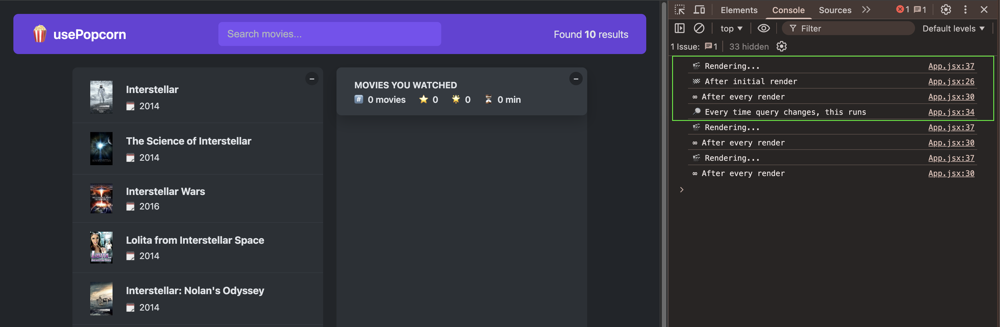

* Rendering `Search` when "Inter" is entered in this input.
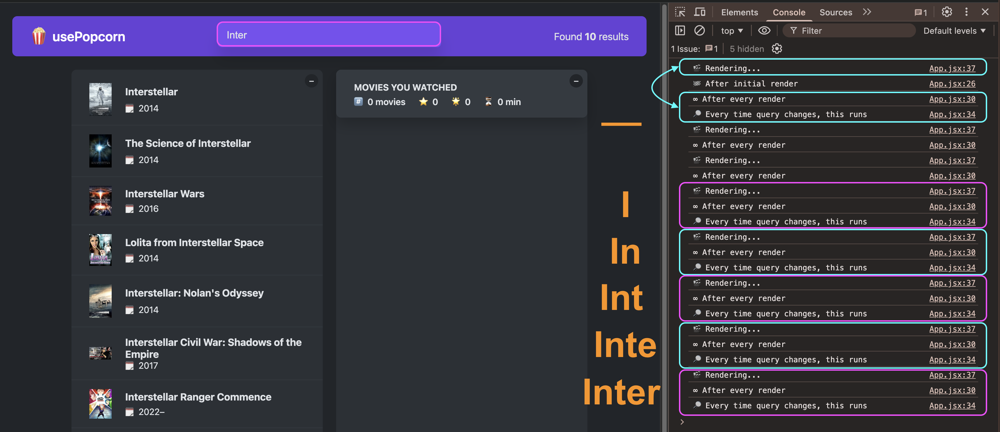

#### 149.2.3 Adding `setError("")` before fetch and an early validation in `query` length:

```tsx
/* src/App.jsx */
import { useState, useEffect } from "react";
import Navbar from "./components/Navbar";
import Main from "./components/Main";
import Search from "./components/Search";
import NumResult from "./components/NumResult";
import Box from "./components/Box";
import MovieList from "./components/MovieList";
import WatchedSummary from "./components/WatchedSummary";
import WatchedMovieList from "./components/WatchedMovieList";
import Loader from "./components/Loader";
import ErrorMessage from "./components/ErrorMessage";
const KEY = "f84fc31d";
function App() {
  const [movies, setMovies] = useState([]);
  const [watched, setWatched] = useState([]);
  const [isLoading, setIsLoading] = useState(false);
  const [error, setError] = useState("");
  const [query, setQuery] = useState("");
  const tempQuery = "interstellar";
  useEffect(() => {
    const fetchMovies = async () => {
      try {
        setIsLoading(true);

        setError("");  // 👈🏽 ✅

        const resp = await fetch(`http://www.omdbapi.com/?apikey=${KEY}&s=${query}`);
        // if the response is not ok, throw an error
        if (!resp.ok) throw new Error("Something went wrong with fetching movies");
        // if the response is ok, parse the json
        const data = await resp.json();
        if (data.Response === "False") throw new Error("Movie not found 😭");
        setMovies(data.Search);
        setIsLoading(false);
      } catch (error) {
        setError(error.message);
      } finally {
        setIsLoading(false);
      }
    };

    if (query.length < 3) {  // 👈🏽 ✅
      setMovies([]);
      setError("");
      return;
    }

    fetchMovies();
  }, [query]);

  return (
    <>
      <Navbar>
        <Search query={query} setQuery={setQuery} />
        <NumResult movies={movies} />
      </Navbar>
      <Main>
        <Box>
          {isLoading && <Loader />}
          {!isLoading && !error && <MovieList movies={movies} />}
          {error && <ErrorMessage message={error} />}
        </Box>
        <Box>
          <WatchedSummary watched={watched} />
          <WatchedMovieList watched={watched} />
        </Box>
      </Main>
    </>
  );
}
export default App;
### 🐞 149.3 Issues:

- **Race Conditions**: Rapid typing triggers multiple simultaneous fetch requests, potentially resulting in stale data displayed last.

| Issue | Status | Log/Error |
|---|---|---|
| Data Consistency | ⚠️ Warning | Observed multiple network requests in the network tab during rapid search input. |

### 🧱 149.4 Pending Fixes (TODO):

- [ ] Implement `AbortController` to cancel stale fetch requests during rapid typing
- [ ] Add a cleanup function to `useEffect` that calls `controller.abort()` to manage resources
- [ ] Gracefully handle `AbortError` to prevent misleading error messages in the UI


<br>

## 🔧 150. Lesson 150 — *Selecting a Movie*

- [Lecture 150: Selecting a Movie](#-150-lesson-150--selecting-a-movie)
- [150.1 Context](#1501-context)
- [150.2 Updating code according the context](#1502-updating-code-according-the-context)
- [150.3 Issues](#1503-issues)
- [150.4 Pending Fixes (TODO)](#1504-pending-fixes-todo)

### 🧠 150.1 Context:

Selecting an item from a list to display its details (often called the **Master-Detail pattern**) is a fundamental UI/UX pattern in modern web applications. It allows users to browse a collection of items and "deep dive" into a specific one without losing their place in the list, effectively managing screen real estate and cognitive load.

#### Definition and Explanation:
The Master-Detail pattern consists of a "Master" list (search results) and a "Detail" view (movie information). When a "Master" item is selected, its identifier is used to fetch or display "Detail" data.

#### When and Why it's used:
This pattern is used when each item in a list contains more information than can be reasonably displayed in the list view itself. It's essential for data-heavy applications, dashboards, and catalogs. It provides a hierarchical navigation structure that is intuitive for users.

#### Examples from the project:
In `usePopcorn`, clicking on a movie card in the search results list updates the `selectedId` state in `App.jsx`. This triggers a conditional rendering change in the right-hand column, swapping the "Watched Movies" summary with the `MovieDetails` component for the selected movie.

#### Advantages:
- **Focus**: Users can see detailed information without distraction.
- **Context Preservation**: The main list remains visible, allowing for quick switching between items.
- **Efficient Screen Usage**: Dynamically updating parts of the UI rather than navigating to a whole new page.
- **Reduced Latency**: Only the detail section needs to update, rather than the entire page.

#### Disadvantages:
- **State Complexity**: Requires lifting state to a common ancestor (`App.jsx`) to coordinate between the list and the details view.
- **Prop Drilling**: Handlers must be passed through several component layers (`App` -> `MovieList` -> `Movie`).
- **Synchronicity**: Ensuring the detail view stays in sync with the selection (e.g., loading states).

#### When to consider alternatives:
- **Modals**: Better when the detail view is a temporary "interruption" or requires a focus shift.
- **Routing/Separate Pages**: Better for SEO, deep-linking, or very complex detail views.
- **Accordions/Expandable Rows**: Better for small amounts of extra data within the list item itself.

#### Connection to Lesson 150:
In this lesson, we implement the state lifting and conditional rendering logic necessary to make the UI interactive. We transition from a static summary to a dynamic view that responds to user input, establishing the foundation for fetching specific movie data in subsequent lessons.

### ⚙️ 150.2 Updating code/theory according the context:

#### Summary
This section covers the transition from a static movie list to a dynamic Master-Detail interface. We solve the problem of displaying detailed movie data without navigating away from the search results. The implementation involves lifting state to `App.jsx`, creating a reusable `MovieDetails` component, and managing user interactions like selecting, closing, and toggling movie details through prop drilling.

#### Subsection Summary
- **Function**: Identifies the unique identifier (`imdbID`) from the API response and initializes state.
- **Responsibility**: Tracks the active movie selection in the top-level state.
- **Concepts**: State management using `useState` and inspecting API data structures.

#### 150.2.1 Searching for `imdbID` in each movie:
```tsx
/* src/App.jsx */
import { useState, useEffect } from "react";
import Navbar from "./components/Navbar";
import Main from "./components/Main";
import Search from "./components/Search";
import NumResult from "./components/NumResult";
import Box from "./components/Box";
import MovieList from "./components/MovieList";
import WatchedSummary from "./components/WatchedSummary";
import WatchedMovieList from "./components/WatchedMovieList";
import Loader from "./components/Loader";
import ErrorMessage from "./components/ErrorMessage";
const KEY = "f84fc31d";
function App() {
  const [movies, setMovies] = useState([]);
  const [watched, setWatched] = useState([]);
  const [isLoading, setIsLoading] = useState(false);
  const [error, setError] = useState("");
  const [query, setQuery] = useState("");
  const [selectedId, setSelectedId] = useState("tt0088763");   // 👈🏽 ✅
  const tempQuery = "interstellar";
  useEffect(() => {
    const fetchMovies = async () => {
      try {
        setIsLoading(true);
        setError("");
        const resp = await fetch(`http://www.omdbapi.com/?apikey=${KEY}&s=${query}`);
        if (!resp.ok) throw new Error("Something went wrong with fetching movies");
        const data = await resp.json();
        if (data.Response === "False") throw new Error("Movie not found 😭");
        setMovies(data.Search);
        console.log("🍿🍿🍿 data.Search", data.Search);   // 👈🏽 ✅
      } catch (error) {
        setError(error.message);
      } finally {
        setIsLoading(false);
      }
    };
    if (query.length < 3) {
      setMovies([]);
      setError("");
      return;
    }
    fetchMovies();
  }, [query]);
  return (
    <>
      <Navbar>
        <Search query={query} setQuery={setQuery} />
        <NumResult movies={movies} />
      </Navbar>
      <Main>
        <Box>
          {isLoading && <Loader />}
          {!isLoading && !error && <MovieList movies={movies} />}
          {error && <ErrorMessage message={error} />}
        </Box>
        <Box>
          <WatchedSummary watched={watched} />
          <WatchedMovieList watched={watched} />
        </Box>
      </Main>
    </>
  );
}
export default App;
```

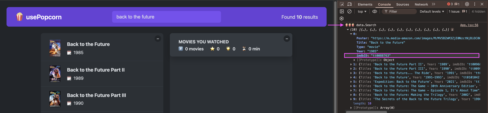

#### Subsection Summary
- **Function**: Creates the skeletal structure for the detail view.
- **Responsibility**: Displays basic information (currently just the ID) of the selected movie.
- **Concepts**: Component isolation and prop reception.

#### 150.2.2 Create `MovieDetails` component:
```tsx
/* src/components/MovieDetails.jsx */
const MovieDetails = ({ selectedId }) => {
  return (
    <div className="details">
      {selectedId}
    </div>
  )
};
export default MovieDetails;
```

#### Subsection Summary
- **Function**: Implements conditional rendering and passes the selection handler down the component tree.
- **Responsibility**: Switches the UI view based on `selectedId` and enables item interactivity.
- **Concepts**: Prop drilling, conditional rendering (ternary operator), and event propagation.

#### 150.2.3 Add `MovieDetails` component in `Box` component from `App`:
```tsx
/* src/App.jsx */
import { useState, useEffect } from "react";
import Navbar from "./components/Navbar";
import Main from "./components/Main";
import Search from "./components/Search";
import NumResult from "./components/NumResult";
import Box from "./components/Box";
import MovieList from "./components/MovieList";
import WatchedSummary from "./components/WatchedSummary";
import WatchedMovieList from "./components/WatchedMovieList";
import Loader from "./components/Loader";
import ErrorMessage from "./components/ErrorMessage";
import MovieDetails from "./components/MovieDetails";
const KEY = "f84fc31d";
function App() {
  const [movies, setMovies] = useState([]);
  const [watched, setWatched] = useState([]);
  const [isLoading, setIsLoading] = useState(false);
  const [error, setError] = useState("");
  const [query, setQuery] = useState("");
  const [selectedId, setSelectedId] = useState(null);
  //const tempQuery = "interstellar";
  const handleSelectMovie = (id) => {   // 👈🏽 ✅
    setSelectedId(id);
  };
  useEffect(() => {
    const fetchMovies = async () => {
      try {
        setIsLoading(true);
        setError("");
        const resp = await fetch(`http://www.omdbapi.com/?apikey=${KEY}&s=${query}`);
        if (!resp.ok) throw new Error("Something went wrong with fetching movies");
        const data = await resp.json();
        if (data.Response === "False") throw new Error("Movie not found 😭");
        setMovies(data.Search);
        console.log("🍿🍿🍿 data.Search", data.Search);
      } catch (error) {
        setError(error.message);
      } finally {
        setIsLoading(false);
      }
    };
    if (query.length < 3) {
      setMovies([]);
      setError("");
      return;
    }
    fetchMovies();
  }, [query]);
  return (
    <>
      <Navbar>
        <Search query={query} setQuery={setQuery} />
        <NumResult movies={movies} />
      </Navbar>
      <Main>
        <Box>
          {isLoading && <Loader />}
          {!isLoading && !error && <MovieList movies={movies} handleSelectMovie={handleSelectMovie} />}    {/* 👈🏽 ✅ */}
          {error && <ErrorMessage message={error} />}
        </Box>
        <Box>
          {selectedId ? (
            <MovieDetails selectedId={selectedId} />    {/* 👈🏽 ✅ */}
          ) : (
            <>
              <WatchedSummary watched={watched} />
              <WatchedMovieList watched={watched} />
            </>
          )}
        </Box>
      </Main>
    </>
  );
}
export default App;
```

Meanwhile:
```jsx
/* src/components/MovieList.jsx */
import Movie from "./Movie";
const MovieList = ({ movies, handleSelectMovie }) => {    // 👈🏽 ✅
  return (
    <ul className="list">
      {movies?.map((movie) => (
        <Movie movie={movie} key={movie.imdbID} handleSelectMovie={handleSelectMovie} />    {/* 👈🏽 ✅ */}
      ))}
    </ul>
  );
};
export default MovieList;
```

and

```jsx
/* src/components/Movie.jsx */
const Movie = ({ movie, handleSelectMovie }) => {   // 👈🏽 ✅
  return (
    <li onClick={() => handleSelectMovie(movie.imdbID)}>    {/* 👈🏽 ✅ */}
      
      <h3>{movie.Title}</h3>
      <div>
        <p>
          <span>🗓</span>
          <span>{movie.Year}</span>
        </p>
      </div>
    </li>
  );
};

export default Movie;
```

#### Subsection Summary
- **Function**: Adds a back button and a close handler.
- **Responsibility**: Provides a way to clear the `selectedId` state and return to the summary view.
- **Concepts**: Resetting state, callback props, and UI navigation patterns.

#### 150.2.4 Adding `Left Arrow` button inside the `MovieDetails` to close it:
```tsx
/* src/App.jsx */
import { useState, useEffect } from "react";
import Navbar from "./components/Navbar";
import Main from "./components/Main";
import Search from "./components/Search";
import NumResult from "./components/NumResult";
import Box from "./components/Box";
import MovieList from "./components/MovieList";
import WatchedSummary from "./components/WatchedSummary";
import WatchedMovieList from "./components/WatchedMovieList";
import Loader from "./components/Loader";
import ErrorMessage from "./components/ErrorMessage";
import MovieDetails from "./components/MovieDetails";
const KEY = "f84fc31d";
function App() {
  const [movies, setMovies] = useState([]);
  const [watched, setWatched] = useState([]);
  const [isLoading, setIsLoading] = useState(false);
  const [error, setError] = useState("");
  const [query, setQuery] = useState("");
  const [selectedId, setSelectedId] = useState(null);
  //const tempQuery = "interstellar";
  const handleSelectMovie = (id) => {
    setSelectedId(id);
  };
  const handleCloseMovie = () => {    // 👈🏽 ✅
    setSelectedId(null);
  };
  useEffect(() => {
    const fetchMovies = async () => {
      try {
        setIsLoading(true);
        setError("");
        const resp = await fetch(`http://www.omdbapi.com/?apikey=${KEY}&s=${query}`);
        // if the response is not ok, throw an error
        if (!resp.ok) throw new Error("Something went wrong with fetching movies");
        // if the response is ok, parse the json
        const data = await resp.json();
        if (data.Response === "False") throw new Error("Movie not found 😭");
        setMovies(data.Search);
        console.log("🍿🍿🍿 data.Search", data.Search);
      } catch (error) {
        setError(error.message);
      } finally {
        setIsLoading(false);
      }
    };
    if (query.length < 3) {
      setMovies([]);
      setError("");
      return;
    }
    fetchMovies();
  }, [query]);
  return (
    <>
      <Navbar>
        <Search query={query} setQuery={setQuery} />
        <NumResult movies={movies} />
      </Navbar>
      <Main>
        <Box>
          {isLoading && <Loader />}
          {!isLoading && !error && <MovieList movies={movies} handleSelectMovie={handleSelectMovie} />}
          {error && <ErrorMessage message={error} />}
        </Box>
        <Box>
          {selectedId ? (
            <MovieDetails selectedId={selectedId} onCloseMovie={handleCloseMovie} />    {/* 👈🏽 ✅ */}
          ) : (
            <>
              <WatchedSummary watched={watched} />
              <WatchedMovieList watched={watched} />
            </>
          )}
        </Box>
      </Main>
    </>
  );
}
export default App;
```

And in `MovieDetails` component:
```jsx
/* src/components/MovieDetails.jsx */
const MovieDetails = ({ selectedId, onCloseMovie }) => {    // 👈🏽 ✅
  return (
    <div className="details">
      <button className="btn-back" onClick={onCloseMovie}>    {/* 👈🏽 ✅ */}
        &larr;
      </button>
      {selectedId}
    </div>
  );
};
export default MovieDetails;
```

#### Subsection Summary
- **Function**: Enhances the selection logic with a toggle feature.
- **Responsibility**: Ensures that clicking an already selected movie closes its details.
- **Concepts**: Functional state updates (using the previous state value).

#### 150.2.5 When click twice on same `Movie`, details must not be seen:
```jsx
/*  */
....
  const handleSelectMovie = (id) => {
    setSelectedId((selectedId) => (selectedId === id ? null : id));
  };
....
```

### 🐞 150.3 Issues:

- **Prop Drilling**: Passing `handleSelectMovie` through `MovieList` to `Movie` creates extra layers of props.
- **State Selection Interaction**: Initially, clicking a movie always set the state, but we needed a toggle behavior (click again to close).

| Issue | Status | Log/Error |
|---|---|---|
| Toggle Behavior | ✅ Resolved | Implemented `setSelectedId((id) => (id === selectedId ? null : id))`. |

### 🧱 150.4 Pending Fixes (TODO):

- [ ] Add keyboard accessibility (`tabIndex`, `onKeyDown`) to the `li` items in `Movie.jsx`
- [ ] Include an `aria-label` for the back button in `MovieDetails.jsx` for screen readers
- [ ] Implement a loading state in `MovieDetails` for the full data fetch transition
- [ ] Clean up unused variables (`setWatched`, `tempQuery`) and comments in `App.jsx`


<br>

## 🔧 151. Lesson 151 — *Loading Movie Details*

- [Lecture 151: Loading Movie Details](#-151-lesson-151--loading-movie-details)
- [151.1 Context](#1511-context)
- [151.2 Updating code according the context](#1512-updating-code-according-the-context)
- [151.3 Issues](#1513-issues)
- [151.4 Pending Fixes (TODO)](#1514-pending-fixes-todo)

### 🧠 151.1 Context:
- **Definition**: Dynamic data fetching refers to the process of retrieving specific information from an external source (like an API) based on a unique identifier (ID) provided at runtime.
- **When it occurs/is used**: It is used in "Master-Detail" patterns where a list of items is displayed, and clicking an item reveals a detailed view with more comprehensive data.
- **Examples from the project**: In `App.jsx`, when a user clicks a movie in the `MovieList`, the `selectedId` state is updated. The `MovieDetails` component then uses this ID to fetch the full movie details from the OMDb API.
- **Advantages**: 
  - **Efficiency**: Only fetches detailed data when requested, saving bandwidth.
  - **Separation of Concerns**: Keeps the list data light and the detail view rich.
  - **User Experience**: Provides a focused view for specific content.
- **Disadvantages**: 
  - **Latency**: Requires an additional network request which can introduce a delay.
  - **State Management**: Requires careful handling of loading, error, and empty states.
- **When to consider alternatives**: If the dataset is small and static, it might be better to fetch all data at once. If SEO is critical, server-side rendering (SSR) might be preferred.
- **Connection to the lesson's practical implementation**: This lesson demonstrates how to synchronize React state (`selectedId`) with an external side effect (`fetch`) using `useEffect` and its dependency array.

### ⚙️ 151.2 Updating code/theory according the context:

#### Summary
This section covers the implementation of the `MovieDetails` component, focusing on fetching movie data from the OMDb API when a user selects a movie. It demonstrates how to use `useEffect` with a dependency to sync the UI with the selected movie ID and how to manage the loading state for a smoother UX.

#### 151.2.1 Looking for `MovieDetails` data or information:
**Subsection Summary**
- Initial setup of the `MovieDetails` component.
- Implementing a basic `useEffect` to fetch data by ID (`selectedId`).
- Logging the API response to verify the data structure.
```tsx
/* src/components/MovieDetails.jsx */
import { useEffect } from "react";    // 👈🏽 ✅
const MovieDetails = ({ selectedId, onCloseMovie }) => {
  const KEY = "f84fc31d";   // 👈🏽 ✅
  useEffect(() => {   // 👈🏽 ✅
    const getMovieDetails = async () => {
      const resp = await fetch(`http://www.omdbapi.com/?apikey=${KEY}&i=${selectedId}`);
      const data = await resp.json();
      console.log("🎥 data", data);
    };
    getMovieDetails();
  }, []);
  return (
    <div className="details">
      <button className="btn-back" onClick={onCloseMovie}>
        &larr;
      </button>
      {selectedId}
    </div>
  );
};
export default MovieDetails;
```

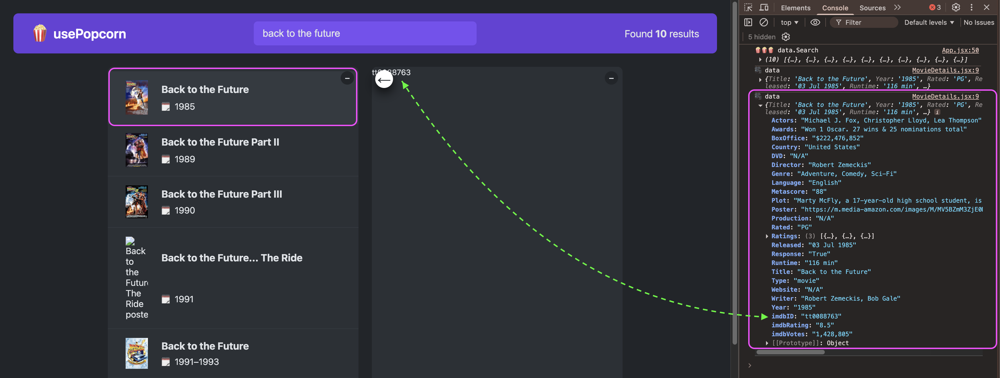


#### 151.2.2 Adding `useState` in order to get the movie details:
**Subsection Summary**
- Introducing the `movie` state to store the fetched object.
- Destructuring properties from the movie object with aliases for cleaner usage.
- Demonstrating the flow from API fetch to state update.
```tsx
/* src/components/MovieDetails.jsx */
import { useEffect, useState } from "react";    // 👈🏽 ✅
const MovieDetails = ({ selectedId, onCloseMovie }) => {
  const KEY = "f84fc31d";
  const [movie, setMovie] = useState({});   // 👈🏽 ✅
  const {   // 👈🏽 ✅
    Title: title,
    Year: year,
    Poster: poster,
    Runtime: runtime,
    imdbRating,
    Plot: plot,
    Released: released,
    Actors: actors,
    Director: director,
    Genre: Genre,
  } = movie;
  console.log(title, year);   // 👈🏽 ✅
  useEffect(() => {
    const getMovieDetails = async () => {
      const resp = await fetch(`http://www.omdbapi.com/?apikey=${KEY}&i=${selectedId}`);
      const data = await resp.json();
      console.log("🎥 data", data);
      setMovie(data);
    };
    getMovieDetails();
  }, []);
  return (
    <div className="details">
      <button className="btn-back" onClick={onCloseMovie}>
        &larr;
      </button>
      {selectedId}
    </div>
  );
};
export default MovieDetails;
```


#### 151.2.3 Adding movie date in the movie details component:
**Subsection Summary**
- Designing the UI layout for movie details including header and section.
- Mapping state properties to JSX elements (poster, title, plot, etc.).
- Identifying initial issues with component re-rendering and persistence.
```tsx
/* src/components/MovieDetails.jsx */
import { useEffect, useState } from "react";
import StarRating from "../StarRating";
const MovieDetails = ({ selectedId, onCloseMovie }) => {
  const KEY = "f84fc31d";
  const [movie, setMovie] = useState({});
  const {   // 👈🏽 ✅
    Title: title,
    Year: year,
    Poster: poster,
    Runtime: runtime,
    imdbRating,
    Plot: plot,
    Released: released,
    Actors: actors,
    Director: director,
    Genre: Genre,
  } = movie;
  console.log(title, year);
  useEffect(() => {
    const getMovieDetails = async () => {
      const resp = await fetch(`http://www.omdbapi.com/?apikey=${KEY}&i=${selectedId}`);
      const data = await resp.json();
      console.log("🎥 data", data);
      setMovie(data);
    };
    getMovieDetails();
  }, []);
  return (    // 👈🏽 ✅
    <div className="details">
      <header>
        <button className="btn-back" onClick={onCloseMovie}>
          &larr;
        </button>
        
        <div className="details-overview">
          <h2>{title}</h2>
          <p>
            {released} &bull; {runtime}
          </p>
          <p>{Genre}</p>
          <p>
            <span>⭐️</span>
            {imdbRating} IMDb rating
          </p>
        </div>
      </header>
      <section>
        <div className="rating">
          <StarRating maxRating={10} size={24} />
        </div>
        <p>{plot}</p>
        <p>Starring {actors}</p>
        <p>Directed by {director}</p>
      </section>
    </div>
  );
};
export default MovieDetails;
```

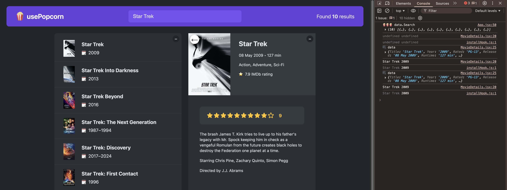

#### 151.2.4 Fixing switing between movies issue and adding `<Loader>` component
**Subsection Summary**
- Adding `selectedId` to the `useEffect` dependency array to trigger re-fetches when a different movie is selected.
- Implementing a loading state (`isLoading`) to improve user feedback.
- Conditional rendering of the `<Loader>` component during data acquisition.
```tsx
/* src/components/MovieDetails.jsx */
import { useEffect, useState } from "react";
import StarRating from "../StarRating";
import Loader from "./Loader";   // 👈🏽 ✅
const MovieDetails = ({ selectedId, onCloseMovie }) => {
  const KEY = "f84fc31d";
  const [movie, setMovie] = useState({});
  const [isLoading, setIsLoading] = useState(false);   // 👈🏽 ✅
  const {
    Title: title,
    Year: year,
    Poster: poster,
    Runtime: runtime,
    imdbRating,
    Plot: plot,
    Released: released,
    Actors: actors,
    Director: director,
    Genre: Genre,
  } = movie;
  console.log(title, year);
  useEffect(() => {
    const getMovieDetails = async () => {
      setIsLoading(true);   // 👈🏽 ✅
      const resp = await fetch(`http://www.omdbapi.com/?apikey=${KEY}&i=${selectedId}`);
      const data = await resp.json();
      console.log("🎥 data", data);
      setMovie(data);
      setIsLoading(false);    // 👈🏽 ✅
    };
    getMovieDetails();
  }, [selectedId]);   // 👈🏽 ✅
  return (
    <div className="details">
      {isLoading ? (    // 👈🏽 ✅
        <Loader />    {/* 👈🏽 ✅ */}
      ) : (
        <>
          <header>
            <button className="btn-back" onClick={onCloseMovie}>
              &larr;
            </button>
            
            <div className="details-overview">
              <h2>{title}</h2>
              <p>
                {released} &bull; {runtime}
              </p>
              <p>{Genre}</p>
              <p>
                <span>⭐️</span>
                {imdbRating} IMDb rating
              </p>
            </div>
          </header>
          <section>
            <div className="rating">
              <StarRating maxRating={10} size={24} />
            </div>
            <p>{plot}</p>
            <p>Starring {actors}</p>
            <p>Directed by {director}</p>
          </section>
        </>
      )}
    </div>
  );
};
export default MovieDetails;
```

[🎥 Ver video](../img/section12-lecture151-003.mp4)

### 🐞 151.3 Issues:

- **Stale Detail View**: Without adding `selectedId` to the `useEffect` dependency array, opening a second movie would still show the first movie's details.

| Issue | Status | Log/Error |
|---|---|---|
| Effect Sync | ✅ Resolved | Added `[selectedId]` to the dependency array in `MovieDetails.jsx`. |

### 🧱 151.4 Pending Fixes (TODO):

- [ ] Implement `try...catch` in `getMovieDetails` to handle network failures gracefully
- [ ] Store/persist the star rating when navigating between different movie details
- [ ] Update `alt` text in `MovieDetails.jsx` to use the movie title instead of the object


<br>

## 🔧 152. Lesson 152 — *Adding a Watched Movie*

- [Lecture 152: Adding a Watched Movie](#-152-lesson-152--adding-a-watched-movie)
- [152.1 Context](#1521-context)
- [152.2 Updating code according the context](#1522-updating-code-according-the-context)
- [152.3 Issues](#1523-issues)
- [152.4 Pending Fixes (TODO)](#1524-pending-fixes-todo)

### 🧠 152.1 Context:

In this lesson, we implement the core functionality of "Adding a Watched Movie" to the application. This process involves **State Lifting**, where the `watched` state is maintained in the common ancestor (`App`) so it can be shared between the selection interface (`MovieDetails`) and the display interface (`WatchedMovieList`).

- **When to use**: State lifting is necessary when multiple sibling components need to access or modify the same data.
- **Project Example**: The `watched` state is defined in `App`, but modified in `MovieDetails` and displayed in `WatchedSummary` and `WatchedMovieList`.
- **Advantages**: Ensures a single source of truth, simplifies data flow between siblings, and keeps the UI in sync.
- **Disadvantages**: Can lead to "prop drilling" where data is passed through multiple layers of components that don't directly use it.
- **Alternatives**: For more complex state trees, React Context or specialized state management libraries (like Redux or Zustand) are preferred.

Connection to implementation: We use a callback function (`handleAddWatched`) passed from `App` to `MovieDetails` to allow a child component to update the parent's state.


### ⚙️ 152.2 Updating code/theory according the context:

**Summary**
This section focuses on the end-to-end implementation of managing a "Watched" movie list. It covers state initialization, creating movie objects from API data, integrating user ratings, preventing duplicates, and implementing a deletion mechanism. The different subsections show the evolution from basic state management to a refined UI with error prevention and list management.

#### 152.2.1 Working with `setWatched` function:
**Subsection Summary**
- Initializes the `watched` state as an empty array in the `App` component.
- Implements the `handleAddWatched` handler to append new movies using the functional state update pattern.
- Passes the handler down to the `MovieDetails` component via props.
```tsx
/* src/App.jsx */
import { useState, useEffect } from "react";
import Navbar from "./components/Navbar";
import Main from "./components/Main";
import Search from "./components/Search";
import NumResult from "./components/NumResult";
import Box from "./components/Box";
import MovieList from "./components/MovieList";
import WatchedSummary from "./components/WatchedSummary";
import WatchedMovieList from "./components/WatchedMovieList";
import Loader from "./components/Loader";
import ErrorMessage from "./components/ErrorMessage";
import MovieDetails from "./components/MovieDetails";
const KEY = "f84fc31d";
function App() {
  const [movies, setMovies] = useState([]);
  const [watched, setWatched] = useState([]);   // 👈🏽 ✅
  const [isLoading, setIsLoading] = useState(false);
  const [error, setError] = useState("");
  const [query, setQuery] = useState("");
  const [selectedId, setSelectedId] = useState(null);
  //const tempQuery = "interstellar";
  const handleSelectMovie = (id) => {
    setSelectedId((selectedId) => (selectedId === id ? null : id));
  };
  const handleCloseMovie = () => {
    setSelectedId(null);
  };
  const handleAddWatched = (movie) => {   // 👈🏽 ✅
    setWatched((watched) => [...watched, movie]);   // 👈🏽 ✅
  };
  useEffect(() => {
    const fetchMovies = async () => {
      try {
        setIsLoading(true);
        setError("");
        const resp = await fetch(`http://www.omdbapi.com/?apikey=${KEY}&s=${query}`);
        if (!resp.ok) throw new Error("Something went wrong with fetching movies");
        const data = await resp.json();
        if (data.Response === "False") throw new Error("Movie not found 😭");
        setMovies(data.Search);
        console.log("🍿🍿🍿 data.Search", data.Search);
      } catch (error) {
        setError(error.message);
      } finally {
        setIsLoading(false);
      }
    };
    if (query.length < 3) {
      setMovies([]);
      setError("");
      return;
    }
    fetchMovies();
  }, [query]);
  return (
    <>
      <Navbar>
        <Search query={query} setQuery={setQuery} />
        <NumResult movies={movies} />
      </Navbar>
      <Main>
        <Box>
          {isLoading && <Loader />}
          {!isLoading && !error && <MovieList movies={movies} handleSelectMovie={handleSelectMovie} />}
          {error && <ErrorMessage message={error} />}
        </Box>
        <Box>
          {selectedId ? (
            <MovieDetails 
              selectedId={selectedId} 
              onCloseMovie={handleCloseMovie}
              onAddWatched={handleAddWatched}   {/* 👈🏽 ✅ */}
            />
          ) : (
            <>
              <WatchedSummary watched={watched} />
              <WatchedMovieList watched={watched} />
            </>
          )}
        </Box>
      </Main>
    </>
  );
}
export default App;
```

#### 152.2.2 Add this `onAddWatched` function as prop into `MovieDetails` component:
**Subsection Summary**
- Receives the `onAddWatched` callback and uses it to add a new movie object to the list.
- Transforms the API movie data into a simplified local object format (e.g., parsing runtime to a number).
- Triggers an automatic UI transition by closing the movie details view after a successful add.
```tsx
/* src/components/MovieDetails.jsx */
import { useEffect, useState } from "react";
import StarRating from "../StarRating";
import Loader from "./Loader";
const MovieDetails = ({ selectedId, onCloseMovie, onAddWatched }) => {    // 👈🏽 ✅ (1)
  const KEY = "f84fc31d";
  const [movie, setMovie] = useState({});
  const [isLoading, setIsLoading] = useState(false);
  const {
    Title: title,
    Year: year,
    Poster: poster,
    Runtime: runtime,
    imdbRating,
    Plot: plot,
    Released: released,
    Actors: actors,
    Director: director,
    Genre: Genre,
  } = movie;
  const handleAdd = () => {    // 👈🏽 ✅ (2)
    const newWatchedMovie = {
      imdbID: selectedId,
      title,
      year,
      poster,
      imdbRating: Number(imdbRating) || 0,
      runtime: Number(runtime.split(" ")[0]) || 0,
    };
    onAddWatched(newWatchedMovie);    // 👈🏽 ✅ (3)
    onCloseMovie();    // 👈🏽 ✅ (5)
  };
  useEffect(() => {
    const getMovieDetails = async () => {
      setIsLoading(true);
      const resp = await fetch(`http://www.omdbapi.com/?apikey=${KEY}&i=${selectedId}`);
      const data = await resp.json();
      setMovie(data);
      setIsLoading(false);
    };
    getMovieDetails();
  }, [selectedId]);
  return (
    <div className="details">
      {isLoading ? (
        <Loader />
      ) : (
        <>
          <header>
            <button className="btn-back" onClick={onCloseMovie}>
              &larr;
            </button>
            
            <div className="details-overview">
              <h2>{title}</h2>
              <p>
                {released} &bull; {runtime}
              </p>
              <p>{Genre}</p>
              <p>
                <span>⭐️</span>
                {imdbRating} IMDb rating
              </p>
            </div>
          </header>
          <section>
            <div className="rating">
              <StarRating maxRating={10} size={24} />
              <button className="btn-add" onClick={handleAdd}>    {/* 👈🏽 ✅ (2) */}
                + Add to list
              </button>
            </div>
            <p>{plot}</p>
            <p>Starring {actors}</p>
            <p>Directed by {director}</p>
          </section>
        </>
      )}
    </div>
  );
};
export default MovieDetails;
```


some changes into `WatchedMovie` component:
```jsx
/* src/components/WatchedMovie.jsx */
const WatchedMovie = ({ movie }) => {
  return (
    <li>
      
      <h3>{movie.title}</h3>
      <div>
        <p>
          <span>⭐️</span>
          <span>{movie.imdbRating}</span>
        </p>
        <p>
          <span>🌟</span>
          <span>{movie.userRating}</span>
        </p>
        <p>
          <span>⏳</span>
          <span>{movie.runtime} min</span>
        </p>
      </div>
    </li>
  );
};
export default WatchedMovie;
```

#### 152.2.3 Working with the `StarRating` component:
**Subsection Summary**
- Integrates the `StarRating` component to allow users to provide their own rating.
- Implements a `userRating` state to track the selection locally before confirming the addition.
- Adds conditional rendering to only show the "Add to list" button once a rating has been selected.
```tsx
/* src/components/MovieDetails.jsx */
import { useEffect, useState } from "react";
import StarRating from "../StarRating";
import Loader from "./Loader";
const MovieDetails = ({ selectedId, onCloseMovie, onAddWatched }) => {
  const KEY = "f84fc31d";
  const [movie, setMovie] = useState({});
  const [isLoading, setIsLoading] = useState(false);
  const [userRating, setUserRating] = useState(0);    // 👈🏽 ✅ (1)
  const {
    Title: title,
    Year: year,
    Poster: poster,
    Runtime: runtime,
    imdbRating,
    Plot: plot,
    Released: released,
    Actors: actors,
    Director: director,
    Genre: Genre,
  } = movie;
  const handleAdd = () => {
    const newWatchedMovie = {
      imdbID: selectedId,
      title,
      year,
      poster,
      imdbRating: Number(imdbRating) || 0,
      runtime: Number(runtime.split(" ")[0]) || 0,
      userRating,    // 👈🏽 ✅ (2)
    };
    onAddWatched(newWatchedMovie);
    onCloseMovie();
  };
  useEffect(() => {
    const getMovieDetails = async () => {
      setIsLoading(true);
      const resp = await fetch(`http://www.omdbapi.com/?apikey=${KEY}&i=${selectedId}`);
      const data = await resp.json();
      setMovie(data);
      setIsLoading(false);
    };
    getMovieDetails();
  }, [selectedId]);
  return (
    <div className="details">
      {isLoading ? (
        <Loader />
      ) : (
        <>
          <header>
            <button className="btn-back" onClick={onCloseMovie}>
              &larr;
            </button>
            
            <div className="details-overview">
              <h2>{title}</h2>
              <p>
                {released} &bull; {runtime}
              </p>
              <p>{Genre}</p>
              <p>
                <span>⭐️</span>
                {imdbRating} IMDb rating
              </p>
            </div>
          </header>
          <section>
            <div className="rating">
              <StarRating maxRating={10} size={24} onSetRating={setUserRating} />   {/* 👈🏽 ✅ (1) */}
              {userRating > 0 && (    // 👈🏽 ✅ (3)
                <button className="btn-add" onClick={handleAdd}>
                  + Add to list
                </button>
              )}
            </div>
            <p>{plot}</p>
            <p>Starring {actors}</p>
            <p>Directed by {director}</p>
          </section>
        </>
      )}
    </div>
  );
};
export default MovieDetails;
```

Issue:
* User can rating same movie so many times.
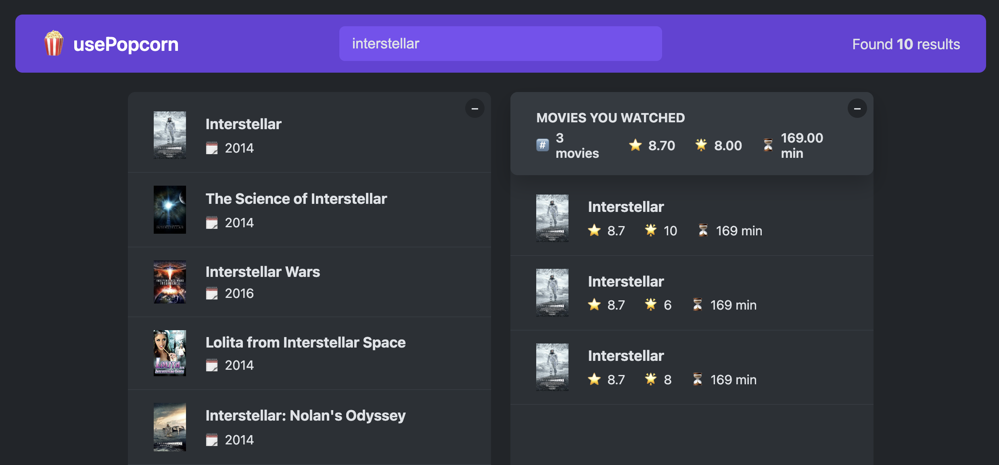


#### 152.2.4 Fixing previous issue:
**Subsection Summary**
- Implements a check to determine if the selected movie is already present in the `watched` list.
- Switches the UI from a rating selector to a "You rated this movie" message for already watched items.
- Extracts and displays the previously given rating from the `watched` list data.
```jsx
/* src/App.jsx */
import { useState, useEffect } from "react";
import Navbar from "./components/Navbar";
import Main from "./components/Main";
import Search from "./components/Search";
import NumResult from "./components/NumResult";
import Box from "./components/Box";
import MovieList from "./components/MovieList";
import WatchedSummary from "./components/WatchedSummary";
import WatchedMovieList from "./components/WatchedMovieList";
import Loader from "./components/Loader";
import ErrorMessage from "./components/ErrorMessage";
import MovieDetails from "./components/MovieDetails";
const KEY = "f84fc31d";
function App() {
  const [movies, setMovies] = useState([]);
  const [watched, setWatched] = useState([]);
  const [isLoading, setIsLoading] = useState(false);
  const [error, setError] = useState("");
  const [query, setQuery] = useState("");
  const [selectedId, setSelectedId] = useState(null);
  //const tempQuery = "interstellar";
  const handleSelectMovie = (id) => {
    setSelectedId((selectedId) => (selectedId === id ? null : id));
  };
  const handleCloseMovie = () => {
    setSelectedId(null);
  };
  const handleAddWatched = (movie) => {
    setWatched((watched) => [...watched, movie]);
  };
  useEffect(() => {
    const fetchMovies = async () => {
      try {
        setIsLoading(true);
        setError("");
        const resp = await fetch(`http://www.omdbapi.com/?apikey=${KEY}&s=${query}`);
        if (!resp.ok) throw new Error("Something went wrong with fetching movies");
        const data = await resp.json();
        if (data.Response === "False") throw new Error("Movie not found 😭");
        setMovies(data.Search);
      } catch (error) {
        setError(error.message);
      } finally {
        setIsLoading(false);
      }
    };
    if (query.length < 3) {
      setMovies([]);
      setError("");
      return;
    }
    fetchMovies();
  }, [query]);
  return (
    <>
      <Navbar>
        <Search query={query} setQuery={setQuery} />
        <NumResult movies={movies} />
      </Navbar>
      <Main>
        <Box>
          {isLoading && <Loader />}
          {!isLoading && !error && <MovieList movies={movies} handleSelectMovie={handleSelectMovie} />}
          {error && <ErrorMessage message={error} />}
        </Box>
        <Box>
          {selectedId ? (
            <MovieDetails
              selectedId={selectedId}
              onCloseMovie={handleCloseMovie}
              onAddWatched={handleAddWatched}
              watched={watched}   {/* 👈🏽 ✅ (1) */}
            />
          ) : (
            <>
              <WatchedSummary watched={watched} />
              <WatchedMovieList watched={watched} />
            </>
          )}
        </Box>
      </Main>
    </>
  );
}
export default App;
```


Meanwhile in `MovieDetails` component:
```jsx
/* src/components/MovieDetails.jsx */
import { useEffect, useState } from "react";
import StarRating from "../StarRating";
import Loader from "./Loader";
const MovieDetails = ({ selectedId, onCloseMovie, onAddWatched, watched }) => {
  const KEY = "f84fc31d";
  const [movie, setMovie] = useState({});
  const [isLoading, setIsLoading] = useState(false);
  const [userRating, setUserRating] = useState(0);
  const isWatched = watched.map((movie) => movie.imdbID).includes(selectedId);    // 👈🏽 ✅ (1)
  //console.log(isWatched);
  const watchedUserRating = watched.find((movie) => movie.imdbID === selectedId)?.userRating;   // 👈🏽 ✅ (3)
  //console.log(watchedUserRating);
  const {
    Title: title,
    Year: year,
    Poster: poster,
    Runtime: runtime,
    imdbRating,
    Plot: plot,
    Released: released,
    Actors: actors,
    Director: director,
    Genre: Genre,
  } = movie;

  const handleAdd = () => {
    const newWatchedMovie = {
      imdbID: selectedId,
      title,
      year,
      poster,
      imdbRating: Number(imdbRating) || 0,
      runtime: Number(runtime.split(" ")[0]) || 0,
      userRating,
    };
    onAddWatched(newWatchedMovie);
    onCloseMovie();
  };
  useEffect(() => {
    const getMovieDetails = async () => {
      setIsLoading(true);
      const resp = await fetch(`http://www.omdbapi.com/?apikey=${KEY}&i=${selectedId}`);
      const data = await resp.json();
      setMovie(data);
      setIsLoading(false);
    };

    getMovieDetails();
  }, [selectedId]);
  return (
    <div className="details">
      {isLoading ? (
        <Loader />
      ) : (
        <>
          <header>
            <button className="btn-back" onClick={onCloseMovie}>
              &larr;
            </button>
            
            <div className="details-overview">
              <h2>{title}</h2>
              <p>
                {released} &bull; {runtime}
              </p>
              <p>{Genre}</p>
              <p>
                <span>⭐️</span>
                {imdbRating} IMDb rating
              </p>
            </div>
          </header>
          <section>
            <div className="rating">
              {!isWatched ? (   // 👈🏽 ✅ (2)
                <>
                  <StarRating maxRating={10} size={24} onSetRating={setUserRating} />
                  {userRating > 0 && (
                    <button className="btn-add" onClick={handleAdd}>
                      + Add to list
                    </button>
                  )}
                </>
              ) : (
                // <p>
                //   You rated this movie   {/* 👈🏽 ✅ (2) */}
                // </p>
                <p>
                  You rated this movie: {watchedUserRating} <span>⭐️</span>   {/* 👈🏽 ✅ (4) */}
                </p>
              )}
            </div>
            <p>{plot}</p>
            <p>Starring {actors}</p>
            <p>Directed by {director}</p>
          </section>
        </>
      )}
    </div>
  );
};
export default MovieDetails;
```


#### 152.2.5 Adding the delete function:
**Subsection Summary**
- Introduces `handleDeleteWatched` in `App.jsx` using the `filter` method to remove movies by ID.
- Chains the deletion callback through multiple component layers to reach the individual movie item.
- Enhances the `WatchedMovie` component with a delete button to allow users to manage their list.
```jsx
/* src/App.jsx */
import { useState, useEffect } from "react";
import Navbar from "./components/Navbar";
import Main from "./components/Main";
import Search from "./components/Search";
import NumResult from "./components/NumResult";
import Box from "./components/Box";
import MovieList from "./components/MovieList";
import WatchedSummary from "./components/WatchedSummary";
import WatchedMovieList from "./components/WatchedMovieList";
import Loader from "./components/Loader";
import ErrorMessage from "./components/ErrorMessage";
import MovieDetails from "./components/MovieDetails";
const KEY = "f84fc31d";
function App() {
  const [movies, setMovies] = useState([]);
  const [watched, setWatched] = useState([]);
  const [isLoading, setIsLoading] = useState(false);
  const [error, setError] = useState("");
  const [query, setQuery] = useState("");
  const [selectedId, setSelectedId] = useState(null);
  //const tempQuery = "interstellar";
  const handleSelectMovie = (id) => {
    setSelectedId((selectedId) => (selectedId === id ? null : id));
  };
  const handleCloseMovie = () => {
    setSelectedId(null);
  };
  const handleAddWatched = (movie) => {
    setWatched((watched) => [...watched, movie]);
  };
  const handleDeleteWatched = (id) => {   // 👈🏽 ✅ (1)
    setWatched((watched) => watched.filter((movie) => movie.imdbID !== id));
  };
  useEffect(() => {
    const fetchMovies = async () => {
      try {
        setIsLoading(true);
        setError("");
        const resp = await fetch(`http://www.omdbapi.com/?apikey=${KEY}&s=${query}`);
        if (!resp.ok) throw new Error("Something went wrong with fetching movies");
        const data = await resp.json();
        if (data.Response === "False") throw new Error("Movie not found 😭");
        setMovies(data.Search);
      } catch (error) {
        setError(error.message);
      } finally {
        setIsLoading(false);
      }
    };
    if (query.length < 3) {
      setMovies([]);
      setError("");
      return;
    }
    fetchMovies();
  }, [query]);
  return (
    <>
      <Navbar>
        <Search query={query} setQuery={setQuery} />
        <NumResult movies={movies} />
      </Navbar>
      <Main>
        <Box>
          {isLoading && <Loader />}
          {!isLoading && !error && <MovieList movies={movies} handleSelectMovie={handleSelectMovie} />}
          {error && <ErrorMessage message={error} />}
        </Box>
        <Box>
          {selectedId ? (
            <MovieDetails
              selectedId={selectedId}
              onCloseMovie={handleCloseMovie}
              onAddWatched={handleAddWatched}
              watched={watched}
            />
          ) : (
            <>
              <WatchedSummary watched={watched} />
              <WatchedMovieList 
                watched={watched}
                onDeleteWatched={handleDeleteWatched}   {/* 👈🏽 ✅ (2) */} 
              />
            </>
          )}
        </Box>
      </Main>
    </>
  );
}
export default App;
```

In `WatchedMovieList` component:
```jsx
/* src/components/WatchedMovieList.jsx */
import WatchedMovie from "./WatchedMovie";
const WatchedMovieList = ({ watched, onDeleteWatched }) => {    // 👈🏽 ✅ (1)
  return (
    <ul className="list">
      {watched.map((movie) => (
        <WatchedMovie 
          movie={movie} 
          key={movie.imdbID} 
          onDeleteWatched={onDeleteWatched}   {/* 👈🏽 ✅ (2) */}
        />
      ))}
    </ul>
  );
};
export default WatchedMovieList;
```

In `WatchedMovie` component:
```jsx
/* src/components/WatchedMovie.jsx */
const WatchedMovie = ({ movie, onDeleteWatched }) => {    // 👈🏽 ✅ (1)
  return (
    <li>
      
      <h3>{movie.title}</h3>
      <div>
        <p>
          <span>⭐️</span>
          <span>{movie.imdbRating}</span>
        </p>
        <p>
          <span>🌟</span>
          <span>{movie.userRating}</span>
        </p>
        <p>
          <span>⏳</span>
          <span>{movie.runtime} min</span>
        </p>
        <button className="btn-delete" onClick={() => onDeleteWatched(movie.imdbID)}>   {/* 👈🏽 ✅ (2) */}
          X
        </button>
      </div>
    </li>
  );
};
export default WatchedMovie;
```

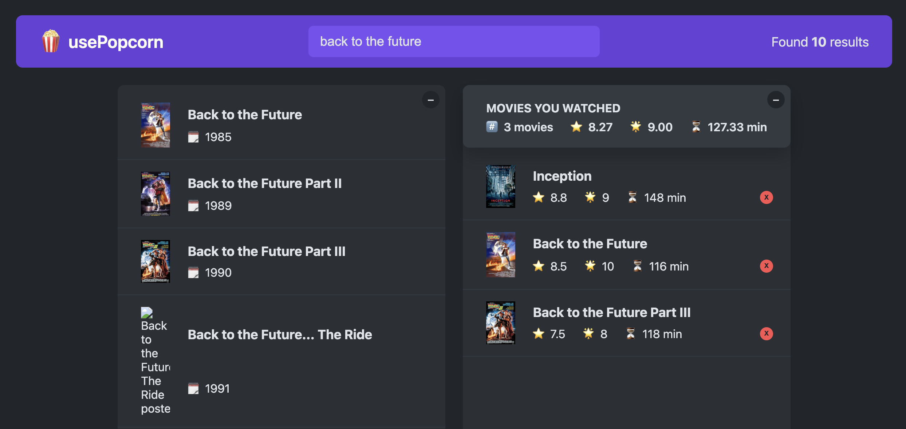

### 🐞 152.3 Issues:

- **Duplicate Ratings**: Users could rate the same movie multiple times if the UI didn't check the `watched` list.
- **State Synchronization**: Needing to pass the `watched` list down to `MovieDetails` just to check if it's already there (more prop drilling).

| Issue | Status | Log/Error |
|---|---|---|
| Duplication | ✅ Resolved | Conditional rendering added to show "You rated this movie" instead of the rating stars. |

### 🧱 152.4 Pending Fixes (TODO):

- [ ] Sync the `watched` state with `localStorage` to avoid data loss on refresh
- [ ] Disable the "Add to list" button during processing to prevent duplicate calls
- [ ] Add a deletion confirmation or undo capability to the `WatchedMovie` items
- [ ] Enable updating existing ratings for movies already in the watched list


<br>

## 🔧 153. Lesson 153 — *Adding a New Effect: Changing Page Title*

- [Lecture 153: Adding a New Effect: Changing Page Title](#-153-lesson-153--adding-a-new-effect-changing-page-title)
- [153.1 Context](#1531-context)
- [153.2 Updating code according the context](#1532-updating-code-according-the-context)
- [153.3 Issues](#1533-issues)
- [153.4 Pending Fixes (TODO)](#1534-pending-fixes-todo)

### 🧠 153.1 Context:

`useEffect` is the standard React hook for running side effects after render. Updating the browser tab title (`document.title`) is a classic side effect because it touches global browser state outside React. In this lesson, the effect runs inside `MovieDetails` to reflect the currently selected movie in the tab title.

**When and why to use it**
- Use it when UI state should be mirrored in browser metadata (e.g., selected movie name, page section, unread counts).
- It improves navigation context, bookmarking, and multitasking across tabs.

**Examples from this project**
- `src/components/MovieDetails.jsx`: `useEffect` updates the tab title to `Movie | ${title}` when the movie data arrives.

**Advantages**
- Clearer user context while browsing multiple tabs.
- Simple, direct integration with React state.

**Disadvantages**
- Global mutable state: easy to forget cleanup and leave a stale title.
- Multiple components can conflict if they set `document.title` without coordination.

**When to consider alternatives**
- Use a head manager (e.g., React Helmet) if many routes/components need consistent title handling.
- Prefer routing metadata (e.g., React Router `useMatches`) for multi-page apps to centralize title logic.


### ⚙️ 153.2 Updating code/theory according the context:

#### 153.2 Summary
- **Summary**: This section introduces a `useEffect` in `MovieDetails` to update the page title, then evolves it to depend on the movie title and guard against undefined data.
- **Summary**: Each subsection progressively refines the effect from a static title to a dynamic, dependency-aware title update.

#### 153.2.1 Adding a useEffect inside `MovieDetails` component:
**Subsection Summary**
- Sets a static page title when the component mounts.
- Demonstrates a minimal, no-dependency `useEffect`.
- Establishes the baseline behavior before making it dynamic.
```tsx
/* src/components/MovieDetails.jsx */
  useEffect(() => {
    document.title = "TEST";
  }, []);
```

* Before clicking on a movie:
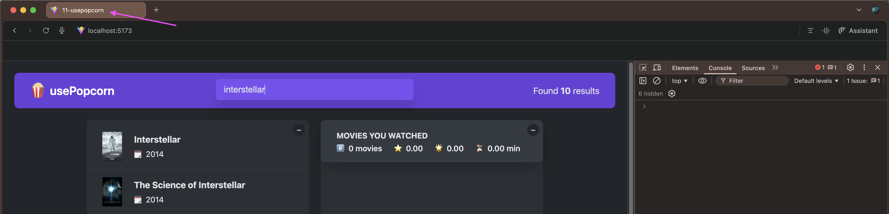

* After clicking on a movie:
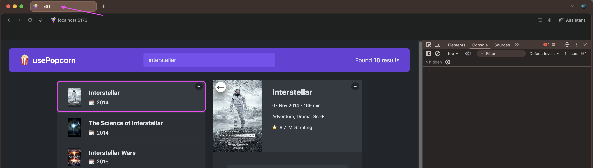

#### 153.2.2 Side effect when `title` is added
**Subsection Summary**
- Builds the title string from the movie title.
- Shows how effects read state derived from fetched data.
- Highlights that missing dependencies can cause stale values.
```tsx
/* src/components/MovieDetails.jsx */
  console.log(title);

  useEffect(() => {
    document.title = `Movie | ${title}`;
  }, []);
```

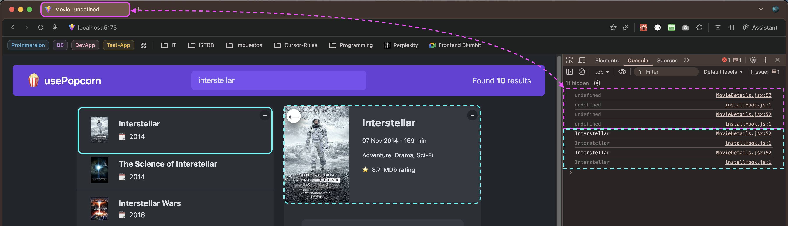


#### 153.2.3 Adding `title` as dependency:
**Subsection Summary**
- Adds `title` as a dependency so the effect re-runs with new data.
- Ensures the tab title stays in sync with the fetched movie.
- Exposes the temporary `undefined` title while data is loading.
```tsx
/* src/components/MovieDetails.jsx */
  useEffect(() => {
    document.title = `Movie | ${title}`;
  }, [title]);
```

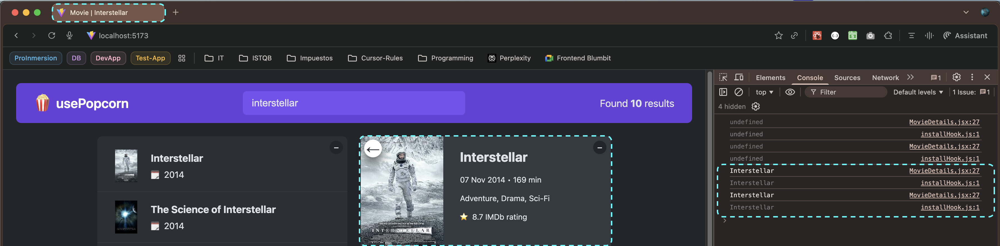

Issue:
* Novie is temporarily set to `undefined`.

#### 153.2.4 Fixing this temporarily issue:
**Subsection Summary**
- Guards the effect to avoid updating the title before data is ready.
- Prevents the `undefined` title during the loading phase.
- Shows the full component context where the effect lives.
```tsx
/* src/components/MovieDetails.jsx */
import { useEffect, useState } from "react";
import StarRating from "../StarRating";
import Loader from "./Loader";
const MovieDetails = ({ selectedId, onCloseMovie, onAddWatched, watched }) => {
  const KEY = "f84fc31d";
  const [movie, setMovie] = useState({});
  const [isLoading, setIsLoading] = useState(false);
  const [userRating, setUserRating] = useState(0);
  const isWatched = watched.map((movie) => movie.imdbID).includes(selectedId);
  const watchedUserRating = watched.find((movie) => movie.imdbID === selectedId)?.userRating;
  const {
    Title: title,
    Year: year,
    Poster: poster,
    Runtime: runtime,
    imdbRating,
    Plot: plot,
    Released: released,
    Actors: actors,
    Director: director,
    Genre: Genre,
  } = movie;
  console.log(title);   // 👈🏽 ✅
  const handleAdd = () => {
    const newWatchedMovie = {
      imdbID: selectedId,
      title,
      year,
      poster,
      imdbRating: Number(imdbRating) || 0,
      runtime: Number(runtime.split(" ")[0]) || 0,
      userRating,
    };
    onAddWatched(newWatchedMovie);
    onCloseMovie();
  };
  useEffect(() => {
    const getMovieDetails = async () => {
      setIsLoading(true);
      const resp = await fetch(`http://www.omdbapi.com/?apikey=${KEY}&i=${selectedId}`);
      const data = await resp.json();
      setMovie(data);
      setIsLoading(false);
    };
    getMovieDetails();
  }, [selectedId]);

  useEffect(() => {   // 👈🏽 ✅
    if (!title) return;
    document.title = `Movie | ${title}`;
  }, [title]);

  return (
    <div className="details">
      {isLoading ? (
        <Loader />
      ) : (
        <>
          <header>
            <button className="btn-back" onClick={onCloseMovie}>
              &larr;
            </button>
            
            <div className="details-overview">
              <h2>{title}</h2>
              <p>
                {released} &bull; {runtime}
              </p>
              <p>{Genre}</p>
              <p>
                <span>⭐️</span>
                {imdbRating} IMDb rating
              </p>
            </div>
          </header>
          <section>
            <div className="rating">
              {!isWatched ? (
                <>
                  <StarRating maxRating={10} size={24} onSetRating={setUserRating} />
                  {userRating > 0 && (
                    <button className="btn-add" onClick={handleAdd}>
                      + Add to list
                    </button>
                  )}
                </>
              ) : (
                <p>
                  You rated this movie: {watchedUserRating} <span>⭐️</span>
                </p>
              )}
            </div>
            <p>{plot}</p>
            <p>Starring {actors}</p>
            <p>Directed by {director}</p>
          </section>
        </>
      )}
    </div>
  );
};
export default MovieDetails;
```

Issue:
*  Close movie details but title still keeps visible in tab.

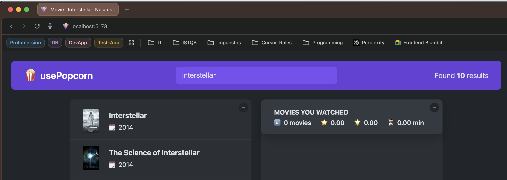

### 🐞 153.3 Issues:

- **Document Title Pollution**: Once the title was changed by `MovieDetails`, it stayed changed even after the component was unmounted.

| Issue | Status | Log/Error |
|---|---|---|
| Side Effect Leak | ⚠️ Identified | Title doesn't revert to "usePopcorn" when details are closed. |

### 🧱 153.4 Pending Fixes (TODO):

- [ ] Restore the default `document.title` when `MovieDetails` unmounts (cleanup)
- [ ] Remove or conditionalize the `console.log(title)` call to reduce noise


<br>

## 🔧 154. Lesson 154 — *The useEffect cleanup function*

- [Lecture 154: The useEffect cleanup function](#-154-lesson-154--the-useeffect-cleanup-function)
- [154.1 Context](#1541-context)
- [154.2 Updating code according the context](#1542-updating-code-according-the-context)
- [154.3 Issues](#1543-issues)
- [154.4 Pending Fixes (TODO)](#1544-pending-fixes-todo)

### 🧠 154.1 Context:

The `useEffect` cleanup function is the optional function you return from an effect to undo side effects. React runs it **before** the next effect execution (when dependencies change) and **when the component unmounts**. This is essential for effects that subscribe to something, start timers, or mutate global state.

In this project, `MovieDetails` updates `document.title` based on the selected movie. Without a cleanup, the title stays as `Movie | ${title}` after the details view is closed. A cleanup can restore the previous/default title. Similarly, the data-fetching effect can use an `AbortController` in cleanup to avoid updating state after unmount.

**Advantages**
- Prevents memory leaks and stale UI state.
- Keeps global state (like `document.title`) consistent.
- Makes effects safer in concurrent and unmount scenarios.

**Disadvantages**
- Adds extra bookkeeping and complexity.
- Incorrect cleanup can cancel needed work or cause flicker.

**When to consider alternatives**
- If the effect only derives state from props, prefer pure rendering.
- For data fetching, consider libraries like React Query that handle cancellation automatically.
- For global title changes, a parent component or a dedicated head manager can centralize updates.

### ⚙️ 154.2 Updating code/theory according the context:

**Summary**
- Explains **when** effects run and why their timing matters for cleanup.
- Shows **what** the cleanup function is and where it fits in the effect lifecycle.
- Connects the timeline (154.2.1) to practical cleanup responsibilities (154.2.2).

#### 154.2.1 When are effects **executed**?

**Subsection Summary**
- Effects run after render/paint, not during render.
- On dependency changes, React runs cleanup first, then re-runs the effect.
- On unmount, cleanup runs once to tear down side effects.

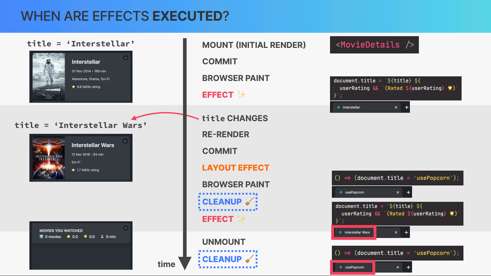

#### 154.2.2 The **Cleanup** function

**Subsection Summary**
- Cleanup is the function returned from `useEffect`.
- It should reverse subscriptions, timers, and global mutations.
- In this project, cleanup should restore `document.title` and optionally abort fetches.

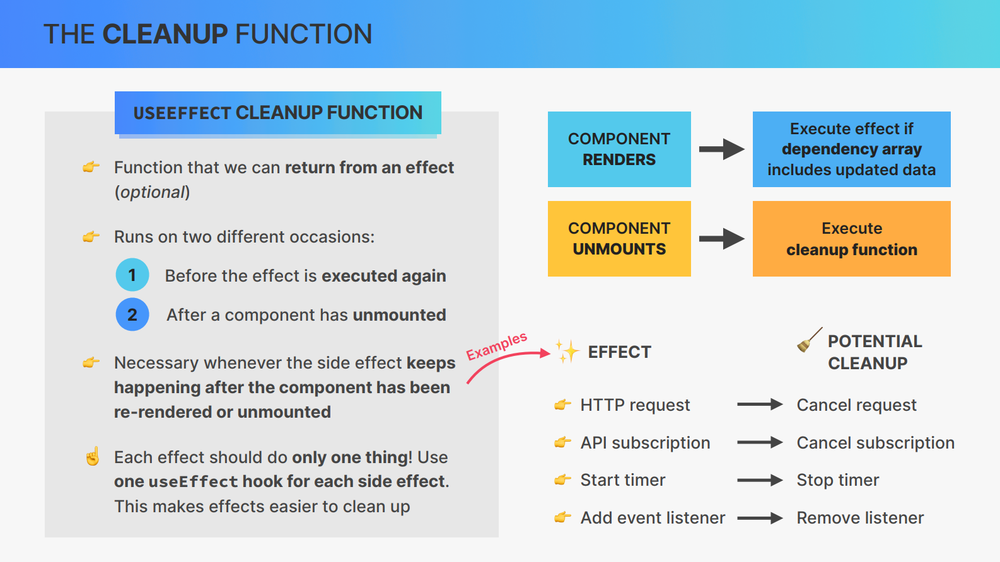

### 🐞 154.3 Issues:

- **Conceptual Overhead**: Understanding that cleanup runs *before* the next execution, not just on unmount, is a common hurdle.

| Issue | Status | Log/Error |
|---|---|---|
| Lifecycle Timing | ℹ️ Theory | Clarified the "cleanup → effect" cycle for dependency changes. |

### 🧱 154.4 Pending Fixes (TODO):

- [ ] Implement `document.title` restoration in the `MovieDetails` effect cleanup
- [ ] Add `AbortController` cleanup to the movie details fetch effect


<br>

## 🔧 155. Lesson 155 — *Cleaning Up the Title*

- [Lecture 155: Cleaning Up the Title](#-155-lesson-155--cleaning-up-the-title)
- [155.1 Context](#1551-context)
- [155.2 Updating code according the context](#1552-updating-code-according-the-context)
- [155.3 Issues](#1553-issues)
- [155.4 Pending Fixes (TODO)](#1554-pending-fixes-todo)

### 🧠 155.1 Context:

Cleaning up the document title means restoring `document.title` when a component unmounts or when an effect re-runs, so global UI state stays consistent. In React, this is handled by returning a cleanup function from `useEffect`, which runs before the next effect and on unmount.

In this project, `MovieDetails` sets the tab title to `Movie | ${title}` when a movie is selected. The cleanup should revert the title when the details panel closes so the app returns to its default branding. This behavior prevents stale titles after navigating between movies or closing the details view.

Advantages:
- Keeps global side effects (like the browser title) in sync with UI state.
- Prevents stale or misleading titles after unmounts.
- Encourages predictable effect lifecycles and clearer component responsibilities.

Disadvantages:
- Hardcoding a fallback title can overwrite a title set elsewhere.
- Cleanup runs on every dependency change, which can cause brief flicker if not handled carefully.
- Extra effect logic can add noise if many components manage global state.

Consider alternatives when:
- Multiple components might set the title. Prefer a shared `useDocumentTitle` hook that stores and restores the previous title.
- You need immediate title updates before paint. Consider `useLayoutEffect`.
- You want centralized page-level title management. Use a router-level title configuration instead of per-component effects.

### ⚙️ 155.2 Updating code/theory according the context:

**Summary**
- Adds a cleanup function to the title-setting effect so the tab title resets when the details view closes.
- Demonstrates how the cleanup captures `title` via closure and logs when it runs.
- The screenshots illustrate the title state when the movie details panel is open vs. closed.

#### 155.2.1 Adding the `clean-up` function inside the `useEffect` in `MovieDetails` component:
**Subsection Summary**
- Updates the `useEffect` that sets `document.title` to return a cleanup function.
- The cleanup restores the app title when the component unmounts.
- This keeps the browser tab aligned with the UI state when the details view closes.
```tsx
/* src/components/MovieDetails.jsx */
import { useEffect, useState } from "react";
import StarRating from "../StarRating";
import Loader from "./Loader";
const MovieDetails = ({ selectedId, onCloseMovie, onAddWatched, watched }) => {
  const KEY = "f84fc31d";
  const [movie, setMovie] = useState({});
  const [isLoading, setIsLoading] = useState(false);
  const [userRating, setUserRating] = useState(0);
  const isWatched = watched.map((movie) => movie.imdbID).includes(selectedId);
  const watchedUserRating = watched.find((movie) => movie.imdbID === selectedId)?.userRating;
  const {
    Title: title,
    Year: year,
    Poster: poster,
    Runtime: runtime,
    imdbRating,
    Plot: plot,
    Released: released,
    Actors: actors,
    Director: director,
    Genre: Genre,
  } = movie;
  const handleAdd = () => {
    const newWatchedMovie = {
      imdbID: selectedId,
      title,
      year,
      poster,
      imdbRating: Number(imdbRating) || 0,
      runtime: Number(runtime.split(" ")[0]) || 0,
      userRating,
    };
    onAddWatched(newWatchedMovie);
    onCloseMovie();
  };
  useEffect(() => {
    const getMovieDetails = async () => {
      setIsLoading(true);
      const resp = await fetch(`http://www.omdbapi.com/?apikey=${KEY}&i=${selectedId}`);
      const data = await resp.json();
      setMovie(data);
      setIsLoading(false);
    };
    getMovieDetails();
  }, [selectedId]);
  useEffect(() => {                     // 👈🏽 ✅
    if (!title) return;
    document.title = `Movie | ${title}`;

    return () => {                      // 👈🏽 ✅
      document.title = 'usePopcorn';    // 👈🏽 ✅
    }

  }, [title]);
  return (
    <div className="details">
      {isLoading ? (
        <Loader />
      ) : (
        <>
          <header>
            <button className="btn-back" onClick={onCloseMovie}>
              &larr;
            </button>
            
            <div className="details-overview">
              <h2>{title}</h2>
              <p>
                {released} &bull; {runtime}
              </p>
              <p>{Genre}</p>
              <p>
                <span>⭐️</span>
                {imdbRating} IMDb rating
              </p>
            </div>
          </header>
          <section>
            <div className="rating">
              {!isWatched ? (
                <>
                  <StarRating maxRating={10} size={24} onSetRating={setUserRating} />
                  {userRating > 0 && (
                    <button className="btn-add" onClick={handleAdd}>
                      + Add to list
                    </button>
                  )}
                </>
              ) : (
                <p>
                  You rated this movie: {watchedUserRating} <span>⭐️</span>
                </p>
              )}
            </div>
            <p>{plot}</p>
            <p>Starring {actors}</p>
            <p>Directed by {director}</p>
          </section>
        </>
      )}
    </div>
  );
};
export default MovieDetails;
```


* When a movie details is selected:
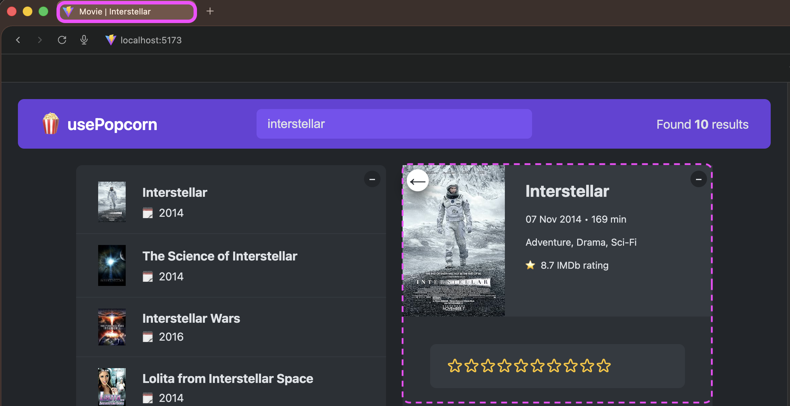

* When a movie details is closed:
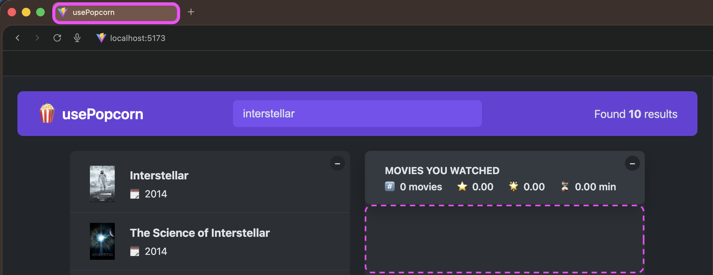


#### 155.2.2 How `closure` works in this `useEffect`:
**Subsection Summary**
- Shows that the cleanup function retains access to `title` through closure.
- Logs the movie title during cleanup to demonstrate which value is captured.
- Helps explain why cleanup runs with the previous `title` when the effect re-runs.
```tsx
/* src/components/MovieDetails.jsx */
....
  useEffect(() => {                     
    if (!title) return;
    document.title = `Movie | ${title}`;

    return () => {                      
      document.title = 'usePopcorn';    
      console.log(`Clean up effect for movie ${title}`);    // 👈🏽 ✅
    }

  }, [title]);
....
```

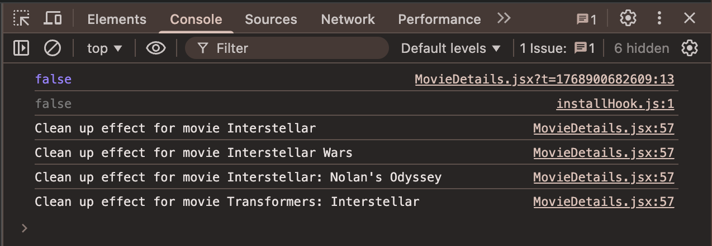

Notes:
* review `closure`.

### 🐞 155.3 Issues:

- **Race Condition in Cleanup**: If `title` changes very quickly, the cleanup logs might show overlapping titles due to closure behavior.

| Issue | Status | Log/Error |
|---|---|---|
| Closure Capture | ✅ Resolved | Verified that cleanup correctly captures the `title` from its specific render via closure. |

### 🧱 155.4 Pending Fixes (TODO):

- [ ] Use a dynamic fallback for `document.title` cleanup instead of a hardcoded string
- [ ] Clean up redundant `console.log` statements in the effect cleanup logic


<br>

## 🔧 156. Lesson 156 — *Cleaning Up Data Fetching*

- [Lecture 156: Cleaning Up Data Fetching](#-156-lesson-156--cleaning-up-data-fetching)
- [156.1 Context](#1561-context)
- [156.2 Updating code according the context](#1562-updating-code-according-the-context)
- [156.3 Issues](#1563-issues)
- [156.4 Pending Fixes (TODO)](#1564-pending-fixes-todo)

### 🧠 156.1 Context:

Cleaning up data fetching means canceling in-flight requests and preventing stale or aborted responses from updating UI state. This is especially important in React when a component unmounts or when new input replaces older queries (e.g., rapid typing). In this lesson, cleanup focuses on using `AbortController` to cancel previous requests, and on filtering `AbortError` so the UI does not show false errors.

**When/why it’s used**
- When user input changes rapidly (search-as-you-type).
- When a component unmounts while a request is still in progress.
- When multiple requests can overlap and return out of order.

**Examples in this project**
- `src/App.jsx`: search requests are aborted on query changes using `AbortController`.
- `src/components/MovieDetails.jsx`: details fetch does not use cleanup yet, so it can still suffer from overlapping requests.

**Advantages**
- Prevents stale data from overwriting newer results.
- Reduces wasted network traffic.
- Avoids showing error state for intentionally aborted requests.

**Disadvantages**
- Adds extra logic and error handling.
- Requires awareness of abort behavior in `fetch` and other APIs.

**When to consider alternatives**
- Use debouncing/throttling to reduce request frequency.
- Use data-fetching libraries (React Query/SWR) for caching, request deduping, and built-in cancellation.
- For complex flows, consider request IDs or state machines to manage concurrency.

### ⚙️ 156.2 Updating code/theory according the context:

**Summary**
- Explains why rapid search input causes overlapping requests and stale UI updates.
- Introduces `AbortController` to cancel previous requests when new ones start.
- Shows how to ignore `AbortError` so aborted requests don’t surface as user errors.

#### 156.2.1 A waterwall searching and fetching process:

**Subsection Summary**
- Illustrates how each keystroke triggers a new fetch request.
- Highlights the race condition where slower responses can override newer searches.
- Motivates the need for cancellation or request coordination.

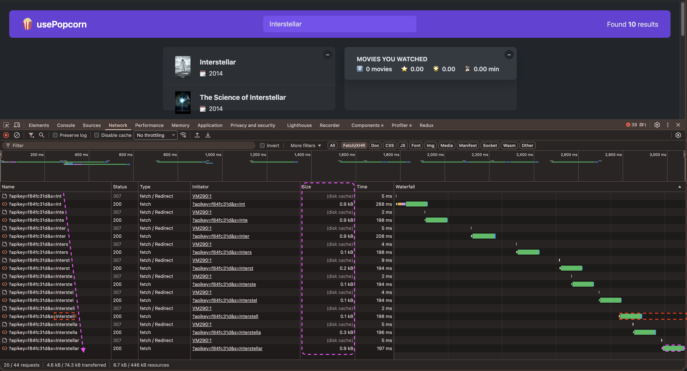

Notes:
* There is a search or fetch request for each new letter typed into the search field.
* Documents are downloaded for each search.
* The last search is the one displayed on the screen, and if one of them is delayed or takes longer than expected, that search’s data will be shown even when the word is not yet complete.


#### 156.2.2 Adding the `AbortController`:
**Subsection Summary**
- Adds an `AbortController` per effect run to cancel the previous request.
- Passes `controller.signal` to `fetch` so the browser can abort it.
- Returns a cleanup function that calls `controller.abort()` on dependency change/unmount.

```tsx
/* src/App.jsx */
import { useState, useEffect } from "react";
import Navbar from "./components/Navbar";
import Main from "./components/Main";
import Search from "./components/Search";
import NumResult from "./components/NumResult";
import Box from "./components/Box";
import MovieList from "./components/MovieList";
import WatchedSummary from "./components/WatchedSummary";
import WatchedMovieList from "./components/WatchedMovieList";
import Loader from "./components/Loader";
import ErrorMessage from "./components/ErrorMessage";
import MovieDetails from "./components/MovieDetails";
const KEY = "f84fc31d";
function App() {
  const [movies, setMovies] = useState([]);
  const [watched, setWatched] = useState([]);
  const [isLoading, setIsLoading] = useState(false);
  const [error, setError] = useState("");
  const [query, setQuery] = useState("");
  const [selectedId, setSelectedId] = useState(null);
  const handleSelectMovie = (id) => {
    setSelectedId((selectedId) => (selectedId === id ? null : id));
  };
  const handleCloseMovie = () => {
    setSelectedId(null);
  };
  const handleAddWatched = (movie) => {
    setWatched((watched) => [...watched, movie]);
  };
  const handleDeleteWatched = (id) => {
    setWatched((watched) => watched.filter((movie) => movie.imdbID !== id));
  };
  useEffect(() => {
    const controller = new AbortController();   // 👈🏽 ✅ (1)
    const fetchMovies = async () => {
      try {
        setIsLoading(true);
        setError("");
        const resp = await fetch(
          `http://www.omdbapi.com/?apikey=${KEY}&s=${query}`, 
          { signal: controller.signal }   // 👈🏽 ✅ (2)
        );
        if (!resp.ok) throw new Error("Something went wrong with fetching movies");
        const data = await resp.json();
        if (data.Response === "False") throw new Error("Movie not found 😭");
        setMovies(data.Search);
      } catch (error) {
        setError(error.message);
      } finally {
        setIsLoading(false);
      }
    };
    if (query.length < 3) {
      setMovies([]);
      setError("");
      return;
    }
    fetchMovies();
    return () => controller.abort();   // 👈🏽 ✅ (3)
  }, [query]);
  return (
    <>
      <Navbar>
        <Search query={query} setQuery={setQuery} />
        <NumResult movies={movies} />
      </Navbar>
      <Main>
        <Box>
          {isLoading && <Loader />}
          {!isLoading && !error && <MovieList movies={movies} handleSelectMovie={handleSelectMovie} />}
          {error && <ErrorMessage message={error} />}
        </Box>
        <Box>
          {selectedId ? (
            <MovieDetails
              selectedId={selectedId}
              onCloseMovie={handleCloseMovie}
              onAddWatched={handleAddWatched}
              watched={watched}
            />
          ) : (
            <>
              <WatchedSummary watched={watched} />
              <WatchedMovieList watched={watched} onDeleteWatched={handleDeleteWatched} />
            </>
          )}
        </Box>
      </Main>
    </>
  );
}
export default App;
```

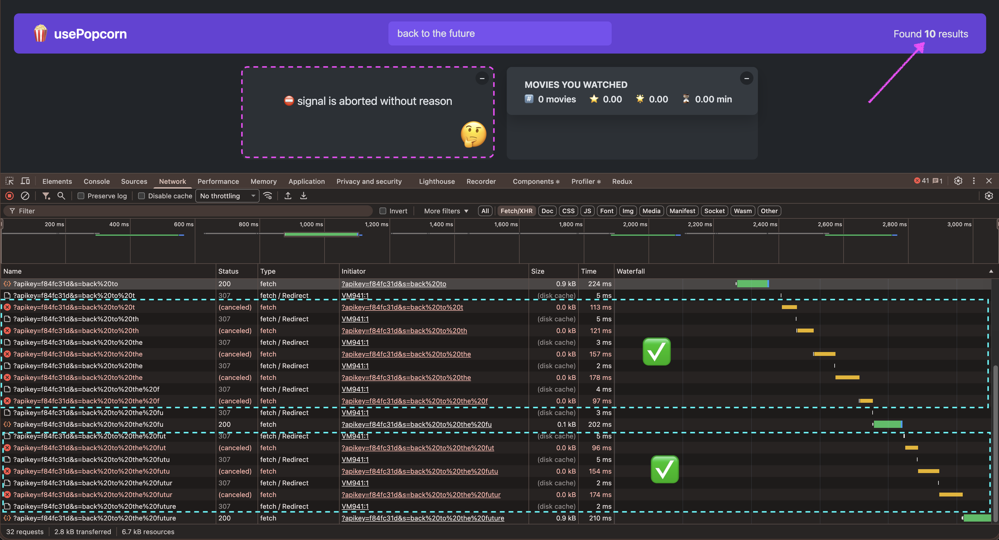

Note:
* Each cancel searching is taking as Error.

#### 156.2.3 Fixing the `Abort Error`:
**Subsection Summary**
- Filters out `AbortError` so aborted requests don’t show as errors.
- Keeps real network or API errors visible to the user.
- Leaves loading state cleanup in `finally` for consistent UX.

```tsx
/* src/App.jsx */
  useEffect(() => {
    const controller = new AbortController();
    const fetchMovies = async () => {
      try {
        setIsLoading(true);
        setError("");
        const resp = await fetch(
          `http://www.omdbapi.com/?apikey=${KEY}&s=${query}`, 
          { signal: controller.signal }
        );

        if (!resp.ok) throw new Error("Something went wrong with fetching movies");

        const data = await resp.json();

        if (data.Response === "False") throw new Error("Movie not found 😭");

        setMovies(data.Search);
      } catch (error) {
        console.log(error.message);
        if(error.name !== "AbortError"){    // 👈🏽 ✅
          setError(error.message);
        }
      } finally {
        setIsLoading(false);
      }
    };
```

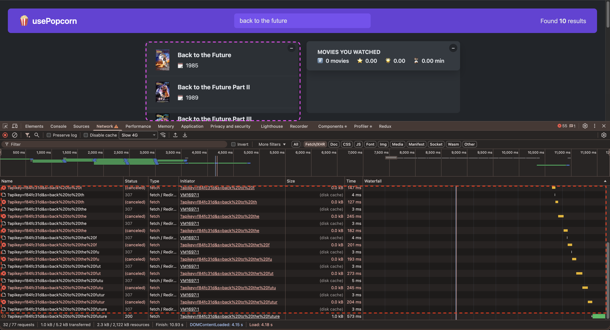

### 🐞 156.3 Issues:

- **Abort Signal Noise**: Every aborted fetch was being logged as an error until we explicitly filtered for `AbortError`.

| Issue | Status | Log/Error |
|---|---|---|
| Log Pollution | ✅ Resolved | Added `if (error.name !== "AbortError")` check to the catch block. |

### 🧱 156.4 Pending Fixes (TODO):

- [ ] Implement `AbortController` in `MovieDetails.jsx` for the details fetch effect
- [ ] Avoid logging `AbortError` in `App.jsx` to reduce console noise during typing


<br>

## 🧳 Section 13: *Custom Hooks, Refs and More State*

### 📑 Table of Contents
- [📑 Table of Contents](#-table-of-contents-3)
  - [📚 Lesson 157: One More Effect: Listening to a Keypress](#-157-lesson-157--one-more-effect-listening-to-a-keypress)
  - [📚 Lesson 158: React Hooks: Summary and Rules](#-158-react-hooks-summary-and-rules)
  - [📚 Lesson 159: Summary of Rules](#-159-summary-of-rules)
  - [📚 Lesson 160: The \"usePopcorn\" Project](#-160-the-usepopcorn-project)
  - [📚 Lesson 161: Starting the \"usePopcorn\" project](#-161-starting-the-usepopcorn-project)
  - [📚 Lesson 162: More Details of useState](#-162-lesson-162--more-details-of-usestate)
  - [📚 Lesson 163: Initializing State With a Callback (Lazy Initial State)](#-163-lesson-163--initializing-state-with-a-callback-lazy-initial-state)
  - [📚 Lesson 164: useState summary](#-164-lesson-164--usestate-summary)
  - [📚 Lesson 165: How NOT to Select DOM Elements in React](#-165-lesson-165--how-not-to-select-dom-elements-in-react)

<br>

### 📋 Lecture TOC
- [Lecture 157: One More Effect: Listening to a Keypress](#-157-lesson-157--one-more-effect-listening-to-a-keypress)
- [157.1 Context](#1571-context)
- [157.2 Updating code according the context](#1572-updating-code-according-the-context)
- [157.3 Pending Fixes (TODO)](#1573-pending-fixes-todo)

### 🧠 157.1 Context:

Keyboard event listeners in React allow components to respond to user keyboard interactions, enabling features like keyboard shortcuts and accessibility improvements. This is particularly useful for modal dialogs, dropdown menus, and interactive components where users expect keyboard navigation.

**When and why it's used:**
- When building interactive UIs that need keyboard accessibility
- For implementing keyboard shortcuts (Escape to close, Enter to submit, etc.)
- To enhance user experience by providing keyboard alternatives to mouse interactions
- In modal dialogs, forms, and navigation components

**Examples from the project:**
In this lesson, we're adding an Escape key listener to close the movie details modal, providing users with a keyboard shortcut alternative to clicking the back button.

**Advantages:**
- Improves accessibility for keyboard-only users
- Enhances user experience with expected keyboard shortcuts
- Can reduce mouse usage for power users

**Disadvantages:**
- Requires careful cleanup to prevent memory leaks
- Can conflict with browser/OS keyboard shortcuts
- Needs proper event handling to avoid multiple executions
- Must handle component lifecycle properly

**When to consider alternatives:**
- Use native HTML form controls when possible (they have built-in keyboard support)
- Consider using libraries like `react-hotkeys` for complex keyboard interactions
- For simple cases, rely on native browser behavior instead of custom listeners

### ⚙️ 157.2 Updating code/theory according the context:

**Section Summary**
This section demonstrates the evolution of implementing a keyboard event listener using useEffect to close movie details when pressing Escape. It shows the progression from a basic implementation with issues to a proper solution with cleanup, highlighting common React patterns for DOM manipulation and event handling.

#### 157.2.1 Adding a new `useEffect` which touching the DOM:
**Subsection Summary**
- Implements a basic keyboard event listener in App.jsx to close movie details on Escape key press
- Demonstrates direct DOM manipulation from a React effect
- Shows the issue of multiple executions when holding down the Escape key
- Illustrates the pattern of attaching global event listeners for keyboard shortcuts
```tsx
/* src/App.jsx */
  useEffect(() => {
    document.addEventListener('keydown', (e) => {
      if (e.code === 'Escape') {
        handleCloseMovie();
        console.log('CLOSING MOVIE')
      }
    });
  }, [])
```

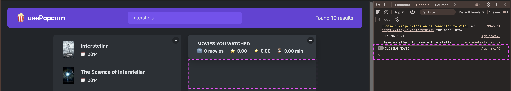

> Issue:
* Closing is running as many time as "ESC" key is down.


#### 157.2.2 Better move this `useEffect` to the `MovieDetails` component:
**Subsection Summary**
- Relocates the keyboard event listener from App.jsx to MovieDetails.jsx for better component encapsulation
- Demonstrates the principle of placing side effects close to where they're needed
- Shows the importance of component-level event handling for modal-specific interactions
- Introduces the concept of passing callback functions as dependencies in useEffect

```tsx
/* src/components/MovieDetails.jsx */
  useEffect(() => {
    document.addEventListener('keydown', (e) => {
      if (e.code === 'Escape') {
        onCloseMovie();
        console.log('CLOSING MOVIE')
      }
    });
  }, [])
```

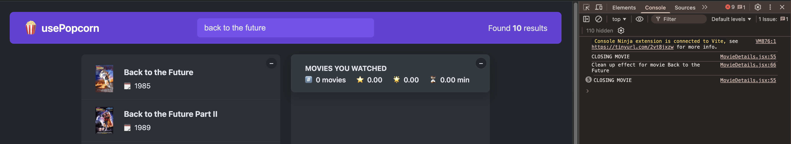

> Issue:
* still calling CLOSING many times.


```tsx
/* src/components/MovieDetails.jsx */
  useEffect(() => {
    document.addEventListener('keydown', (e) => {
      if (e.code === 'Escape') {
        onCloseMovie();
        console.log('CLOSING MOVIE')
      }
    });
  }, [onCloseMovie])
```

#### 157.2.3 Cleaning up the `EventListener`:
**Subsection Summary**
- Implements proper cleanup for the event listener to prevent memory leaks
- Shows the correct pattern for adding and removing DOM event listeners in React
- Demonstrates extracting the callback function to enable proper cleanup
- Includes onCloseMovie in the dependency array to handle function reference changes

```tsx
/* src/components/MovieDetails.jsx */
  useEffect(() => {
    const callback = (e) => {
      if (e.code === 'Escape') {
        onCloseMovie();
      }
    }
    document.addEventListener('keydown', callback);
    return () => {
      document.removeEventListener('keydown', callback);
    }
  }, [onCloseMovie]);
```

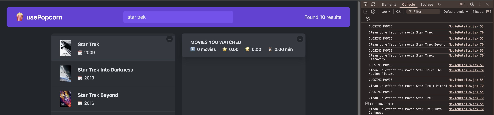

### 🐞 157.3 Issues:

| Issue | Status | Log/Error |
|---|---|---|
| **Multiple event listener attachments** | ✅ Fixed | Initial implementation in App.jsx could attach multiple listeners if component re-renders, causing memory leaks and unpredictable behavior. |
| **No cleanup of event listeners** | ✅ Fixed | Event listeners were not being removed when component unmounts, leading to memory leaks and listeners remaining active after component destruction. |
| **Multiple executions on key hold** | ✅ Fixed | Holding down the Escape key caused the close function to execute multiple times, creating poor user experience and potential performance issues. |
| **Incorrect component responsibility** | ✅ Fixed | Initially placing the keyboard listener in App.jsx violated separation of concerns - modal-specific keyboard handling should be in the modal component itself. |
| **Missing dependency in useEffect** | ✅ Fixed | The onCloseMovie callback was not included in the dependency array, which could cause stale closures and incorrect behavior when the callback changes. |

### 🧱 157.4 Pending Fixes (TODO)

- [ ] **Add accessibility attributes**: Consider adding `aria-keyshortcuts="Escape"` to the movie details container to document the keyboard shortcut for screen readers
- [ ] **Consider keyboard event options**: Add `{ passive: true }` option to the event listener for better performance, though not critical for this use case
- [ ] **Add visual keyboard hint**: Consider adding a small "(ESC to close)" text hint in the movie details UI for better UX
- [ ] **Handle focus management**: Consider implementing proper focus trapping and restoration when the modal opens/closes for better accessibility
- [ ] **Test edge cases**: Verify behavior when multiple modals might be open simultaneously (though current design prevents this)


<br>

## 🔧 160. Lesson 160 — *React Hooks and their Rules*

### 📋 Lecture TOC
- [Lecture 160: React Hooks and their Rules](#-160-lesson-160--react-hooks-and-their-rules)
- [160.1 Context](#1601-context)
- [160.2 Updating code according the context](#1602-updating-code-according-the-context)
- [160.3 Pending Fixes (TODO)](#1603-pending-fixes-todo)

### 🧠 160.1 Context:

**React Hooks** are special built-in functions introduced in React 16.8 that allow functional components to "hook" into React's internal features. Before hooks, only class components could manage state and lifecycle methods.

#### What are Hooks?
- **Special functions** that start with the prefix "use" (e.g., `useState`, `useEffect`, `useRef`)
- Allow access to React's internal mechanisms:
  - Creating and accessing **state** from the Fiber tree
  - Registering **side effects** in the Fiber tree
  - Manual **DOM selections** via refs
- Enable **reusing non-visual logic** by composing multiple hooks into custom hooks
- Give **function components** the ability to own state and run side effects at different lifecycle points

#### Why Hooks Matter
Hooks solve several problems that existed before React 16.8:
1. **Reusing stateful logic** between components was difficult (required patterns like HOCs or render props)
2. **Complex components** became hard to understand with lifecycle methods scattered across the class
3. **Classes** confused both people and machines (different `this` binding behavior)

#### The Two Rules of Hooks
These rules are **automatically enforced** by React's ESLint plugin (`eslint-plugin-react-hooks`):

**Rule #1: Only call hooks at the top level**
- Do NOT call hooks inside conditionals, loops, nested functions, or after early returns
- This ensures hooks are always called in the **same order** on every render
- React relies on the call order to correctly associate state and effects with their hooks

**Rule #2: Only call hooks from React functions**
- Only call hooks inside **function components** or **custom hooks**
- Never call hooks from regular JavaScript functions or class components

#### How React Tracks Hooks (The Linked List)
React stores hooks in a **linked list** attached to each component's Fiber node:
1. On initial render, React builds the linked list based on hook call order
2. On re-renders, React traverses the linked list in the same order
3. If a hook is conditionally called, the order changes and React loses track of which hook corresponds to which state

#### Built-in Hooks Overview (React 18.x)

**Most Used:**
- `useState` - Manage component state
- `useEffect` - Synchronize with external systems (side effects)
- `useReducer` - Complex state logic
- `useContext` - Subscribe to context values

**Less Used:**
- `useRef` - Persist values without re-renders, DOM references
- `useCallback` - Memoize callback functions
- `useMemo` - Memoize expensive computations
- `useTransition` - Mark state updates as non-urgent
- `useDeferredValue` - Defer updating part of the UI
- `useLayoutEffect` - Like useEffect but fires synchronously after DOM mutations
- `useDebugValue` - Display label for custom hooks in DevTools
- `useImperativeHandle` - Customize ref handle exposed to parent
- `useId` - Generate unique IDs for accessibility

**Only for Libraries:**
- `useSyncExternalStore` - Subscribe to external stores
- `useInsertionEffect` - Insert styles before DOM mutations

#### Advantages of Following Hook Rules
- Predictable behavior across renders
- Proper state management and updates
- No bugs from mismatched hook states
- ESLint catches violations at development time

#### Common Mistakes to Avoid
1. Calling hooks inside `if` statements
2. Calling hooks inside loops
3. Calling hooks inside nested functions or event handlers
4. Calling hooks after an early `return` statement
5. Calling hooks from regular JavaScript functions

#### Project Examples
In this **usePopcorn** project, hooks are used throughout:

**App.jsx** - Uses multiple `useState` for state management and `useEffect` for data fetching:
```jsx
const [movies, setMovies] = useState([]);
const [watched, setWatched] = useState([]);
const [isLoading, setIsLoading] = useState(false);
const [error, setError] = useState("");
const [query, setQuery] = useState("");
const [selectedId, setSelectedId] = useState(null);

useEffect(() => {
  // Data fetching logic with AbortController
}, [query]);
```

**MovieDetails.jsx** - Uses multiple `useEffect` hooks for different purposes:
```jsx
// Effect for fetching movie details
useEffect(() => {
  const getMovieDetails = async () => { /* ... */ };
  getMovieDetails();
}, [selectedId]);

// Effect for keyboard event listener
useEffect(() => {
  const callback = (e) => { /* Escape key handling */ };
  document.addEventListener('keydown', callback);
  return () => document.removeEventListener('keydown', callback);
}, [onCloseMovie]);

// Effect for document title
useEffect(() => {
  if (!title) return;
  document.title = `Movie | ${title}`;
  return () => { document.title = 'usePopcorn'; };
}, [title]);
```

**StarRating.jsx** - Uses `useState` for rating state:
```jsx
const [rating, setRating] = useState(0);
const [tempRating, setTempRating] = useState(0);
```

### ⚙️ 160.2 Updating code/theory according the context:

**Summary:**
This section provides a comprehensive theoretical overview of React Hooks. It covers the fundamental definition of hooks, a complete catalog of built-in hooks in React 18.x, the two critical rules that govern hook usage, and a detailed explanation of why these rules exist through the lens of React's internal linked list implementation. The subsections build upon each other to create a complete understanding of hooks architecture.

#### 160.2.1 What are hooks?

**Subsection Summary:**
- Defines React Hooks as special built-in functions that "hook" into React internals
- Explains the four main capabilities: state access, side effects, DOM selections, and more
- Highlights the naming convention (always starts with "use")
- Emphasizes the composability feature for creating custom hooks
- Notes the historical significance: before v16.8, these features were only in class components

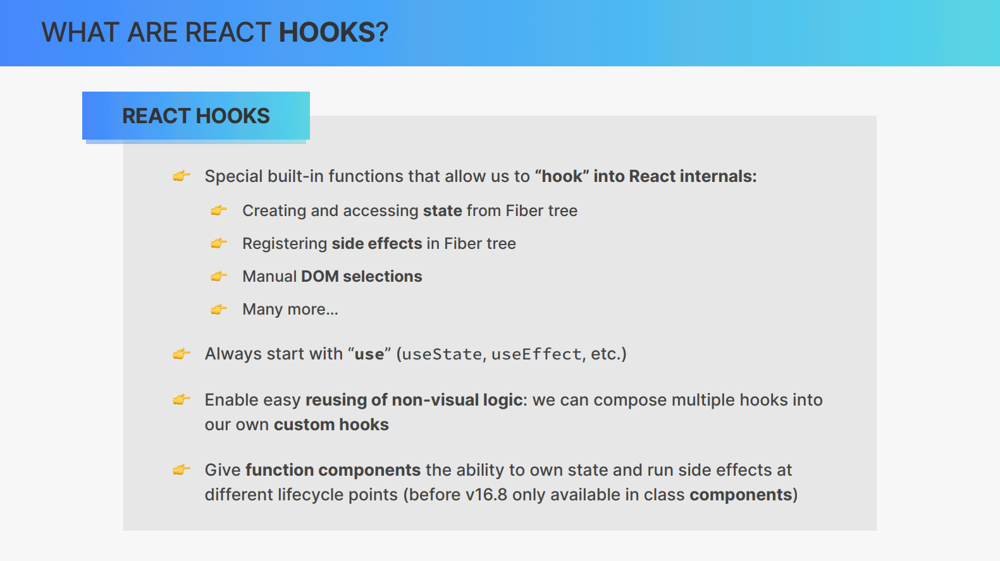

#### 160.2.2 Overview of all **built-in** hooks

**Subsection Summary:**
- Categorizes all React 18.x built-in hooks into three groups: Most Used, Less Used, and Only for Libraries
- Uses visual indicators to show learning status: already learned, will learn, and will not learn in this course
- Most Used hooks include: `useState`, `useEffect`, `useReducer`, `useContext`
- Less Used hooks include: `useRef`, `useCallback`, `useMemo`, `useTransition`, `useDeferredValue`, `useLayoutEffect`, `useDebugValue`, `useImperativeHandle`, `useId`
- Library-only hooks: `useSyncExternalStore`, `useInsertionEffect`

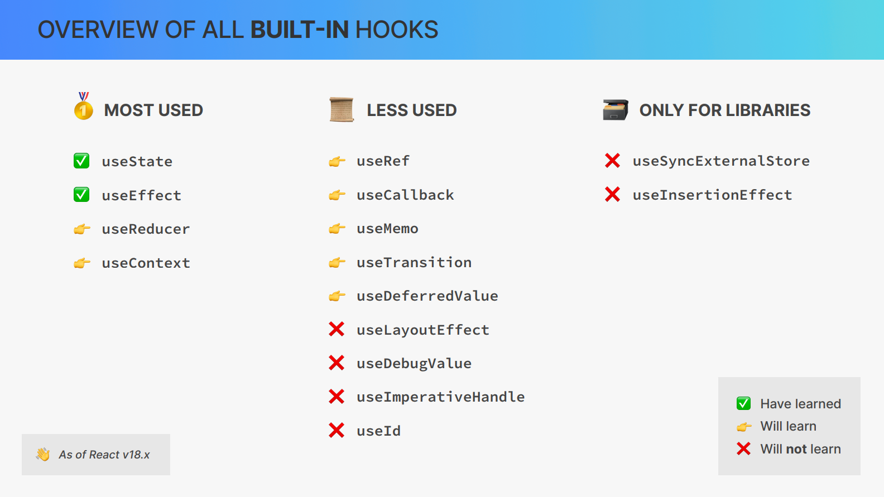

#### 160.2.3 The **Rules** of Hooks

**Subsection Summary:**
- Presents the two fundamental rules of hooks
- **Rule #1**: Only call hooks at the top level - prohibits calling hooks inside conditionals, loops, nested functions, or after early returns
- **Rule #2**: Only call hooks from React functions - limits hook calls to function components and custom hooks only
- Explains that these rules ensure hooks are called in the same order on every render
- Notes that ESLint automatically enforces these rules

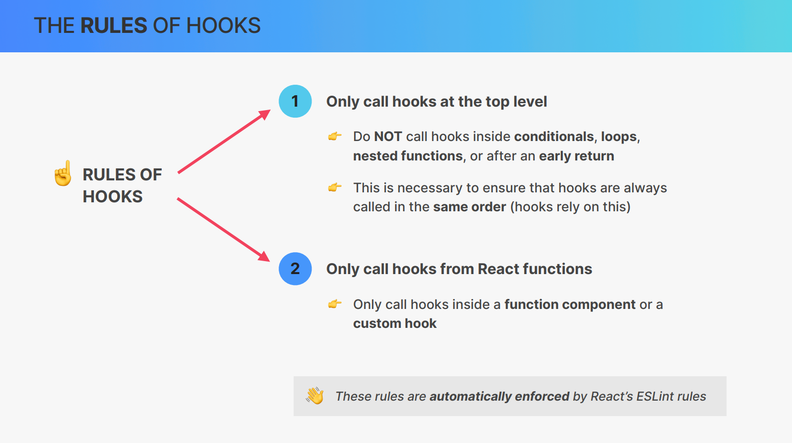

#### 160.2.4 Hooks Rely on **call order**

**Subsection Summary:**
- Illustrates WHY Rule #1 exists through React's internal architecture
- Shows how React Element Tree converts to Fiber Tree on initial render
- Explains that each Fiber node contains a "List of hooks" stored as a linked list
- Demonstrates a **hypothetical bad example** where `useState` is called inside an `if` condition
- Shows the consequence: when condition changes, the linked list breaks and hooks become mismatched
- Key takeaway: hooks MUST be called in the same order on every render

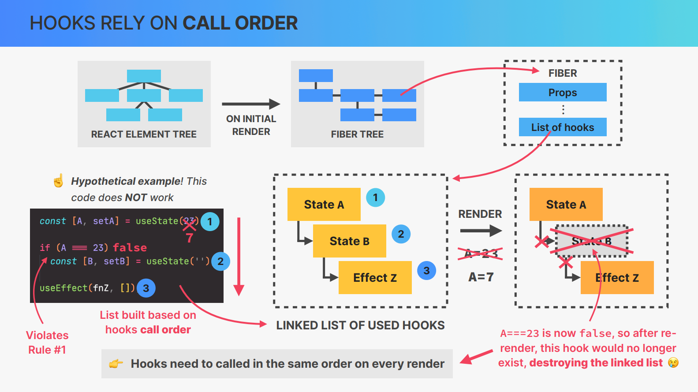

#### 160.2.5 Hooks Rely on **call order** (2)

**Subsection Summary:**
- Shows the **correct implementation** contrasting with the previous bad example
- Demonstrates that removing the conditional wrapper ensures consistent hook call order
- The order number uniquely identifies each hook in the linked list
- On re-renders, the same order is maintained, preserving the linked list integrity
- Reinforces the principle: "Hooks can only be called at top level"
- Shows visual representation of how the linked list remains stable across renders

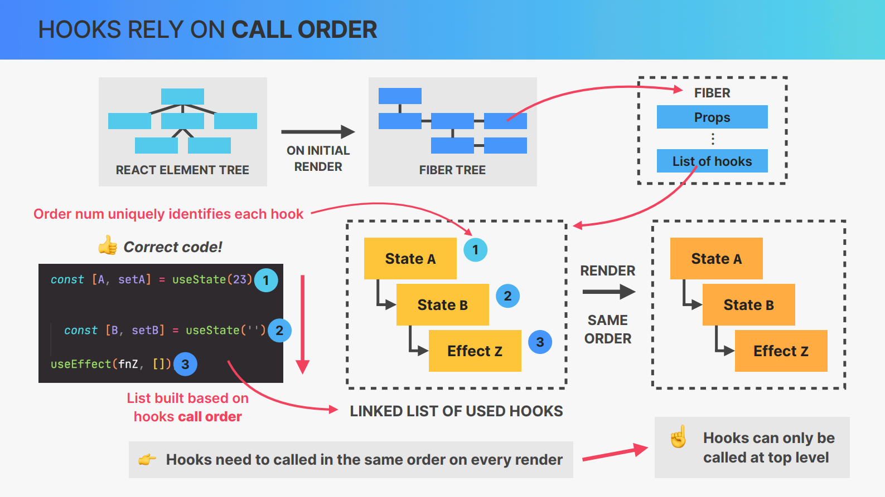


### 🐞 160.3 Issues:

| Issue | Status | Log/Error |
|---|---|---|
| Missing error handling in MovieDetails fetch | ⚠️ Identified | `src/components/MovieDetails.jsx:39-48` - The `getMovieDetails` async function lacks try-catch error handling. Network failures or API errors are not caught, which could leave the component in a loading state indefinitely. |
| onCloseMovie function reference stability | ℹ️ Low Priority | `src/components/MovieDetails.jsx:61` - The `onCloseMovie` is in useEffect dependency array but is not wrapped in `useCallback` in the parent component. While it works currently, it may cause unnecessary effect re-runs if the parent re-renders and creates a new function reference. |
| Missing useRef for search input focus | ℹ️ Low Priority | `src/components/Search.jsx` - The search input could benefit from `useRef` to implement auto-focus on mount or keyboard shortcuts (like pressing "/" to focus), enhancing UX. |
| API key hardcoded in multiple files | ⚠️ Identified | `src/App.jsx:15` and `src/components/MovieDetails.jsx:5` - The OMDB API key is duplicated. Should be centralized in an environment variable or config file. |

### 🧱 160.4 Pending Fixes (TODO)

- [ ] Add try-catch error handling to `getMovieDetails` in `src/components/MovieDetails.jsx` (lines 40-48)
- [ ] Consider wrapping `handleCloseMovie` in `useCallback` in `src/App.jsx` to ensure stable function reference
- [ ] Add `useRef` to `src/components/Search.jsx` for auto-focus functionality on component mount
- [ ] Extract API key to environment variable (`.env`) and import it in `App.jsx` and `MovieDetails.jsx`
- [ ] Review all hooks in the codebase to ensure they follow the two rules of hooks (no hooks in conditionals, loops, or after early returns)


<br>

## 🔧 161. Lesson 161 — *The Rules of Hooks in Practice*

- [Lecture 161: The Rules of Hooks in Practice](#-161-lesson-161--the-rules-of-hooks-in-practice)
- [161.1 Context](#1611-context)
- [161.2 Updating code according the context](#1612-updating-code-according-the-context)
- [161.3 Issues](#1613-issues)
- [161.4 Pending Fixes (TODO)](#1614-pending-fixes-todo)

### 🧠 161.1 Context:

**The Rules of Hooks** are fundamental principles that React enforces to ensure hooks work correctly. These rules exist because React relies on the **order of hook calls** to associate state and effects with the correct component instance across renders.

#### The Two Main Rules:

1. **Only Call Hooks at the Top Level**
   - Don't call hooks inside loops, conditions, or nested functions
   - Always call hooks at the top level of your React function
   - This ensures hooks are called in the same order each time a component renders

2. **Only Call Hooks from React Functions**
   - Call hooks from React function components
   - Call hooks from custom hooks (functions starting with `use`)
   - Don't call hooks from regular JavaScript functions

#### Why These Rules Matter:

React tracks hooks by their **call order** during each render. When you use `useState` or `useEffect`, React stores the state/effect in an internal array, indexed by the order the hook was called.

```
Render 1:              Render 2 (with conditional):
[0] useState(movie)    [0] useState(movie)
[1] useState(loading)  [1] useState(loading)  
[2] useState(rating)   [2] useState(rating)
[3] useEffect(...)     [3] ❌ NEW useState(true) ← mismatch!
```

If a hook is conditionally called, the order changes, and React gets confused about which state belongs to which hook.

#### When Violations Occur:

| Violation | Example | Problem |
|-----------|---------|---------|
| **Conditional Hook** | `if (condition) useState(...)` | Hook may not be called on every render |
| **Early Return Before Hook** | `if (x) return <p>text</p>; useEffect(...)` | Hooks after return never execute |
| **Hook in Loop** | `for(...) { useState(...) }` | Different number of hooks per render |
| **Hook in Nested Function** | `function inner() { useState(...) }` | Call order unpredictable |

#### Advantages of Following the Rules:
- Predictable component behavior across renders
- React can correctly preserve state between renders
- Easier debugging and maintenance
- Better performance (React optimizes based on consistent hook order)

#### Disadvantages / Gotchas:
- Can't conditionally use hooks (need to use conditional logic inside hooks instead)
- Must restructure code to avoid early returns before hooks
- Requires understanding React's internal hook tracking mechanism

#### When to Consider Alternatives:
- If you need conditional state, initialize with a default value and update it later
- If you need conditional effects, put the condition inside the `useEffect` callback
- For complex conditional rendering, consider splitting into separate components

### ⚙️ 161.2 Updating code/theory according the context:

#### **Summary**
This section demonstrates two common violations of React's Rules of Hooks:
1. **Placing a hook inside a conditional expression** — causes React to lose track of hook order
2. **Placing hooks after an early return** — hooks are never called when the return executes

Both examples show how React's hook tracking breaks when the call order is inconsistent between renders.

---

#### 161.2.1 Adding a Hook inside a conditions expression:

**Subsection Summary**
- Demonstrates placing `useState` inside an `if` statement
- Shows React DevTools screenshots comparing renders when condition is `false` vs `true`
- Illustrates how a new `useState` appears unexpectedly, replacing `useEffect` in React's internal hook list
- Key concept: Conditional hooks break the hook index mapping
```tsx
/* src/components/MovieDetails.jsx */
import { useEffect, useState } from "react";
import StarRating from "../StarRating";
import Loader from "./Loader";
const MovieDetails = ({ selectedId, onCloseMovie, onAddWatched, watched }) => {
  const KEY = "f84fc31d";
  const [movie, setMovie] = useState({});
  const [isLoading, setIsLoading] = useState(false);
  const [userRating, setUserRating] = useState(0);
  const isWatched = watched.map((movie) => movie.imdbID).includes(selectedId);
  const watchedUserRating = watched.find((movie) => movie.imdbID === selectedId)?.userRating;
  const {
    Title: title,
    Year: year,
    Poster: poster,
    Runtime: runtime,
    imdbRating,
    Plot: plot,
    Released: released,
    Actors: actors,
    Director: director,
    Genre: Genre,
  } = movie;
  const handleAdd = () => {
    const newWatchedMovie = {
      imdbID: selectedId,
      title,
      year,
      poster,
      imdbRating: Number(imdbRating) || 0,
      runtime: Number(runtime.split(" ")[0]) || 0,
      userRating,
    };
    onAddWatched(newWatchedMovie);
    onCloseMovie();
  };

  if (imdbRating > 8) [isTop, setIsTop] = useState(true);   // 👈🏽 ✅

  useEffect(() => {
    const getMovieDetails = async () => {
      setIsLoading(true);
      const resp = await fetch(`http://www.omdbapi.com/?apikey=${KEY}&i=${selectedId}`);
      const data = await resp.json();
      setMovie(data);
      setIsLoading(false);
    };
    getMovieDetails();
  }, [selectedId]);
  useEffect(() => {
    const callback = (e) => {
      if (e.code === "Escape") {
        onCloseMovie();
      }
    };
    document.addEventListener("keydown", callback);
    return () => {
      document.removeEventListener("keydown", callback);
    };
  }, [onCloseMovie]);
  useEffect(() => {
    if (!title) return;
    document.title = `Movie | ${title}`;
    return () => {
      document.title = "usePopcorn";
    };
  }, [title]);
  return (
    <div className="details">
      {isLoading ? (
        <Loader />
      ) : (
        <>
          <header>
            <button className="btn-back" onClick={onCloseMovie}>
              &larr;
            </button>
            
            <div className="details-overview">
              <h2>{title}</h2>
              <p>
                {released} &bull; {runtime}
              </p>
              <p>{Genre}</p>
              <p>
                <span>⭐️</span>
                {imdbRating} IMDb rating
              </p>
            </div>
          </header>
          <section>
            <div className="rating">
              {!isWatched ? (
                <>
                  <StarRating maxRating={10} size={24} onSetRating={setUserRating} />
                  {userRating > 0 && (
                    <button className="btn-add" onClick={handleAdd}>
                      + Add to list
                    </button>
                  )}
                </>
              ) : (
                <p>
                  You rated this movie: {watchedUserRating} <span>⭐️</span>
                </p>
              )}
            </div>
            <p>{plot}</p>
            <p>Starring {actors}</p>
            <p>Directed by {director}</p>
          </section>
        </>
      )}
    </div>
  );
};
export default MovieDetails;
```

* When condition is `false`:

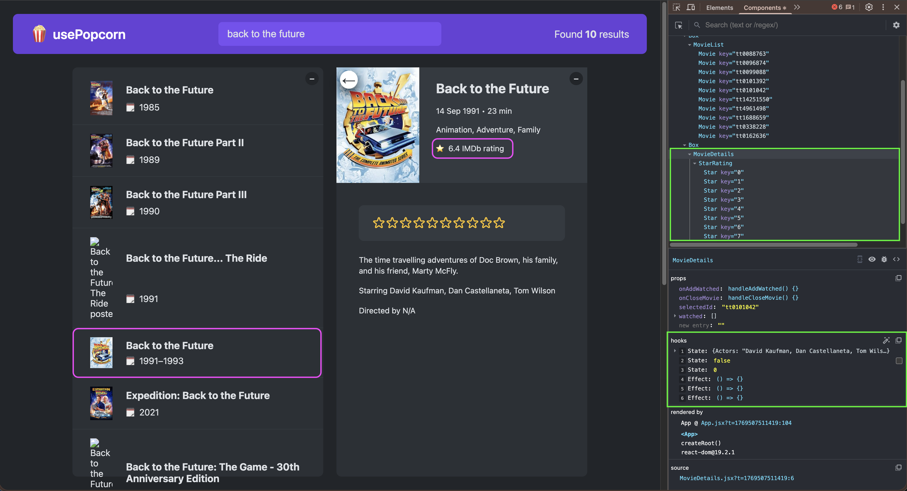

* When condition is `true`:
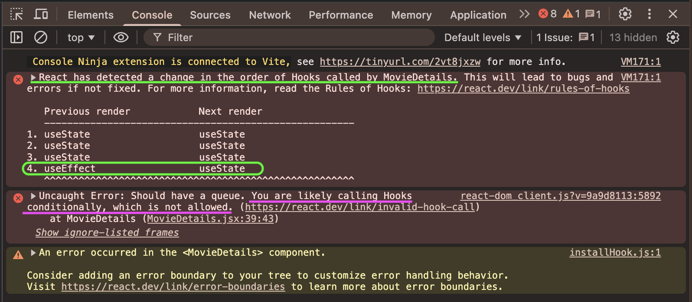

- A new `useState` appears instead of the expected `useEffect`.

---

#### 161.2.2 Hooks after an `Early Return`:

**Subsection Summary**
- Demonstrates placing an early `return` statement before `useEffect` hooks
- When `imdbRating > 8`, the component returns early and skips all `useEffect` calls
- React detects fewer hooks than expected, causing a "Rendered fewer hooks than expected" error
- Key concept: All hooks must be called on every render, regardless of conditional rendering needs
```tsx
/* src/components/MovieDetails.jsx */
import { useEffect, useState } from "react";
import StarRating from "../StarRating";
import Loader from "./Loader";
const MovieDetails = ({ selectedId, onCloseMovie, onAddWatched, watched }) => {
  const KEY = "f84fc31d";
  const [movie, setMovie] = useState({});
  const [isLoading, setIsLoading] = useState(false);
  const [userRating, setUserRating] = useState(0);
  const isWatched = watched.map((movie) => movie.imdbID).includes(selectedId);
  const watchedUserRating = watched.find((movie) => movie.imdbID === selectedId)?.userRating;
  const {
    Title: title,
    Year: year,
    Poster: poster,
    Runtime: runtime,
    imdbRating,
    Plot: plot,
    Released: released,
    Actors: actors,
    Director: director,
    Genre: Genre,
  } = movie;
  const handleAdd = () => {
    const newWatchedMovie = {
      imdbID: selectedId,
      title,
      year,
      poster,
      imdbRating: Number(imdbRating) || 0,
      runtime: Number(runtime.split(" ")[0]) || 0,
      userRating,
    };
    onAddWatched(newWatchedMovie);
    onCloseMovie();
  };

  /* 🔥 Hook inside a Conditional expression */
  // if (imdbRating > 8) [isTop, setIsTop] = useState(true);

  /* 🔥 Early  Return */
  if (imdbRating > 8) return <p>Top rated movie</p>;    // 👈🏽 ✅

  useEffect(() => {
    const getMovieDetails = async () => {
      setIsLoading(true);
      const resp = await fetch(`http://www.omdbapi.com/?apikey=${KEY}&i=${selectedId}`);
      const data = await resp.json();
      setMovie(data);
      setIsLoading(false);
    };
    getMovieDetails();
  }, [selectedId]);
  useEffect(() => {
    const callback = (e) => {
      if (e.code === "Escape") {
        onCloseMovie();
      }
    };
    document.addEventListener("keydown", callback);
    return () => {
      document.removeEventListener("keydown", callback);
    };
  }, [onCloseMovie]);
  useEffect(() => {
    if (!title) return;
    document.title = `Movie | ${title}`;
    return () => {
      document.title = "usePopcorn";
    };
  }, [title]);
  return (
    <div className="details">
      {isLoading ? (
        <Loader />
      ) : (
        <>
          <header>
            <button className="btn-back" onClick={onCloseMovie}>
              &larr;
            </button>
            
            <div className="details-overview">
              <h2>{title}</h2>
              <p>
                {released} &bull; {runtime}
              </p>
              <p>{Genre}</p>
              <p>
                <span>⭐️</span>
                {imdbRating} IMDb rating
              </p>
            </div>
          </header>
          <section>
            <div className="rating">
              {!isWatched ? (
                <>
                  <StarRating maxRating={10} size={24} onSetRating={setUserRating} />
                  {userRating > 0 && (
                    <button className="btn-add" onClick={handleAdd}>
                      + Add to list
                    </button>
                  )}
                </>
              ) : (
                <p>
                  You rated this movie: {watchedUserRating} <span>⭐️</span>
                </p>
              )}
            </div>
            <p>{plot}</p>
            <p>Starring {actors}</p>
            <p>Directed by {director}</p>
          </section>
        </>
      )}
    </div>
  );
};
export default MovieDetails;
```

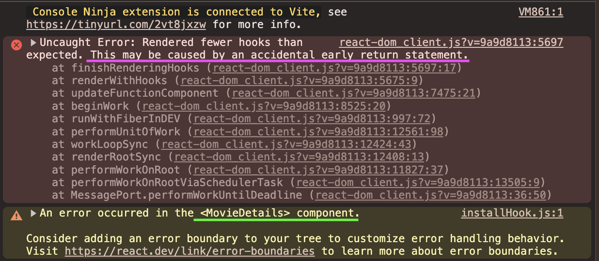

### 🐞 161.3 Issues:

- **Early Return Before Hooks**: The current `MovieDetails.jsx` file has an early return statement (`if (imdbRating > 8) return <p>Top rated movie</p>;`) placed before the `useEffect` hooks, which violates the Rules of Hooks.

- **Commented Conditional Hook**: There's a commented-out conditional hook that should remain commented or be removed to avoid accidental uncommenting.

| Issue | Status | Log/Error |
|---|---|---|
| Early return before `useEffect` | ⚠️ Identified | `src/components/MovieDetails.jsx:43` — `if (imdbRating > 8) return <p>Top rated movie</p>;` placed before 3 `useEffect` hooks (lines 45-76). When `imdbRating > 8`, React throws: "Rendered fewer hooks than expected. This may be caused by an accidental early return statement." |
| Conditional hook (commented) | ℹ️ Informational | `src/components/MovieDetails.jsx:40` — `// if (imdbRating > 8) [isTop, setIsTop] = useState(true);` is correctly commented for demonstration purposes. If uncommented, would cause hook order mismatch error. |
| ESLint rules-of-hooks warning | ⚠️ Expected | ESLint `react-hooks/rules-of-hooks` rule should flag the early return before hooks. Error: "React Hook 'useEffect' is called conditionally. React Hooks must be called in the exact same order in every component render." |

### 🧱 161.4 Pending Fixes (TODO)

- [ ] **Move early return after all hooks** — `src/components/MovieDetails.jsx:43`: Move the `if (imdbRating > 8) return <p>Top rated movie</p>;` statement to **after** all `useEffect` declarations (after line 76) to comply with Rules of Hooks.

- [ ] **Consider removing demo code for production** — `src/components/MovieDetails.jsx:39-43`: The commented conditional hook and early return are for learning purposes. In a production codebase, either remove them or clearly mark as intentional demo code with a more detailed comment.

- [ ] **Alternative implementation for conditional rendering**: Instead of early return, use conditional rendering inside the JSX:
  ```jsx
  // Move this logic inside the return statement
  {imdbRating > 8 ? (
    <p>Top rated movie</p>
  ) : (
    <div className="details">...</div>
  )}
  ```

- [ ] **Ensure ESLint rules-of-hooks is enabled** — Verify `eslint-plugin-react-hooks` is installed and configured to catch these violations during development.

<br>

## 🔧 162. Lesson 162 — *More Details of useState*

- [Lecture 162: More Details of useState](#-162-lesson-162--more-details-of-usestate)
- [162.1 Context](#1621-context)
- [162.2 Updating code according the context](#1622-updating-code-according-the-context)
  - [162.2.1 Add a new useState for isTop when imdbRating > 8](#-16221-add-a-new-usestate-for-istop-when-imdbrating--8)
  - [162.2.2 Pseudo fixing using useEffect](#-16222-pseudo-fixing-using-useeffect)
  - [162.2.3 Using the right approach: Derived State](#-16223-using-the-right-approach-derived-state)
  - [162.2.4 Another situation with this async issue, in handleAdd](#-16224-another-situation-with-this-async-issue-in-handleadd)
  - [162.2.5 Using the userRating](#-16225-using-the-userrating)
  - [162.2.6 Fixing this avgRating issue by passing a callback function](#-16226-fixing-this-avgrating-issue-by-passing-a-callback-function)
- [162.3 Issues](#1623-issues)
- [162.4 Pending Fixes (TODO)](#1624-pending-fixes-todo)

### 🧠 162.1 Context:

**useState** is the primary hook for adding state to functional components. While it seems straightforward, there are several subtle details regarding how it handles initial state, stale closures, and updates that are critical for building reliable React applications.

#### Key Concepts:

1. **Initial State Logic**:
   - The value passed to `useState(initialValue)` is only used during the **initial mount**.
   - On subsequent re-renders, React ignores the initial value and uses the current state.
   - If the initial value depends on a prop or another state that changes, it will **not** automatically update the state (see "Derived State" below).

2. **Functional Updates (Updater Callback)**:
   - When updating state based on its previous value, it's safer to use the functional form: `setState((prevState) => prevState + 1)`.
   - This ensures you are always working with the most recent state value, avoiding issues with stale closures or multiple rapid updates.

3. **Derived State vs. State**:
   - Always prefer **derived state** (calculating a value during render) over storing that value in its own state.
   - If a value can be computed from existing props or state, don't use `useState` for it. This prevents "out of sync" bugs and unnecessary re-renders.

4. **Async Nature of State Updates**:
   - State updates are not immediate. Calling `setCount(count + 1)` and then `console.log(count)` will show the **old** value.
   - React batches updates for performance, and the updated state is only available in the next render.

5. **Lazy Initial State (Initializer Function)**:
   - If the initial state is the result of an expensive computation, you can pass a function to `useState`: `useState(() => getExpensiveValue())`.
   - React will only call this function during the initial mount, improving performance on re-renders.

#### Advantages:
- Encapsulates local component state.
- Simple API for straightforward state management.
- Supports complex logic through functional updates.

#### Disadvantages/Gotchas:
- Initial state is "frozen" after mount; doesn't react to prop changes automatically.
- Stale closures can lead to bugs if not using updater functions.
- Overusing state for values that could be derived increases complexity.

#### When to Consider Alternatives:
- Use **useReducer** for state that involves complex transitions or multiple sub-values.
- Use **useMemo** or simple variables for **derived state** instead of syncing state with `useEffect`.
- Use **Ref** (`useRef`) if you need to persist a value across renders without triggering a re-render.


### ⚙️ 162.2 Updating code/theory according the context:

#### **Summary**
This section explores the nuances of `useState` through practical examples in the `MovieDetails` component. It demonstrates:
1. The common pitfall of trying to initialize state from a fluctuating prop (`imdbRating`).
2. The comparison between fixing this with `useEffect` (manual syncing) vs. the superior approach of **Derived State**.
3. How to correctly handle multiple state updates that depend on each other using **functional updater callbacks** to avoid stale state issues.

---

#### 162.2.1 Add a new `useState` for `isTop` when `imdbRating > 8`:

**Subsection Summary**
- Demonstrates an attempt to track if a movie is "top rated" using a new `isTop` state.
- Shows that since `imdbRating` is fetched asynchronously (initially `undefined`), `isTop` gets initialized to `false` and stays there even after the rating is loaded.
- Highlights that `useState` only uses its initial value once.
```tsx
/* src/components/MovieDetails.jsx */
....
const [isTop, setIsTop] = useState(imdbRating > 8);
  console.log("💫 isTop", isTop);
....
```

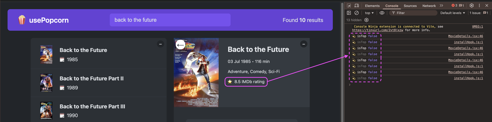

* `imdbRating` initial state is `indefined` so `imbdRating > 8` is always `false`.

#### 162.2.2 Pseudo fixing using `useEffect`:

**Subsection Summary**
- Attempts to fix the "frozen initial state" problem by using `useEffect` to manually sync `isTop` whenever `imdbRating` changes.
- While it works, it's labeled a "pseudo fix" because it introduces an unnecessary extra render and increases code complexity.
```tsx
/* src/components/MovieDetails.jsx */
....
const [isTop, setIsTop] = useState(imdbRating > 8);
  console.log("💫 isTop", isTop);

useEffect(() => {
  setIsTop(imdbRating > 8);
}, [imdbRating]);
....
```

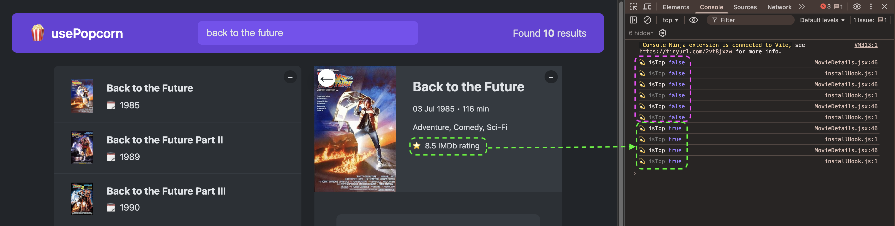

#### 162.2.3 Using the right approach: Derived State

**Subsection Summary**
- Shows the best practice: calculating `isTop` directly in the component body during render.
- No `useState` or `useEffect` is needed.
- This ensures `isTop` is always in sync with `imdbRating` and reduces the number of state variables to manage.
```tsx
/* src/components/MovieDetails.jsx */
....
// const [isTop, setIsTop] = useState(imdbRating > 8);
//   console.log("💫 isTop", isTop);

// useEffect(() => {
//   setIsTop(imdbRating > 8);
// }, [imdbRating]);
const isTop = imdbRating > 8;
console.log("🫵🏽 isTop", isTop)
....
```

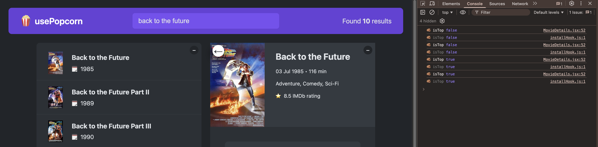
* imdbRating is mont twice.

#### 162.2.4 Another situation with this async issue, in `handleAdd`:

**Subsection Summary**
- Introduces `avgRating` state to demonstrate state update timing.
- Shows that calling `setAvgRating(Number(imdbRating))` and immediately alerting `avgRating` results in the **stale** value (initial state `0`).
- Reinforces that state updates are asynchronous from the perspective of the current function execution.
```tsx
/* src/components/MovieDetails.jsx */
import { useEffect, useState } from "react";
import StarRating from "../StarRating";
import Loader from "./Loader";
const MovieDetails = ({ selectedId, onCloseMovie, onAddWatched, watched }) => {
  const KEY = "f84fc31d";
  const [movie, setMovie] = useState({});
  const [isLoading, setIsLoading] = useState(false);
  const [userRating, setUserRating] = useState(0);

  const isWatched = watched.map((movie) => movie.imdbID).includes(selectedId);
  const watchedUserRating = watched.find((movie) => movie.imdbID === selectedId)?.userRating;
  const {
    Title: title,
    Year: year,
    Poster: poster,
    Runtime: runtime,
    imdbRating,
    Plot: plot,
    Released: released,
    Actors: actors,
    Director: director,
    Genre: Genre,
  } = movie;

  const [avgRating, setAvgRating] = useState(0);    // 👈🏽 ✅ (1)

  const handleAdd = () => {
    const newWatchedMovie = {
      imdbID: selectedId,
      title,
      year,
      poster,
      imdbRating: Number(imdbRating) || 0,
      runtime: Number(runtime.split(" ")[0]) || 0,
      userRating,
    };
    onAddWatched(newWatchedMovie);
    //onCloseMovie();   // 👈🏽 ✅ (1)

    // setting the current imdbRating value to avgRating:
    setAvgRating(Number(imdbRating));   // 👈🏽 ✅ (3)
    alert(avgRating);   // 👈🏽 ✅ (3)
  };

  useEffect(() => {
    const getMovieDetails = async () => {
      setIsLoading(true);
      const resp = await fetch(`http://www.omdbapi.com/?apikey=${KEY}&i=${selectedId}`);
      const data = await resp.json();
      setMovie(data);
      setIsLoading(false);
    };

    getMovieDetails();
  }, [selectedId]);

  useEffect(() => {
    const callback = (e) => {
      if (e.code === "Escape") {
        onCloseMovie();
      }
    };
    document.addEventListener("keydown", callback);
    return () => {
      document.removeEventListener("keydown", callback);
    };
  }, [onCloseMovie]);

  useEffect(() => {
    if (!title) return;
    document.title = `Movie | ${title}`;
    return () => {
      document.title = "usePopcorn";
      //console.log(`Clean up effect for movie ${title}`);
    };
  }, [title]);

  return (
    <div className="details">
      {isLoading ? (
        <Loader />
      ) : (
        <>
          <header>
            <button className="btn-back" onClick={onCloseMovie}>
              &larr;
            </button>
            
            <div className="details-overview">
              <h2>{title}</h2>
              <p>
                {released} &bull; {runtime}
              </p>
              <p>{Genre}</p>
              <p>
                <span>⭐️</span>
                {imdbRating} IMDb rating
              </p>
            </div>
          </header>

          <p>🍺 {avgRating}</p>  {/* 👈🏽 ✅ (2) */}

          <section>
            <div className="rating">
              {!isWatched ? (
                <>
                  <StarRating maxRating={10} size={24} onSetRating={setUserRating} />
                  {userRating > 0 && (
                    <button className="btn-add" onClick={handleAdd}>
                      + Add to list
                    </button>
                  )}
                </>
              ) : (
                <p>
                  You rated this movie: {watchedUserRating} <span>⭐️</span> 
                </p>
              )}
            </div>
            <p>{plot}</p>
            <p>Starring {actors}</p>
            <p>Directed by {director}</p>
          </section>
        </>
      )}
    </div>
  );
};
export default MovieDetails;
```

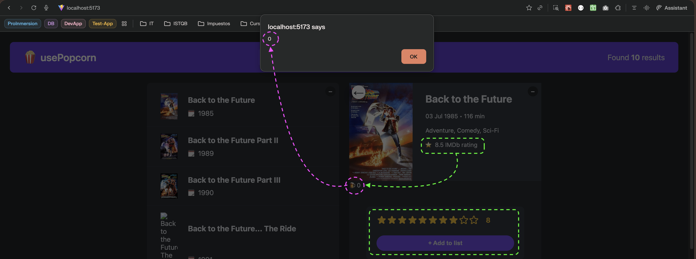

* It only considers the `avgRating` initial value.
* `imdbRating` value is never considered.

#### 162.2.5 Using the `userRating`:

**Subsection Summary**
- Shows another attempt at updating `avgRating` by combining it with `userRating`.
- Illustrates how multiple updates using the current state variable (`avgRating + userRating`) fail because each call sees the same stale value from the current "snapshot" of the component.
```tsx
/* src/components/MovieDetails.jsx */
    // setting the current imdbRating value to avgRating:
    setAvgRating(Number(imdbRating));
    //alert(avgRating);
    setAvgRating(Number(avgRating + userRating) / 2);   // 👈🏽 ✅
```

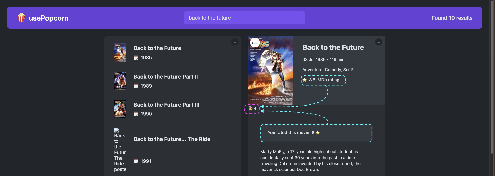

* it only consider the `userRating` value.
* `imdbRating`/`avgRating` is never considered.
* It only considers the `avgRating` initial value.

#### 162.2.6 Fixing this `avgRating` issue by passing a callback function:

**Subsection Summary**
- Demonstrates the correct way to perform multiple updates: using the **functional updater form**.
- React ensures the callback receives the most up-to-date state from the previous update in the batch.
- This allows for "chained" updates that correctly accumulate results.
```tsx
/* src/components/MovieDetails.jsx */
....
  // setting the current imdbRating value to avgRating:
  setAvgRating(Number(imdbRating));
  //alert(avgRating);
  setAvgRating((avgRating) => (avgRating + userRating) / 2);
....
```

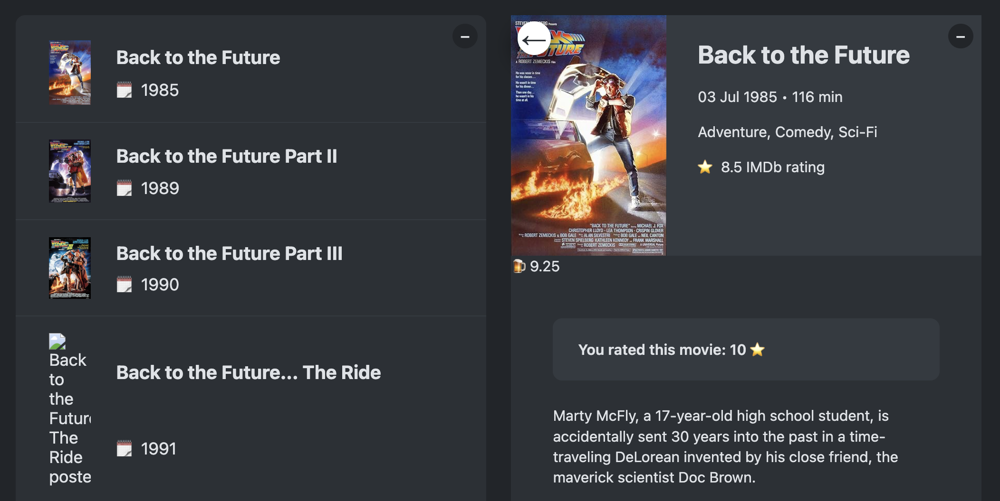

* `setAvgRating(Number(imdbRating))` must be there as previous setting a value.
* it considers the `imdbRating` as well as `userRating` values.

### 🐞 162.3 Issues:

- **State Syncing Anti-pattern**: The `avgRating` state in `MovieDetails.jsx` is being updated manually in `handleAdd` based on other states.
- **Stale State Awareness**: Initial attempt to alert state immediately after setting it demonstrates a misunderstanding of React's update batching.
- **Redundant State**: The `isTop` variable was almost made into a state when it should have been derived.

| Issue | Status | Log/Error |
|---|---|---|
| Manual state syncing | ℹ️ Low Priority | `src/components/MovieDetails.jsx:25, 41-43` - `avgRating` is being manually managed. While it demonstrates functional updates, this value could potentially be derived if the data structure allowed. |
| Console logs left in code | ℹ️ Low Priority | `src/components/MovieDetails.jsx:42` - Commented out `alert` and console logs should be cleaned up for production. |
| Unused state `avgRating` | ⚠️ Identified | `src/components/MovieDetails.jsx:103` - `avgRating` is displayed but doesn't persist beyond the component's unmount, which might not be the intended behavior for an "average rating". |

### 🧱 162.4 Pending Fixes (TODO)

- [ ] **Cleanup Demo Code** — `src/components/MovieDetails.jsx`: Remove commented-out code and logs from lines 38-43 once the learning objective is met.
- [ ] **Refactor to Derived State where possible** — Review all `useState` calls and ensure they aren't better suited as derived variables.
- [ ] **Verify Functional Updates** — Ensure all state updates that depend on previous state (like counters or accumulators) use the callback form `(s) => s + 1`.
- [ ] **Standardize API key usage** — (Carry over from previous lessons) Centralize the hardcoded API key from line 5.


<br>

## 🔧 163. Lesson 163 — *Initializing State With a Callback (Lazy Initial State)*

- [163.1 Context](#1631-context)
- [163.2 Updating code/theory according the context](#1632-updating-code-theory-according-the-context)
  - [163.2.1 Adding `localStorage` in `handleAddWatched` function](#16321-adding-localstorage-in-handleaddwatched-function)
  - [163.2.2 Adding a `useEffect` in charge of handling the watched movies in local storage](#16322-adding-a-useeffect-in-charge-of-handling-the-watched-movies-in-local-storage)
  - [163.2.3 Retrieving the local storage data](#16323-retrieving-the-local-storage-data)
- [163.3 Issues](#1633-issues)
- [163.4 Pending Fixes (TODO)](#1634-pending-fixes-todo)

### 🧠 163.1 Context:

This lesson introduces the concept of **Lazy Initial State** in React's `useState` hook. When the initial value of a state variable requires an expensive computation (like reading from `localStorage` and parsing JSON), passing a callback function to `useState` ensures that the calculation only runs once during the initial component render.

#### **Key Concepts**
1. **Initial State Callback**: Instead of passing a value directly to `useState(value)`, you pass a function `useState(() => value)`.
2. **One-Time Execution**: React executes the callback function only during the initial mount of the component.
3. **Pure Functions**: The initialization function should be pure and not have side effects (except for the computation itself).
4. **State Persistence**: Using `localStorage` combined with lazy initialization allows application state to persist across page refreshes.

#### **Advantages**
- **Performance Optimization**: Prevents expensive computations (I/O, large data processing) from running on every re-render.
- **Cleaner Initialization**: Logical separation of complex initialization from the component's main body.

#### **Disadvantages/Gotchas**
- **Reference Error**: If you call the function inside `useState(getValue())`, it will still run on every render. You must pass the reference: `useState(getValue)`.
- **SSR Concerns**: `localStorage` is not available on the server; ensure checks like `typeof window !== 'undefined'` if using frameworks like Next.js.

#### **When to Consider Alternatives**
- If the initial state is simple (e.g., `0`, `""`, `[]`), lazy initialization is unnecessary and slightly adds overhead.
- Use `useEffect` for data that needs to be fetched from an API rather than being available synchronously at mount.

### ⚙️ 163.2 Updating code/theory according the context:

#### **Summary**
- Explores strategies for persisting the "Watched Movies" list using the browser's `localStorage`.
- Demonstrates why synchronizing state with local storage in event handlers vs. `useEffect` matters for consistency.
- Implements the **Lazy Initial State** pattern to retrieve stored data efficiently during component mount.

#### 163.2.1 Adding `localStorage` in `handleAddWatched` function:

**Subsection Summary**
- Initially attempts to persist data within the `handleAddWatched` event handler.
- Uses `localStorage.setItem` to save the updated movie list as a JSON string.
- Highlights a limitation: This approach is manual and must be repeated in every function that modifies the `watched` state (e.g., delete) => adding the deleted movie logic from localstorage in `handleDeleteWatched`.

```jsx
/* src/App.jsx */
import { useState, useEffect } from "react";
import Navbar from "./components/Navbar";
import Main from "./components/Main";
import Search from "./components/Search";
import NumResult from "./components/NumResult";

import Box from "./components/Box";
import MovieList from "./components/MovieList";
import WatchedSummary from "./components/WatchedSummary";
import WatchedMovieList from "./components/WatchedMovieList";
import Loader from "./components/Loader";
import ErrorMessage from "./components/ErrorMessage";
import MovieDetails from "./components/MovieDetails";

const KEY = "f84fc31d";

function App() {
  const [movies, setMovies] = useState([]);
  const [watched, setWatched] = useState([]);
  const [isLoading, setIsLoading] = useState(false);
  const [error, setError] = useState("");
  const [query, setQuery] = useState("");
  const [selectedId, setSelectedId] = useState(null);
  //const tempQuery = "interstellar";

  const handleSelectMovie = (id) => {
    setSelectedId((selectedId) => (selectedId === id ? null : id));
  };

  const handleCloseMovie = () => {
    setSelectedId(null);
  };

  const handleAddWatched = (movie) => {
    setWatched((watched) => [...watched, movie]);

    localStorage.setItem("watched", JSON.stringify([...watched, movie]));   // 👈🏽 ✅
  };

  const handleDeleteWatched = (id) => {
    setWatched((watched) => watched.filter((movie) => movie.imdbID !== id));
  };

  useEffect(() => {
    const controller = new AbortController();
    const fetchMovies = async () => {
      try {
        setIsLoading(true);
        setError("");
        const resp = await fetch(`http://www.omdbapi.com/?apikey=${KEY}&s=${query}`, { signal: controller.signal });

        if (!resp.ok) throw new Error("Something went wrong with fetching movies");

        const data = await resp.json();

        if (data.Response === "False") throw new Error("Movie not found 😭");

        setMovies(data.Search);
      } catch (error) {
        console.log(error.message);
        if (error.name !== "AbortError") {
          setError(error.message);
        }
      } finally {
        setIsLoading(false);
      }
    };

    if (query.length < 3) {
      setMovies([]);
      setError("");
      return;
    }

    handleCloseMovie();
    fetchMovies();
    return () => controller.abort();
  }, [query]);

  return (
    <>
      <Navbar>
        <Search query={query} setQuery={setQuery} />
        <NumResult movies={movies} />
      </Navbar>
      <Main>
        <Box>
          {isLoading && <Loader />}
          {!isLoading && !error && <MovieList movies={movies} handleSelectMovie={handleSelectMovie} />}
          {error && <ErrorMessage message={error} />}
        </Box>
        <Box>
          {selectedId ? (
            <MovieDetails
              selectedId={selectedId}
              onCloseMovie={handleCloseMovie}
              onAddWatched={handleAddWatched}
              watched={watched}
            />
          ) : (
            <>
              <WatchedSummary watched={watched} />
              <WatchedMovieList watched={watched} onDeleteWatched={handleDeleteWatched} />
            </>
          )}
        </Box>
      </Main>
    </>
  );
}

export default App;
```

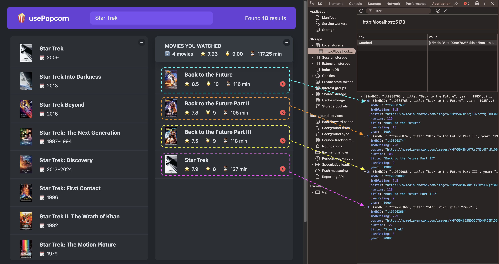

#### 163.2.2 Adding a `useEffect` in charge of handling the watched movies in local storage:

**Subsection Summary**
- Refactors persistence logic into a dedicated `useEffect` hook.
- Synchronizes the `watched` state with `localStorage` whenever the state changes.
- Ensures a "Single Source of Truth" for persistence, removing the need for `localStorage` calls in individual handlers like `handleAddWatched`.
```jsx
/* src/App.jsx */
import { useState, useEffect } from "react";
import Navbar from "./components/Navbar";
import Main from "./components/Main";
import Search from "./components/Search";
import NumResult from "./components/NumResult";

import Box from "./components/Box";
import MovieList from "./components/MovieList";
import WatchedSummary from "./components/WatchedSummary";
import WatchedMovieList from "./components/WatchedMovieList";
import Loader from "./components/Loader";
import ErrorMessage from "./components/ErrorMessage";
import MovieDetails from "./components/MovieDetails";

const KEY = "f84fc31d";

function App() {
  const [movies, setMovies] = useState([]);
  const [isLoading, setIsLoading] = useState(false);
  const [watched, setWatched] = useState([]);
  const [error, setError] = useState("");
  const [query, setQuery] = useState("");
  const [selectedId, setSelectedId] = useState(null);
  //const tempQuery = "interstellar";

  const handleSelectMovie = (id) => {
    setSelectedId((selectedId) => (selectedId === id ? null : id));
  };

  const handleCloseMovie = () => {
    setSelectedId(null);
  };

  const handleAddWatched = (movie) => {
    setWatched((watched) => [...watched, movie]);
    //localStorage.setItem("watched", JSON.stringify([...watched, movie]));
  };

  const handleDeleteWatched = (id) => {
    setWatched((watched) => watched.filter((movie) => movie.imdbID !== id));
  };

  useEffect(() => {
    localStorage.setItem("watched", JSON.stringify(watched));
  }, [watched]);    {/* 👈🏽 ✅ */}

  useEffect(() => {
    const controller = new AbortController();
    const fetchMovies = async () => {
      try {
        setIsLoading(true);
        setError("");
        const resp = await fetch(`http://www.omdbapi.com/?apikey=${KEY}&s=${query}`, { signal: controller.signal });

        if (!resp.ok) throw new Error("Something went wrong with fetching movies");

        const data = await resp.json();

        if (data.Response === "False") throw new Error("Movie not found 😭");

        setMovies(data.Search);
      } catch (error) {
        console.log(error.message);
        if (error.name !== "AbortError") {
          setError(error.message);
        }
      } finally {
        setIsLoading(false);
      }
    };

    if (query.length < 3) {
      setMovies([]);
      setError("");
      return;
    }

    handleCloseMovie();
    fetchMovies();
    return () => controller.abort();
  }, [query]);

  return (
    <>
      <Navbar>
        <Search query={query} setQuery={setQuery} />
        <NumResult movies={movies} />
      </Navbar>
      <Main>
        <Box>
          {isLoading && <Loader />}
          {!isLoading && !error && <MovieList movies={movies} handleSelectMovie={handleSelectMovie} />}
          {error && <ErrorMessage message={error} />}
        </Box>
        <Box>
          {selectedId ? (
            <MovieDetails
              selectedId={selectedId}
              onCloseMovie={handleCloseMovie}
              onAddWatched={handleAddWatched}
              watched={watched}
            />
          ) : (
            <>
              <WatchedSummary watched={watched} />
              <WatchedMovieList watched={watched} onDeleteWatched={handleDeleteWatched} />
            </>
          )}
        </Box>
      </Main>
    </>
  );
}

export default App;
```

#### 163.2.3 Retrieving the local storage data:

**Subsection Summary**
- Implements **Lazy Initial State** by passing a callback function to `useState`.
- Reads and parses data from `localStorage` once when the `App` component is first initialized.
- Provides a fallback to an empty array `[]` if no data exists in storage.
- Fixes the issue where the UI would reset on page refresh even if data existed in `localStorage`.
```jsx
/* src/App.jsx */
import { useState, useEffect } from "react";
import Navbar from "./components/Navbar";
import Main from "./components/Main";
import Search from "./components/Search";
import NumResult from "./components/NumResult";

import Box from "./components/Box";
import MovieList from "./components/MovieList";
import WatchedSummary from "./components/WatchedSummary";
import WatchedMovieList from "./components/WatchedMovieList";
import Loader from "./components/Loader";
import ErrorMessage from "./components/ErrorMessage";
import MovieDetails from "./components/MovieDetails";

const KEY = "f84fc31d";

function App() {
  const [movies, setMovies] = useState([]);
  const [isLoading, setIsLoading] = useState(false);
  const [error, setError] = useState("");
  const [query, setQuery] = useState("");
  const [selectedId, setSelectedId] = useState(null);
  //const [watched, setWatched] = useState([]);
  const [watched, setWatched] = useState(() => {
    const storedValue = localStorage.getItem("watched");
    return storedValue ? JSON.parse(storedValue) : [];
  });   // 👈🏽 ✅ 
  //const tempQuery = "interstellar";

  const handleSelectMovie = (id) => {
    setSelectedId((selectedId) => (selectedId === id ? null : id));
  };

  const handleCloseMovie = () => {
    setSelectedId(null);
  };

  const handleAddWatched = (movie) => {
    setWatched((watched) => [...watched, movie]);
    //localStorage.setItem("watched", JSON.stringify([...watched, movie]));
  };

  const handleDeleteWatched = (id) => {
    setWatched((watched) => watched.filter((movie) => movie.imdbID !== id));
  };

  useEffect(() => {
    localStorage.setItem("watched", JSON.stringify(watched));
  }, [watched]);

  useEffect(() => {
    const controller = new AbortController();
    const fetchMovies = async () => {
      try {
        setIsLoading(true);
        setError("");
        const resp = await fetch(`http://www.omdbapi.com/?apikey=${KEY}&s=${query}`, { signal: controller.signal });

        if (!resp.ok) throw new Error("Something went wrong with fetching movies");

        const data = await resp.json();

        if (data.Response === "False") throw new Error("Movie not found 😭");

        setMovies(data.Search);
      } catch (error) {
        console.log(error.message);
        if (error.name !== "AbortError") {
          setError(error.message);
        }
      } finally {
        setIsLoading(false);
      }
    };

    if (query.length < 3) {
      setMovies([]);
      setError("");
      return;
    }

    handleCloseMovie();
    fetchMovies();
    return () => controller.abort();
  }, [query]);

  return (
    <>
      <Navbar>
        <Search query={query} setQuery={setQuery} />
        <NumResult movies={movies} />
      </Navbar>
      <Main>
        <Box>
          {isLoading && <Loader />}
          {!isLoading && !error && <MovieList movies={movies} handleSelectMovie={handleSelectMovie} />}
          {error && <ErrorMessage message={error} />}
        </Box>
        <Box>
          {selectedId ? (
            <MovieDetails
              selectedId={selectedId}
              onCloseMovie={handleCloseMovie}
              onAddWatched={handleAddWatched}
              watched={watched}
            />
          ) : (
            <>
              <WatchedSummary watched={watched} />
              <WatchedMovieList watched={watched} onDeleteWatched={handleDeleteWatched} />
            </>
          )}
        </Box>
      </Main>
    </>
  );
}

export default App;
```

> Issue fixed, after refreshing the page

* localstorage still have the watched movies list.
* WatchedMovie component still shows the watched movies.

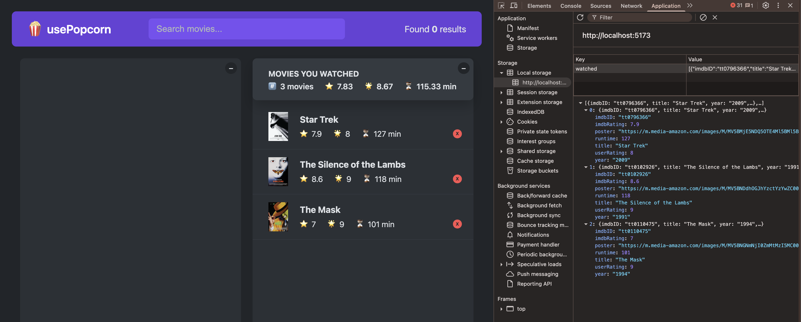

### 🐞 163.3 Issues:

- **State Desync on Refresh**: Initially, moving data to `localStorage` didn't reflect in the UI upon refresh because the state was still initialized as an empty array `[]`.
- **Manual Persistence**: Calling `localStorage.setItem` inside event handlers is error-prone and leads to code duplication across add/delete actions.

| Issue | Status | Log/Error |
|---|---|---|
| Persistent state not loading | ✅ Fixed | UI starts with `[]` instead of reading from `localStorage` at `src/App.jsx:9413`. |
| Manual Syncing | ✅ Fixed | Refactored to use `useEffect` for automatic synchronization at `src/App.jsx:9436`. |

### 🧱 163.4 Pending Fixes (TODO)

- [ ] Add error handling (try/catch) inside the lazy initializer to handle corrupted JSON in `localStorage`.
- [ ] Implement a custom hook `useLocalStorageState` to encapsulate the persistence logic (upcoming lesson).
- [ ] Optimize `JSON.stringify` calls if the list becomes very large.

<br>

## 🔧 164. Lesson 164 — *useState summary*

- [164.1 Context](#1641-context)
- [164.2 Updating code/theory according the context](#1642-updating-code-theory-according-the-context)
  - [164.2.1 Creating State vs Updating State](#16421-creating-state-vs-updating-state)
- [164.3 Issues](#1643-issues)
- [164.4 Pending Fixes (TODO)](#1644-pending-fixes-todo)

### 🧠 164.1 Context:

This lesson provides a comprehensive summary of the `useState` hook, consolidating the rules, patterns, and best practices covered throughout the section. `useState` is the primary tool for adding "memory" to React components, allowing them to track data that changes over time and trigger re-renders when those changes occur.

#### **Key Concepts**
1. **State Ownership**: State belongs to the component where it's declared and is private by default.
2. **Re-rendering**: Updating state via its setter function triggers a re-render of the component and its children.
3. **Asynchronous Updates**: State updates are batched and don't immediately change the variable in the current execution context.
4. **Functional Updates**: When the new state depends on the previous state, always use a callback function: `setState(prev => prev + 1)`.
5. **Lazy Initialization**: Use a function for expensive initial state computations: `useState(() => expensiveFunc())`.

#### **Advantages**
- **Reactive UI**: Automatically keeps the UI in sync with underlying data.
- **Simplicity**: Easy-to-use API for managing local component state.
- **Performance**: React's batching mechanism ensures efficient UI updates.

#### **Disadvantages/Gotchas**
- **Stale Closures**: Relying on stale state variables inside async functions or effects instead of functional updates.
- **Object Mutations**: Never mutate state objects or arrays directly; always return a new copy.
- **Over-use**: Using state for values that can be derived from existing state or props (e.g., calculated totals).

#### **When to Consider Alternatives**
- **useReducer**: For complex state objects with multiple related sub-values or transition logic.
- **useRef**: For values that should persist between renders but **don't** need to trigger a re-render when changed.
- **Context API/Redux**: For global state shared across many deeply nested components.

### ⚙️ 164.2 Updating code/theory according the context:

#### **Summary**
- Provides a high-level overview of the `useState` mental model.
- Illustrates the distinction between the initialization phase and the update phase.
- Acts as a quick reference guide for debugging state-related issues in `usePopcorn`.

#### 164.2.1 Creating State vs Updating State:

**Subsection Summary**
- Visualizes the lifecycle of state within a component.
- Highlights that state is preserved across renders by React.
- Explains that calling the setter function is the **only** way to trigger a reactive update in a standard functional component.

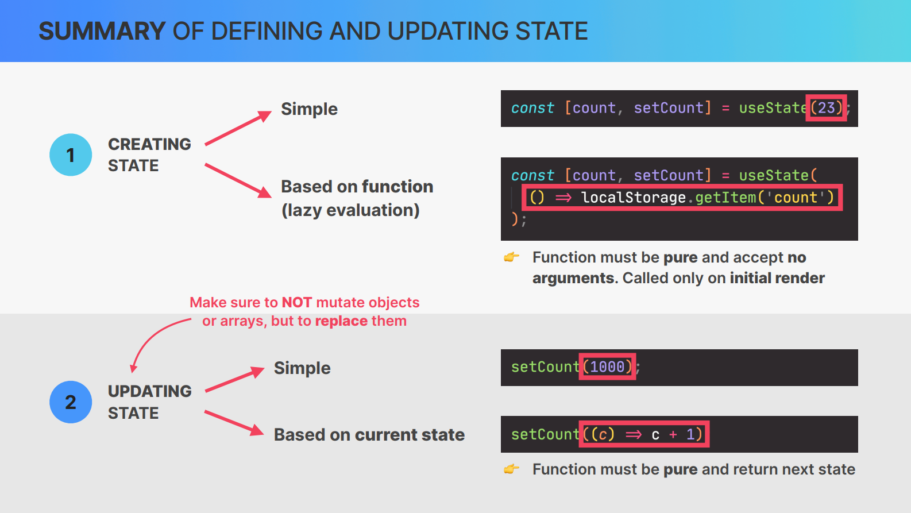

### 🐞 164.3 Issues:

- **Redundant State Callbacks**: Use of lazy initialization for simple values (e.g., primitive `0` or `""`) is technically valid but adds unnecessary complexity.
- **Direct Mutation Pitfalls**: Potential risks when updating the `watched` or `movies` lists if the "no-mutation" rule is violated.

| Issue | Status | Log/Error |
|---|---|---|
| Informational Summary | ✅ Informational | Consolidated `useState` knowledge base for the project. |

### 🧱 164.4 Pending Fixes (TODO)

- [ ] Audit `src/App.jsx` to ensure all state updates depending on prior values use the functional form (e.g., `setWatched(w => [...w, movie])`).
- [ ] Verify that no derived data is being stored in state (like `numResults`, which should just be `movies.length`).
- [ ] Consider refactoring complex `useState` logic in `App.jsx` into a custom hook (e.g., `useLocalStorageState`).


<br>

## 🔧 165. Lesson 165 — *How NOT to Select DOM Elements in React*

- [How NOT to Select DOM Elements in React](#-165-lesson-165--how-not-to-select-dom-elements-in-react)
- [165.1 Context](#1651-context)
- [165.2 Updating code/theory according the context](#1652-updating-codetheory-according-the-context)
  - [165.2.1 DOM manipulation of Search component](#16521-dom-manipulation-of-search-component)
- [165.3 Issues](#1653-issues)
- [165.4 Pending Fixes (TODO)](#1654-pending-fixes-todo)

### 🧠 165.1 Context:

In standard web development (Vanilla JavaScript), we often use `document.querySelector()` or `document.getElementById()` to interact with DOM elements (e.g., to focus an input field or change a style). However, in React, this approach is discouraged because it bypasses React's declarative nature and its virtual DOM management. React should be the only one responsible for managing the DOM to ensure that state and UI stay in sync.

#### **Key Concepts**
1. **Declarative vs. Imperative**: React is declarative; you describe *what* the UI should look like based on state, rather than *how* to change it. Manual DOM selection is imperative.
2. **Virtual DOM**: React uses a virtual representation of the DOM to optimize updates. Direct manipulation confuses React's tracking system.
3. **Component Reusability**: Using classes or IDs for selection (like `.search`) makes components less reusable because multiple instances of the component will share the same identifier, leading to unexpected behavior.
4. **Side Effects**: DOM manipulation is a side effect and should always be handled inside `useEffect`.

#### **Advantages of the React Way (Refs)**
- **Isolation**: Each component instance has its own private reference to its DOM elements.
- **Safety**: Avoids conflicts between components or third-party libraries.
- **Predictability**: Follows the unidirectional data flow and React lifecycle.

#### **When to Consider Alternatives**
- **Vanilla JavaScript**: Only use manual DOM selection in non-React environments or very specific legacy integrations where React has no control.
- **React Refs**: Use the `useRef` hook for any imperative DOM interaction (focus, scroll, measurements).

---

### ⚙️ 165.2 Updating code/theory according the context:

#### **Summary**
- Explains why manual DOM selection via `document.querySelector` is problematic in React.
- Demonstrates an imperative approach to focusing an element within a `useEffect` hook.
- Highlights the conflict between declarative React and imperative DOM manipulation.

#### **165.2.1 DOM manipulation of Search component:**

**Subsection Summary**
- Shows a common mistake: using `document.querySelector(".search")` to focus an input.
- Demonstrates how this approach depends on specific CSS classes, making the component fragile.
- Illustrates that while it "works," it breaks React's abstraction and reusability.

- React is all about being declarative.
- Manually selecting the DOM like this is not really the React way.
```jsx
/* src/components/Search.jsx */
import { useEffect } from "react";

const Search = ({ query, setQuery }) => {
  useEffect(() => {   // 👈🏽 ✅
    // ❌ Imperative and non-React way
    const el = document.querySelector(".search");
    console.log(el);

    el.focus();
  }, [query])
  return (
    <input
      className="search"
      type="text"
      placeholder="Search movies..."
      value={query}
      onChange={(e) => setQuery(e.target.value)}
    />
  );
};

export default Search;
```

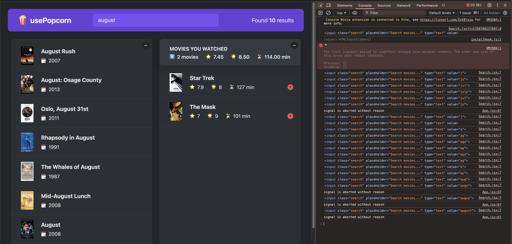

### 🐞 165.3 Issues:

- **Imperative DOM Selection**: Using `document.querySelector` is an imperative escape hatch that bypasses React's state management.
- **Fragile Selectors**: The code depends on the `.search` class being present and unique, which fails if multiple search bars exist.
- **Violates React Principles**: Direct DOM manipulation can lead to bugs where the UI state and the actual DOM are out of sync.

| Issue | Status | Log/Error |
|---|---|---|
| Manual DOM manipulation | ⚠️ Identified | Using `document.querySelector(".search")` in `src/components/Search.jsx:9667`. |
| Loss of Component Isolation | ⚠️ Identified | Multiple `Search` components would conflict over the same `.search` selector. |

### 🧱 165.4 Pending Fixes (TODO)

- [ ] Replace `document.querySelector` with `useRef` in `src/components/Search.jsx`.
- [ ] Implement focus logic using the `ref.current.focus()` method within `useEffect`.
- [ ] Remove the dependency on the `.search` CSS class for functional logic.


<br>

## 🔧 166. Lesson 166 — *Introducing Another Hook: useRef*

- [166. Lesson 166 — *Introducing Another Hook: useRef*](#-166-lesson-166--introducing-another-hook-useref)
- [166.1 Context](#1661-context)
- [166.2 Updating code/theory according the context](#1662-updating-codetheory-according-the-context)
  - [166.2.1 What are **REFS**?](#16621-what-are-refs)
  - [166.2.2 State **vs** Refs](#16622-state-vs-refs)
  - [166.2.3 Different example level of useRef applying](#16623-different-example-level-of-useref-applying)
- [166.3 Issues](#1663-issues)
- [166.4 Pending Fixes (TODO)](#1664-pending-fixes-todo)

### 🧠 166.1 Context:

`useRef` is a React Hook that allows you to persist values between renders without triggering a re-render. It is most commonly known for accessing DOM elements directly, but its utility extends to storing any mutable value that the component needs to "remember" without needing to display it in the UI.

**Key Concepts:**
1. **Mutable Box**: `useRef` returns a plain JavaScript object with a single `current` property. You can store any value in this property, and it will persist across the component's entire lifecycle.
2. **No Re-renders**: Unlike `useState`, changing the `current` value of a ref does **not** cause React to re-render the component. This makes it ideal for values that are "internal" to the component's logic but not the UI.
3. **DOM Access**: By passing a ref object to the `ref` attribute of a JSX element, React will automatically set the `current` property to that DOM element once it is mounted.
4. **Synchronous Updates**: Updates to `ref.current` happen immediately (synchronously), whereas state updates are scheduled and async.

**Advantages:**
- Efficiently stores data that doesn't affect the visual output (e.g., timer IDs, previous prop values).
- Provides a "declarative" way to interact with the "imperative" DOM API.
- Useful for integrating with non-React libraries (e.g., Google Maps, D3.js).

**Disadvantages/Gotchas:**
- **Don't use for UI state**: If a value needs to be reflected in the JSX, use `useState`.
- **Avoid rendering logic usage**: Do not read or write `ref.current` during the actual rendering phase of the component (except for lazy initialization), as it makes the component's behavior unpredictable.
- **Not for prop drilling**: Passing refs down deep component trees can lead to fragile code; consider `forwardRef` for controlled access.

**When to Consider Alternatives:**
- Use `useState` if the data change should trigger a UI update.
- Use `useMemo` or `useCallback` if you are trying to memoize a value or function to prevent unnecessary child re-renders.

### ⚙️ 166.2 Updating code/theory according the context:

#### **Summary**
- **Core Purpose**: Introduces the `useRef` hook as a specialized tool for persisting mutable data that does not trigger component re-renders.
- **Bridging Concepts**: Explains the fundamental differences between `useState` (UI-driven) and `useRef` (logic/DOM-driven).
- **Hierarchical Learning**: Progresses from basic DOM manipulation to advanced patterns like `forwardRef` and `useImperativeHandle`, providing a complete roadmap for hook mastery.

#### 166.2.1 What are **REFS**?

**Subsection Summary**
- **Visual Definition**: Uses diagrams to illustrate that a Ref is a "box" holding a `current` value.
- **Persistence**: Highlights that the value stays the same across renders, even when the component function executes again.

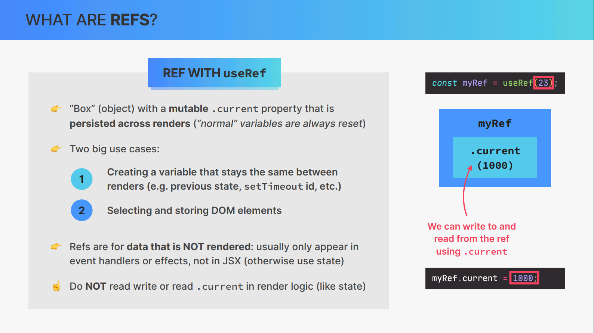

#### 166.2.2 State **vs** Refs

**Subsection Summary**
- **Comparative Analysis**: Contrasts State (re-renders, immutable, async) with Refs (no re-renders, mutable, synchronous).
- **Guidance**: Helps developers choose the right tool based on whether the data should "talk to the UI" or "talk to the logic".

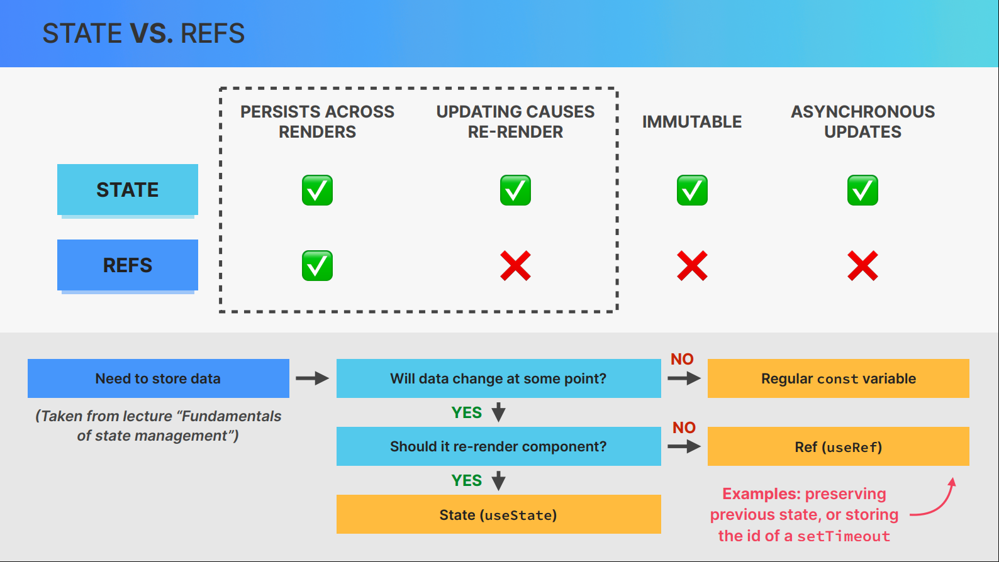


#### 166.2.3 Different example level of useRef applying:

**Subsection Summary**
- **Practical Application**: Demonstrates six specific tiers of `useRef` usage, from standard DOM focusing to complex parent-child imperative interactions.
- **Common Patterns**: Includes the "Previous State" pattern and interval management, which are staple use cases in real-world React apps.
- **Advanced Integration**: Explains `forwardRef` and `useImperativeHandle` for scenarios where internal component logic needs to be exposed to parents.

**`useRef`** is one of the most versatile hooks in React, but it is often underutilized, with people thinking it only serves for selecting DOM elements.

The key to understanding **`useRef`** is to think of it as a **`mutable box`** that can hold any value (an object, a number, a DOM element) and **`persists across renders`** without causing the component to re-render if you change its contents.

Here are the different ways to use it, ordered from the simplest to the most complex:

**1. Basic Level: Accessing the DOM**

This is the most common way. It is used to "select" an HTML element just like you would with **`document.getElementById`**, but in a declarative way.

**`Use case`**: You want the cursor to be automatically focused on a text input when the page loads.

```jsx
import React, { useRef, useEffect } from 'react';

function Formulario() {
  // 1. Create the reference
  const inputRef = useRef(null);

  useEffect(() => {
    // 3. Access the element and focus it
    // current is null at the start, but when the component mounts, 
    // React assigns the DOM element here.
    if (inputRef.current) {
      inputRef.current.focus();
    }
  }, []);

  return (
    <div>
      <h2>Registration Form</h2>
      {/* 2. Connect the ref with the JSX element */}
      <input ref={inputRef} type="text" placeholder="Type your name..." />
    </div>
  );
}
```

**2. Intermediate Level: Storing values that don't trigger re-renders**

Unlike **`useState`**, if you change the value of **`ref.current`**, React ***`will not`*** execute the component again. This is ideal for storing values you need to read later but that aren't visual.

**`Use case`**: A counter of how many times the component has rendered, or storing a timer ID.

```jsx
import React, { useRef, useState, useEffect } from 'react';

function RenderCounter() {
  const [count, setCount] = useState(0);
  const renderCount = useRef(0);

  useEffect(() => {
    // Every time the component renders, this runs.
    // Note! If we used useState here to save the number,
    // we would enter an infinite loop of renders.
    renderCount.current = renderCount.current + 1;
  });

  return (
    <div>
      <p>State count: {count}</p>
      <p>The component has rendered: {renderCount.current} times</p>
      <button onClick={() => setCount(c => c + 1)}>Increase State</button>
    </div>
  );
}
```

**3. Intermediate-Advanced Level: The "Previous State" Pattern**

Do you need to know what the value of a variable or prop was before it changed? **`useRef`** is perfect for remembering the past without affecting the present.

**`Use case`**: A chat that shows "New message" only if the number of messages actually changes.

```jsx
import React, { useState, useEffect, useRef } from 'react';

function Chat({ message }) {
  const [currentMessage, setCurrentMessage] = useState(message);
  // We save the previous value of the message
  const prevMessageRef = useRef();

  useEffect(() => {
    // We update the ref with the CURRENT value before it changes
    prevMessageRef.current = currentMessage;
  }, [currentMessage]); // Runs only when currentMessage changes

  const isNew = prevMessageRef.current !== currentMessage;

  return (
    <div>
      <h3>Chat Thread</h3>
      <p>Current: {currentMessage}</p>
      <p>Previous: {prevMessageRef.current}</p>
      {isNew && <span style={{color: 'red'}}>¡NEW!</span>}
      <button onClick={() => setCurrentMessage(prompt("Type something"))}>
        Change Message
      </button>
    </div>
  );
}
```


**4. Advanced Level: Timers and Cleanup (setInterval / setTimeout)**

When you use **`setInterval`**, you often need to clear it (clearInterval) or access its ID elsewhere. Saving the timer ID in a **`ref`** ensures you always have access to the correct ID, even if the component re-renders many times while the timer is running.

**`Use case`**: A stopwatch that can be stopped and resumed.

```jsx
import React, { useState, useEffect, useRef } from 'react';

function Stopwatch() {
  const [seconds, setSeconds] = useState(0);
  const intervalRef = useRef(null); // We save the interval ID here

  const start = () => {
    if (intervalRef.current) return; // It's already running

    intervalRef.current = setInterval(() => {
      setSeconds((s) => s + 1);
    }, 1000);
  };

  const stop = () => {
    if (intervalRef.current) {
      clearInterval(intervalRef.current); // We use the ref to clean up
      intervalRef.current = null;
    }
  };

  // Automatic cleanup if the component unmounts
  useEffect(() => {
    return () => {
      clearInterval(intervalRef.current);
    };
  }, []);

  return (
    <div>
      <h1>{seconds} s</h1>
      <button onClick={start}>Start</button>
      <button onClick={stop}>Stop</button>
    </div>
  );
}
```


**5. Expert Level: Integration with Third-Party Libraries (`forwardRef`)**

Sometimes you create your own components (custom buttons, styled inputs) and you want the parent component to be able to focus them or access their DOM properties. Since React encapsulates everything, the parent doesn't see the child's internal DOM. For this, we use **`forwardRef`**.

**`Use case`**: A `FancyInput` that receives a ref from its parent.

```jsx
// The CHILD component
const FancyInput = React.forwardRef((props, ref) => {
  return (
    <div style={{ border: '2px solid blue', padding: '10px' }}>
      {/* We connect the ref passed to us to the real input */}
      <input ref={ref} type="text" style={{ fontSize: '20px' }} />
    </div>
  );
});

// The PARENT component
function App() {
  const inputRef = useRef(null);

  const handleClick = () => {
    // Magic! The parent can focus the input living inside the child.
    if (inputRef.current) {
      inputRef.current.focus();
    }
  };

  return (
    <div>
      <FancyInput ref={inputRef} />
      <button onClick={handleClick}>Focus Child Input</button>
    </div>
  );
}
```


**6. Very Expert Level: `useImperativeHandle`**

This is the most complex and specific form. Sometimes you don't want to expose the entire DOM element (which can be dangerous or give too much access), but you want to expose **specific functions** of your child component to the parent.

Use case: A Modal or VideoPlayer where the parent only wants to call **`play()`** or **`reset()`**, but doesn't want to access the HTML div directly.

```jsx
import React, { useRef, useImperativeHandle, forwardRef, useState } from 'react';

// Child Component
const VideoPlayer = forwardRef((props, ref) => {
  const [isPlaying, setIsPlaying] = useState(false);

  // Internal function to play
  const play = () => {
    setIsPlaying(true);
    console.log("Playing video...");
  };

  // Internal function to pause
  const pause = () => {
    setIsPlaying(false);
    console.log("Pausing video...");
  };

  // We expose ONLY what we want to the parent through the ref
  useImperativeHandle(ref, () => ({
    play,
    pause,
    isPlaying // We can also expose read-only values
  }));

  return (
    <div className="video-box" style={{ padding: 20, background: '#eee' }}>
      Status: {isPlaying ? "▶️ Playing" : "⏸️ Paused"}
    </div>
  );
});

// Parent Component
function RemoteControl() {
  const playerRef = useRef(null);

  return (
    <div>
      <VideoPlayer ref={playerRef} />
      
      <div style={{ marginTop: 10 }}>
        <button onClick={() => playerRef.current.play()}>
          Play (from parent)
        </button>
        <button onClick={() => playerRef.current.pause()}>
          Pause (from parent)
        </button>
      </div>
    </div>
  );
}
```

**Summary**:
1. **Simple**: Focus or scroll to an HTML element (**`ref={domElement}`**).
2. **Medium**: Store mutable variables that shouldn't re-render the app (timers, internal counters).
3. **Advanced**: Pass a ref through components (**`forwardRef`**).
4. **Complex**: Create a custom API for your component exposing only specific functions (**`useImperativeHandle`**`).


### 🐞 166.3 Issues:
- **Language Inconsistency**: Some code examples and comments are in Spanish (e.g., `Formulario`, `¡NEW!`), whereas the rest of the documentation is in English.
- **Missing implementation in project**: `useRef` is explained theoretically but not yet implemented in the `usePopcorn` components.

| Issue | Status | Log/Error |
|---|---|---|
| Language Inconsistency | ℹ️ Informational | Spanish snippets in theoretical examples: `docs/LECTURE_STEPS.md:9783, 9862`. |
| Pending Integration | ⚠️ Identified | Components like `Search.jsx` still use standard state or props where refs could optimize focus/interaction. |

### 🧱 166.4 Pending Fixes (TODO)

- [ ] Implement `useRef` to focus the search input in `Search.jsx` on mount.
- [ ] Use `useRef` to store the previous movie rating in `MovieDetails.jsx` to compare with the new rating.
- [ ] Implement a custom hook `useKey` that utilizes `useRef` for event listener cleanup.


<br>

## 🔧 167. Lesson 167 — *Refs to Select DOM Elements*

- [Lecture 167: Refs to Select DOM Elements](#-167-lesson-167--refs-to-select-dom-elements)
- [167.1 Context](#1671-context)
- [167.2 Updating code/theory according the context](#1672-updating-codetheory-according-the-context)
  - [167.2.1 Adding the useRef](#16721-adding-the-useref)
  - [167.2.2 Adding useEffect() hook](#16722-adding-useeffect-hook-in-order-to-get-focus-on-input-search-when-user-hits-enter)
  - [167.2.3 Clear search on enter](#16723-when-user-hits-enter-and-search-input-delete-it-all)
  - [167.2.4 Focus check logic](#16724-hitting-on-enter-key-and-delete-all-content-when-search-is-not-focus)
- [167.3 Issues](#1673-issues)
- [167.4 Pending Fixes (TODO)](#1674-pending-fixes-todo)

### 🧠 167.1 Context:

This lesson introduces the use of the `useRef` hook to directly interact with DOM elements in React. While React's declarative nature is preferred for most UI updates, certain actions—like focusing an input, scrolling to a position, or measuring element dimensions—require direct access to the underlying DOM node. We apply this to the `Search` component to enhance the user experience by allowing a global hotkey (Enter) to focus the search bar from anywhere in the app.

1. **Key Concepts**:
   - **Hook Initialization**: `const inputEl = useRef(null);` creates a ref object with a `.current` property.
   - **Ref Attachment**: Passing the ref object to the `ref` prop of a JSX element (e.g., `<input ref={inputEl} />`) assigns the DOM element to `inputEl.current` after the component mounts.
   - **Timing**: Refs are only populated after the DOM is rendered, so access to `current` should occur within `useEffect` or event handlers.
   - **Global Listeners**: Using `document.addEventListener` within `useEffect` to capture keydown events regardless of which element is currently focused.

2. **Advantages**:
   - **Direct DOM Access**: Provides a clean way to perform imperative actions (like `.focus()`) that cannot be handled declaratively.
   - **Performance**: Refs don't trigger re-renders when their values change, making them efficient for purely imperative side effects.

3. **Disadvantages/Gotchas**:
   - **Manual Management**: Since you're bypassing React's rendering cycle, you must manually handle edge cases (like checking if an element is already focused).
   - **Cleanup**: Global event listeners added in `useEffect` must be removed in the cleanup function to prevent memory leaks and unexpected behavior.

4. **When to Consider Alternatives**:
   - Use standard state and props for any UI change that should be reflected in the DOM structure (e.g., hiding/showing elements).
   - Consider custom hooks for reusable DOM interaction logic.

### ⚙️ 167.2 Updating code/theory according the context:

#### **Summary**
- The primary goal of this section is to implement a keyboard shortcut (the "Enter" key) that automatically focuses the search input field.
- This is achieved by using the `useRef` hook to grab a reference to the `input` DOM element and the `useEffect` hook to set up a global event listener.
- The implementation progresses from basic ref attachment to sophisticated logic that prevents resetting the search query if the input is already active.

#### 167.2.1 Adding the `useRef`:
**Subsection Summary**
- Demonstrates how to initialize a ref using `useRef(null)` and bind it to a DOM element via the `ref` attribute.
- This establishes the bridge between React logic and the actual browser DOM node.

```jsx
/* src/components/Search.jsx */
import { useEffect, useRef } from "react";    // 👈🏽 ✅

const Search = ({ query, setQuery }) => {
  const inputEl = useRef(null);    // 👈🏽 ✅

  return (
    <input
      className="search"
      type="text"
      placeholder="Search movies..."
      value={query}
      onChange={(e) => setQuery(e.target.value)}
      ref={inputEl}    {/* 👈🏽 ✅ */}
    />
  );
};

export default Search;
```

#### 167.2.2 Adding `useEffect()` hook in order to get focus on `input` search when user hits `enter`.
**Subsection Summary**
- Introduces a `useEffect` hook with an empty dependency array to register a global `keydown` listener on mount.
- Uses the `inputEl.current.focus()` method to imperatively move focus to the input when the "Enter" key is detected.
- Includes vital cleanup logic using `removeEventListener` to ensure stability.

```jsx
/* src/components/Search.jsx */
import { useEffect, useRef } from "react";

const Search = ({ query, setQuery }) => {
  const inputEl = useRef(null);

  useEffect(() => {
    //console.log(inputEl.current);
    function callback(e) {   // 👈🏽 ✅
      if (e.code === "Enter") {
        inputEl.current.focus();
      }
    }
    document.addEventListener("keydown", callback);   // 👈🏽 ✅
    return () => document.removeEventListener("keydown", callback);   // 👈🏽 ✅
  }, []);

  return (
    <input
      className="search"
      type="text"
      placeholder="Search movies..."
      value={query}
      onChange={(e) => setQuery(e.target.value)}
      ref={inputEl}
    />
  );
};

export default Search;
```

#### 167.2.3 When user hits `enter` and search `input`, delete it all:
**Subsection Summary**
- Enhances the keyboard behavior by clearing the current search results when the user hits "Enter".
- This aligns with the expected UX of starting a fresh search or clearing a previous selection.

```jsx
/* src/components/Search.jsx */
import { useEffect, useRef } from "react";

const Search = ({ query, setQuery }) => {
  const inputEl = useRef(null);

  useEffect(() => {
    function callback(e) {
      if (e.code === "Enter") {
        inputEl.current.focus();
        setQuery("");   // 👈🏽 ✅
      }
    }
    document.addEventListener("keydown", callback);
    return () => document.removeEventListener("keydown", callback);
  }, []);

  return (
    <input
      className="search"
      type="text"
      placeholder="Search movies..."
      value={query}
      onChange={(e) => setQuery(e.target.value)}
      ref={inputEl}
    />
  );
};

export default Search;
```

- enter a `movie name` in search input.
- hit enter.
- Expected: entered `movie name` deleted!


#### 167.2.4 Hitting on `Enter` key and delete all content when search is not focus:
**Subsection Summary**
- Adds a critical guard clause: `document.activeElement === inputEl.current`.
- This ensures that if the search bar is *already* focused, hitting "Enter" doesn't clear the user's typing. It only clears and refocuses when the user is interacting with other parts of the UI.
- Updates the dependency array to include `setQuery` for correctness.

```jsx
/* src/components/Search.jsx */
import { useEffect, useRef } from "react";

const Search = ({ query, setQuery }) => {
  const inputEl = useRef(null);

  useEffect(() => {
    function callback(e) {
      if(document.activeElement === inputEl.current) return;    // 👈🏽 ✅
      if (e.code === "Enter") {
        inputEl.current.focus();
        setQuery("");
      }
    }
    document.addEventListener("keydown", callback);
    return () => document.removeEventListener("keydown", callback);
  }, [setQuery]);    // 👈🏽 ✅

  return (
    <input
      className="search"
      type="text"
      placeholder="Search movies..."
      value={query}
      onChange={(e) => setQuery(e.target.value)}
      ref={inputEl}
    />
  );
};

export default Search;
```

- enter a `movie name` in search input.
- hit enter.
- Expected: entered `movie name` stays
- click on any displayed movie.
- hit enter.
- Expected: entered `movie name` deleted!


### 🐞 167.3 Issues:

- **Manual DOM Logic Inconsistency**: Using `document.activeElement` is a global check that could potentially clash if multiple search-like components existed.
- **Global Event Listener**: Adding a listener to `document` inside a component makes it harder to test and can lead to bugs if not cleaned up properly.

| Issue | Status | Log/Error |
|---|---|---|
| Focus Guard Clause | ✅ Fixed | Added check to ensure input isn't cleared if already focused in `src/components/Search.jsx`. |
| Memory Leak Risk | ✅ Fixed | Implemented cleanup function in `useEffect` to remove "keydown" listener. |

### 🧱 167.4 Pending Fixes (TODO)

- [ ] Abstract the focus logic into a reusable `useKey` or `useFocus` custom hook to decrease component complexity.
- [ ] Add accessibility ARIA labels to the search input to improve screen reader support while using refs.
- [ ] Investigate if `autoFocus` property could be used as a simpler alternative for the initial mount focus.


<br>
<br>
<br>
<br>

🔥 🔥 🔥 

<br>

## 🔧 XXX. Lesson XXX — *{{TITLE_NAME}}*

### 🧠 XXX.1 Context:

### ⚙️ XXX.2 Updating code/theory according the context:

#### XXX.2.1
```jsx
/*  */

```

#### XXX.2.2
```jsx
/*  */

```

#### XXX.2.3
```jsx
/*  */

```

#### XXX.2.4
```jsx
/*  */

```

### 🐞 XXX.3 Issues:
- **first issue**: something..

| Issue | Status | Log/Error |
|---|---|---|

### 🧱 XXX.4 Pending Fixes (TODO)

- [ ]